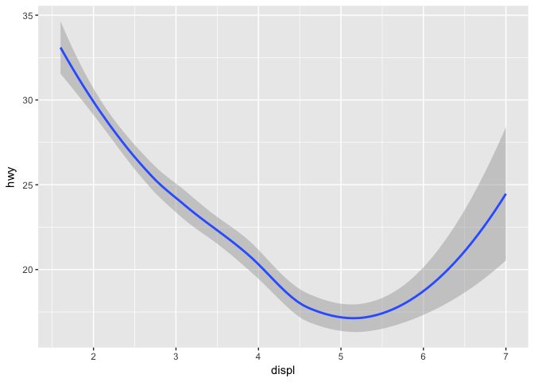
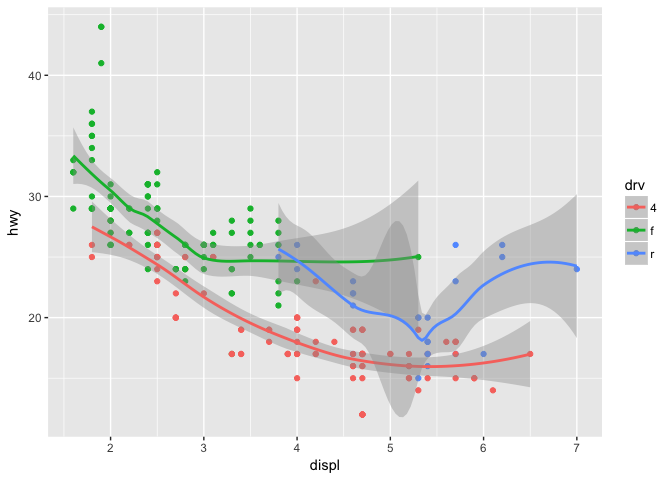

# Rclub2017_spring_Kazu
Kazu  
5/3/2017  
# Prerequisites

# 3.6

```r
ggplot(data = mpg) +
  geom_smooth(mapping = aes(x = displ, y = hwy))
```

```
## `geom_smooth()` using method = 'loess'
```

<!-- -->

```r
ggplot(data = mpg) +
  geom_smooth(mapping = aes(x = displ, y = hwy, group = drv))
```

```
## `geom_smooth()` using method = 'loess'
```

<!-- -->

```r
ggplot(data = mpg) +
  geom_smooth(
    mapping = aes(x = displ, y = hwy, group = drv)
  )
```

```
## `geom_smooth()` using method = 'loess'
```

<!-- -->

```r
# multiple geoms
ggplot(data = mpg) + 
  geom_point(mapping = aes(x = displ, y = hwy)) +
  geom_smooth(mapping = aes(x = displ, y = hwy))
```

```
## `geom_smooth()` using method = 'loess'
```

<!-- -->

```r
# filter
ggplot(data = mpg, mapping = aes(x = displ, y = hwy)) + 
  geom_point(mapping = aes(color = class)) + 
  geom_smooth(data = filter(mpg, class == "subcompact"), se = FALSE)
```

```
## `geom_smooth()` using method = 'loess'
```

<!-- -->
# 3.6 Exercises

```r
#1. What geom would you use to draw a line chart? A boxplot? A histogram? An area chart?
?geom_line()
?geom_boxplot() #or
?geom_violin()
?geom_area()
#2. Run this code in your head and predict what the output will look like. Then, run the code in R and check your predictions.
ggplot(data = mpg, mapping = aes(x = displ, y = hwy, color = drv)) + 
  geom_point()
```

<!-- -->

```r
ggplot(data = mpg, mapping = aes(x = displ, y = hwy, color = drv)) + 
  geom_point() + 
  geom_smooth(se = FALSE)
```

```
## `geom_smooth()` using method = 'loess'
```

<!-- -->

```r
#3. What does show.legend = FALSE do? What happens if you remove it?
ggplot() + 
  geom_point(data = mpg, mapping = aes(x = displ, y = hwy, color = drv),show.legend=FALSE)
```

<!-- -->

```r
  geom_smooth(data = mpg, mapping = aes(x = displ, y = hwy, color = drv),se = FALSE,show.legend=FALSE)
```

```
## mapping: x = displ, y = hwy, colour = drv 
## geom_smooth: na.rm = FALSE
## stat_smooth: na.rm = FALSE, method = auto, formula = y ~ x, se = FALSE
## position_identity
```

```r
# Why do you think I used it earlier in the chapter?
# with default
ggplot(data = mpg) + 
  geom_point(mapping = aes(x = displ, y = hwy, color = class))
```

<!-- -->

```r
# show.legend=FALSE (no legend)
ggplot(data = mpg) + 
  geom_point(mapping = aes(x = displ, y = hwy, color = class),show.legend=FALSE)
```

<!-- -->

```r
#4. What does the se argument to geom_smooth() do?
ggplot(data = mpg, mapping = aes(x = displ, y = hwy, color = drv)) + 
  geom_point() + 
  geom_smooth(se = TRUE) #  displaying confidence interval around smooth
```

```
## `geom_smooth()` using method = 'loess'
```

<!-- -->

```r
#5. Will these two graphs look different? Why/why not?
# the same. The first one shared data and aes setting, while the second one used the same data and aes in different geom.
ggplot(data = mpg, mapping = aes(x = displ, y = hwy)) + 
  geom_point() + 
  geom_smooth()
```

```
## `geom_smooth()` using method = 'loess'
```

<!-- -->

```r
ggplot() + 
  geom_point(data = mpg, mapping = aes(x = displ, y = hwy)) + 
  geom_smooth(data = mpg, mapping = aes(x = displ, y = hwy))
```

```
## `geom_smooth()` using method = 'loess'
```

<!-- -->

```r
#6. Recreate the R code necessary to generate the following graphs.
p1<-ggplot(data = mpg, mapping = aes(x = displ, y = hwy)) + 
  geom_point() + 
  geom_smooth(se=FALSE)
p2<-ggplot(data = mpg, mapping = aes(x = displ, y = hwy,group=drv)) + 
  geom_point() + 
  geom_smooth(se=FALSE)
p3<-ggplot(data = mpg, mapping = aes(x = displ,
                                     y = hwy,group=drv,color=drv)) + 
  geom_point() + 
  geom_smooth(se=FALSE)
p4<-ggplot(data = mpg, mapping = aes(x = displ, y = hwy,color=drv)) + 
  geom_point() + 
  geom_smooth(aes(group=FALSE),se=FALSE)
p5<-ggplot(data = mpg, mapping = aes(x = displ, y = hwy)) + 
  geom_point(aes(color=drv)) + 
  geom_smooth(se=FALSE,aes(linetype=drv))
p6<-ggplot() + 
  geom_point(data = mpg, mapping = aes(x = displ, y = hwy,fill=drv),shape = 21,size=5,stroke=2,colour="white") 
library(cowplot)
```

```
## 
## Attaching package: 'cowplot'
```

```
## The following object is masked from 'package:ggplot2':
## 
##     ggsave
```

```r
plot.all<-plot_grid(p1,p2,p3,p4,p5,p6,
  ncol=2,nrow=3,labels=c("A","B","C","D","E","F"),rel_widths=c(1,1,1,1,1,1)
  )
```

```
## `geom_smooth()` using method = 'loess'
```

```
## `geom_smooth()` using method = 'loess'
## `geom_smooth()` using method = 'loess'
## `geom_smooth()` using method = 'loess'
## `geom_smooth()` using method = 'loess'
```

```r
save_plot("/Volumes/data_work/Data6/bioconductor_R/Rclub2017_spring/Rclub-r4ds_Kazu.Nozue/R-club-May-3/3.6.6.png", plot.all, ncol = 2, nrow = 3,base_aspect_ratio = 0.8)
```
# my own data

```r
# load function
plot.bar7 <- function(trait,data.input=data.plot,title="",ylabel,rownum=3,save.plot=T,show.plot=F,width=8,height=6,RFRratio=F) { 
  #make bar chart for a trait in Kazu's data
  if (title=="") title <- trait
  data.plot<-data.input[grep(paste("(^",trait,")\\w+(rCol)",sep=""),names(data.input),value=T)]
  print(data.plot)
  # names(data.plot)<-"diff" # Kazu added this line    
  data.plot$gene <- data.input$plant  
  # #Calculate difference between sun and shade to
  #sort plot
  #data.plot$dif <- (get(paste(trait,"shade",sep="_"),data.plot) -
  # # get(paste(trait,"sun",sep="_"),data.plot))
  data.plot$dif<-data.plot[,grep("sun_mean",names(data.plot))[grep("sun_mean",names(data.plot)) %in% grep("_rCol_rsun",names(data.plot))]]-data.plot[,grep("shade_mean",names(data.plot))[grep("shade_mean",names(data.plot)) %in% grep("_rCol_rsun",names(data.plot))]]    
  print("data.plot$dif is")
  print(data.plot$dif)     
  print("names(data.plot) are")
  print(names(data.plot))  
  # order according to response (data.plot$dif) # this is off in SA plot
  #data.plot <- data.plot[order(data.plot$dif),] 
  #print("ordered data is")
  print(data.plot)
  # #will need to preserve this ordering
  data.plot$rank <- 1:dim(data.plot)[1]  
  #subset and rearrange data
  data.plot.sun <- data.plot[c(grep("(_sun)",names(data.plot),value=T)[grep("(_sun)",names(data.plot)) %in% grep("(_rsun)",names(data.plot))],"gene","rank")]
  print("names(data.plot.sun) are")
  
  print(names(data.plot.sun))
  data.plot.shade <- data.plot[c(grep("(_shade)",names(data.plot),value=T)[grep("(_shade)",names(data.plot)) %in% grep("(_rshade)",names(data.plot))],"gene","rank")]
  print("names(data.plot.shade) are");print(names(data.plot.shade))
  data.plot.sun$trt <- "sun"
  data.plot.shade$trt <- "shade"
  names(data.plot.sun)[1:3] <- c("mean","SE","pvalue")
  names(data.plot.shade)[1:3] <- c("mean","SE","pvalue") # this pvalue is not "response" 
  # input response pvalue
  data.plot.shade$"pvalue"<-data.plot[,grep("(_shade_pvalue_rCol_rsun)",names(data.plot))]
  
  data.plot <- rbind(data.plot.sun,data.plot.shade)
  # if (length(data.plot)!=7) {
  # warning(paste("incorrect number of data columns for trait",trait,"not plotting"))
  # return()
  # }
  print("rearragend data.plot is");print(data.plot)
  data.plot$trt <- factor(data.plot$trt,levels=c("sun","shade"))
  data.plot$gene <- factor(data.plot$gene,levels=data.plot.sun$gene)
  data.plot$ymin=data.plot$mean - data.plot$SE
  data.plot$ymax=data.plot$mean + data.plot$SE
  
  # add significance label (p<0.05)
  data.plot$significance<-" "
  data.plot$significance[data.plot$pvalue<0.05]<-"*"
  # remove significance in Col in sun
  data.plot[data.plot$gene=="Col"&data.plot$trt=="sun","significance"]<-" "
  
  if(RFRratio) {
    data.plot$trt<-gsub("sun","high \nR/FR",as.character(data.plot$trt))
    data.plot$trt<-gsub("shade","low \nR/FR",as.character(data.plot$trt))
    data.plot$trt<-factor(data.plot$trt,levels=c("high \nR/FR","low \nR/FR"))
  } 
  
  print(data.plot)
  pl <- ggplot(data=data.plot)
  pl <- pl + geom_bar(mapping=aes(fill=trt,x=trt,y=mean),stat="identity")
  pl <- pl + facet_wrap(facets=~gene,nrow=rownum)
  pl <- pl + geom_errorbar(mapping=aes(x=trt,ymin=ymin,ymax=ymax))
  #  pl <- pl + opts(strip.text.x = theme_text(angle=90))
  pl <- pl + theme(strip.text.x = element_text(angle=90))
  #pl <- pl + theme(strip.text.x = element_text(angle=90,colour=data.plot$gene))
  pl <- pl + theme(strip.text.x = element_text(colour=data.plot$gene))
  #pl <- pl + opts(axis.title.x = theme_blank(), axis.title.y = theme_blank(),title=title)
  pl <-pl + theme(axis.title.x = element_blank(), axis.text.x=element_text(angle=90))
  pl <-pl + labs(title=title,y=ylabel)
  pl <- pl + geom_text(data=data.plot,aes(x=trt,y=ymax*1.05,label=factor(significance),color=trt))     # for significance
  pl
  if(save.plot) ggsave(filename=paste(title,"pdf",sep="."),
                       plot=pl,width=width,height=height)
  if(show.plot) pl
  return(pl) # added on 071715
}
# the end of plot.bar7

load("/Volumes/data_work/Data6/bioconductor_R/Rclub2017_spring/Rclub-r4ds_Kazu.Nozue/summary.table.FT.rCol.Rdata")
# summary plot (FT)
FT.moreSAmutSASdata<-plot.bar7(trait="bolted days",title="FT",ylabel="days at bolting",data.input=merge(summary.table.FT.rCol.rSun,summary.table.FT.rCol.rShade,by="plant"),save.plot=F,show.plot=T,rownum=1,RFRratio=T)+ scale_fill_manual( values = c("high \nR/FR" = "red","low \nR/FR" = "darkred")) + scale_colour_manual( values = c("high \nR/FR" = "red","low \nR/FR" = "darkred"))
```

```
##   bolted days_sun_mean_rCol_rsun bolted days_sun_SE_rCol_rsun
## 1                       27.99408                     2.856221
## 2                       28.19018                     1.183287
## 3                       28.99502                     1.261392
## 4                       27.54771                     1.114410
## 5                       28.33333                     1.112561
## 6                       27.93290                     1.326494
## 7                       29.59169                     1.316985
## 8                       28.74532                     1.077928
## 9                       28.92051                     1.078073
##   bolted days_sun_pvalue_rCol_rsun bolted days_shade_mean_rCol_rsun
## 1                       0.04270013                         22.71953
## 2                       0.86856510                         23.94544
## 3                       0.42856009                         24.15835
## 4                       0.68924833                         23.59467
## 5                       0.76078176                         22.55663
## 6                       0.96326606                         22.93840
## 7                       0.22673899                         23.62111
## 8                       0.48677892                         23.33710
## 9                       0.39134122                         22.83725
##   bolted days_shade_SE_rCol_rsun bolted days_shade_pvalue_rCol_rsun
## 1                       1.218633                       2.603122e-05
## 2                       1.671467                       5.386303e-01
## 3                       1.707135                       7.978718e-01
## 4                       1.529152                       3.886611e-01
## 5                       1.559520                       7.478413e-01
## 6                       1.824819                       8.782063e-01
## 7                       1.718223                       6.859067e-01
## 8                       1.536273                       9.307587e-01
## 9                       1.500730                       5.906592e-01
##   bolted days_sun_mean_rCol_rshade bolted days_sun_SE_rCol_rshade
## 1                         27.99408                       1.218633
## 2                         28.19018                       1.671467
## 3                         28.99502                       1.707135
## 4                         27.54771                       1.529152
## 5                         28.33333                       1.559520
## 6                         27.93290                       1.824819
## 7                         29.59169                       1.718223
## 8                         28.74532                       1.536273
## 9                         28.92051                       1.500730
##   bolted days_sun_pvalue_rCol_rshade bolted days_shade_mean_rCol_rshade
## 1                       2.603122e-05                           22.71953
## 2                       5.386304e-01                           23.94544
## 3                       7.978719e-01                           24.15835
## 4                       3.886611e-01                           23.59467
## 5                       7.478413e-01                           22.55663
## 6                       8.782065e-01                           22.93840
## 7                       6.859067e-01                           23.62111
## 8                       9.307587e-01                           23.33710
## 9                       5.906592e-01                           22.83725
##   bolted days_shade_SE_rCol_rshade bolted days_shade_pvalue_rCol_rshade
## 1                         2.816500                           0.05220202
## 2                         1.183581                           0.30175567
## 3                         1.156914                           0.21530060
## 4                         1.050472                           0.40592366
## 5                         1.101736                           0.88261936
## 6                         1.275698                           0.86397445
## 7                         1.100373                           0.41370163
## 8                         1.094741                           0.57340333
## 9                         1.045319                           0.91046693
## [1] "data.plot$dif is"
## [1] 5.274545 4.244737 4.836670 3.953037 5.776706 4.994494 5.970575 5.408226
## [9] 6.083259
## [1] "names(data.plot) are"
##  [1] "bolted days_sun_mean_rCol_rsun"      
##  [2] "bolted days_sun_SE_rCol_rsun"        
##  [3] "bolted days_sun_pvalue_rCol_rsun"    
##  [4] "bolted days_shade_mean_rCol_rsun"    
##  [5] "bolted days_shade_SE_rCol_rsun"      
##  [6] "bolted days_shade_pvalue_rCol_rsun"  
##  [7] "bolted days_sun_mean_rCol_rshade"    
##  [8] "bolted days_sun_SE_rCol_rshade"      
##  [9] "bolted days_sun_pvalue_rCol_rshade"  
## [10] "bolted days_shade_mean_rCol_rshade"  
## [11] "bolted days_shade_SE_rCol_rshade"    
## [12] "bolted days_shade_pvalue_rCol_rshade"
## [13] "gene"                                
## [14] "dif"                                 
##   bolted days_sun_mean_rCol_rsun bolted days_sun_SE_rCol_rsun
## 1                       27.99408                     2.856221
## 2                       28.19018                     1.183287
## 3                       28.99502                     1.261392
## 4                       27.54771                     1.114410
## 5                       28.33333                     1.112561
## 6                       27.93290                     1.326494
## 7                       29.59169                     1.316985
## 8                       28.74532                     1.077928
## 9                       28.92051                     1.078073
##   bolted days_sun_pvalue_rCol_rsun bolted days_shade_mean_rCol_rsun
## 1                       0.04270013                         22.71953
## 2                       0.86856510                         23.94544
## 3                       0.42856009                         24.15835
## 4                       0.68924833                         23.59467
## 5                       0.76078176                         22.55663
## 6                       0.96326606                         22.93840
## 7                       0.22673899                         23.62111
## 8                       0.48677892                         23.33710
## 9                       0.39134122                         22.83725
##   bolted days_shade_SE_rCol_rsun bolted days_shade_pvalue_rCol_rsun
## 1                       1.218633                       2.603122e-05
## 2                       1.671467                       5.386303e-01
## 3                       1.707135                       7.978718e-01
## 4                       1.529152                       3.886611e-01
## 5                       1.559520                       7.478413e-01
## 6                       1.824819                       8.782063e-01
## 7                       1.718223                       6.859067e-01
## 8                       1.536273                       9.307587e-01
## 9                       1.500730                       5.906592e-01
##   bolted days_sun_mean_rCol_rshade bolted days_sun_SE_rCol_rshade
## 1                         27.99408                       1.218633
## 2                         28.19018                       1.671467
## 3                         28.99502                       1.707135
## 4                         27.54771                       1.529152
## 5                         28.33333                       1.559520
## 6                         27.93290                       1.824819
## 7                         29.59169                       1.718223
## 8                         28.74532                       1.536273
## 9                         28.92051                       1.500730
##   bolted days_sun_pvalue_rCol_rshade bolted days_shade_mean_rCol_rshade
## 1                       2.603122e-05                           22.71953
## 2                       5.386304e-01                           23.94544
## 3                       7.978719e-01                           24.15835
## 4                       3.886611e-01                           23.59467
## 5                       7.478413e-01                           22.55663
## 6                       8.782065e-01                           22.93840
## 7                       6.859067e-01                           23.62111
## 8                       9.307587e-01                           23.33710
## 9                       5.906592e-01                           22.83725
##   bolted days_shade_SE_rCol_rshade bolted days_shade_pvalue_rCol_rshade
## 1                         2.816500                           0.05220202
## 2                         1.183581                           0.30175567
## 3                         1.156914                           0.21530060
## 4                         1.050472                           0.40592366
## 5                         1.101736                           0.88261936
## 6                         1.275698                           0.86397445
## 7                         1.100373                           0.41370163
## 8                         1.094741                           0.57340333
## 9                         1.045319                           0.91046693
##       gene      dif
## 1      Col 5.274545
## 2     NahG 4.244737
## 3     npr1 4.836670
## 4 npr2/3/4 3.953037
## 5     npr3 5.776706
## 6   npr3/4 4.994494
## 7     npr4 5.970575
## 8     sid1 5.408226
## 9     sid2 6.083259
## [1] "names(data.plot.sun) are"
## [1] "bolted days_sun_mean_rCol_rsun"   "bolted days_sun_SE_rCol_rsun"    
## [3] "bolted days_sun_pvalue_rCol_rsun" "gene"                            
## [5] "rank"                            
## [1] "names(data.plot.shade) are"
## [1] "bolted days_shade_mean_rCol_rshade"  
## [2] "bolted days_shade_SE_rCol_rshade"    
## [3] "bolted days_shade_pvalue_rCol_rshade"
## [4] "gene"                                
## [5] "rank"                                
## [1] "rearragend data.plot is"
##        mean       SE       pvalue     gene rank   trt
## 1  27.99408 2.856221 4.270013e-02      Col    1   sun
## 2  28.19018 1.183287 8.685651e-01     NahG    2   sun
## 3  28.99502 1.261392 4.285601e-01     npr1    3   sun
## 4  27.54771 1.114410 6.892483e-01 npr2/3/4    4   sun
## 5  28.33333 1.112561 7.607818e-01     npr3    5   sun
## 6  27.93290 1.326494 9.632661e-01   npr3/4    6   sun
## 7  29.59169 1.316985 2.267390e-01     npr4    7   sun
## 8  28.74532 1.077928 4.867789e-01     sid1    8   sun
## 9  28.92051 1.078073 3.913412e-01     sid2    9   sun
## 10 22.71953 2.816500 2.603122e-05      Col    1 shade
## 11 23.94544 1.183581 5.386303e-01     NahG    2 shade
## 12 24.15835 1.156914 7.978718e-01     npr1    3 shade
## 13 23.59467 1.050472 3.886611e-01 npr2/3/4    4 shade
## 14 22.55663 1.101736 7.478413e-01     npr3    5 shade
## 15 22.93840 1.275698 8.782063e-01   npr3/4    6 shade
## 16 23.62111 1.100373 6.859067e-01     npr4    7 shade
## 17 23.33710 1.094741 9.307587e-01     sid1    8 shade
## 18 22.83725 1.045319 5.906592e-01     sid2    9 shade
##        mean       SE       pvalue     gene rank         trt     ymin
## 1  27.99408 2.856221 4.270013e-02      Col    1 high \nR/FR 25.13786
## 2  28.19018 1.183287 8.685651e-01     NahG    2 high \nR/FR 27.00689
## 3  28.99502 1.261392 4.285601e-01     npr1    3 high \nR/FR 27.73363
## 4  27.54771 1.114410 6.892483e-01 npr2/3/4    4 high \nR/FR 26.43330
## 5  28.33333 1.112561 7.607818e-01     npr3    5 high \nR/FR 27.22077
## 6  27.93290 1.326494 9.632661e-01   npr3/4    6 high \nR/FR 26.60640
## 7  29.59169 1.316985 2.267390e-01     npr4    7 high \nR/FR 28.27470
## 8  28.74532 1.077928 4.867789e-01     sid1    8 high \nR/FR 27.66739
## 9  28.92051 1.078073 3.913412e-01     sid2    9 high \nR/FR 27.84244
## 10 22.71953 2.816500 2.603122e-05      Col    1  low \nR/FR 19.90303
## 11 23.94544 1.183581 5.386303e-01     NahG    2  low \nR/FR 22.76186
## 12 24.15835 1.156914 7.978718e-01     npr1    3  low \nR/FR 23.00143
## 13 23.59467 1.050472 3.886611e-01 npr2/3/4    4  low \nR/FR 22.54420
## 14 22.55663 1.101736 7.478413e-01     npr3    5  low \nR/FR 21.45489
## 15 22.93840 1.275698 8.782063e-01   npr3/4    6  low \nR/FR 21.66271
## 16 23.62111 1.100373 6.859067e-01     npr4    7  low \nR/FR 22.52074
## 17 23.33710 1.094741 9.307587e-01     sid1    8  low \nR/FR 22.24235
## 18 22.83725 1.045319 5.906592e-01     sid2    9  low \nR/FR 21.79193
##        ymax significance
## 1  30.85030             
## 2  29.37347             
## 3  30.25641             
## 4  28.66212             
## 5  29.44589             
## 6  29.25939             
## 7  30.90867             
## 8  29.82325             
## 9  29.99858             
## 10 25.53603            *
## 11 25.12903             
## 12 25.31526             
## 13 24.64514             
## 14 23.65836             
## 15 24.21410             
## 16 24.72149             
## 17 24.43184             
## 18 23.88257
```

```r
FT.moreSAmutSASdata
```

<!-- -->
