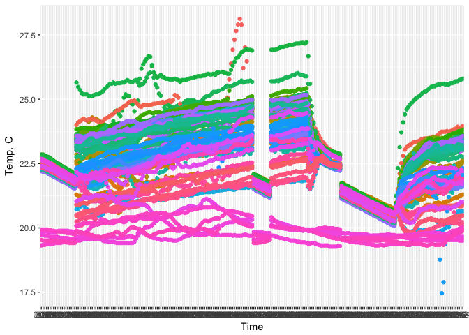
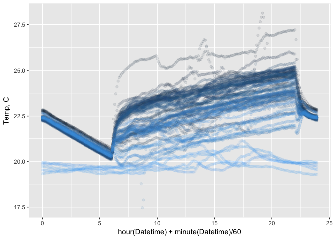
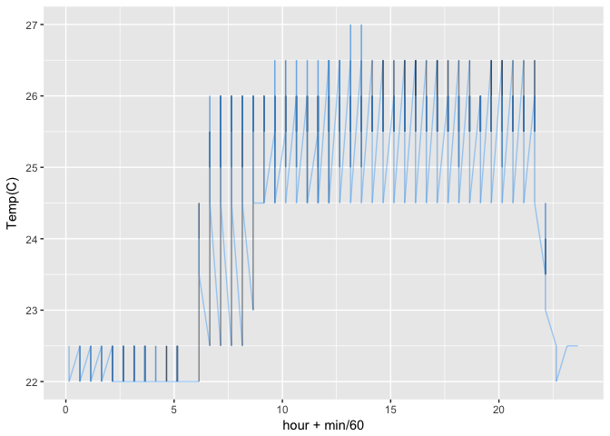

# chamber_temp_monitoring
Kazu  
7/21/2017  


# reading data files
## JT_2014_shelf10_JTshelf4_right.csv from James Ta; 2014
## CEF501shelf13.csv from me (Kazu); 2017

```r
JT.data<-read_csv("JT_2014_shelf10_JTshelf4_right.csv")
```

```
## Parsed with column specification:
## cols(
##   `Date Time, GMT-07:00` = col_character(),
##   `Temp, C` = col_double(),
##   `RH, %` = col_double()
## )
```

```r
JT.data
```

```
## # A tibble: 18,736 × 3
##    `Date Time, GMT-07:00` `Temp, C` `RH, %`
##                     <chr>     <dbl>   <dbl>
## 1            7/1/14 17:00    21.748  61.518
## 2            7/1/14 17:00        NA      NA
## 3            7/1/14 17:06    21.963  59.877
## 4            7/1/14 17:12    21.843  60.255
## 5            7/1/14 17:18    21.748  60.484
## 6            7/1/14 17:24    21.700  60.842
## 7            7/1/14 17:30    21.676  61.051
## 8            7/1/14 17:36    21.628  61.347
## 9            7/1/14 17:42    21.604  61.738
## 10           7/1/14 17:48    21.581  62.642
## # ... with 18,726 more rows
```

```r
KN.data<-read_csv("CEF501shelf13.csv",skip=4)
```

```
## Warning: Missing column names filled in: 'X6' [6]
```

```
## Parsed with column specification:
## cols(
##   Index = col_integer(),
##   `Date/Time` = col_character(),
##   `Temp(C)` = col_double(),
##   `Humidity(%rh)` = col_double(),
##   `Dew Point(C)` = col_double(),
##   X6 = col_character()
## )
```

```r
KN.data
```

```
## # A tibble: 8,026 × 6
##    Index          `Date/Time` `Temp(C)` `Humidity(%rh)` `Dew Point(C)`
##    <int>                <chr>     <dbl>           <dbl>          <dbl>
## 1      1 2/1/2017 10:09:32 AM      23.0            37.0            7.5
## 2      2 2/1/2017 10:39:32 AM      24.5            35.5            8.3
## 3      3 2/1/2017 11:09:32 AM      25.0            34.5            8.3
## 4      4 2/1/2017 11:39:32 AM      25.0            34.5            8.3
## 5      5 2/1/2017 12:09:32 PM      24.5            34.5            7.8
## 6      6 2/1/2017 12:39:32 PM      24.5            34.5            7.8
## 7      7  2/1/2017 1:09:32 PM      25.0            34.0            8.1
## 8      8  2/1/2017 1:39:32 PM      25.0            34.5            8.3
## 9      9  2/1/2017 2:09:32 PM      25.5            33.5            8.3
## 10    10  2/1/2017 2:39:32 PM      25.5            34.0            8.5
## # ... with 8,016 more rows, and 1 more variables: X6 <chr>
```
# merge two data and drawing temp trace in one plot

# draw each data in daily temp trace manner (eg. 24h) separately and compare them side-by-side

```r
# reformat JT.data
# JT.data.s <- JT.data %>% select("Date Time, GMT-08:00") # 
JT.data.s <- JT.data %>% select(1:2) # 
# split "Date Time, GMT-08:00" into date and time
JT.data.ss<-JT.data.s %>% separate("Date Time, GMT-07:00",into=c("Date","Time"),sep=" ") # separated by white space
# plot 
JT.data.ss %>% ggplot(aes(x=`Time`,y=`Temp, C`,color=Date)) + geom_point() + theme(legend.position = "none") # needs to work on Time？
```

```
## Warning: Removed 4 rows containing missing values (geom_point).
```

<!-- -->

```r
# remove missing data
JT.data.sss<-JT.data.ss %>% filter(!is.na(`Temp, C`))
JT.data.sss %>% ggplot(aes(x=`Time`,y=`Temp, C`,color=Date)) + geom_point() + theme(legend.position = "none") # T_SHOW_BACKTRACE environmental variable.
```

<!-- -->

```r
# treat the date/time as date object
# JT.data.s$`Date Time, GMT-07:00`<-as_datetime(JT.data.s$`Date Time, GMT-07:00`) # needs library(lubridate). error
JT.data.s$`Date Time, GMT-07:00`<-mdy_hm(JT.data.s$`Date Time, GMT-07:00`) # needs library(lubridate). works
# rename column name
JT.data.s<-JT.data.s %>% rename(Datetime=`Date Time, GMT-07:00`)
# 
minute(JT.data.s$Datetime)
```

```
##     [1]  0  0  6 12 18 24 30 36 42 48 54  0  6 12 18 24 30 36 42 48 54  0
##    [23]  6 12 18 24 30 36 42 48 54  0  6 12 18 24 30 36 42 48 54  0  6 12
##    [45] 18 24 30 36 42 48 54  0  6 12 18 24 30 36 42 48 54  0  6 12 18 24
##    [67] 30 36 42 48 54  0  6 12 18 24 30 36 42 48 54  0  6 12 18 24 30 36
##    [89] 42 48 54  0  6 12 18 24 30 36 42 48 54  0  6 12 18 24 30 36 42 48
##   [111] 54  0  6 12 18 24 30 36 42 48 54  0  6 12 18 24 30 36 42 48 54  0
##   [133]  6 12 18 24 30 36 42 48 54  0  6 12 18 24 30 36 42 48 54  0  6 12
##   [155] 18 24 30 36 42 48 54  0  6 12 18 24 30 36 42 48 54  0  6 12 18 24
##   [177] 30 36 42 48 54  0  6 12 18 24 30 36 42 48 54  0  6 12 18 24 30 36
##   [199] 42 48 54  0  6 12 18 24 30 36 42 48 54  0  6 12 18 24 30 36 42 48
##   [221] 54  0  6 12 18 24 30 36 42 48 54  0  6 12 18 24 30 36 42 48 54  0
##   [243]  6 12 18 24 30 36 42 48 54  0  6 12 18 24 30 36 42 48 54  0  6 12
##   [265] 18 24 30 36 42 48 54  0  6 12 18 24 30 36 42 48 54  0  6 12 18 24
##   [287] 30 36 42 48 54  0  6 12 18 24 30 36 42 48 54  0  6 12 18 24 30 36
##   [309] 42 48 54  0  6 12 18 24 30 36 42 48 54  0  6 12 18 24 30 36 42 48
##   [331] 54  0  6 12 18 24 30 36 42 48 54  0  6 12 18 24 30 36 42 48 54  0
##   [353]  6 12 18 24 30 36 42 48 54  0  6 12 18 24 30 36 42 48 54  0  6 12
##   [375] 18 24 30 36 42 48 54  0  6 12 18 24 30 36 42 48 54  0  6 12 18 24
##   [397] 30 36 42 48 54  0  6 12 18 24 30 36 42 48 54  0  6 12 18 24 30 36
##   [419] 42 48 54  0  6 12 18 24 30 36 42 48 54  0  6 12 18 24 30 36 42 48
##   [441] 54  0  6 12 18 24 30 36 42 48 54  0  6 12 18 24 30 36 42 48 54  0
##   [463]  6 12 18 24 30 36 42 48 54  0  6 12 18 24 30 36 42 48 54  0  6 12
##   [485] 18 24 30 36 42 48 54  0  6 12 18 24 30 36 42 48 54  0  6 12 18 24
##   [507] 30 36 42 48 54  0  6 12 18 24 30 36 42 48 54  0  6 12 18 24 30 36
##   [529] 42 48 54  0  6 12 18 24 30 36 42 48 54  0  6 12 18 24 30 36 42 48
##   [551] 54  0  6 12 18 24 30 36 42 48 54  0  6 12 18 24 30 36 42 48 54  0
##   [573]  6 12 18 24 30 36 42 48 54  0  6 12 18 24 30 36 42 48 54  0  6 12
##   [595] 18 24 30 36 42 48 54  0  6 12 18 24 30 36 42 48 54  0  6 12 18 24
##   [617] 30 36 42 48 54  0  6 12 18 24 30 36 42 48 54  0  6 12 18 24 30 36
##   [639] 42 48 54  0  6 12 18 24 30 36 42 48 54  0  6 12 18 24 30 36 42 48
##   [661] 54  0  6 12 18 24 30 36 42 48 54  0  6 12 18 24 30 36 42 48 54  0
##   [683]  6 12 18 24 30 36 42 48 54  0  6 12 18 24 30 36 42 48 54  0  6 12
##   [705] 18 24 30 36 42 48 54  0  6 12 18 24 30 36 42 48 54  0  6 12 18 24
##   [727] 30 36 42 48 54  0  6 12 18 24 30 36 42 48 54  0  6 12 18 24 30 36
##   [749] 42 48 54  0  6 12 18 24 30 36 42 48 54  0  6 12 18 24 30 36 42 48
##   [771] 54  0  6 12 18 24 30 36 42 48 54  0  6 12 18 24 30 36 42 48 54  0
##   [793]  6 12 18 24 30 36 42 48 54  0  6 12 18 24 30 36 42 48 54  0  6 12
##   [815] 18 24 30 36 42 48 54  0  6 12 18 24 30 36 42 48 54  0  6 12 18 24
##   [837] 30 36 42 48 54  0  6 12 18 24 30 36 42 48 54  0  6 12 18 24 30 36
##   [859] 42 48 54  0  6 12 18 24 30 36 42 48 54  0  6 12 18 24 30 36 42 48
##   [881] 54  0  6 12 18 24 30 36 42 48 54  0  6 12 18 24 30 36 42 48 54  0
##   [903]  6 12 18 24 30 36 42 48 54  0  6 12 18 24 30 36 42 48 54  0  6 12
##   [925] 18 24 30 36 42 48 54  0  6 12 18 24 30 36 42 48 54  0  6 12 18 24
##   [947] 30 36 42 48 54  0  6 12 18 24 30 36 42 48 54  0  6 12 18 24 30 36
##   [969] 42 48 54  0  6 12 18 24 30 36 42 48 54  0  6 12 18 24 30 36 42 48
##   [991] 54  0  6 12 18 24 30 36 42 48 54  0  6 12 18 24 30 36 42 48 54  0
##  [1013]  6 12 18 24 30 36 42 48 54  0  6 12 18 24 30 36 42 48 54  0  6 12
##  [1035] 18 24 30 36 42 48 54  0  6 12 18 24 30 36 42 48 54  0  6 12 18 24
##  [1057] 30 36 42 48 54  0  6 12 18 24 30 36 42 48 54  0  6 12 18 24 30 36
##  [1079] 42 48 54  0  6 12 18 24 30 36 42 48 54  0  6 12 18 24 30 36 42 48
##  [1101] 54  0  6 12 18 24 30 36 42 48 54  0  6 12 18 24 30 36 42 48 54  0
##  [1123]  6 12 18 24 30 36 42 48 54  0  6 12 18 24 30 36 42 48 54  0  6 12
##  [1145] 18 24 30 36 42 48 54  0  6 12 18 24 30 36 42 48 54  0  6 12 18 24
##  [1167] 30 36 42 48 54  0  6 12 18 24 30 36 42 48 54  0  6 12 18 24 30 36
##  [1189] 42 48 54  0  6 12 18 24 30 36 42 48 54  0  6 12 18 24 30 36 42 48
##  [1211] 54  0  6 12 18 24 30 36 42 48 54  0  6 12 18 24 30 36 42 48 54  0
##  [1233]  6 12 18 24 30 36 42 48 54  0  6 12 18 24 30 36 42 48 54  0  6 12
##  [1255] 18 24 30 36 42 48 54  0  6 12 18 24 30 36 42 48 54  0  6 12 18 24
##  [1277] 30 36 42 48 54  0  6 12 18 24 30 36 42 48 54  0  6 12 18 24 30 36
##  [1299] 42 48 54  0  6 12 18 24 30 36 42 48 54  0  6 12 18 24 30 36 42 48
##  [1321] 54  0  6 12 18 24 30 36 42 48 54  0  6 12 18 24 30 36 42 48 54  0
##  [1343]  6 12 18 24 30 36 42 48 54  0  6 12 18 24 30 36 42 48 54  0  6 12
##  [1365] 18 24 30 36 42 48 54  0  6 12 18 24 30 36 42 48 54  0  6 12 18 24
##  [1387] 30 36 42 48 54  0  6 12 18 24 30 36 42 48 54  0  6 12 18 24 30 36
##  [1409] 42 48 54  0  6 12 18 24 30 36 42 48 54  0  6 12 18 24 30 36 42 48
##  [1431] 54  0  6 12 18 24 30 36 42 48 54  0  6 12 18 24 30 36 42 48 54  0
##  [1453]  6 12 18 24 30 36 42 48 54  0  6 12 18 24 30 36 42 48 54  0  6 12
##  [1475] 18 24 30 36 42 48 54  0  6 12 18 24 30 36 42 48 54  0  6 12 18 24
##  [1497] 30 36 42 48 54  0  6 12 18 24 30 36 42 48 54  0  6 12 18 24 30 36
##  [1519] 42 48 54  0  6 12 18 24 30 36 42 48 54  0  6 12 18 24 30 36 42 48
##  [1541] 54  0  6 12 18 24 30 36 42 48 54  0  6 12 18 24 30 36 42 48 54  0
##  [1563]  6 12 18 24 30 36 42 48 54  0  6 12 18 24 30 36 42 48 54  0  6 12
##  [1585] 18 24 30 36 42 48 54  0  6 12 18 24 30 36 42 48 54  0  6 12 18 24
##  [1607] 30 36 42 48 54  0  6 12 18 24 30 36 42 48 54  0  6 12 18 24 30 36
##  [1629] 42 48 54  0  6 12 18 24 30 36 42 48 54  0  6 12 18 24 30 36 42 48
##  [1651] 54  0  6 12 18 24 30 36 42 48 54  0  6 12 18 24 30 36 42 48 54  0
##  [1673]  6 12 18 24 30 36 42 48 54  0  6 12 18 24 30 36 42 48 54  0  6 12
##  [1695] 18 24 30 36 42 48 54  0  6 12 18 24 30 36 42 48 54  0  6 12 18 24
##  [1717] 30 36 42 48 54  0  6 12 18 24 30 36 42 48 54  0  6 12 18 24 30 36
##  [1739] 42 48 54  0  6 12 18 24 30 36 42 48 54  0  6 12 18 24 30 36 42 48
##  [1761] 54  0  6 12 18 24 30 36 42 48 54  0  6 12 18 24 30 36 42 48 54  0
##  [1783]  6 12 18 24 30 36 42 48 54  0  6 12 18 24 30 36 42 48 54  0  6 12
##  [1805] 18 24 30 36 42 48 54  0  6 12 18 24 30 36 42 48 54  0  6 12 18 24
##  [1827] 30 36 42 48 54  0  6 12 18 24 30 36 42 48 54  0  6 12 18 24 30 36
##  [1849] 42 48 54  0  6 12 18 24 30 36 42 48 54  0  6 12 18 24 30 36 42 48
##  [1871] 54  0  6 12 18 24 30 36 42 48 54  0  6 12 18 24 30 36 42 48 54  0
##  [1893]  6 12 18 24 30 36 42 48 54  0  6 12 18 24 30 36 42 48 54  0  6 12
##  [1915] 18 24 30 36 42 48 54  0  6 12 18 24 30 36 42 48 54  0  6 12 18 24
##  [1937] 30 36 42 48 54  0  6 12 18 24 30 36 42 48 54  0  6 12 18 24 30 36
##  [1959] 42 48 54  0  6 12 18 24 30 36 42 48 54  0  6 12 18 24 30 36 42 48
##  [1981] 54  0  6 12 18 24 30 36 42 48 54  0  6 12 18 24 30 36 42 48 54  0
##  [2003]  6 12 18 24 30 36 42 48 54  0  6 12 18 24 30 36 42 48 54  0  6 12
##  [2025] 18 24 30 36 42 48 54  0  6 12 18 24 30 36 42 48 54  0  6 12 18 24
##  [2047] 30 36 42 48 54  0  6 12 18 24 30 36 42 48 54  0  6 12 18 24 30 36
##  [2069] 42 48 54  0  6 12 18 24 30 36 42 48 54  0  6 12 18 24 30 36 42 48
##  [2091] 54  0  6 12 18 24 30 36 42 48 54  0  6 12 18 24 30 36 42 48 54  0
##  [2113]  6 12 18 24 30 36 42 48 54  0  6 12 18 24 30 36 42 48 54  0  6 12
##  [2135] 18 24 30 36 42 48 54  0  6 12 18 24 30 36 42 48 54  0  6 12 18 24
##  [2157] 30 36 42 48 54  0  6 12 18 24 30 36 42 48 54  0  6 12 18 24 30 36
##  [2179] 42 48 54  0  6 12 18 24 30 36 42 48 54  0  6 12 18 24 30 36 42 48
##  [2201] 54  0  6 12 18 24 30 36 42 48 54  0  6 12 18 24 30 36 42 48 54  0
##  [2223]  6 12 18 24 30 36 42 48 54  0  6 12 18 24 30 36 42 48 54  0  6 12
##  [2245] 18 24 30 36 42 48 54  0  6 12 18 24 30 36 42 48 54  0  6 12 18 24
##  [2267] 30 36 42 48 54  0  6 12 18 24 30 36 42 48 54  0  6 12 18 24 30 36
##  [2289] 42 48 54  0  6 12 18 24 30 36 42 48 54  0  6 12 18 24 30 36 42 48
##  [2311] 54  0  6 12 18 24 30 36 42 48 54  0  6 12 18 24 30 36 42 48 54  0
##  [2333]  6 12 18 24 30 36 42 48 54  0  6 12 18 24 30 36 42 48 54  0  6 12
##  [2355] 18 24 30 36 42 48 54  0  6 12 18 24 30 36 42 48 54  0  6 12 18 24
##  [2377] 30 36 42 48 54  0  6 12 18 24 30 36 42 48 54  0  6 12 18 24 30 36
##  [2399] 42 48 54  0  6 12 18 24 30 36 42 48 54  0  6 12 18 24 30 36 42 48
##  [2421] 54  0  6 12 18 24 30 36 42 48 54  0  6 12 18 24 30 36 42 48 54  0
##  [2443]  6 12 18 24 30 36 42 48 54  0  6 12 18 24 30 36 42 48 54  0  6 12
##  [2465] 18 24 30 36 42 48 54  0  6 12 18 24 30 36 42 48 54  0  6 12 18 24
##  [2487] 30 36 42 48 54  0  6 12 18 24 30 36 42 48 54  0  6 12 18 24 30 36
##  [2509] 42 48 54  0  6 12 18 24 30 36 42 48 54  0  6 12 18 24 30 36 42 48
##  [2531] 54  0  6 12 18 24 30 36 42 48 54  0  6 12 18 24 30 36 42 48 54  0
##  [2553]  6 12 18 24 30 36 42 48 54  0  6 12 18 24 30 36 42 48 54  0  6 12
##  [2575] 18 24 30 36 42 48 54  0  6 12 18 24 30 36 42 48 54  0  6 12 18 24
##  [2597] 30 36 42 48 54  0  6 12 18 24 30 36 42 48 54  0  6 12 18 24 30 36
##  [2619] 42 48 54  0  6 12 18 24 30 36 42 48 54  0  6 12 18 24 30 36 42 48
##  [2641] 54  0  6 12 18 24 30 36 42 48 54  0  6 12 18 24 30 36 42 48 54  0
##  [2663]  6 12 18 24 30 36 42 48 54  0  6 12 18 24 30 36 42 48 54  0  6 12
##  [2685] 18 24 30 36 42 48 54  0  6 12 18 24 30 36 42 48 54  0  6 12 18 24
##  [2707] 30 36 42 48 54  0  6 12 18 24 30 36 42 48 54  0  6 12 18 24 30 36
##  [2729] 42 48 54  0  6 12 18 24 30 36 42 48 54  0  6 12 18 24 30 36 42 48
##  [2751] 54  0  6 12 18 24 30 36 42 48 54  0  6 12 18 24 30 36 42 48 54  0
##  [2773]  6 12 18 24 30 36 42 48 54  0  6 12 18 24 30 36 42 48 54  0  6 12
##  [2795] 18 24 30 36 42 48 54  0  6 12 18 24 30 36 42 48 54  0  6 12 18 24
##  [2817] 30 36 42 48 54  0  6 12 18 24 30 36 42 48 54  0  6 12 18 24 30 36
##  [2839] 42 48 54  0  6 12 18 24 30 36 42 48 54  0  6 12 18 24 30 36 42 48
##  [2861] 54  0  6 12 18 24 30 36 42 48 54  0  6 12 18 24 30 36 42 48 54  0
##  [2883]  6 12 18 24 30 36 42 48 54  0  6 12 18 24 30 36 42 48 54  0  6 12
##  [2905] 18 24 30 36 42 48 54  0  6 12 18 24 30 36 42 48 54  0  6 12 18 24
##  [2927] 30 36 42 48 54  0  6 12 18 24 30 36 42 48 54  0  6 12 18 24 30 36
##  [2949] 42 48 54  0  6 12 18 24 30 36 42 48 54  0  6 12 18 24 30 36 42 48
##  [2971] 54  0  6 12 18 24 30 36 42 48 54  0  6 12 18 24 30 36 42 48 54  0
##  [2993]  6 12 18 24 30 36 42 48 54  0  6 12 18 24 30 36 42 48 54  0  6 12
##  [3015] 18 24 30 36 42 48 54  0  6 12 18 24 30 36 42 48 54  0  6 12 18 24
##  [3037] 30 36 42 48 54  0  6 12 18 24 30 36 42 48 54  0  6 12 18 24 30 36
##  [3059] 42 48 54  0  6 12 18 24 30 36 42 48 54  0  6 12 18 24 30 36 42 48
##  [3081] 54  0  6 12 18 24 30 36 42 48 54  0  6 12 18 24 30 36 42 48 54  0
##  [3103]  6 12 18 24 30 36 42 48 54  0  6 12 18 24 30 36 42 48 54  0  6 12
##  [3125] 18 24 30 36 42 48 54  0  6 12 18 24 30 36 42 48 54  0  6 12 18 24
##  [3147] 30 36 42 48 54  0  6 12 18 24 30 36 42 48 54  0  6 12 18 24 30 36
##  [3169] 42 48 54  0  6 12 18 24 30 36 42 48 54  0  6 12 18 24 30 36 42 48
##  [3191] 54  0  6 12 18 24 30 36 42 48 54  0  6 12 18 24 30 36 42 48 54  0
##  [3213]  6 12 18 24 30 36 42 48 54  0  6 12 18 24 30 36 42 48 54  0  6 12
##  [3235] 18 24 30 36 42 48 54  0  6 12 18 24 30 36 42 48 54  0  6 12 18 24
##  [3257] 30 36 42 48 54  0  6 12 18 24 30 36 42 48 54  0  6 12 18 24 30 36
##  [3279] 42 48 54  0  6 12 18 24 30 36 42 48 54  0  6 12 18 24 30 36 42 48
##  [3301] 54  0  6 12 18 24 30 36 42 48 54  0  6 12 18 24 30 36 42 48 54  0
##  [3323]  6 12 18 24 30 36 42 48 54  0  6 12 18 24 30 36 42 48 54  0  6 12
##  [3345] 18 24 30 36 42 48 54  0  6 12 18 24 30 36 42 48 54  0  6 12 18 24
##  [3367] 30 36 42 48 54  0  6 12 18 24 30 36 42 48 54  0  6 12 18 24 30 36
##  [3389] 42 48 54  0  6 12 18 24 30 36 42 48 54  0  6 12 18 24 30 36 42 48
##  [3411] 54  0  6 12 18 24 30 36 42 48 54  0  6 12 18 24 30 36 42 48 54  0
##  [3433]  6 12 18 24 30 36 42 48 54  0  6 12 18 24 30 36 42 48 54  0  6 12
##  [3455] 18 24 30 36 42 48 54  0  6 12 18 24 30 36 42 48 54  0  6 12 18 24
##  [3477] 30 36 42 48 54  0  6 12 18 24 30 36 42 48 54  0  6 12 18 24 30 36
##  [3499] 42 48 54  0  6 12 18 24 30 36 42 48 54  0  6 12 18 24 30 36 42 48
##  [3521] 54  0  6 12 18 24 30 36 42 48 54  0  6 12 18 24 30 36 42 48 54  0
##  [3543]  6 12 18 24 30 36 42 48 54  0  6 12 18 24 30 36 42 48 54  0  6 12
##  [3565] 18 24 30 36 42 48 54  0  6 12 18 24 30 36 42 48 54  0  6 12 18 24
##  [3587] 30 36 42 48 54  0  6 12 18 24 30 36 42 48 54  0  6 12 18 24 30 36
##  [3609] 42 48 54  0  6 12 18 24 30 36 42 48 54  0  6 12 18 24 30 36 42 48
##  [3631] 54  0  6 12 18 24 30 36 42 48 54  0  6 12 18 24 30 36 42 48 54  0
##  [3653]  6 12 18 24 30 36 42 48 54  0  6 12 18 24 30 36 42 48 54  0  6 12
##  [3675] 18 24 30 36 42 48 54  0  6 12 18 24 30 36 42 48 54  0  6 12 18 24
##  [3697] 30 36 42 48 54  0  6 12 18 24 30 36 42 48 54  0  6 12 18 24 30 36
##  [3719] 42 48 54  0  6 12 18 24 30 36 42 48 54  0  6 12 18 24 30 36 42 48
##  [3741] 54  0  6 12 18 24 30 36 42 48 54  0  6 12 18 24 30 36 42 48 54  0
##  [3763]  6 12 18 24 30 36 42 48 54  0  6 12 18 24 30 36 42 48 54  0  6 12
##  [3785] 18 24 30 36 42 48 54  0  6 12 18 24 30 36 42 48 54  0  6 12 18 24
##  [3807] 30 36 42 48 54  0  6 12 18 24 30 36 42 48 54  0  6 12 18 24 30 36
##  [3829] 42 48 54  0  6 12 18 24 30 36 42 48 54  0  6 12 18 24 30 36 42 48
##  [3851] 54  0  6 12 18 24 30 36 42 48 54  0  6 12 18 24 30 36 42 48 54  0
##  [3873]  6 12 18 24 30 36 42 48 54  0  6 12 18 24 30 36 42 48 54  0  6 12
##  [3895] 18 24 30 36 42 48 54  0  6 12 18 24 30 36 42 48 54  0  6 12 18 24
##  [3917] 30 36 42 48 54  0  6 12 18 24 30 36 42 48 54  0  6 12 18 24 30 36
##  [3939] 42 48 54  0  6 12 18 24 30 36 42 48 54  0  6 12 18 24 30 36 42 48
##  [3961] 54  0  6 12 18 24 30 36 42 48 54  0  6 12 18 24 30 36 42 48 54  0
##  [3983]  6 12 18 24 30 36 42 48 54  0  6 12 18 24 30 36 42 48 54  0  6 12
##  [4005] 18 24 30 36 42 48 54  0  6 12 18 24 30 36 42 48 54  0  6 12 18 24
##  [4027] 30 36 42 48 54  0  6 12 18 24 30 36 42 48 54  0  6 12 18 24 30 36
##  [4049] 42 48 54  0  6 12 18 24 30 36 42 48 54  0  6 12 18 24 30 36 42 48
##  [4071] 54  0  6 12 18 24 30 36 42 48 54  0  6 12 18 24 30 36 42 48 54  0
##  [4093]  6 12 18 24 30 36 42 48 54  0  6 12 18 24 30 36 42 48 54  0  6 12
##  [4115] 18 24 30 36 42 48 54  0  6 12 18 24 30 36 42 48 54  0  6 12 18 24
##  [4137] 30 36 42 48 54  0  6 12 18 24 30 36 42 48 54  0  6 12 18 24 30 36
##  [4159] 42 48 54  0  6 12 18 24 30 36 42 48 54  0  6 12 18 24 30 36 42 48
##  [4181] 54  0  6 12 18 24 30 36 42 48 54  0  6 12 18 24 30 36 42 48 54  0
##  [4203]  6 12 18 24 30 36 42 48 54  0  6 12 18 24 30 36 42 48 54  0  6 12
##  [4225] 18 24 30 36 42 48 54  0  6 12 18 24 30 36 42 48 54  0  6 12 18 24
##  [4247] 30 36 42 48 54  0  6 12 18 24 30 36 42 48 54  0  6 12 18 24 30 36
##  [4269] 42 48 54  0  6 12 18 24 30 36 42 48 54  0  6 12 18 24 30 36 42 48
##  [4291] 54  0  6 12 18 24 30 36 42 48 54  0  6 12 18 24 30 36 42 48 54  0
##  [4313]  6 12 18 24 30 36 42 48 54  0  6 12 18 24 30 36 42 48 54  0  6 12
##  [4335] 18 24 30 36 42 48 54  0  6 12 18 24 30 36 42 48 54  0  6 12 18 24
##  [4357] 30 36 42 48 54  0  6 12 18 24 30 36 42 48 54  0  6 12 18 24 30 36
##  [4379] 42 48 54  0  6 12 18 24 30 36 42 48 54  0  6 12 18 24 30 36 42 48
##  [4401] 54  0  6 12 18 24 30 36 42 48 54  0  6 12 18 24 30 36 42 48 54  0
##  [4423]  6 12 18 24 30 36 42 48 54  0  6 12 18 24 30 36 42 48 54  0  6 12
##  [4445] 18 24 30 36 42 48 54  0  6 12 18 24 30 36 42 48 54  0  6 12 18 24
##  [4467] 30 36 42 48 54  0  6 12 18 24 30 36 42 48 54  0  6 12 18 24 30 36
##  [4489] 42 48 54  0  6 12 18 24 30 36 42 48 54  0  6 12 18 24 30 36 42 48
##  [4511] 54  0  6 12 18 24 30 36 42 48 54  0  6 12 18 24 30 36 42 48 54  0
##  [4533]  6 12 18 24 30 36 42 48 54  0  6 12 18 24 30 36 42 48 54  0  6 12
##  [4555] 18 24 30 36 42 48 54  0  6 12 18 24 30 36 42 48 54  0  6 12 18 24
##  [4577] 30 36 42 48 54  0  6 12 18 24 30 36 42 48 54  0  6 12 18 24 30 36
##  [4599] 42 48 54  0  6 12 18 24 30 36 42 48 54  0  6 12 18 24 30 36 42 48
##  [4621] 54  0  6 12 18 24 30 36 42 48 54  0  6 12 18 24 30 36 42 48 54  0
##  [4643]  6 12 18 24 30 36 42 48 54  0  6 12 18 24 30 36 42 48 54  0  6 12
##  [4665] 18 24 30 36 42 48 54  0  6 12 18 24 30 36 42 48 54  0  6 12 18 24
##  [4687] 30 36 42 48 54  0  6 12 18 24 30 36 42 48 54  0  6 12 18 24 30 36
##  [4709] 42 48 54  0  6 12 18 24 30 36 42 48 54  0  6 12 18 24 30 36 42 48
##  [4731] 54  0  6 12 18 24 30 36 42 48 54  0  6 12 18 24 30 36 42 48 54  0
##  [4753]  6 12 18 24 30 36 42 48 54  0  6 12 18 24 30 36 42 48 54  0  6 12
##  [4775] 18 24 30 36 42 48 54  0  6 12 18 24 30 36 42 48 54  0  6 12 18 24
##  [4797] 30 36 42 48 54  0  6 12 18 24 30 36 42 48 54  0  6 12 18 24 30 36
##  [4819] 42 48 54  0  6 12 18 24 30 36 42 48 54  0  6 12 18 24 30 36 42 48
##  [4841] 54  0  6 12 18 24 30 36 42 48 54  0  6 12 18 24 30 36 42 48 54  0
##  [4863]  6 12 18 24 30 36 42 48 54  0  6 12 18 24 30 36 42 48 54  0  6 12
##  [4885] 18 24 30 36 42 48 54  0  6 12 18 24 30 36 42 48 54  0  6 12 18 24
##  [4907] 30 36 42 48 54  0  6 12 18 24 30 36 42 48 54  0  6 12 18 24 30 36
##  [4929] 42 48 54  0  6 12 18 24 30 36 42 48 54  0  6 12 18 24 30 36 42 48
##  [4951] 54  0  6 12 18 24 30 36 42 48 54  0  6 12 18 24 30 36 42 48 54  0
##  [4973]  6 12 18 24 30 36 42 48 54  0  6 12 18 24 30 36 42 48 54  0  6 12
##  [4995] 18 24 30 36 42 48 54  0  6 12 18 24 30 36 42 48 54  0  6 12 18 24
##  [5017] 30 36 42 48 54  0  6 12 18 24 30 36 42 48 54  0  6 12 18 24 30 36
##  [5039] 42 48 54  0  6 12 18 24 30 36 42 48 54  0  6 12 18 24 30 36 42 48
##  [5061] 54  0  6 12 18 24 30 36 42 48 54  0  6 12 18 24 30 36 42 48 54  0
##  [5083]  6 12 18 24 30 36 42 48 54  0  6 12 18 24 30 36 42 48 54  0  6 12
##  [5105] 18 24 30 36 42 48 54  0  6 12 18 24 30 36 42 48 54  0  6 12 18 24
##  [5127] 30 36 42 48 54  0  6 12 18 24 30 36 42 48 54  0  6 12 18 24 30 36
##  [5149] 42 48 54  0  6 12 18 24 30 36 42 48 54  0  6 12 18 24 30 36 42 48
##  [5171] 54  0  6 12 18 24 30 36 42 48 54  0  6 12 18 24 30 36 42 48 54  0
##  [5193]  6 12 18 24 30 36 42 48 54  0  6 12 18 24 30 36 42 48 54  0  6 12
##  [5215] 18 24 30 36 42 48 54  0  6 12 18 24 30 36 42 48 54  0  6 12 18 24
##  [5237] 30 36 42 48 54  0  6 12 18 24 30 36 42 48 54  0  6 12 18 24 30 36
##  [5259] 42 48 54  0  6 12 18 24 30 36 42 48 54  0  6 12 18 24 30 36 42 48
##  [5281] 54  0  6 12 18 24 30 36 42 48 54  0  6 12 18 24 30 36 42 48 54  0
##  [5303]  6 12 18 24 30 36 42 48 54  0  6 12 18 24 30 36 42 48 54  0  6 12
##  [5325] 18 24 30 36 42 48 54  0  6 12 18 24 30 36 42 48 54  0  6 12 18 24
##  [5347] 30 36 42 48 54  0  6 12 18 24 30 36 42 48 54  0  6 12 18 24 30 36
##  [5369] 42 48 54  0  6 12 18 24 30 36 42 48 54  0  6 12 18 24 30 36 42 48
##  [5391] 54  0  6 12 18 24 30 36 42 48 54  0  6 12 18 24 30 36 42 48 54  0
##  [5413]  6 12 18 24 30 36 42 48 54  0  6 12 18 24 30 36 42 48 54  0  6 12
##  [5435] 18 24 30 36 42 48 54  0  6 12 18 24 30 36 42 48 54  0  6 12 18 24
##  [5457] 30 36 42 48 54  0  6 12 18 24 30 36 42 48 54  0  6 12 18 24 30 36
##  [5479] 42 48 54  0  6 12 18 24 30 36 42 48 54  0  6 12 18 24 30 36 42 48
##  [5501] 54  0  6 12 18 24 30 36 42 48 54  0  6 12 18 24 30 36 42 48 54  0
##  [5523]  6 12 18 24 30 36 42 48 54  0  6 12 18 24 30 36 42 48 54  0  6 12
##  [5545] 18 24 30 36 42 48 54  0  6 12 18 24 30 36 42 48 54  0  6 12 18 24
##  [5567] 30 36 42 48 54  0  6 12 18 24 30 36 42 48 54  0  6 12 18 24 30 36
##  [5589] 42 48 54  0  6 12 18 24 30 36 42 48 54  0  6 12 18 24 30 36 42 48
##  [5611] 54  0  6 12 18 24 30 36 42 48 54  0  6 12 18 24 30 36 42 48 54  0
##  [5633]  6 12 18 24 30 36 42 48 54  0  6 12 18 24 30 36 42 48 54  0  6 12
##  [5655] 18 24 30 36 42 48 54  0  6 12 18 24 30 36 42 48 54  0  6 12 18 24
##  [5677] 30 36 42 48 54  0  6 12 18 24 30 36 42 48 54  0  6 12 18 24 30 36
##  [5699] 42 48 54  0  6 12 18 24 30 36 42 48 54  0  6 12 18 24 30 36 42 48
##  [5721] 54  0  6 12 18 24 30 36 42 48 54  0  6 12 18 24 30 36 42 48 54  0
##  [5743]  6 12 18 24 30 36 42 48 54  0  6 12 18 24 30 36 42 48 54  0  6 12
##  [5765] 18 24 30 36 42 48 54  0  6 12 18 24 30 36 42 48 54  0  6 12 18 24
##  [5787] 30 36 42 48 54  0  6 12 18 24 30 36 42 48 54  0  6 12 18 24 30 36
##  [5809] 42 48 54  0  6 12 18 24 30 36 42 48 54  0  6 12 18 24 30 36 42 48
##  [5831] 54  0  6 12 18 24 30 36 42 48 54  0  6 12 18 24 30 36 42 48 54  0
##  [5853]  6 12 18 24 30 36 42 48 54  0  6 12 18 24 30 36 42 48 54  0  6 12
##  [5875] 18 24 30 36 42 48 54  0  6 12 18 24 30 36 42 48 54  0  6 12 18 24
##  [5897] 30 36 42 48 54  0  6 12 18 24 30 36 42 48 54  0  6 12 18 24 30 36
##  [5919] 42 48 54  0  6 12 18 24 30 36 42 48 54  0  6 12 18 24 30 36 42 48
##  [5941] 54  0  6 12 18 24 30 36 42 48 54  0  6 12 18 24 30 36 42 48 54  0
##  [5963]  6 12 18 24 30 36 42 48 54  0  6 12 18 24 30 36 42 48 54  0  6 12
##  [5985] 18 24 30 36 42 48 54  0  6 12 18 24 30 36 42 48 54  0  6 12 18 24
##  [6007] 30 36 42 48 54  0  6 12 18 24 30 36 42 48 54  0  6 12 18 24 30 36
##  [6029] 42 48 54  0  6 12 18 24 30 36 42 48 54  0  6 12 18 24 30 36 42 48
##  [6051] 54  0  6 12 18 24 30 36 42 48 54  0  6 12 18 24 30 36 42 48 54  0
##  [6073]  6 12 18 24 30 36 42 48 54  0  6 12 18 24 30 36 42 48 54  0  6 12
##  [6095] 18 24 30 36 42 48 54  0  6 12 18 24 30 36 42 48 54  0  6 12 18 24
##  [6117] 30 36 42 48 54  0  6 12 18 24 30 36 42 48 54  0  6 12 18 24 30 36
##  [6139] 42 48 54  0  6 12 18 24 30 36 42 48 54  0  6 12 18 24 30 36 42 48
##  [6161] 54  0  6 12 18 24 30 36 42 48 54  0  6 12 18 24 30 36 42 48 54  0
##  [6183]  6 12 18 24 30 36 42 48 54  0  6 12 18 24 30 36 42 48 54  0  6 12
##  [6205] 18 24 30 36 42 48 54  0  6 12 18 24 30 36 42 48 54  0  6 12 18 24
##  [6227] 30 36 42 48 54  0  6 12 18 24 30 36 42 48 54  0  6 12 18 24 30 36
##  [6249] 42 48 54  0  6 12 18 24 30 36 42 48 54  0  6 12 18 24 30 36 42 48
##  [6271] 54  0  6 12 18 24 30 36 42 48 54  0  6 12 18 24 30 36 42 48 54  0
##  [6293]  6 12 18 24 30 36 42 48 54  0  6 12 18 24 30 36 42 48 54  0  6 12
##  [6315] 18 24 30 36 42 48 54  0  6 12 18 24 30 36 42 48 54  0  6 12 18 24
##  [6337] 30 36 42 48 54  0  6 12 18 24 30 36 42 48 54  0  6 12 18 24 30 36
##  [6359] 42 48 54  0  6 12 18 24 30 36 42 48 54  0  6 12 18 24 30 36 42 48
##  [6381] 54  0  6 12 18 24 30 36 42 48 54  0  6 12 18 24 30 36 42 48 54  0
##  [6403]  6 12 18 24 30 36 42 48 54  0  6 12 18 24 30 36 42 48 54  0  6 12
##  [6425] 18 24 30 36 42 48 54  0  6 12 18 24 30 36 42 48 54  0  6 12 18 24
##  [6447] 30 36 42 48 54  0  6 12 18 24 30 36 42 48 54  0  6 12 18 24 30 36
##  [6469] 42 48 54  0  6 12 18 24 30 36 42 48 54  0  6 12 18 24 30 36 42 48
##  [6491] 54  0  6 12 18 24 30 36 42 48 54  0  6 12 18 24 30 36 42 48 54  0
##  [6513]  6 12 18 24 30 36 42 48 54  0  6 12 18 24 30 36 42 48 54  0  6 12
##  [6535] 18 24 30 36 42 48 54  0  6 12 18 24 30 36 42 48 54  0  6 12 18 24
##  [6557] 30 36 42 48 54  0  6 12 18 24 30 36 42 48 54  0  6 12 18 24 30 36
##  [6579] 42 48 54  0  6 12 18 24 30 36 42 48 54  0  6 12 18 24 30 36 42 48
##  [6601] 54  0  6 12 18 24 30 36 42 48 54  0  6 12 18 24 30 36 42 48 54  0
##  [6623]  6 12 18 24 30 36 42 48 54  0  6 12 18 24 30 36 42 48 54  0  6 12
##  [6645] 18 24 30 36 42 48 54  0  6 12 18 24 30 36 42 48 54  0  6 12 18 24
##  [6667] 30 36 42 48 54  0  6 12 18 24 30 36 42 48 54  0  6 12 18 24 30 36
##  [6689] 42 48 54  0  6 12 18 24 30 36 42 48 54  0  6 12 18 24 30 36 42 48
##  [6711] 54  0  6 12 18 24 30 36 42 48 54  0  6 12 18 24 30 36 42 48 54  0
##  [6733]  6 12 18 24 30 36 42 48 54  0  6 12 18 24 30 36 42 48 54  0  6 12
##  [6755] 18 24 30 36 42 48 54  0  6 12 18 24 30 36 42 48 54  0  6 12 18 24
##  [6777] 30 36 42 48 54  0  6 12 18 24 30 36 42 48 54  0  6 12 18 24 30 36
##  [6799] 42 48 54  0  6 12 18 24 30 36 42 48 54  0  6 12 18 24 30 36 42 48
##  [6821] 54  0  6 12 18 24 30 36 42 48 54  0  6 12 18 24 30 36 42 48 54  0
##  [6843]  6 12 18 24 30 36 42 48 54  0  6 12 18 24 30 36 42 48 54  0  6 12
##  [6865] 18 24 30 36 42 48 54  0  6 12 18 24 30 36 42 48 54  0  6 12 18 24
##  [6887] 30 36 42 48 54  0  6 12 18 24 30 36 42 48 54  0  6 12 18 24 30 36
##  [6909] 42 48 54  0  6 12 18 24 30 36 42 48 54  0  6 12 18 24 30 36 42 48
##  [6931] 54  0  6 12 18 24 30 36 42 48 54  0  6 12 18 24 30 36 42 48 54  0
##  [6953]  6 12 18 24 30 36 42 48 54  0  6 12 18 24 30 36 42 48 54  0  6 12
##  [6975] 18 24 30 36 42 48 54  0  6 12 18 24 30 36 42 48 54  0  6 12 18 24
##  [6997] 30 36 42 48 54  0  6 12 18 24 30 36 42 48 54  0  6 12 18 24 30 36
##  [7019] 42 48 54  0  6 12 18 24 30 36 42 48 54  0  6 12 18 24 30 36 42 48
##  [7041] 54  0  6 12 18 24 30 36 42 48 54  0  6 12 18 24 30 36 42 48 54  0
##  [7063]  6 12 18 24 30 36 42 48 54  0  6 12 18 24 30 36 42 48 54  0  6 12
##  [7085] 18 24 30 36 42 48 54  0  6 12 18 24 30 36 42 48 54  0  6 12 18 24
##  [7107] 30 36 42 48 54  0  6 12 18 24 30 36 42 48 54  0  6 12 18 24 30 36
##  [7129] 42 48 54  0  6 12 18 24 30 36 42 48 54  0  6 12 18 24 30 36 42 48
##  [7151] 54  0  6 12 18 24 30 36 42 48 54  0  6 12 18 24 30 36 42 48 54  0
##  [7173]  6 12 18 24 30 36 42 48 54  0  6 12 18 24 30 36 42 48 54  0  6 12
##  [7195] 18 24 30 36 42 48 54  0  6 12 18 24 30 36 42 48 54  0  6 12 18 24
##  [7217] 30 36 42 48 54  0  6 12 18 24 30 36 42 48 54  0  6 12 18 24 30 36
##  [7239] 42 48 54  0  6 12 18 24 30 36 42 48 54  0  6 12 18 24 30 36 42 48
##  [7261] 54  0  6 12 18 24 30 36 42 48 54  0  6 12 18 24 30 36 42 48 54  0
##  [7283]  6 12 18 24 30 36 42 48 54  0  6 12 18 24 30 36 42 48 54  0  6 12
##  [7305] 18 24 30 36 42 48 54  0  6 12 18 24 30 36 42 48 54  0  6 12 18 24
##  [7327] 30 36 42 48 54  0  6 12 18 24 30 36 42 48 54  0  6 12 18 24 30 36
##  [7349] 42 48 54  0  6 12 18 24 30 36 42 48 54  0  6 12 18 24 30 36 42 48
##  [7371] 54  0  6 12 18 24 30 36 42 48 54  0  6 12 18 24 30 36 42 48 54  0
##  [7393]  6 12 18 24 30 36 42 48 54  0  6 12 18 24 30 36 42 48 54  0  6 12
##  [7415] 18 24 30 36 42 48 54  0  6 12 18 24 30 36 42 48 54  0  6 12 18 24
##  [7437] 30 36 42 48 54  0  6 12 18 24 30 36 42 48 54  0  6 12 18 24 30 36
##  [7459] 42 48 54  0  6 12 18 24 30 36 42 48 54  0  6 12 18 24 30 36 42 48
##  [7481] 54  0  6 12 18 24 30 36 42 48 54  0  6 12 18 24 30 36 42 48 54  0
##  [7503]  6 12 18 24 30 36 42 48 54  0  6 12 18 24 30 36 42 48 54  0  6 12
##  [7525] 18 24 30 36 42 48 54  0  6 12 18 24 30 36 42 48 54  0  6 12 18 24
##  [7547] 30 36 42 48 54  0  6 12 18 24 30 36 42 48 54  0  6 12 18 24 30 36
##  [7569] 42 48 54  0  6 12 18 24 30 36 42 48 54  0  6 12 18 24 30 36 42 48
##  [7591] 54  0  6 12 18 24 30 36 42 48 54  0  6 12 18 24 30 36 42 48 54  0
##  [7613]  6 12 18 24 30 36 42 48 54  0  6 12 18 24 30 36 42 48 54  0  6 12
##  [7635] 18 24 30 36 42 48 54  0  6 12 18 24 30 36 42 48 54  0  6 12 18 24
##  [7657] 30 36 42 48 54  0  6 12 18 24 30 36 42 48 54  0  6 12 18 24 30 36
##  [7679] 42 48 54  0  6 12 18 24 30 36 42 48 54  0  6 12 18 24 30 36 42 48
##  [7701] 54  0  6 12 18 24 30 36 42 48 54  0  6 12 18 24 30 36 42 48 54  0
##  [7723]  6 12 18 24 30 36 42 48 54  0  6 12 18 24 30 36 42 48 54  0  6 12
##  [7745] 18 24 30 36 42 48 54  0  6 12 18 24 30 36 42 48 54  0  6 12 18 24
##  [7767] 30 36 42 48 54  0  6 12 18 24 30 36 42 48 54  0  6 12 18 24 30 36
##  [7789] 42 48 54  0  6 12 18 24 30 36 42 48 54  0  6 12 18 24 30 36 42 48
##  [7811] 54  0  6 12 18 24 30 36 42 48 54  0  6 12 18 24 30 36 42 48 54  0
##  [7833]  6 12 18 24 30 36 42 48 54  0  6 12 18 24 30 36 42 48 54  0  6 12
##  [7855] 18 24 30 36 42 48 54  0  6 12 18 24 30 36 42 48 54  0  6 12 18 24
##  [7877] 30 36 42 48 54  0  6 12 18 24 30 36 42 48 54  0  6 12 18 24 30 36
##  [7899] 42 48 54  0  6 12 18 24 30 36 42 48 54  0  6 12 18 24 30 36 42 48
##  [7921] 54  0  6 12 18 24 30 36 42 48 54  0  6 12 18 24 30 36 42 48 54  0
##  [7943]  6 12 18 24 30 36 42 48 54  0  6 12 18 24 30 36 42 48 54  0  6 12
##  [7965] 18 24 30 36 42 48 54  0  6 12 18 24 30 36 42 48 54  0  6 12 18 24
##  [7987] 30 36 42 48 54  0  6 12 18 24 30 36 42 48 54  0  6 12 18 24 30 36
##  [8009] 42 48 54  0  6 12 18 24 30 36 42 48 54  0  6 12 18 24 30 36 42 48
##  [8031] 54  0  6 12 18 24 30 36 42 48 54  0  6 12 18 24 30 36 42 48 54  0
##  [8053]  6 12 18 24 30 36 42 48 54  0  6 12 18 24 30 36 42 48 54  0  6 12
##  [8075] 18 24 30 36 42 48 54  0  6 12 18 24 30 36 42 48 54  0  6 12 18 24
##  [8097] 30 36 42 48 54  0  6 12 18 24 30 36 42 48 54  0  6 12 18 24 30 36
##  [8119] 42 48 54  0  6 12 18 24 30 36 42 48 54  0  6 12 18 24 30 36 42 48
##  [8141] 54  0  6 12 18 24 30 36 42 48 54  0  6 12 18 24 30 36 42 48 54  0
##  [8163]  6 12 18 24 30 36 42 48 54  0  6 12 18 24 30 36 42 48 54  0  6 12
##  [8185] 18 24 30 36 42 48 54  0  6 12 18 24 30 36 42 48 54  0  6 12 18 24
##  [8207] 30 36 42 48 54  0  6 12 18 24 30 36 42 48 54  0  6 12 18 24 30 36
##  [8229] 42 48 54  0  6 12 18 24 30 36 42 48 54  0  6 12 18 24 30 36 42 48
##  [8251] 54  0  6 12 18 24 30 36 42 48 54  0  6 12 18 24 30 36 42 48 54  0
##  [8273]  6 12 18 24 30 36 42 48 54  0  6 12 18 24 30 36 42 48 54  0  6 12
##  [8295] 18 24 30 36 42 48 54  0  6 12 18 24 30 36 42 48 54  0  6 12 18 24
##  [8317] 30 36 42 48 54  0  6 12 18 24 30 36 42 48 54  0  6 12 18 24 30 36
##  [8339] 42 48 54  0  6 12 18 24 30 36 42 48 54  0  6 12 18 24 30 36 42 48
##  [8361] 54  0  6 12 18 24 30 36 42 48 54  0  6 12 18 24 30 36 42 48 54  0
##  [8383]  6 12 18 24 30 36 42 48 54  0  6 12 18 24 30 36 42 48 54  0  6 12
##  [8405] 18 24 30 36 42 48 54  0  6 12 18 24 30 36 42 48 54  0  6 12 18 24
##  [8427] 30 36 42 48 54  0  6 12 18 24 30 36 42 48 54  0  6 12 18 24 30 36
##  [8449] 42 48 54  0  6 12 18 24 30 36 42 48 54  0  6 12 18 24 30 36 42 48
##  [8471] 54  0  6 12 18 24 30 36 42 48 54  0  6 12 18 24 30 36 42 48 54  0
##  [8493]  6 12 18 24 30 36 42 48 54  0  6 12 18 24 30 36 42 48 54  0  6 12
##  [8515] 18 24 30 36 42 48 54  0  6 12 18 24 30 36 42 48 54  0  6 12 18 24
##  [8537] 30 36 42 48 54  0  6 12 18 24 30 36 42 48 54  0  6 12 18 24 30 36
##  [8559] 42 48 54  0  6 12 18 24 30 36 42 48 54  0  6 12 18 24 30 36 42 48
##  [8581] 54  0  6 12 18 24 30 36 42 48 54  0  6 12 18 24 30 36 42 48 54  0
##  [8603]  6 12 18 24 30 36 42 48 54  0  6 12 18 24 30 36 42 48 54  0  6 12
##  [8625] 18 24 30 36 42 48 54  0  6 12 18 24 30 36 42 48 54  0  6 12 18 24
##  [8647] 30 36 42 48 54  0  6 12 18 24 30 36 42 48 54  0  6 12 18 24 30 36
##  [8669] 42 48 54  0  6 12 18 24 30 36 42 48 54  0  6 12 18 24 30 36 42 48
##  [8691] 54  0  6 12 18 24 30 36 42 48 54  0  6 12 18 24 30 36 42 48 54  0
##  [8713]  6 12 18 24 30 36 42 48 54  0  6 12 18 24 30 36 42 48 54  0  6 12
##  [8735] 18 24 30 36 42 48 54  0  6 12 18 24 30 36 42 48 54  0  6 12 18 24
##  [8757] 30 36 42 48 54  0  6 12 18 24 30 36 42 48 54  0  6 12 18 24 30 36
##  [8779] 42 48 54  0  6 12 18 24 30 36 42 48 54  0  6 12 18 24 30 36 42 48
##  [8801] 54  0  6 12 18 24 30 36 42 48 54  0  6 12 18 24 30 36 42 48 54  0
##  [8823]  6 12 18 24 30 36 42 48 54  0  6 12 18 24 30 36 42 48 54  0  6 12
##  [8845] 18 24 30 36 42 48 54  0  6 12 18 24 30 36 42 48 54  0  6 12 18 24
##  [8867] 30 36 42 48 54  0  6 12 18 24 30 36 42 48 54  0  6 12 18 24 30 36
##  [8889] 42 48 54  0  6 12 18 24 30 36 42 48 54  0  6 12 18 24 30 36 42 48
##  [8911] 54  0  6 12 18 24 30 36 42 48 54  0  6 12 18 24 30 36 42 48 54  0
##  [8933]  6 12 18 24 30 36 42 48 54  0  6 12 18 24 30 36 42 48 54  0  6 12
##  [8955] 18 24 30 36 42 48 54  0  6 12 18 24 30 36 42 48 54  0  6 12 18 24
##  [8977] 30 36 42 48 54  0  6 12 18 24 30 36 42 48 54  0  6 12 18 24 30 36
##  [8999] 42 48 54  0  6 12 18 24 30 36 42 48 54  0  6 12 18 24 30 36 42 48
##  [9021] 54  0  6 12 18 24 30 36 42 48 54  0  6 12 18 24 30 36 42 48 54  0
##  [9043]  6 12 18 24 30 36 42 48 54  0  6 12 18 24 30 36 42 48 54  0  6 12
##  [9065] 18 24 30 36 42 48 54  0  6 12 18 24 30 36 42 48 54  0  6 12 18 24
##  [9087] 30 36 42 48 54  0  6 12 18 24 30 36 42 48 54  0  6 12 18 24 30 36
##  [9109] 42 48 54  0  6 12 18 24 30 36 42 48 54  0  6 12 18 24 30 36 42 48
##  [9131] 54  0  6 12 18 24 30 36 42 48 54  0  6 12 18 24 30 36 42 48 54  0
##  [9153]  6 12 18 24 30 36 42 48 54  0  6 12 18 24 30 36 42 48 54  0  6 12
##  [9175] 18 24 30 36 42 48 54  0  6 12 18 24 30 36 42 48 54  0  6 12 18 24
##  [9197] 30 36 42 48 54  0  6 12 18 24 30 36 42 48 54  0  6 12 18 24 30 36
##  [9219] 42 48 54  0  6 12 18 24 30 36 42 48 54  0  6 12 18 24 30 36 42 48
##  [9241] 54  0  6 12 18 24 30 36 42 48 54  0  6 12 18 24 30 36 42 48 54  0
##  [9263]  6 12 18 24 30 36 42 48 54  0  6 12 18 24 30 36 42 48 54  0  6 12
##  [9285] 18 24 30 36 42 48 54  0  6 12 18 24 30 36 42 48 54  0  6 12 18 24
##  [9307] 30 36 42 48 54  0  6 12 18 24 30 36 42 48 54  0  6 12 18 24 30 36
##  [9329] 42 48 54  0  6 12 18 24 30 36 42 48 54  0  6 12 18 24 30 36 42 48
##  [9351] 54  0  6 12 18 24 30 36 42 48 54  0  6 12 18 24 30 36 42 48 54  0
##  [9373]  6 12 18 24 30 36 42 48 54  0  6 12 18 24 30 36 42 48 54  0  6 12
##  [9395] 18 24 30 36 42 48 54  0  6 12 18 24 30 36 42 48 54  0  6 12 18 24
##  [9417] 30 36 42 48 54  0  6 12 18 24 30 36 42 48 54  0  6 12 18 24 30 36
##  [9439] 42 48 54  0  6 12 18 24 30 36 42 48 54  0  6 12 18 24 30 36 42 48
##  [9461] 54  0  6 12 18 24 30 36 42 48 54  0  6 12 18 24 30 36 42 48 54  0
##  [9483]  6 12 18 24 30 36 42 48 54  0  6 12 18 24 30 36 42 48 54  0  6 12
##  [9505] 18 24 30 36 42 48 54  0  6 12 18 24 30 36 42 48 54  0  6 12 18 24
##  [9527] 30 36 42 48 54  0  6 12 18 24 30 36 42 48 54  0  6 12 18 24 30 36
##  [9549] 42 48 54  0  6 12 18 24 30 36 42 48 54  0  6 12 18 24 30 36 42 48
##  [9571] 54  0  6 12 18 24 30 36 42 48 54  0  6 12 18 24 30 36 42 48 54  0
##  [9593]  6 12 18 24 30 36 42 48 54  0  6 12 18 24 30 36 42 48 54  0  6 12
##  [9615] 18 24 30 36 42 48 54  0  6 12 18 24 30 36 42 48 54  0  6 12 18 24
##  [9637] 30 36 42 48 54  0  6 12 18 24 30 36 42 48 54  0  6 12 18 24 30 36
##  [9659] 42 48 54  0  6 12 18 24 30 36 42 48 54  0  6 12 18 24 30 36 42 48
##  [9681] 54  0  6 12 18 24 30 36 42 48 54  0  6 12 18 24 30 36 42 48 54  0
##  [9703]  6 12 18 24 30 36 42 48 54  0  6 12 18 24 30 36 42 48 54  0  6 12
##  [9725] 18 24 30 36 42 48 54  0  6 12 18 24 30 36 42 48 54  0  6 12 18 24
##  [9747] 30 36 42 48 54  0  6 12 18 24 30 36 42 48 54  0  6 12 18 24 30 36
##  [9769] 42 48 54  0  6 12 18 24 30 36 42 48 54  0  6 12 18 24 30 36 42 48
##  [9791] 54  0  6 12 18 24 30 36 42 48 54  0  6 12 18 24 30 36 42 48 54  0
##  [9813]  6 12 18 24 30 36 42 48 54  0  6 12 18 24 30 36 42 48 54  0  6 12
##  [9835] 18 24 30 36 42 48 54  0  6 12 18 24 30 36 42 48 54  0  6 12 18 24
##  [9857] 30 36 42 48 54  0  6 12 18 24 30 36 42 48 54  0  6 12 18 24 30 36
##  [9879] 42 48 54  0  6 12 18 24 30 36 42 48 54  0  6 12 18 24 30 36 42 48
##  [9901] 54  0  6 12 18 24 30 36 42 48 54  0  6 12 18 24 30 36 42 48 54  0
##  [9923]  6 12 18 24 30 36 42 48 54  0  6 12 18 24 30 36 42 48 54  0  6 12
##  [9945] 18 24 30 36 42 48 54  0  6 12 18 24 30 36 42 48 54  0  6 12 18 24
##  [9967] 30 36 42 48 54  0  6 12 18 24 30 36 42 48 54  0  6 12 18 24 30 36
##  [9989] 42 48 54  0  6 12 18 24 30 36 42 48 54  0  6 12 18 24 30 36 42 48
## [10011] 54  0  6 12 18 24 30 36 42 48 54  0  6 12 18 24 30 36 42 48 54  0
## [10033]  6 12 18 24 30 36 42 48 54  0  6 12 18 24 30 36 42 48 54  0  6 12
## [10055] 18 24 30 36 42 48 54  0  6 12 18 24 30 36 42 48 54  0  6 12 18 24
## [10077] 30 36 42 48 54  0  6 12 18 24 30 36 42 48 54  0  6 12 18 24 30 36
## [10099] 42 48 54  0  6 12 18 24 30 36 42 48 54  0  6 12 18 24 30 36 42 48
## [10121] 54  0  6 12 18 24 30 36 42 48 54  0  6 12 18 24 30 36 42 48 54  0
## [10143]  6 12 18 24 30 36 42 48 54  0  6 12 18 24 30 36 42 48 54  0  6 12
## [10165] 18 24 30 36 42 48 54  0  6 12 18 24 30 36 42 48 54  0  6 12 18 24
## [10187] 30 36 42 48 54  0  6 12 18 24 30 36 42 48 54  0  6 12 18 24 30 36
## [10209] 42 48 54  0  6 12 18 24 30 36 42 48 54  0  6 12 18 24 30 36 42 48
## [10231] 54  0  6 12 18 24 30 36 42 48 54  0  6 12 18 24 30 36 42 48 54  0
## [10253]  6 12 18 24 30 36 42 48 54  0  6 12 18 24 30 36 42 48 54  0  6 12
## [10275] 18 24 30 36 42 48 54  0  6 12 18 24 30 36 42 48 54  0  6 12 18 24
## [10297] 30 36 42 48 54  0  6 12 18 24 30 36 42 48 54  0  6 12 18 24 30 36
## [10319] 42 48 54  0  6 12 18 24 30 36 42 48 54  0  6 12 18 24 30 36 42 48
## [10341] 54  0  6 12 18 24 30 36 42 48 54  0  6 12 18 24 30 36 42 48 54  0
## [10363]  6 12 18 24 30 36 42 48 54  0  6 12 18 24 30 36 42 48 54  0  6 12
## [10385] 18 24 30 36 42 48 54  0  6 12 18 24 30 36 42 48 54  0  6 12 18 24
## [10407] 30 36 42 48 54  0  6 12 18 24 30 36 42 48 54  0  6 12 18 24 30 36
## [10429] 42 48 54  0  6 12 18 24 30 36 42 48 54  0  6 12 18 24 30 36 42 48
## [10451] 54  0  6 12 18 24 30 36 42 48 54  0  6 12 18 24 30 36 42 48 54  0
## [10473]  6 12 18 24 30 36 42 48 54  0  6 12 18 24 30 36 42 48 54  0  6 12
## [10495] 18 24 30 36 42 48 54  0  6 12 18 24 30 36 42 48 54  0  6 12 18 24
## [10517] 30 36 42 48 54  0  6 12 18 24 30 36 42 48 54  0  6 12 18 24 30 36
## [10539] 42 48 54  0  6 12 18 24 30 36 42 48 54  0  6 12 18 24 30 36 42 48
## [10561] 54  0  6 12 18 24 30 36 42 48 54  0  6 12 18 24 30 36 42 48 54  0
## [10583]  6 12 18 24 30 36 42 48 54  0  6 12 18 24 30 36 42 48 54  0  6 12
## [10605] 18 24 30 36 42 48 54  0  6 12 18 24 30 36 42 48 54  0  6 12 18 24
## [10627] 30 36 42 48 54  0  6 12 18 24 30 36 42 48 54  0  6 12 18 24 30 36
## [10649] 42 48 54  0  6 12 18 24 30 36 42 48 54  0  6 12 18 24 30 36 42 48
## [10671] 54  0  6 12 18 24 30 36 42 48 54  0  6 12 18 24 30 36 42 48 54  0
## [10693]  6 12 18 24 30 36 42 48 54  0  6 12 18 24 30 36 42 48 54  0  6 12
## [10715] 18 24 30 36 42 48 54  0  6 12 18 24 30 36 42 48 54  0  6 12 18 24
## [10737] 30 36 42 48 54  0  6 12 18 24 30 36 42 48 54  0  6 12 18 24 30 36
## [10759] 42 48 54  0  6 12 18 24 30 36 42 48 54  0  6 12 18 24 30 36 42 48
## [10781] 54  0  6 12 18 24 30 36 42 48 54  0  6 12 18 24 30 36 42 48 54  0
## [10803]  6 12 18 24 30 36 42 48 54  0  6 12 18 24 30 36 42 48 54  0  6 12
## [10825] 18 24 30 36 42 48 54  0  6 12 18 24 30 36 42 48 54  0  6 12 18 24
## [10847] 30 36 42 48 54  0  6 12 18 24 30 36 42 48 54  0  6 12 18 24 30 36
## [10869] 42 48 54  0  6 12 18 24 30 36 42 48 54  0  6 12 18 24 30 36 42 48
## [10891] 54  0  6 12 18 24 30 36 42 48 54  0  6 12 18 24 30 36 42 48 54  0
## [10913]  6 12 18 24 30 36 42 48 54  0  6 12 18 24 30 36 42 48 54  0  6 12
## [10935] 18 24 30 36 42 48 54  0  6 12 18 24 30 36 42 48 54  0  6 12 18 24
## [10957] 30 36 42 48 54  0  6 12 18 24 30 36 42 48 54  0  6 12 18 24 30 36
## [10979] 42 48 54  0  6 12 18 24 30 36 42 48 54  0  6 12 18 24 30 36 42 48
## [11001] 54  0  6 12 18 24 30 36 42 48 54  0  6 12 18 24 30 36 42 48 54  0
## [11023]  6 12 18 24 30 36 42 48 54  0  6 12 18 24 30 36 42 48 54  0  6 12
## [11045] 18 24 30 36 42 48 54  0  6 12 18 24 30 36 42 48 54  0  6 12 18 24
## [11067] 30 36 42 48 54  0  6 12 18 24 30 36 42 48 54  0  6 12 18 24 30 36
## [11089] 42 48 54  0  6 12 18 24 30 36 42 48 54  0  6 12 18 24 30 36 42 48
## [11111] 54  0  6 12 18 24 30 36 42 48 54  0  6 12 18 24 30 36 42 48 54  0
## [11133]  6 12 18 24 30 36 42 48 54  0  6 12 18 24 30 36 42 48 54  0  6 12
## [11155] 18 24 30 36 42 48 54  0  6 12 18 24 30 36 42 48 54  0  6 12 18 24
## [11177] 30 36 42 48 54  0  6 12 18 24 30 36 42 48 54  0  6 12 18 24 30 36
## [11199] 42 48 54  0  6 12 18 24 30 36 42 48 54  0  6 12 18 24 30 36 42 48
## [11221] 54  0  6 12 18 24 30 36 42 48 54  0  6 12 18 24 30 36 42 48 54  0
## [11243]  6 12 18 24 30 36 42 48 54  0  6 12 18 24 30 36 42 48 54  0  6 12
## [11265] 18 24 30 36 42 48 54  0  6 12 18 24 30 36 42 48 54  0  6 12 18 24
## [11287] 30 36 42 48 54  0  6 12 18 24 30 36 42 48 54  0  6 12 18 24 30 36
## [11309] 42 48 54  0  6 12 18 24 30 36 42 48 54  0  6 12 18 24 30 36 42 48
## [11331] 54  0  6 12 18 24 30 36 42 48 54  0  6 12 18 24 30 36 42 48 54  0
## [11353]  6 12 18 24 30 36 42 48 54  0  6 12 18 24 30 36 42 48 54  0  6 12
## [11375] 18 24 30 36 42 48 54  0  6 12 18 24 30 36 42 48 54  0  6 12 18 24
## [11397] 30 36 42 48 54  0  6 12 18 24 30 36 42 48 54  0  6 12 18 24 30 36
## [11419] 42 48 54  0  6 12 18 24 30 36 42 48 54  0  6 12 18 24 30 36 42 48
## [11441] 54  0  6 12 18 24 30 36 42 48 54  0  6 12 18 24 30 36 42 48 54  0
## [11463]  6 12 18 24 30 36 42 48 54  0  6 12 18 24 30 36 42 48 54  0  6 12
## [11485] 18 24 30 36 42 48 54  0  6 12 18 24 30 36 42 48 54  0  6 12 18 24
## [11507] 30 36 42 48 54  0  6 12 18 24 30 36 42 48 54  0  6 12 18 24 30 36
## [11529] 42 48 54  0  6 12 18 24 30 36 42 48 54  0  6 12 18 24 30 36 42 48
## [11551] 54  0  6 12 18 24 30 36 42 48 54  0  6 12 18 24 30 36 42 48 54  0
## [11573]  6 12 18 24 30 36 42 48 54  0  6 12 18 24 30 36 42 48 54  0  6 12
## [11595] 18 24 30 36 42 48 54  0  6 12 18 24 30 36 42 48 54  0  6 12 18 24
## [11617] 30 36 42 48 54  0  6 12 18 24 30 36 42 48 54  0  6 12 18 24 30 36
## [11639] 42 48 54  0  6 12 18 24 30 36 42 48 54  0  6 12 18 24 30 36 42 48
## [11661] 54  0  6 12 18 24 30 36 42 48 54  0  6 12 18 24 30 36 42 48 54  0
## [11683]  6 12 18 24 30 36 42 48 54  0  6 12 18 24 30 36 42 48 54  0  6 12
## [11705] 18 24 30 36 42 48 54  0  6 12 18 24 30 36 42 48 54  0  6 12 18 24
## [11727] 30 36 42 48 54  0  6 12 18 24 30 36 42 48 54  0  6 12 18 24 30 36
## [11749] 42 48 54  0  6 12 18 24 30 36 42 48 54  0  6 12 18 24 30 36 42 48
## [11771] 54  0  6 12 18 24 30 36 42 48 54  0  6 12 18 24 30 36 42 48 54  0
## [11793]  6 12 18 24 30 36 42 48 54  0  6 12 18 24 30 36 42 48 54  0  6 12
## [11815] 18 24 30 36 42 48 54  0  6 12 18 24 30 36 42 48 54  0  6 12 18 24
## [11837] 30 36 42 48 54  0  6 12 18 24 30 36 42 48 54  0  6 12 18 24 30 36
## [11859] 42 48 54  0  6 12 18 24 30 36 42 48 54  0  6 12 18 24 30 36 42 48
## [11881] 54  0  6 12 18 24 30 36 42 48 54  0  6 12 18 24 30 36 42 48 54  0
## [11903]  6 12 18 24 30 36 42 48 54  0  6 12 18 24 30 36 42 48 54  0  6 12
## [11925] 18 24 30 36 42 48 54  0  6 12 18 24 30 36 42 48 54  0  6 12 18 24
## [11947] 30 36 42 48 54  0  6 12 18 24 30 36 42 48 54  0  6 12 18 24 30 36
## [11969] 42 48 54  0  6 12 18 24 30 36 42 48 54  0  6 12 18 24 30 36 42 48
## [11991] 54  0  6 12 18 24 30 36 42 48 54  0  6 12 18 24 30 36 42 48 54  0
## [12013]  6 12 18 24 30 36 42 48 54  0  6 12 18 24 30 36 42 48 54  0  6 12
## [12035] 18 24 30 36 42 48 54  0  6 12 18 24 30 36 42 48 54  0  6 12 18 24
## [12057] 30 36 42 48 54  0  6 12 18 24 30 36 42 48 54  0  6 12 18 24 30 36
## [12079] 42 48 54  0  6 12 18 24 30 36 42 48 54  0  6 12 18 24 30 36 42 48
## [12101] 54  0  6 12 18 24 30 36 42 48 54  0  6 12 18 24 30 36 42 48 54  0
## [12123]  6 12 18 24 30 36 42 48 54  0  6 12 18 24 30 36 42 48 54  0  6 12
## [12145] 18 24 30 36 42 48 54  0  6 12 18 24 30 36 42 48 54  0  6 12 18 24
## [12167] 30 36 42 48 54  0  6 12 18 24 30 36 42 48 54  0  6 12 18 24 30 36
## [12189] 42 48 54  0  6 12 18 24 30 36 42 48 54  0  6 12 18 24 30 36 42 48
## [12211] 54  0  6 12 18 24 30 36 42 48 54  0  6 12 18 24 30 36 42 48 54  0
## [12233]  6 12 18 24 30 36 42 48 54  0  6 12 18 24 30 36 42 48 54  0  6 12
## [12255] 18 24 30 36 42 48 54  0  6 12 18 24 30 36 42 48 54  0  6 12 18 24
## [12277] 30 36 42 48 54  0  6 12 18 24 30 36 42 48 54  0  6 12 18 24 30 36
## [12299] 42 48 54  0  6 12 18 24 30 36 42 48 54  0  6 12 18 24 30 36 42 48
## [12321] 54  0  6 12 18 24 30 36 42 48 54  0  6 12 18 24 30 36 42 48 54  0
## [12343]  6 12 18 24 30 36 42 48 54  0  6 12 18 24 30 36 42 48 54  0  6 12
## [12365] 18 24 30 36 42 48 54  0  6 12 18 24 30 36 42 48 54  0  6 12 18 24
## [12387] 30 36 42 48 54  0  6 12 18 24 30 36 42 48 54  0  6 12 18 24 30 36
## [12409] 42 48 54  0  6 12 18 24 30 36 42 48 54  0  6 12 18 24 30 36 42 48
## [12431] 54  0  6 12 18 24 30 36 42 48 54  0  6 12 18 24 30 36 42 48 54  0
## [12453]  6 12 18 24 30 36 42 48 54  0  6 12 18 24 30 36 42 48 54  0  6 12
## [12475] 18 24 30 36 42 48 54  0  6 12 18 24 30 36 42 48 54  0  6 12 18 24
## [12497] 30 36 42 48 54  0  6 12 18 24 30 36 42 48 54  0  6 12 18 24 30 36
## [12519] 42 48 54  0  6 12 18 24 30 36 42 48 54  0  6 12 18 24 30 36 42 48
## [12541] 54  0  6 12 18 24 30 36 42 48 54  0  6 12 18 24 30 36 42 48 54  0
## [12563]  6 12 18 24 30 36 42 48 54  0  6 12 18 24 30 36 42 48 54  0  6 12
## [12585] 18 24 30 36 42 48 54  0  6 12 18 24 30 36 42 48 54  0  6 12 18 24
## [12607] 30 36 42 48 54  0  6 12 18 24 30 36 42 48 54  0  6 12 18 24 30 36
## [12629] 42 48 54  0  6 12 18 24 30 36 42 48 54  0  6 12 18 24 30 36 42 48
## [12651] 54  0  6 12 18 24 30 36 42 48 54  0  6 12 18 24 30 36 42 48 54  0
## [12673]  6 12 18 24 30 36 42 48 54  0  6 12 18 24 30 36 42 48 54  0  6 12
## [12695] 18 24 30 36 42 48 54  0  6 12 18 24 30 36 42 48 54  0  6 12 18 24
## [12717] 30 36 42 48 54  0  6 12 18 24 30 36 42 48 54  0  6 12 18 24 30 36
## [12739] 42 48 54  0  6 12 18 24 30 36 42 48 54  0  6 12 18 24 30 36 42 48
## [12761] 54  0  6 12 18 24 30 36 42 48 54  0  6 12 18 24 30 36 42 48 54  0
## [12783]  6 12 18 24 30 36 42 48 54  0  6 12 18 24 30 36 42 48 54  0  6 12
## [12805] 18 24 30 36 42 48 54  0  6 12 18 24 30 36 42 48 54  0  6 12 18 24
## [12827] 30 36 42 48 54  0  6 12 18 24 30 36 42 48 54  0  6 12 18 24 30 36
## [12849] 42 48 54  0  6 12 18 24 30 36 42 48 54  0  6 12 18 24 30 36 42 48
## [12871] 54  0  6 12 18 24 30 36 42 48 54  0  6 12 18 24 30 36 42 48 54  0
## [12893]  6 12 18 24 30 36 42 48 54  0  6 12 18 24 30 36 42 48 54  0  6 12
## [12915] 18 24 30 36 42 48 54  0  6 12 18 24 30 36 42 48 54  0  6 12 18 24
## [12937] 30 36 42 48 54  0  6 12 18 24 30 36 42 48 54  0  6 12 18 24 30 36
## [12959] 42 48 54  0  6 12 18 24 30 36 42 48 54  0  6 12 18 24 30 36 42 48
## [12981] 54  0  6 12 18 24 30 36 42 48 54  0  6 12 18 24 30 36 42 48 54  0
## [13003]  6 12 18 24 30 36 42 48 54  0  6 12 18 24 30 36 42 48 54  0  6 12
## [13025] 18 24 30 36 42 48 54  0  6 12 18 24 30 36 42 48 54  0  6 12 18 24
## [13047] 30 36 42 48 54  0  6 12 18 24 30 36 42 48 54  0  6 12 18 24 30 36
## [13069] 42 48 54  0  6 12 18 24 30 36 42 48 54  0  6 12 18 24 30 36 42 48
## [13091] 54  0  6 12 18 24 30 36 42 48 54  0  6 12 18 24 30 36 42 48 54  0
## [13113]  6 12 18 24 30 36 42 48 54  0  6 12 18 24 30 36 42 48 54  0  6 12
## [13135] 18 24 30 36 42 48 54  0  6 12 18 24 30 36 42 48 54  0  6 12 18 24
## [13157] 30 36 42 48 54  0  6 12 18 24 30 36 42 48 54  0  6 12 18 24 30 36
## [13179] 42 48 54  0  6 12 18 24 30 36 42 48 54  0  6 12 18 24 30 36 42 48
## [13201] 54  0  6 12 18 24 30 36 42 48 54  0  6 12 18 24 30 36 42 48 54  0
## [13223]  6 12 18 24 30 36 42 48 54  0  6 12 18 24 30 36 42 48 54  0  6 12
## [13245] 18 24 30 36 42 48 54  0  6 12 18 24 30 36 42 48 54  0  6 12 18 24
## [13267] 30 36 42 48 54  0  6 12 18 24 30 36 42 48 54  0  6 12 18 24 30 36
## [13289] 42 48 54  0  6 12 18 24 30 36 42 48 54  0  6 12 18 24 30 36 42 48
## [13311] 54  0  6 12 18 24 30 36 42 48 54  0  6 12 18 24 30 36 42 48 54  0
## [13333]  6 12 18 24 30 36 42 48 54  0  6 12 18 24 30 36 42 48 54  0  6 12
## [13355] 18 24 30 36 42 48 54  0  6 12 18 24 30 36 42 48 54  0  6 12 18 24
## [13377] 30 36 42 48 54  0  6 12 18 24 30 36 42 48 54  0  6 12 18 24 30 36
## [13399] 42 48 54  0  6 12 18 24 30 36 42 48 54  0  6 12 18 24 30 36 42 48
## [13421] 54  0  6 12 18 24 30 36 42 48 54  0  6 12 18 24 30 36 42 48 54  0
## [13443]  6 12 18 24 30 36 42 48 54  0  6 12 18 24 30 36 42 48 54  0  6 12
## [13465] 18 24 30 36 42 48 54  0  6 12 18 24 30 36 42 48 54  0  6 12 18 24
## [13487] 30 36 42 48 54  0  6 12 18 24 30 36 42 48 54  0  6 12 18 24 30 36
## [13509] 42 48 54  0  6 12 18 24 30 36 42 48 54  0  6 12 18 24 30 36 42 48
## [13531] 54  0  6 12 18 24 30 36 42 48 54  0  6 12 18 24 30 36 42 48 54  0
## [13553]  6 12 18 24 30 36 42 48 54  0  6 12 18 24 30 36 42 48 54  0  6 12
## [13575] 18 24 30 36 42 48 54  0  6 12 18 24 30 36 42 48 54  0  6 12 18 24
## [13597] 30 36 42 48 54  0  6 12 18 24 30 36 42 48 54  0  6 12 18 24 30 36
## [13619] 42 48 54  0  6 12 18 24 30 36 42 48 54  0  6 12 18 24 30 36 42 48
## [13641] 54  0  6 12 18 24 30 36 42 48 54  0  6 12 18 24 30 36 42 48 54  0
## [13663]  6 12 18 24 30 36 42 48 54  0  6 12 18 24 30 36 42 48 54  0  6 12
## [13685] 18 24 30 36 42 48 54  0  6 12 18 24 30 36 42 48 54  0  6 12 18 24
## [13707] 30 36 42 48 54  0  6 12 18 24 30 36 42 48 54  0  6 12 18 24 30 36
## [13729] 42 48 54  0  6 12 18 24 30 36 42 48 54  0  6 12 18 24 30 36 42 48
## [13751] 54  0  6 12 18 24 30 36 42 48 54  0  6 12 18 24 30 36 42 48 54  0
## [13773]  6 12 18 24 30 36 42 48 54  0  6 12 18 24 30 36 42 48 54  0  6 12
## [13795] 18 24 30 36 42 48 54  0  6 12 18 24 30 36 42 48 54  0  6 12 18 24
## [13817] 30 36 42 48 54  0  6 12 18 24 30 36 42 48 54  0  6 12 18 24 30 36
## [13839] 42 48 54  0  6 12 18 24 30 36 42 48 54  0  6 12 18 24 30 36 42 48
## [13861] 54  0  6 12 18 24 30 36 42 48 54  0  6 12 18 24 30 36 42 48 54  0
## [13883]  6 12 18 24 30 36 42 48 54  0  6 12 18 24 30 36 42 48 54  0  6 12
## [13905] 18 24 30 36 42 48 54  0  6 12 18 24 30 36 42 48 54  0  6 12 18 24
## [13927] 30 36 42 48 54  0  6 12 18 24 30 36 42 48 54  0  6 12 18 24 30 36
## [13949] 42 48 54  0  6 12 18 24 30 36 42 48 54  0  6 12 18 24 30 36 42 48
## [13971] 54  0  6 12 18 24 30 36 42 48 54  0  6 12 18 24 30 36 42 48 54  0
## [13993]  6 12 18 24 30 36 42 48 54  0  6 12 18 24 30 36 42 48 54  0  6 12
## [14015] 18 24 30 36 42 48 54  0  6 12 18 24 30 36 42 48 54  0  6 12 18 24
## [14037] 30 36 42 48 54  0  6 12 18 24 30 36 42 48 54  0  6 12 18 24 30 36
## [14059] 42 48 54  0  6 12 18 24 30 36 42 48 54  0  6 12 18 24 30 36 42 48
## [14081] 54  0  6 12 18 24 30 36 42 48 54  0  6 12 18 24 30 36 42 48 54  0
## [14103]  6 12 18 24 30 36 42 48 54  0  6 12 18 24 30 36 42 48 54  0  6 12
## [14125] 18 24 30 36 42 48 54  0  6 12 18 24 30 36 42 48 54  0  6 12 18 24
## [14147] 30 36 42 48 54  0  6 12 18 24 30 36 42 48 54  0  6 12 18 24 30 36
## [14169] 42 48 54  0  6 12 18 24 30 36 42 48 54  0  6 12 18 24 30 36 42 48
## [14191] 54  0  6 12 18 24 30 36 42 48 54  0  6 12 18 24 30 36 42 48 54  0
## [14213]  6 12 18 24 30 36 42 48 54  0  6 12 18 24 30 36 42 48 54  0  6 12
## [14235] 18 24 30 36 42 48 54  0  6 12 18 24 30 36 42 48 54  0  6 12 18 24
## [14257] 30 36 42 48 54  0  6 12 18 24 30 36 42 48 54  0  6 12 18 24 30 36
## [14279] 42 48 54  0  6 12 18 24 30 36 42 48 54  0  6 12 18 24 30 36 42 48
## [14301] 54  0  6 12 18 24 30 36 42 48 54  0  6 12 18 24 30 36 42 48 54  0
## [14323]  6 12 18 24 30 36 42 48 54  0  6 12 18 24 30 36 42 48 54  0  6 12
## [14345] 18 24 30 36 42 48 54  0  6 12 18 24 30 36 42 48 54  0  6 12 18 24
## [14367] 30 36 42 48 54  0  6 12 18 24 30 36 42 48 54  0  6 12 18 24 30 36
## [14389] 42 48 54  0  6 12 18 24 30 36 42 48 54  0  6 12 18 24 30 36 42 48
## [14411] 54  0  6 12 18 24 30 36 42 48 54  0  6 12 18 24 30 36 42 48 54  0
## [14433]  6 12 18 24 30 36 42 48 54  0  6 12 18 24 30 36 42 48 54  0  6 12
## [14455] 18 24 30 36 42 48 54  0  6 12 18 24 30 36 42 48 54  0  6 12 18 24
## [14477] 30 36 42 48 54  0  6 12 18 24 30 36 42 48 54  0  6 12 18 24 30 36
## [14499] 42 48 54  0  6 12 18 24 30 36 42 48 54  0  6 12 18 24 30 36 42 48
## [14521] 54  0  6 12 18 24 30 36 42 48 54  0  6 12 18 24 30 36 42 48 54  0
## [14543]  6 12 18 24 30 36 42 48 54  0  6 12 18 24 30 36 42 48 54  0  6 12
## [14565] 18 24 30 36 42 48 54  0  6 12 18 24 30 36 42 48 54  0  6 12 18 24
## [14587] 30 36 42 48 54  0  6 12 18 24 30 36 42 48 54  0  6 12 18 24 30 36
## [14609] 42 48 54  0  6 12 18 24 30 36 42 48 54  0  6 12 18 24 30 36 42 48
## [14631] 54  0  6 12 18 24 30 36 42 48 54  0  6 12 18 24 30 36 42 48 54  0
## [14653]  6 12 18 24 30 36 42 48 54  0  6 12 18 24 30 36 42 48 54  0  6 12
## [14675] 18 24 30 36 42 48 54  0  6 12 18 24 30 36 42 48 54  0  6 12 18 24
## [14697] 30 36 42 48 54  0  6 12 18 24 30 36 42 48 54  0  6 12 18 24 30 36
## [14719] 42 48 54  0  6 12 18 24 30 36 42 48 54  0  6 12 18 24 30 36 42 48
## [14741] 54  0  6 12 18 24 30 36 42 48 54  0  6 12 18 24 30 36 42 48 54  0
## [14763]  6 12 18 24 30 36 42 48 54  0  6 12 18 24 30 36 42 48 54  0  6 12
## [14785] 18 24 30 36 42 48 54  0  6 12 18 24 30 36 42 48 54  0  6 12 18 24
## [14807] 30 36 42 48 54  0  6 12 18 24 30 36 42 48 54  0  6 12 18 24 30 36
## [14829] 42 48 54  0  6 12 18 24 30 36 42 48 54  0  6 12 18 24 30 36 42 48
## [14851] 54  0  6 12 18 24 30 36 42 48 54  0  6 12 18 24 30 36 42 48 54  0
## [14873]  6 12 18 24 30 36 42 48 54  0  6 12 18 24 30 36 42 48 54  0  6 12
## [14895] 18 24 30 36 42 48 54  0  6 12 18 24 30 36 42 48 54  0  6 12 18 24
## [14917] 30 36 42 48 54  0  6 12 18 24 30 36 42 48 54  0  6 12 18 24 30 36
## [14939] 42 48 54  0  6 12 18 24 30 36 42 48 54  0  6 12 18 24 30 36 42 48
## [14961] 54  0  6 12 18 24 30 36 42 48 54  0  6 12 18 24 30 36 42 48 54  0
## [14983]  6 12 18 24 30 36 42 48 54  0  6 12 18 24 30 36 42 48 54  0  6 12
## [15005] 18 24 30 36 42 48 54  0  6 12 18 24 30 36 42 48 54  0  6 12 18 24
## [15027] 30 36 42 48 54  0  6 12 18 24 30 36 42 48 54  0  6 12 18 24 30 36
## [15049] 42 48 54  0  6 12 18 24 30 36 42 48 54  0  6 12 18 24 30 36 42 48
## [15071] 54  0  6 12 18 24 30 36 42 48 54  0  6 12 18 24 30 36 42 48 54  0
## [15093]  6 12 18 24 30 36 42 48 54  0  6 12 18 24 30 36 42 48 54  0  6 12
## [15115] 18 24 30 36 42 48 54  0  6 12 18 24 30 36 42 48 54  0  6 12 18 24
## [15137] 30 36 42 48 54  0  6 12 18 24 30 36 42 48 54  0  6 12 18 24 30 36
## [15159] 42 48 54  0  6 12 18 24 30 36 42 48 54  0  6 12 18 24 30 36 42 48
## [15181] 54  0  6 12 18 24 30 36 42 48 54  0  6 12 18 24 30 36 42 48 54  0
## [15203]  6 12 18 24 30 36 42 48 54  0  6 12 18 24 30 36 42 48 54  0  6 12
## [15225] 18 24 30 36 42 48 54  0  6 12 18 24 30 36 42 48 54  0  6 12 18 24
## [15247] 30 36 42 48 54  0  6 12 18 24 30 36 42 48 54  0  6 12 18 24 30 36
## [15269] 42 48 54  0  6 12 18 24 30 36 42 48 54  0  6 12 18 24 30 36 42 48
## [15291] 54  0  6 12 18 24 30 36 42 48 54  0  6 12 18 24 30 36 42 48 54  0
## [15313]  6 12 18 24 30 36 42 48 54  0  6 12 18 24 30 36 42 48 54  0  6 12
## [15335] 18 24 30 36 42 48 54  0  6 12 18 24 30 36 42 48 54  0  6 12 18 24
## [15357] 30 36 42 48 54  0  6 12 18 24 30 36 42 48 54  0  6 12 18 24 30 36
## [15379] 42 48 54  0  6 12 18 24 30 36 42 48 54  0  6 12 18 24 30 36 42 48
## [15401] 54  0  6 12 18 24 30 36 42 48 54  0  6 12 18 24 30 36 42 48 54  0
## [15423]  6 12 18 24 30 36 42 48 54  0  6 12 18 24 30 36 42 48 54  0  6 12
## [15445] 18 24 30 36 42 48 54  0  6 12 18 24 30 36 42 48 54  0  6 12 18 24
## [15467] 30 36 42 48 54  0  6 12 18 24 30 36 42 48 54  0  6 12 18 24 30 36
## [15489] 42 48 54  0  6 12 18 24 30 36 42 48 54  0  6 12 18 24 30 36 42 48
## [15511] 54  0  6 12 18 24 30 36 42 48 54  0  6 12 18 24 30 36 42 48 54  0
## [15533]  6 12 18 24 30 36 42 48 54  0  6 12 18 24 30 36 42 48 54  0  6 12
## [15555] 18 24 30 36 42 48 54  0  6 12 18 24 30 36 42 48 54  0  6 12 18 24
## [15577] 30 36 42 48 54  0  6 12 18 24 30 36 42 48 54  0  6 12 18 24 30 36
## [15599] 42 48 54  0  6 12 18 24 30 36 42 48 54  0  6 12 18 24 30 36 42 48
## [15621] 54  0  6 12 18 24 30 36 42 48 54  0  6 12 18 24 30 36 42 48 54  0
## [15643]  6 12 18 24 30 36 42 48 54  0  6 12 18 24 30 36 42 48 54  0  6 12
## [15665] 18 24 30 36 42 48 54  0  6 12 18 24 30 36 42 48 54  0  6 12 18 24
## [15687] 30 36 42 48 54  0  6 12 18 24 30 36 42 48 54  0  6 12 18 24 30 36
## [15709] 42 48 54  0  6 12 18 24 30 36 42 48 54  0  6 12 18 24 30 36 42 48
## [15731] 54  0  6 12 18 24 30 36 42 48 54  0  6 12 18 24 30 36 42 48 54  0
## [15753]  6 12 18 24 30 36 42 48 54  0  6 12 18 24 30 36 42 48 54  0  6 12
## [15775] 18 24 30 36 42 48 54  0  6 12 18 24 30 36 42 48 54  0  6 12 18 24
## [15797] 30 36 42 48 54  0  6 12 18 24 30 36 42 48 54  0  6 12 18 24 30 36
## [15819] 42 48 54  0  6 12 18 24 30 36 42 48 54  0  6 12 18 24 30 36 42 48
## [15841] 54  0  6 12 18 24 30 36 42 48 54  0  6 12 18 24 30 36 42 48 54  0
## [15863]  6 12 18 24 30 36 42 48 54  0  6 12 18 24 30 36 42 48 54  0  6 12
## [15885] 18 24 30 36 42 48 54  0  6 12 18 24 30 36 42 48 54  0  6 12 18 24
## [15907] 30 36 42 48 54  0  6 12 18 24 30 36 42 48 54  0  6 12 18 24 30 36
## [15929] 42 48 54  0  6 12 18 24 30 36 42 48 54  0  6 12 18 24 30 36 42 48
## [15951] 54  0  6 12 18 24 30 36 42 48 54  0  6 12 18 24 30 36 42 48 54  0
## [15973]  6 12 18 24 30 36 42 48 54  0  6 12 18 24 30 36 42 48 54  0  6 12
## [15995] 18 24 30 36 42 48 54  0  6 12 18 24 30 36 42 48 54  0  6 12 18 24
## [16017] 30 36 42 48 54  0  6 12 18 24 30 36 42 48 54  0  6 12 18 24 30 36
## [16039] 42 48 54  0  6 12 18 24 30 36 42 48 54  0  6 12 18 24 30 36 42 48
## [16061] 54  0  6 12 18 24 30 36 42 48 54  0  6 12 18 24 30 36 42 48 54  0
## [16083]  6 12 18 24 30 36 42 48 54  0  6 12 18 24 30 36 42 48 54  0  6 12
## [16105] 18 24 30 36 42 48 54  0  6 12 18 24 30 36 42 48 54  0  6 12 18 24
## [16127] 30 36 42 48 54  0  6 12 18 24 30 36 42 48 54  0  6 12 18 24 30 36
## [16149] 42 48 54  0  6 12 18 24 30 36 42 48 54  0  6 12 18 24 30 36 42 48
## [16171] 54  0  6 12 18 24 30 36 42 48 54  0  6 12 18 24 30 36 42 48 54  0
## [16193]  6 12 18 24 30 36 42 48 54  0  6 12 18 24 30 36 42 48 54  0  6 12
## [16215] 18 24 30 36 42 48 54  0  6 12 18 24 30 36 42 48 54  0  6 12 18 24
## [16237] 30 36 42 48 54  0  6 12 18 24 30 36 42 48 54  0  6 12 18 24 30 36
## [16259] 42 48 54  0  6 12 18 24 30 36 42 48 54  0  6 12 18 24 30 36 42 48
## [16281] 54  0  6 12 18 24 30 36 42 48 54  0  6 12 18 24 30 36 42 48 54  0
## [16303]  6 12 18 24 30 36 42 48 54  0  6 12 18 24 30 36 42 48 54  0  6 12
## [16325] 18 24 30 36 42 48 54  0  6 12 18 24 30 36 42 48 54  0  6 12 18 24
## [16347] 30 36 42 48 54  0  6 12 18 24 30 36 42 48 54  0  6 12 18 24 30 36
## [16369] 42 48 54  0  6 12 18 24 30 36 42 48 54  0  6 12 18 24 30 36 42 48
## [16391] 54  0  6 12 18 24 30 36 42 48 54  0  6 12 18 24 30 36 42 48 54  0
## [16413]  6 12 18 24 30 36 42 48 54  0  6 12 18 24 30 36 42 48 54  0  6 12
## [16435] 18 24 30 36 42 48 54  0  6 12 18 24 30 36 42 48 54  0  6 12 18 24
## [16457] 30 36 42 48 54  0  6 12 18 24 30 36 42 48 54  0  6 12 18 24 30 36
## [16479] 42 48 54  0  6 12 18 24 30 36 42 48 54  0  6 12 18 24 30 36 42 48
## [16501] 54  0  6 12 18 24 30 36 42 48 54  0  6 12 18 24 30 36 42 48 54  0
## [16523]  6 12 18 24 30 36 42 48 54  0  6 12 18 24 30 36 42 48 54  0  6 12
## [16545] 18 24 30 36 42 48 54  0  6 12 18 24 30 36 42 48 54  0  6 12 18 24
## [16567] 30 36 42 48 54  0  6 12 18 24 30 36 42 48 54  0  6 12 18 24 30 36
## [16589] 42 48 54  0  6 12 18 24 30 36 42 48 54  0  6 12 18 24 30 36 42 48
## [16611] 54  0  6 12 18 24 30 36 42 48 54  0  6 12 18 24 30 36 42 48 54  0
## [16633]  6 12 18 24 30 36 42 48 54  0  6 12 18 24 30 36 42 48 54  0  6 12
## [16655] 18 24 30 36 42 48 54  0  6 12 18 24 30 36 42 48 54  0  6 12 18 24
## [16677] 30 36 42 48 54  0  6 12 18 24 30 36 42 48 54  0  6 12 18 24 30 36
## [16699] 42 48 54  0  6 12 18 24 30 36 42 48 54  0  6 12 18 24 30 36 42 48
## [16721] 54  0  6 12 18 24 30 36 42 48 54  0  6 12 18 24 30 36 42 48 54  0
## [16743]  6 12 18 24 30 36 42 48 54  0  6 12 18 24 30 36 42 48 54  0  6 12
## [16765] 18 24 30 36 42 48 54  0  6 12 18 24 30 36 42 48 54  0  6 12 18 24
## [16787] 30 36 42 48 54  0  6 12 18 24 30 36 42 48 54  0  6 12 18 24 30 36
## [16809] 42 48 54  0  6 12 18 24 30 36 42 48 54  0  6 12 18 24 30 36 42 48
## [16831] 54  0  6 12 18 24 30 36 42 48 54  0  6 12 18 24 30 36 42 48 54  0
## [16853]  6 12 18 24 30 36 42 48 54  0  6 12 18 24 30 36 42 48 54  0  6 12
## [16875] 18 24 30 36 42 48 54  0  6 12 18 24 30 36 42 48 54  0  6 12 18 24
## [16897] 30 36 42 48 54  0  6 12 18 24 30 36 42 48 54  0  6 12 18 24 30 36
## [16919] 42 48 54  0  6 12 18 24 30 36 42 48 54  0  6 12 18 24 30 36 42 48
## [16941] 54  0  6 12 18 24 30 36 42 48 54  0  6 12 18 24 30 36 42 48 54  0
## [16963]  6 12 18 24 30 36 42 48 54  0  6 12 18 24 30 36 42 48 54  0  6 12
## [16985] 18 24 30 36 42 48 54  0  6 12 18 24 30 36 42 48 54  0  6 12 18 24
## [17007] 30 36 42 48 54  0  6 12 18 24 30 36 42 48 54  0  6 12 18 24 30 36
## [17029] 42 48 54  0  6 12 18 24 30 36 42 48 54  0  6 12 18 24 30 36 42 48
## [17051] 54  0  6 12 18 24 30 36 42 48 54  0  6 12 18 24 30 36 42 48 54  0
## [17073]  6 12 18 24 30 36 42 48 54  0  6 12 18 24 30 36 42 48 54  0  6 12
## [17095] 18 24 30 36 42 48 54  0  6 12 18 24 30 36 42 48 54  0  6 12 18 24
## [17117] 30 36 42 48 54  0  6 12 18 24 30 36 42 48 54  0  6 12 18 24 30 36
## [17139] 42 48 54  0  6 12 18 24 30 36 42 48 54  0  6 12 18 24 30 36 42 48
## [17161] 54  0  6 12 18 24 30 36 42 48 54  0  6 12 18 24 30 36 42 48 54  0
## [17183]  6 12 18 24 30 36 42 48 54  0  6 12 18 24 30 36 42 48 54  0  6 12
## [17205] 18 24 30 36 42 48 54  0  6 12 18 24 30 36 42 48 54  0  6 12 18 24
## [17227] 30 36 42 48 54  0  6 12 18 24 30 36 42 48 54  0  6 12 18 24 30 36
## [17249] 42 48 54  0  6 12 18 24 30 36 42 48 54  0  6 12 18 24 30 36 42 48
## [17271] 54  0  6 12 18 24 30 36 42 48 54  0  6 12 18 24 30 36 42 48 54  0
## [17293]  6 12 18 24 30 36 42 48 54  0  6 12 18 24 30 36 42 48 54  0  6 12
## [17315] 18 24 30 36 42 48 54  0  6 12 18 24 30 36 42 48 54  0  6 12 18 24
## [17337] 30 36 42 48 54  0  6 12 18 24 30 36 42 48 54  0  6 12 18 24 30 36
## [17359] 42 48 54  0  6 12 18 24 30 36 42 48 54  0  6 12 18 24 30 36 42 48
## [17381] 54  0  6 12 18 24 30 36 42 48 54  0  6 12 18 24 30 36 42 48 54  0
## [17403]  6 12 18 24 30 36 42 48 54  0  6 12 18 24 30 36 42 48 54  0  6 12
## [17425] 18 24 30 36 42 48 54  0  6 12 18 24 30 36 42 48 54  0  6 12 18 24
## [17447] 30 36 42 48 54  0  6 12 18 24 30 36 42 48 54  0  6 12 18 24 30 36
## [17469] 42 48 54  0  6 12 18 24 30 36 42 48 54  0  6 12 18 24 30 36 42 48
## [17491] 54  0  6 12 18 24 30 36 42 48 54  0  6 12 18 24 30 36 42 48 54  0
## [17513]  6 12 18 24 30 36 42 48 54  0  6 12 18 24 30 36 42 48 54  0  6 12
## [17535] 18 24 30 36 42 48 54  0  6 12 18 24 30 36 42 48 54  0  6 12 18 24
## [17557] 30 36 42 48 54  0  6 12 18 24 30 36 42 48 54  0  6 12 18 24 30 36
## [17579] 42 48 54  0  6 12 18 24 30 36 42 48 54  0  6 12 18 24 30 36 42 48
## [17601] 54  0  6 12 18 24 30 36 42 48 54  0  6 12 18 24 30 36 42 48 54  0
## [17623]  6 12 18 24 30 36 42 48 54  0  6 12 18 24 30 36 42 48 54  0  6 12
## [17645] 18 24 30 36 42 48 54  0  6 12 18 24 30 36 42 48 54  0  6 12 18 24
## [17667] 30 36 42 48 54  0  6 12 18 24 30 36 42 48 54  0  6 12 18 24 30 36
## [17689] 42 48 54  0  6 12 18 24 30 36 42 48 54  0  6 12 18 24 30 36 42 48
## [17711] 54  0  6 12 18 24 30 36 42 48 54  0  6 12 18 24 30 36 42 48 54  0
## [17733]  6 12 18 24 30 36 42 48 54  0  6 12 18 24 30 36 42 48 54  0  6 12
## [17755] 18 24 30 36 42 48 54  0  6 12 18 24 30 36 42 48 54  0  6 12 18 24
## [17777] 30 36 42 48 54  0  6 12 18 24 30 36 42 48 54  0  6 12 18 24 30 36
## [17799] 42 48 54  0  6 12 18 24 30 36 42 48 54  0  6 12 18 24 30 36 42 48
## [17821] 54  0  6 12 18 24 30 36 42 48 54  0  6 12 18 24 30 36 42 48 54  0
## [17843]  6 12 18 24 30 36 42 48 54  0  6 12 18 24 30 36 42 48 54  0  6 12
## [17865] 18 24 30 36 42 48 54  0  6 12 18 24 30 36 42 48 54  0  6 12 18 24
## [17887] 30 36 42 48 54  0  6 12 18 24 30 36 42 48 54  0  6 12 18 24 30 36
## [17909] 42 48 54  0  6 12 18 24 30 36 42 48 54  0  6 12 18 24 30 36 42 48
## [17931] 54  0  6 12 18 24 30 36 42 48 54  0  6 12 18 24 30 36 42 48 54  0
## [17953]  6 12 18 24 30 36 42 48 54  0  6 12 18 24 30 36 42 48 54  0  6 12
## [17975] 18 24 30 36 42 48 54  0  6 12 18 24 30 36 42 48 54  0  6 12 18 24
## [17997] 30 36 42 48 54  0  6 12 18 24 30 36 42 48 54  0  6 12 18 24 30 36
## [18019] 42 48 54  0  6 12 18 24 30 36 42 48 54  0  6 12 18 24 30 36 42 48
## [18041] 54  0  6 12 18 24 30 36 42 48 54  0  6 12 18 24 30 36 42 48 54  0
## [18063]  6 12 18 24 30 36 42 48 54  0  6 12 18 24 30 36 42 48 54  0  6 12
## [18085] 18 24 30 36 42 48 54  0  6 12 18 24 30 36 42 48 54  0  6 12 18 24
## [18107] 30 36 42 48 54  0  6 12 18 24 30 36 42 48 54  0  6 12 18 24 30 36
## [18129] 42 48 54  0  6 12 18 24 30 36 42 48 54  0  6 12 18 24 30 36 42 48
## [18151] 54  0  6 12 18 24 30 36 42 48 54  0  6 12 18 24 30 36 42 48 54  0
## [18173]  6 12 18 24 30 36 42 48 54  0  6 12 18 24 30 36 42 48 54  0  6 12
## [18195] 18 24 30 36 42 48 54  0  6 12 18 24 30 36 42 48 54  0  6 12 18 24
## [18217] 30 36 42 48 54  0  6 12 18 24 30 36 42 48 54  0  6 12 18 24 30 36
## [18239] 42 48 54  0  6 12 18 24 30 36 42 48 54  0  6 12 18 24 30 36 42 48
## [18261] 54  0  6 12 18 24 30 36 42 48 54  0  6 12 18 24 30 36 42 48 54  0
## [18283]  6 12 18 24 30 36 42 48 54  0  6 12 18 24 30 36 42 48 54  0  6 12
## [18305] 18 24 30 36 42 48 54  0  6 12 18 24 30 36 42 48 54  0  6 12 18 24
## [18327] 30 36 42 48 54  0  6 12 18 24 30 36 42 48 54  0  6 12 18 24 30 36
## [18349] 42 48 54  0  6 12 18 24 30 36 42 48 54  0  6 12 18 24 30 36 42 48
## [18371] 54  0  6 12 18 24 30 36 42 48 54  0  6 12 18 24 30 36 42 48 54  0
## [18393]  6 12 18 24 30 36 42 48 54  0  6 12 18 24 30 36 42 48 54  0  6 12
## [18415] 18 24 30 36 42 48 54  0  6 12 18 24 30 36 42 48 54  0  6 12 18 24
## [18437] 30 36 42 48 54  0  6 12 18 24 30 36 42 48 54  0  6 12 18 24 30 36
## [18459] 42 48 54  0  6 12 18 24 30 36 42 48 54  0  6 12 18 24 30 36 42 48
## [18481] 54  0  6 12 18 24 30 36 42 48 54  0  6 12 18 24 30 36 42 48 54  0
## [18503]  6 12 18 24 30 36 42 48 54  0  6 12 18 24 30 36 42 48 54  0  6 12
## [18525] 18 24 30 36 42 48 54  0  6 12 18 24 30 36 42 48 54  0  6 12 18 24
## [18547] 30 36 42 48 54  0  6 12 18 24 30 36 42 48 54  0  6 12 18 24 30 36
## [18569] 42 48 54  0  6 12 18 24 30 36 42 48 54  0  6 12 18 24 30 36 42 48
## [18591] 54  0  6 12 18 24 30 36 42 48 54  0  6 12 18 24 30 36 42 48 54  0
## [18613]  6 12 18 24 30 36 42 48 54  0  6 12 18 24 30 36 42 48 54  0  6 12
## [18635] 18 24 30 36 42 48 54  0  6 12 18 24 30 36 42 48 54  0  6 12 18 24
## [18657] 30 36 42 48 54  0  6 12 18 24 30 36 42 48 54  0  6 12 18 24 30 36
## [18679] 42 48 54  0  6 12 18 24 30 36 42 48 54  0  6 12 18 24 30 36 42 48
## [18701] 54  0  6 12 18 24 30 36 42 48 54  0  6 12 18 24 30 36 42 48 54  0
## [18723]  6 12 18 24 30 36 42 48 54  0  6 10 10 10
```

```r
yday(JT.data.s$Datetime) # how to extract year-month-date?
```

```
##     [1] 182 182 182 182 182 182 182 182 182 182 182 182 182 182 182 182 182
##    [18] 182 182 182 182 182 182 182 182 182 182 182 182 182 182 182 182 182
##    [35] 182 182 182 182 182 182 182 182 182 182 182 182 182 182 182 182 182
##    [52] 182 182 182 182 182 182 182 182 182 182 182 182 182 182 182 182 182
##    [69] 182 182 182 183 183 183 183 183 183 183 183 183 183 183 183 183 183
##    [86] 183 183 183 183 183 183 183 183 183 183 183 183 183 183 183 183 183
##   [103] 183 183 183 183 183 183 183 183 183 183 183 183 183 183 183 183 183
##   [120] 183 183 183 183 183 183 183 183 183 183 183 183 183 183 183 183 183
##   [137] 183 183 183 183 183 183 183 183 183 183 183 183 183 183 183 183 183
##   [154] 183 183 183 183 183 183 183 183 183 183 183 183 183 183 183 183 183
##   [171] 183 183 183 183 183 183 183 183 183 183 183 183 183 183 183 183 183
##   [188] 183 183 183 183 183 183 183 183 183 183 183 183 183 183 183 183 183
##   [205] 183 183 183 183 183 183 183 183 183 183 183 183 183 183 183 183 183
##   [222] 183 183 183 183 183 183 183 183 183 183 183 183 183 183 183 183 183
##   [239] 183 183 183 183 183 183 183 183 183 183 183 183 183 183 183 183 183
##   [256] 183 183 183 183 183 183 183 183 183 183 183 183 183 183 183 183 183
##   [273] 183 183 183 183 183 183 183 183 183 183 183 183 183 183 183 183 183
##   [290] 183 183 183 183 183 183 183 183 183 183 183 183 183 183 183 183 183
##   [307] 183 183 183 183 183 184 184 184 184 184 184 184 184 184 184 184 184
##   [324] 184 184 184 184 184 184 184 184 184 184 184 184 184 184 184 184 184
##   [341] 184 184 184 184 184 184 184 184 184 184 184 184 184 184 184 184 184
##   [358] 184 184 184 184 184 184 184 184 184 184 184 184 184 184 184 184 184
##   [375] 184 184 184 184 184 184 184 184 184 184 184 184 184 184 184 184 184
##   [392] 184 184 184 184 184 184 184 184 184 184 184 184 184 184 184 184 184
##   [409] 184 184 184 184 184 184 184 184 184 184 184 184 184 184 184 184 184
##   [426] 184 184 184 184 184 184 184 184 184 184 184 184 184 184 184 184 184
##   [443] 184 184 184 184 184 184 184 184 184 184 184 184 184 184 184 184 184
##   [460] 184 184 184 184 184 184 184 184 184 184 184 184 184 184 184 184 184
##   [477] 184 184 184 184 184 184 184 184 184 184 184 184 184 184 184 184 184
##   [494] 184 184 184 184 184 184 184 184 184 184 184 184 184 184 184 184 184
##   [511] 184 184 184 184 184 184 184 184 184 184 184 184 184 184 184 184 184
##   [528] 184 184 184 184 184 184 184 184 184 184 184 184 184 184 184 184 184
##   [545] 184 184 184 184 184 184 184 185 185 185 185 185 185 185 185 185 185
##   [562] 185 185 185 185 185 185 185 185 185 185 185 185 185 185 185 185 185
##   [579] 185 185 185 185 185 185 185 185 185 185 185 185 185 185 185 185 185
##   [596] 185 185 185 185 185 185 185 185 185 185 185 185 185 185 185 185 185
##   [613] 185 185 185 185 185 185 185 185 185 185 185 185 185 185 185 185 185
##   [630] 185 185 185 185 185 185 185 185 185 185 185 185 185 185 185 185 185
##   [647] 185 185 185 185 185 185 185 185 185 185 185 185 185 185 185 185 185
##   [664] 185 185 185 185 185 185 185 185 185 185 185 185 185 185 185 185 185
##   [681] 185 185 185 185 185 185 185 185 185 185 185 185 185 185 185 185 185
##   [698] 185 185 185 185 185 185 185 185 185 185 185 185 185 185 185 185 185
##   [715] 185 185 185 185 185 185 185 185 185 185 185 185 185 185 185 185 185
##   [732] 185 185 185 185 185 185 185 185 185 185 185 185 185 185 185 185 185
##   [749] 185 185 185 185 185 185 185 185 185 185 185 185 185 185 185 185 185
##   [766] 185 185 185 185 185 185 185 185 185 185 185 185 185 185 185 185 185
##   [783] 185 185 185 185 185 185 185 185 185 186 186 186 186 186 186 186 186
##   [800] 186 186 186 186 186 186 186 186 186 186 186 186 186 186 186 186 186
##   [817] 186 186 186 186 186 186 186 186 186 186 186 186 186 186 186 186 186
##   [834] 186 186 186 186 186 186 186 186 186 186 186 186 186 186 186 186 186
##   [851] 186 186 186 186 186 186 186 186 186 186 186 186 186 186 186 186 186
##   [868] 186 186 186 186 186 186 186 186 186 186 186 186 186 186 186 186 186
##   [885] 186 186 186 186 186 186 186 186 186 186 186 186 186 186 186 186 186
##   [902] 186 186 186 186 186 186 186 186 186 186 186 186 186 186 186 186 186
##   [919] 186 186 186 186 186 186 186 186 186 186 186 186 186 186 186 186 186
##   [936] 186 186 186 186 186 186 186 186 186 186 186 186 186 186 186 186 186
##   [953] 186 186 186 186 186 186 186 186 186 186 186 186 186 186 186 186 186
##   [970] 186 186 186 186 186 186 186 186 186 186 186 186 186 186 186 186 186
##   [987] 186 186 186 186 186 186 186 186 186 186 186 186 186 186 186 186 186
##  [1004] 186 186 186 186 186 186 186 186 186 186 186 186 186 186 186 186 186
##  [1021] 186 186 186 186 186 186 186 186 186 186 186 187 187 187 187 187 187
##  [1038] 187 187 187 187 187 187 187 187 187 187 187 187 187 187 187 187 187
##  [1055] 187 187 187 187 187 187 187 187 187 187 187 187 187 187 187 187 187
##  [1072] 187 187 187 187 187 187 187 187 187 187 187 187 187 187 187 187 187
##  [1089] 187 187 187 187 187 187 187 187 187 187 187 187 187 187 187 187 187
##  [1106] 187 187 187 187 187 187 187 187 187 187 187 187 187 187 187 187 187
##  [1123] 187 187 187 187 187 187 187 187 187 187 187 187 187 187 187 187 187
##  [1140] 187 187 187 187 187 187 187 187 187 187 187 187 187 187 187 187 187
##  [1157] 187 187 187 187 187 187 187 187 187 187 187 187 187 187 187 187 187
##  [1174] 187 187 187 187 187 187 187 187 187 187 187 187 187 187 187 187 187
##  [1191] 187 187 187 187 187 187 187 187 187 187 187 187 187 187 187 187 187
##  [1208] 187 187 187 187 187 187 187 187 187 187 187 187 187 187 187 187 187
##  [1225] 187 187 187 187 187 187 187 187 187 187 187 187 187 187 187 187 187
##  [1242] 187 187 187 187 187 187 187 187 187 187 187 187 187 187 187 187 187
##  [1259] 187 187 187 187 187 187 187 187 187 187 187 187 187 188 188 188 188
##  [1276] 188 188 188 188 188 188 188 188 188 188 188 188 188 188 188 188 188
##  [1293] 188 188 188 188 188 188 188 188 188 188 188 188 188 188 188 188 188
##  [1310] 188 188 188 188 188 188 188 188 188 188 188 188 188 188 188 188 188
##  [1327] 188 188 188 188 188 188 188 188 188 188 188 188 188 188 188 188 188
##  [1344] 188 188 188 188 188 188 188 188 188 188 188 188 188 188 188 188 188
##  [1361] 188 188 188 188 188 188 188 188 188 188 188 188 188 188 188 188 188
##  [1378] 188 188 188 188 188 188 188 188 188 188 188 188 188 188 188 188 188
##  [1395] 188 188 188 188 188 188 188 188 188 188 188 188 188 188 188 188 188
##  [1412] 188 188 188 188 188 188 188 188 188 188 188 188 188 188 188 188 188
##  [1429] 188 188 188 188 188 188 188 188 188 188 188 188 188 188 188 188 188
##  [1446] 188 188 188 188 188 188 188 188 188 188 188 188 188 188 188 188 188
##  [1463] 188 188 188 188 188 188 188 188 188 188 188 188 188 188 188 188 188
##  [1480] 188 188 188 188 188 188 188 188 188 188 188 188 188 188 188 188 188
##  [1497] 188 188 188 188 188 188 188 188 188 188 188 188 188 188 188 189 189
##  [1514] 189 189 189 189 189 189 189 189 189 189 189 189 189 189 189 189 189
##  [1531] 189 189 189 189 189 189 189 189 189 189 189 189 189 189 189 189 189
##  [1548] 189 189 189 189 189 189 189 189 189 189 189 189 189 189 189 189 189
##  [1565] 189 189 189 189 189 189 189 189 189 189 189 189 189 189 189 189 189
##  [1582] 189 189 189 189 189 189 189 189 189 189 189 189 189 189 189 189 189
##  [1599] 189 189 189 189 189 189 189 189 189 189 189 189 189 189 189 189 189
##  [1616] 189 189 189 189 189 189 189 189 189 189 189 189 189 189 189 189 189
##  [1633] 189 189 189 189 189 189 189 189 189 189 189 189 189 189 189 189 189
##  [1650] 189 189 189 189 189 189 189 189 189 189 189 189 189 189 189 189 189
##  [1667] 189 189 189 189 189 189 189 189 189 189 189 189 189 189 189 189 189
##  [1684] 189 189 189 189 189 189 189 189 189 189 189 189 189 189 189 189 189
##  [1701] 189 189 189 189 189 189 189 189 189 189 189 189 189 189 189 189 189
##  [1718] 189 189 189 189 189 189 189 189 189 189 189 189 189 189 189 189 189
##  [1735] 189 189 189 189 189 189 189 189 189 189 189 189 189 189 189 189 189
##  [1752] 190 190 190 190 190 190 190 190 190 190 190 190 190 190 190 190 190
##  [1769] 190 190 190 190 190 190 190 190 190 190 190 190 190 190 190 190 190
##  [1786] 190 190 190 190 190 190 190 190 190 190 190 190 190 190 190 190 190
##  [1803] 190 190 190 190 190 190 190 190 190 190 190 190 190 190 190 190 190
##  [1820] 190 190 190 190 190 190 190 190 190 190 190 190 190 190 190 190 190
##  [1837] 190 190 190 190 190 190 190 190 190 190 190 190 190 190 190 190 190
##  [1854] 190 190 190 190 190 190 190 190 190 190 190 190 190 190 190 190 190
##  [1871] 190 190 190 190 190 190 190 190 190 190 190 190 190 190 190 190 190
##  [1888] 190 190 190 190 190 190 190 190 190 190 190 190 190 190 190 190 190
##  [1905] 190 190 190 190 190 190 190 190 190 190 190 190 190 190 190 190 190
##  [1922] 190 190 190 190 190 190 190 190 190 190 190 190 190 190 190 190 190
##  [1939] 190 190 190 190 190 190 190 190 190 190 190 190 190 190 190 190 190
##  [1956] 190 190 190 190 190 190 190 190 190 190 190 190 190 190 190 190 190
##  [1973] 190 190 190 190 190 190 190 190 190 190 190 190 190 190 190 190 190
##  [1990] 190 190 191 191 191 191 191 191 191 191 191 191 191 191 191 191 191
##  [2007] 191 191 191 191 191 191 191 191 191 191 191 191 191 191 191 191 191
##  [2024] 191 191 191 191 191 191 191 191 191 191 191 191 191 191 191 191 191
##  [2041] 191 191 191 191 191 191 191 191 191 191 191 191 191 191 191 191 191
##  [2058] 191 191 191 191 191 191 191 191 191 191 191 191 191 191 191 191 191
##  [2075] 191 191 191 191 191 191 191 191 191 191 191 191 191 191 191 191 191
##  [2092] 191 191 191 191 191 191 191 191 191 191 191 191 191 191 191 191 191
##  [2109] 191 191 191 191 191 191 191 191 191 191 191 191 191 191 191 191 191
##  [2126] 191 191 191 191 191 191 191 191 191 191 191 191 191 191 191 191 191
##  [2143] 191 191 191 191 191 191 191 191 191 191 191 191 191 191 191 191 191
##  [2160] 191 191 191 191 191 191 191 191 191 191 191 191 191 191 191 191 191
##  [2177] 191 191 191 191 191 191 191 191 191 191 191 191 191 191 191 191 191
##  [2194] 191 191 191 191 191 191 191 191 191 191 191 191 191 191 191 191 191
##  [2211] 191 191 191 191 191 191 191 191 191 191 191 191 191 191 191 191 191
##  [2228] 191 191 191 191 192 192 192 192 192 192 192 192 192 192 192 192 192
##  [2245] 192 192 192 192 192 192 192 192 192 192 192 192 192 192 192 192 192
##  [2262] 192 192 192 192 192 192 192 192 192 192 192 192 192 192 192 192 192
##  [2279] 192 192 192 192 192 192 192 192 192 192 192 192 192 192 192 192 192
##  [2296] 192 192 192 192 192 192 192 192 192 192 192 192 192 192 192 192 192
##  [2313] 192 192 192 192 192 192 192 192 192 192 192 192 192 192 192 192 192
##  [2330] 192 192 192 192 192 192 192 192 192 192 192 192 192 192 192 192 192
##  [2347] 192 192 192 192 192 192 192 192 192 192 192 192 192 192 192 192 192
##  [2364] 192 192 192 192 192 192 192 192 192 192 192 192 192 192 192 192 192
##  [2381] 192 192 192 192 192 192 192 192 192 192 192 192 192 192 192 192 192
##  [2398] 192 192 192 192 192 192 192 192 192 192 192 192 192 192 192 192 192
##  [2415] 192 192 192 192 192 192 192 192 192 192 192 192 192 192 192 192 192
##  [2432] 192 192 192 192 192 192 192 192 192 192 192 192 192 192 192 192 192
##  [2449] 192 192 192 192 192 192 192 192 192 192 192 192 192 192 192 192 192
##  [2466] 192 192 192 192 192 192 193 193 193 193 193 193 193 193 193 193 193
##  [2483] 193 193 193 193 193 193 193 193 193 193 193 193 193 193 193 193 193
##  [2500] 193 193 193 193 193 193 193 193 193 193 193 193 193 193 193 193 193
##  [2517] 193 193 193 193 193 193 193 193 193 193 193 193 193 193 193 193 193
##  [2534] 193 193 193 193 193 193 193 193 193 193 193 193 193 193 193 193 193
##  [2551] 193 193 193 193 193 193 193 193 193 193 193 193 193 193 193 193 193
##  [2568] 193 193 193 193 193 193 193 193 193 193 193 193 193 193 193 193 193
##  [2585] 193 193 193 193 193 193 193 193 193 193 193 193 193 193 193 193 193
##  [2602] 193 193 193 193 193 193 193 193 193 193 193 193 193 193 193 193 193
##  [2619] 193 193 193 193 193 193 193 193 193 193 193 193 193 193 193 193 193
##  [2636] 193 193 193 193 193 193 193 193 193 193 193 193 193 193 193 193 193
##  [2653] 193 193 193 193 193 193 193 193 193 193 193 193 193 193 193 193 193
##  [2670] 193 193 193 193 193 193 193 193 193 193 193 193 193 193 193 193 193
##  [2687] 193 193 193 193 193 193 193 193 193 193 193 193 193 193 193 193 193
##  [2704] 193 193 193 193 193 193 193 193 194 194 194 194 194 194 194 194 194
##  [2721] 194 194 194 194 194 194 194 194 194 194 194 194 194 194 194 194 194
##  [2738] 194 194 194 194 194 194 194 194 194 194 194 194 194 194 194 194 194
##  [2755] 194 194 194 194 194 194 194 194 194 194 194 194 194 194 194 194 194
##  [2772] 194 194 194 194 194 194 194 194 194 194 194 194 194 194 194 194 194
##  [2789] 194 194 194 194 194 194 194 194 194 194 194 194 194 194 194 194 194
##  [2806] 194 194 194 194 194 194 194 194 194 194 194 194 194 194 194 194 194
##  [2823] 194 194 194 194 194 194 194 194 194 194 194 194 194 194 194 194 194
##  [2840] 194 194 194 194 194 194 194 194 194 194 194 194 194 194 194 194 194
##  [2857] 194 194 194 194 194 194 194 194 194 194 194 194 194 194 194 194 194
##  [2874] 194 194 194 194 194 194 194 194 194 194 194 194 194 194 194 194 194
##  [2891] 194 194 194 194 194 194 194 194 194 194 194 194 194 194 194 194 194
##  [2908] 194 194 194 194 194 194 194 194 194 194 194 194 194 194 194 194 194
##  [2925] 194 194 194 194 194 194 194 194 194 194 194 194 194 194 194 194 194
##  [2942] 194 194 194 194 194 194 194 194 194 194 195 195 195 195 195 195 195
##  [2959] 195 195 195 195 195 195 195 195 195 195 195 195 195 195 195 195 195
##  [2976] 195 195 195 195 195 195 195 195 195 195 195 195 195 195 195 195 195
##  [2993] 195 195 195 195 195 195 195 195 195 195 195 195 195 195 195 195 195
##  [3010] 195 195 195 195 195 195 195 195 195 195 195 195 195 195 195 195 195
##  [3027] 195 195 195 195 195 195 195 195 195 195 195 195 195 195 195 195 195
##  [3044] 195 195 195 195 195 195 195 195 195 195 195 195 195 195 195 195 195
##  [3061] 195 195 195 195 195 195 195 195 195 195 195 195 195 195 195 195 195
##  [3078] 195 195 195 195 195 195 195 195 195 195 195 195 195 195 195 195 195
##  [3095] 195 195 195 195 195 195 195 195 195 195 195 195 195 195 195 195 195
##  [3112] 195 195 195 195 195 195 195 195 195 195 195 195 195 195 195 195 195
##  [3129] 195 195 195 195 195 195 195 195 195 195 195 195 195 195 195 195 195
##  [3146] 195 195 195 195 195 195 195 195 195 195 195 195 195 195 195 195 195
##  [3163] 195 195 195 195 195 195 195 195 195 195 195 195 195 195 195 195 195
##  [3180] 195 195 195 195 195 195 195 195 195 195 195 195 196 196 196 196 196
##  [3197] 196 196 196 196 196 196 196 196 196 196 196 196 196 196 196 196 196
##  [3214] 196 196 196 196 196 196 196 196 196 196 196 196 196 196 196 196 196
##  [3231] 196 196 196 196 196 196 196 196 196 196 196 196 196 196 196 196 196
##  [3248] 196 196 196 196 196 196 196 196 196 196 196 196 196 196 196 196 196
##  [3265] 196 196 196 196 196 196 196 196 196 196 196 196 196 196 196 196 196
##  [3282] 196 196 196 196 196 196 196 196 196 196 196 196 196 196 196 196 196
##  [3299] 196 196 196 196 196 196 196 196 196 196 196 196 196 196 196 196 196
##  [3316] 196 196 196 196 196 196 196 196 196 196 196 196 196 196 196 196 196
##  [3333] 196 196 196 196 196 196 196 196 196 196 196 196 196 196 196 196 196
##  [3350] 196 196 196 196 196 196 196 196 196 196 196 196 196 196 196 196 196
##  [3367] 196 196 196 196 196 196 196 196 196 196 196 196 196 196 196 196 196
##  [3384] 196 196 196 196 196 196 196 196 196 196 196 196 196 196 196 196 196
##  [3401] 196 196 196 196 196 196 196 196 196 196 196 196 196 196 196 196 196
##  [3418] 196 196 196 196 196 196 196 196 196 196 196 196 196 196 197 197 197
##  [3435] 197 197 197 197 197 197 197 197 197 197 197 197 197 197 197 197 197
##  [3452] 197 197 197 197 197 197 197 197 197 197 197 197 197 197 197 197 197
##  [3469] 197 197 197 197 197 197 197 197 197 197 197 197 197 197 197 197 197
##  [3486] 197 197 197 197 197 197 197 197 197 197 197 197 197 197 197 197 197
##  [3503] 197 197 197 197 197 197 197 197 197 197 197 197 197 197 197 197 197
##  [3520] 197 197 197 197 197 197 197 197 197 197 197 197 197 197 197 197 197
##  [3537] 197 197 197 197 197 197 197 197 197 197 197 197 197 197 197 197 197
##  [3554] 197 197 197 197 197 197 197 197 197 197 197 197 197 197 197 197 197
##  [3571] 197 197 197 197 197 197 197 197 197 197 197 197 197 197 197 197 197
##  [3588] 197 197 197 197 197 197 197 197 197 197 197 197 197 197 197 197 197
##  [3605] 197 197 197 197 197 197 197 197 197 197 197 197 197 197 197 197 197
##  [3622] 197 197 197 197 197 197 197 197 197 197 197 197 197 197 197 197 197
##  [3639] 197 197 197 197 197 197 197 197 197 197 197 197 197 197 197 197 197
##  [3656] 197 197 197 197 197 197 197 197 197 197 197 197 197 197 197 197 198
##  [3673] 198 198 198 198 198 198 198 198 198 198 198 198 198 198 198 198 198
##  [3690] 198 198 198 198 198 198 198 198 198 198 198 198 198 198 198 198 198
##  [3707] 198 198 198 198 198 198 198 198 198 198 198 198 198 198 198 198 198
##  [3724] 198 198 198 198 198 198 198 198 198 198 198 198 198 198 198 198 198
##  [3741] 198 198 198 198 198 198 198 198 198 198 198 198 198 198 198 198 198
##  [3758] 198 198 198 198 198 198 198 198 198 198 198 198 198 198 198 198 198
##  [3775] 198 198 198 198 198 198 198 198 198 198 198 198 198 198 198 198 198
##  [3792] 198 198 198 198 198 198 198 198 198 198 198 198 198 198 198 198 198
##  [3809] 198 198 198 198 198 198 198 198 198 198 198 198 198 198 198 198 198
##  [3826] 198 198 198 198 198 198 198 198 198 198 198 198 198 198 198 198 198
##  [3843] 198 198 198 198 198 198 198 198 198 198 198 198 198 198 198 198 198
##  [3860] 198 198 198 198 198 198 198 198 198 198 198 198 198 198 198 198 198
##  [3877] 198 198 198 198 198 198 198 198 198 198 198 198 198 198 198 198 198
##  [3894] 198 198 198 198 198 198 198 198 198 198 198 198 198 198 198 198 198
##  [3911] 198 199 199 199 199 199 199 199 199 199 199 199 199 199 199 199 199
##  [3928] 199 199 199 199 199 199 199 199 199 199 199 199 199 199 199 199 199
##  [3945] 199 199 199 199 199 199 199 199 199 199 199 199 199 199 199 199 199
##  [3962] 199 199 199 199 199 199 199 199 199 199 199 199 199 199 199 199 199
##  [3979] 199 199 199 199 199 199 199 199 199 199 199 199 199 199 199 199 199
##  [3996] 199 199 199 199 199 199 199 199 199 199 199 199 199 199 199 199 199
##  [4013] 199 199 199 199 199 199 199 199 199 199 199 199 199 199 199 199 199
##  [4030] 199 199 199 199 199 199 199 199 199 199 199 199 199 199 199 199 199
##  [4047] 199 199 199 199 199 199 199 199 199 199 199 199 199 199 199 199 199
##  [4064] 199 199 199 199 199 199 199 199 199 199 199 199 199 199 199 199 199
##  [4081] 199 199 199 199 199 199 199 199 199 199 199 199 199 199 199 199 199
##  [4098] 199 199 199 199 199 199 199 199 199 199 199 199 199 199 199 199 199
##  [4115] 199 199 199 199 199 199 199 199 199 199 199 199 199 199 199 199 199
##  [4132] 199 199 199 199 199 199 199 199 199 199 199 199 199 199 199 199 199
##  [4149] 199 199 199 200 200 200 200 200 200 200 200 200 200 200 200 200 200
##  [4166] 200 200 200 200 200 200 200 200 200 200 200 200 200 200 200 200 200
##  [4183] 200 200 200 200 200 200 200 200 200 200 200 200 200 200 200 200 200
##  [4200] 200 200 200 200 200 200 200 200 200 200 200 200 200 200 200 200 200
##  [4217] 200 200 200 200 200 200 200 200 200 200 200 200 200 200 200 200 200
##  [4234] 200 200 200 200 200 200 200 200 200 200 200 200 200 200 200 200 200
##  [4251] 200 200 200 200 200 200 200 200 200 200 200 200 200 200 200 200 200
##  [4268] 200 200 200 200 200 200 200 200 200 200 200 200 200 200 200 200 200
##  [4285] 200 200 200 200 200 200 200 200 200 200 200 200 200 200 200 200 200
##  [4302] 200 200 200 200 200 200 200 200 200 200 200 200 200 200 200 200 200
##  [4319] 200 200 200 200 200 200 200 200 200 200 200 200 200 200 200 200 200
##  [4336] 200 200 200 200 200 200 200 200 200 200 200 200 200 200 200 200 200
##  [4353] 200 200 200 200 200 200 200 200 200 200 200 200 200 200 200 200 200
##  [4370] 200 200 200 200 200 200 200 200 200 200 200 200 200 200 200 200 200
##  [4387] 200 200 200 200 200 201 201 201 201 201 201 201 201 201 201 201 201
##  [4404] 201 201 201 201 201 201 201 201 201 201 201 201 201 201 201 201 201
##  [4421] 201 201 201 201 201 201 201 201 201 201 201 201 201 201 201 201 201
##  [4438] 201 201 201 201 201 201 201 201 201 201 201 201 201 201 201 201 201
##  [4455] 201 201 201 201 201 201 201 201 201 201 201 201 201 201 201 201 201
##  [4472] 201 201 201 201 201 201 201 201 201 201 201 201 201 201 201 201 201
##  [4489] 201 201 201 201 201 201 201 201 201 201 201 201 201 201 201 201 201
##  [4506] 201 201 201 201 201 201 201 201 201 201 201 201 201 201 201 201 201
##  [4523] 201 201 201 201 201 201 201 201 201 201 201 201 201 201 201 201 201
##  [4540] 201 201 201 201 201 201 201 201 201 201 201 201 201 201 201 201 201
##  [4557] 201 201 201 201 201 201 201 201 201 201 201 201 201 201 201 201 201
##  [4574] 201 201 201 201 201 201 201 201 201 201 201 201 201 201 201 201 201
##  [4591] 201 201 201 201 201 201 201 201 201 201 201 201 201 201 201 201 201
##  [4608] 201 201 201 201 201 201 201 201 201 201 201 201 201 201 201 201 201
##  [4625] 201 201 201 201 201 201 201 202 202 202 202 202 202 202 202 202 202
##  [4642] 202 202 202 202 202 202 202 202 202 202 202 202 202 202 202 202 202
##  [4659] 202 202 202 202 202 202 202 202 202 202 202 202 202 202 202 202 202
##  [4676] 202 202 202 202 202 202 202 202 202 202 202 202 202 202 202 202 202
##  [4693] 202 202 202 202 202 202 202 202 202 202 202 202 202 202 202 202 202
##  [4710] 202 202 202 202 202 202 202 202 202 202 202 202 202 202 202 202 202
##  [4727] 202 202 202 202 202 202 202 202 202 202 202 202 202 202 202 202 202
##  [4744] 202 202 202 202 202 202 202 202 202 202 202 202 202 202 202 202 202
##  [4761] 202 202 202 202 202 202 202 202 202 202 202 202 202 202 202 202 202
##  [4778] 202 202 202 202 202 202 202 202 202 202 202 202 202 202 202 202 202
##  [4795] 202 202 202 202 202 202 202 202 202 202 202 202 202 202 202 202 202
##  [4812] 202 202 202 202 202 202 202 202 202 202 202 202 202 202 202 202 202
##  [4829] 202 202 202 202 202 202 202 202 202 202 202 202 202 202 202 202 202
##  [4846] 202 202 202 202 202 202 202 202 202 202 202 202 202 202 202 202 202
##  [4863] 202 202 202 202 202 202 202 202 202 203 203 203 203 203 203 203 203
##  [4880] 203 203 203 203 203 203 203 203 203 203 203 203 203 203 203 203 203
##  [4897] 203 203 203 203 203 203 203 203 203 203 203 203 203 203 203 203 203
##  [4914] 203 203 203 203 203 203 203 203 203 203 203 203 203 203 203 203 203
##  [4931] 203 203 203 203 203 203 203 203 203 203 203 203 203 203 203 203 203
##  [4948] 203 203 203 203 203 203 203 203 203 203 203 203 203 203 203 203 203
##  [4965] 203 203 203 203 203 203 203 203 203 203 203 203 203 203 203 203 203
##  [4982] 203 203 203 203 203 203 203 203 203 203 203 203 203 203 203 203 203
##  [4999] 203 203 203 203 203 203 203 203 203 203 203 203 203 203 203 203 203
##  [5016] 203 203 203 203 203 203 203 203 203 203 203 203 203 203 203 203 203
##  [5033] 203 203 203 203 203 203 203 203 203 203 203 203 203 203 203 203 203
##  [5050] 203 203 203 203 203 203 203 203 203 203 203 203 203 203 203 203 203
##  [5067] 203 203 203 203 203 203 203 203 203 203 203 203 203 203 203 203 203
##  [5084] 203 203 203 203 203 203 203 203 203 203 203 203 203 203 203 203 203
##  [5101] 203 203 203 203 203 203 203 203 203 203 203 204 204 204 204 204 204
##  [5118] 204 204 204 204 204 204 204 204 204 204 204 204 204 204 204 204 204
##  [5135] 204 204 204 204 204 204 204 204 204 204 204 204 204 204 204 204 204
##  [5152] 204 204 204 204 204 204 204 204 204 204 204 204 204 204 204 204 204
##  [5169] 204 204 204 204 204 204 204 204 204 204 204 204 204 204 204 204 204
##  [5186] 204 204 204 204 204 204 204 204 204 204 204 204 204 204 204 204 204
##  [5203] 204 204 204 204 204 204 204 204 204 204 204 204 204 204 204 204 204
##  [5220] 204 204 204 204 204 204 204 204 204 204 204 204 204 204 204 204 204
##  [5237] 204 204 204 204 204 204 204 204 204 204 204 204 204 204 204 204 204
##  [5254] 204 204 204 204 204 204 204 204 204 204 204 204 204 204 204 204 204
##  [5271] 204 204 204 204 204 204 204 204 204 204 204 204 204 204 204 204 204
##  [5288] 204 204 204 204 204 204 204 204 204 204 204 204 204 204 204 204 204
##  [5305] 204 204 204 204 204 204 204 204 204 204 204 204 204 204 204 204 204
##  [5322] 204 204 204 204 204 204 204 204 204 204 204 204 204 204 204 204 204
##  [5339] 204 204 204 204 204 204 204 204 204 204 204 204 204 205 205 205 205
##  [5356] 205 205 205 205 205 205 205 205 205 205 205 205 205 205 205 205 205
##  [5373] 205 205 205 205 205 205 205 205 205 205 205 205 205 205 205 205 205
##  [5390] 205 205 205 205 205 205 205 205 205 205 205 205 205 205 205 205 205
##  [5407] 205 205 205 205 205 205 205 205 205 205 205 205 205 205 205 205 205
##  [5424] 205 205 205 205 205 205 205 205 205 205 205 205 205 205 205 205 205
##  [5441] 205 205 205 205 205 205 205 205 205 205 205 205 205 205 205 205 205
##  [5458] 205 205 205 205 205 205 205 205 205 205 205 205 205 205 205 205 205
##  [5475] 205 205 205 205 205 205 205 205 205 205 205 205 205 205 205 205 205
##  [5492] 205 205 205 205 205 205 205 205 205 205 205 205 205 205 205 205 205
##  [5509] 205 205 205 205 205 205 205 205 205 205 205 205 205 205 205 205 205
##  [5526] 205 205 205 205 205 205 205 205 205 205 205 205 205 205 205 205 205
##  [5543] 205 205 205 205 205 205 205 205 205 205 205 205 205 205 205 205 205
##  [5560] 205 205 205 205 205 205 205 205 205 205 205 205 205 205 205 205 205
##  [5577] 205 205 205 205 205 205 205 205 205 205 205 205 205 205 205 206 206
##  [5594] 206 206 206 206 206 206 206 206 206 206 206 206 206 206 206 206 206
##  [5611] 206 206 206 206 206 206 206 206 206 206 206 206 206 206 206 206 206
##  [5628] 206 206 206 206 206 206 206 206 206 206 206 206 206 206 206 206 206
##  [5645] 206 206 206 206 206 206 206 206 206 206 206 206 206 206 206 206 206
##  [5662] 206 206 206 206 206 206 206 206 206 206 206 206 206 206 206 206 206
##  [5679] 206 206 206 206 206 206 206 206 206 206 206 206 206 206 206 206 206
##  [5696] 206 206 206 206 206 206 206 206 206 206 206 206 206 206 206 206 206
##  [5713] 206 206 206 206 206 206 206 206 206 206 206 206 206 206 206 206 206
##  [5730] 206 206 206 206 206 206 206 206 206 206 206 206 206 206 206 206 206
##  [5747] 206 206 206 206 206 206 206 206 206 206 206 206 206 206 206 206 206
##  [5764] 206 206 206 206 206 206 206 206 206 206 206 206 206 206 206 206 206
##  [5781] 206 206 206 206 206 206 206 206 206 206 206 206 206 206 206 206 206
##  [5798] 206 206 206 206 206 206 206 206 206 206 206 206 206 206 206 206 206
##  [5815] 206 206 206 206 206 206 206 206 206 206 206 206 206 206 206 206 206
##  [5832] 207 207 207 207 207 207 207 207 207 207 207 207 207 207 207 207 207
##  [5849] 207 207 207 207 207 207 207 207 207 207 207 207 207 207 207 207 207
##  [5866] 207 207 207 207 207 207 207 207 207 207 207 207 207 207 207 207 207
##  [5883] 207 207 207 207 207 207 207 207 207 207 207 207 207 207 207 207 207
##  [5900] 207 207 207 207 207 207 207 207 207 207 207 207 207 207 207 207 207
##  [5917] 207 207 207 207 207 207 207 207 207 207 207 207 207 207 207 207 207
##  [5934] 207 207 207 207 207 207 207 207 207 207 207 207 207 207 207 207 207
##  [5951] 207 207 207 207 207 207 207 207 207 207 207 207 207 207 207 207 207
##  [5968] 207 207 207 207 207 207 207 207 207 207 207 207 207 207 207 207 207
##  [5985] 207 207 207 207 207 207 207 207 207 207 207 207 207 207 207 207 207
##  [6002] 207 207 207 207 207 207 207 207 207 207 207 207 207 207 207 207 207
##  [6019] 207 207 207 207 207 207 207 207 207 207 207 207 207 207 207 207 207
##  [6036] 207 207 207 207 207 207 207 207 207 207 207 207 207 207 207 207 207
##  [6053] 207 207 207 207 207 207 207 207 207 207 207 207 207 207 207 207 207
##  [6070] 207 207 208 208 208 208 208 208 208 208 208 208 208 208 208 208 208
##  [6087] 208 208 208 208 208 208 208 208 208 208 208 208 208 208 208 208 208
##  [6104] 208 208 208 208 208 208 208 208 208 208 208 208 208 208 208 208 208
##  [6121] 208 208 208 208 208 208 208 208 208 208 208 208 208 208 208 208 208
##  [6138] 208 208 208 208 208 208 208 208 208 208 208 208 208 208 208 208 208
##  [6155] 208 208 208 208 208 208 208 208 208 208 208 208 208 208 208 208 208
##  [6172] 208 208 208 208 208 208 208 208 208 208 208 208 208 208 208 208 208
##  [6189] 208 208 208 208 208 208 208 208 208 208 208 208 208 208 208 208 208
##  [6206] 208 208 208 208 208 208 208 208 208 208 208 208 208 208 208 208 208
##  [6223] 208 208 208 208 208 208 208 208 208 208 208 208 208 208 208 208 208
##  [6240] 208 208 208 208 208 208 208 208 208 208 208 208 208 208 208 208 208
##  [6257] 208 208 208 208 208 208 208 208 208 208 208 208 208 208 208 208 208
##  [6274] 208 208 208 208 208 208 208 208 208 208 208 208 208 208 208 208 208
##  [6291] 208 208 208 208 208 208 208 208 208 208 208 208 208 208 208 208 208
##  [6308] 208 208 208 208 209 209 209 209 209 209 209 209 209 209 209 209 209
##  [6325] 209 209 209 209 209 209 209 209 209 209 209 209 209 209 209 209 209
##  [6342] 209 209 209 209 209 209 209 209 209 209 209 209 209 209 209 209 209
##  [6359] 209 209 209 209 209 209 209 209 209 209 209 209 209 209 209 209 209
##  [6376] 209 209 209 209 209 209 209 209 209 209 209 209 209 209 209 209 209
##  [6393] 209 209 209 209 209 209 209 209 209 209 209 209 209 209 209 209 209
##  [6410] 209 209 209 209 209 209 209 209 209 209 209 209 209 209 209 209 209
##  [6427] 209 209 209 209 209 209 209 209 209 209 209 209 209 209 209 209 209
##  [6444] 209 209 209 209 209 209 209 209 209 209 209 209 209 209 209 209 209
##  [6461] 209 209 209 209 209 209 209 209 209 209 209 209 209 209 209 209 209
##  [6478] 209 209 209 209 209 209 209 209 209 209 209 209 209 209 209 209 209
##  [6495] 209 209 209 209 209 209 209 209 209 209 209 209 209 209 209 209 209
##  [6512] 209 209 209 209 209 209 209 209 209 209 209 209 209 209 209 209 209
##  [6529] 209 209 209 209 209 209 209 209 209 209 209 209 209 209 209 209 209
##  [6546] 209 209 209 209 209 209 210 210 210 210 210 210 210 210 210 210 210
##  [6563] 210 210 210 210 210 210 210 210 210 210 210 210 210 210 210 210 210
##  [6580] 210 210 210 210 210 210 210 210 210 210 210 210 210 210 210 210 210
##  [6597] 210 210 210 210 210 210 210 210 210 210 210 210 210 210 210 210 210
##  [6614] 210 210 210 210 210 210 210 210 210 210 210 210 210 210 210 210 210
##  [6631] 210 210 210 210 210 210 210 210 210 210 210 210 210 210 210 210 210
##  [6648] 210 210 210 210 210 210 210 210 210 210 210 210 210 210 210 210 210
##  [6665] 210 210 210 210 210 210 210 210 210 210 210 210 210 210 210 210 210
##  [6682] 210 210 210 210 210 210 210 210 210 210 210 210 210 210 210 210 210
##  [6699] 210 210 210 210 210 210 210 210 210 210 210 210 210 210 210 210 210
##  [6716] 210 210 210 210 210 210 210 210 210 210 210 210 210 210 210 210 210
##  [6733] 210 210 210 210 210 210 210 210 210 210 210 210 210 210 210 210 210
##  [6750] 210 210 210 210 210 210 210 210 210 210 210 210 210 210 210 210 210
##  [6767] 210 210 210 210 210 210 210 210 210 210 210 210 210 210 210 210 210
##  [6784] 210 210 210 210 210 210 210 210 211 211 211 211 211 211 211 211 211
##  [6801] 211 211 211 211 211 211 211 211 211 211 211 211 211 211 211 211 211
##  [6818] 211 211 211 211 211 211 211 211 211 211 211 211 211 211 211 211 211
##  [6835] 211 211 211 211 211 211 211 211 211 211 211 211 211 211 211 211 211
##  [6852] 211 211 211 211 211 211 211 211 211 211 211 211 211 211 211 211 211
##  [6869] 211 211 211 211 211 211 211 211 211 211 211 211 211 211 211 211 211
##  [6886] 211 211 211 211 211 211 211 211 211 211 211 211 211 211 211 211 211
##  [6903] 211 211 211 211 211 211 211 211 211 211 211 211 211 211 211 211 211
##  [6920] 211 211 211 211 211 211 211 211 211 211 211 211 211 211 211 211 211
##  [6937] 211 211 211 211 211 211 211 211 211 211 211 211 211 211 211 211 211
##  [6954] 211 211 211 211 211 211 211 211 211 211 211 211 211 211 211 211 211
##  [6971] 211 211 211 211 211 211 211 211 211 211 211 211 211 211 211 211 211
##  [6988] 211 211 211 211 211 211 211 211 211 211 211 211 211 211 211 211 211
##  [7005] 211 211 211 211 211 211 211 211 211 211 211 211 211 211 211 211 211
##  [7022] 211 211 211 211 211 211 211 211 211 211 212 212 212 212 212 212 212
##  [7039] 212 212 212 212 212 212 212 212 212 212 212 212 212 212 212 212 212
##  [7056] 212 212 212 212 212 212 212 212 212 212 212 212 212 212 212 212 212
##  [7073] 212 212 212 212 212 212 212 212 212 212 212 212 212 212 212 212 212
##  [7090] 212 212 212 212 212 212 212 212 212 212 212 212 212 212 212 212 212
##  [7107] 212 212 212 212 212 212 212 212 212 212 212 212 212 212 212 212 212
##  [7124] 212 212 212 212 212 212 212 212 212 212 212 212 212 212 212 212 212
##  [7141] 212 212 212 212 212 212 212 212 212 212 212 212 212 212 212 212 212
##  [7158] 212 212 212 212 212 212 212 212 212 212 212 212 212 212 212 212 212
##  [7175] 212 212 212 212 212 212 212 212 212 212 212 212 212 212 212 212 212
##  [7192] 212 212 212 212 212 212 212 212 212 212 212 212 212 212 212 212 212
##  [7209] 212 212 212 212 212 212 212 212 212 212 212 212 212 212 212 212 212
##  [7226] 212 212 212 212 212 212 212 212 212 212 212 212 212 212 212 212 212
##  [7243] 212 212 212 212 212 212 212 212 212 212 212 212 212 212 212 212 212
##  [7260] 212 212 212 212 212 212 212 212 212 212 212 212 213 213 213 213 213
##  [7277] 213 213 213 213 213 213 213 213 213 213 213 213 213 213 213 213 213
##  [7294] 213 213 213 213 213 213 213 213 213 213 213 213 213 213 213 213 213
##  [7311] 213 213 213 213 213 213 213 213 213 213 213 213 213 213 213 213 213
##  [7328] 213 213 213 213 213 213 213 213 213 213 213 213 213 213 213 213 213
##  [7345] 213 213 213 213 213 213 213 213 213 213 213 213 213 213 213 213 213
##  [7362] 213 213 213 213 213 213 213 213 213 213 213 213 213 213 213 213 213
##  [7379] 213 213 213 213 213 213 213 213 213 213 213 213 213 213 213 213 213
##  [7396] 213 213 213 213 213 213 213 213 213 213 213 213 213 213 213 213 213
##  [7413] 213 213 213 213 213 213 213 213 213 213 213 213 213 213 213 213 213
##  [7430] 213 213 213 213 213 213 213 213 213 213 213 213 213 213 213 213 213
##  [7447] 213 213 213 213 213 213 213 213 213 213 213 213 213 213 213 213 213
##  [7464] 213 213 213 213 213 213 213 213 213 213 213 213 213 213 213 213 213
##  [7481] 213 213 213 213 213 213 213 213 213 213 213 213 213 213 213 213 213
##  [7498] 213 213 213 213 213 213 213 213 213 213 213 213 213 213 214 214 214
##  [7515] 214 214 214 214 214 214 214 214 214 214 214 214 214 214 214 214 214
##  [7532] 214 214 214 214 214 214 214 214 214 214 214 214 214 214 214 214 214
##  [7549] 214 214 214 214 214 214 214 214 214 214 214 214 214 214 214 214 214
##  [7566] 214 214 214 214 214 214 214 214 214 214 214 214 214 214 214 214 214
##  [7583] 214 214 214 214 214 214 214 214 214 214 214 214 214 214 214 214 214
##  [7600] 214 214 214 214 214 214 214 214 214 214 214 214 214 214 214 214 214
##  [7617] 214 214 214 214 214 214 214 214 214 214 214 214 214 214 214 214 214
##  [7634] 214 214 214 214 214 214 214 214 214 214 214 214 214 214 214 214 214
##  [7651] 214 214 214 214 214 214 214 214 214 214 214 214 214 214 214 214 214
##  [7668] 214 214 214 214 214 214 214 214 214 214 214 214 214 214 214 214 214
##  [7685] 214 214 214 214 214 214 214 214 214 214 214 214 214 214 214 214 214
##  [7702] 214 214 214 214 214 214 214 214 214 214 214 214 214 214 214 214 214
##  [7719] 214 214 214 214 214 214 214 214 214 214 214 214 214 214 214 214 214
##  [7736] 214 214 214 214 214 214 214 214 214 214 214 214 214 214 214 214 215
##  [7753] 215 215 215 215 215 215 215 215 215 215 215 215 215 215 215 215 215
##  [7770] 215 215 215 215 215 215 215 215 215 215 215 215 215 215 215 215 215
##  [7787] 215 215 215 215 215 215 215 215 215 215 215 215 215 215 215 215 215
##  [7804] 215 215 215 215 215 215 215 215 215 215 215 215 215 215 215 215 215
##  [7821] 215 215 215 215 215 215 215 215 215 215 215 215 215 215 215 215 215
##  [7838] 215 215 215 215 215 215 215 215 215 215 215 215 215 215 215 215 215
##  [7855] 215 215 215 215 215 215 215 215 215 215 215 215 215 215 215 215 215
##  [7872] 215 215 215 215 215 215 215 215 215 215 215 215 215 215 215 215 215
##  [7889] 215 215 215 215 215 215 215 215 215 215 215 215 215 215 215 215 215
##  [7906] 215 215 215 215 215 215 215 215 215 215 215 215 215 215 215 215 215
##  [7923] 215 215 215 215 215 215 215 215 215 215 215 215 215 215 215 215 215
##  [7940] 215 215 215 215 215 215 215 215 215 215 215 215 215 215 215 215 215
##  [7957] 215 215 215 215 215 215 215 215 215 215 215 215 215 215 215 215 215
##  [7974] 215 215 215 215 215 215 215 215 215 215 215 215 215 215 215 215 215
##  [7991] 215 216 216 216 216 216 216 216 216 216 216 216 216 216 216 216 216
##  [8008] 216 216 216 216 216 216 216 216 216 216 216 216 216 216 216 216 216
##  [8025] 216 216 216 216 216 216 216 216 216 216 216 216 216 216 216 216 216
##  [8042] 216 216 216 216 216 216 216 216 216 216 216 216 216 216 216 216 216
##  [8059] 216 216 216 216 216 216 216 216 216 216 216 216 216 216 216 216 216
##  [8076] 216 216 216 216 216 216 216 216 216 216 216 216 216 216 216 216 216
##  [8093] 216 216 216 216 216 216 216 216 216 216 216 216 216 216 216 216 216
##  [8110] 216 216 216 216 216 216 216 216 216 216 216 216 216 216 216 216 216
##  [8127] 216 216 216 216 216 216 216 216 216 216 216 216 216 216 216 216 216
##  [8144] 216 216 216 216 216 216 216 216 216 216 216 216 216 216 216 216 216
##  [8161] 216 216 216 216 216 216 216 216 216 216 216 216 216 216 216 216 216
##  [8178] 216 216 216 216 216 216 216 216 216 216 216 216 216 216 216 216 216
##  [8195] 216 216 216 216 216 216 216 216 216 216 216 216 216 216 216 216 216
##  [8212] 216 216 216 216 216 216 216 216 216 216 216 216 216 216 216 216 216
##  [8229] 216 216 216 217 217 217 217 217 217 217 217 217 217 217 217 217 217
##  [8246] 217 217 217 217 217 217 217 217 217 217 217 217 217 217 217 217 217
##  [8263] 217 217 217 217 217 217 217 217 217 217 217 217 217 217 217 217 217
##  [8280] 217 217 217 217 217 217 217 217 217 217 217 217 217 217 217 217 217
##  [8297] 217 217 217 217 217 217 217 217 217 217 217 217 217 217 217 217 217
##  [8314] 217 217 217 217 217 217 217 217 217 217 217 217 217 217 217 217 217
##  [8331] 217 217 217 217 217 217 217 217 217 217 217 217 217 217 217 217 217
##  [8348] 217 217 217 217 217 217 217 217 217 217 217 217 217 217 217 217 217
##  [8365] 217 217 217 217 217 217 217 217 217 217 217 217 217 217 217 217 217
##  [8382] 217 217 217 217 217 217 217 217 217 217 217 217 217 217 217 217 217
##  [8399] 217 217 217 217 217 217 217 217 217 217 217 217 217 217 217 217 217
##  [8416] 217 217 217 217 217 217 217 217 217 217 217 217 217 217 217 217 217
##  [8433] 217 217 217 217 217 217 217 217 217 217 217 217 217 217 217 217 217
##  [8450] 217 217 217 217 217 217 217 217 217 217 217 217 217 217 217 217 217
##  [8467] 217 217 217 217 217 218 218 218 218 218 218 218 218 218 218 218 218
##  [8484] 218 218 218 218 218 218 218 218 218 218 218 218 218 218 218 218 218
##  [8501] 218 218 218 218 218 218 218 218 218 218 218 218 218 218 218 218 218
##  [8518] 218 218 218 218 218 218 218 218 218 218 218 218 218 218 218 218 218
##  [8535] 218 218 218 218 218 218 218 218 218 218 218 218 218 218 218 218 218
##  [8552] 218 218 218 218 218 218 218 218 218 218 218 218 218 218 218 218 218
##  [8569] 218 218 218 218 218 218 218 218 218 218 218 218 218 218 218 218 218
##  [8586] 218 218 218 218 218 218 218 218 218 218 218 218 218 218 218 218 218
##  [8603] 218 218 218 218 218 218 218 218 218 218 218 218 218 218 218 218 218
##  [8620] 218 218 218 218 218 218 218 218 218 218 218 218 218 218 218 218 218
##  [8637] 218 218 218 218 218 218 218 218 218 218 218 218 218 218 218 218 218
##  [8654] 218 218 218 218 218 218 218 218 218 218 218 218 218 218 218 218 218
##  [8671] 218 218 218 218 218 218 218 218 218 218 218 218 218 218 218 218 218
##  [8688] 218 218 218 218 218 218 218 218 218 218 218 218 218 218 218 218 218
##  [8705] 218 218 218 218 218 218 218 219 219 219 219 219 219 219 219 219 219
##  [8722] 219 219 219 219 219 219 219 219 219 219 219 219 219 219 219 219 219
##  [8739] 219 219 219 219 219 219 219 219 219 219 219 219 219 219 219 219 219
##  [8756] 219 219 219 219 219 219 219 219 219 219 219 219 219 219 219 219 219
##  [8773] 219 219 219 219 219 219 219 219 219 219 219 219 219 219 219 219 219
##  [8790] 219 219 219 219 219 219 219 219 219 219 219 219 219 219 219 219 219
##  [8807] 219 219 219 219 219 219 219 219 219 219 219 219 219 219 219 219 219
##  [8824] 219 219 219 219 219 219 219 219 219 219 219 219 219 219 219 219 219
##  [8841] 219 219 219 219 219 219 219 219 219 219 219 219 219 219 219 219 219
##  [8858] 219 219 219 219 219 219 219 219 219 219 219 219 219 219 219 219 219
##  [8875] 219 219 219 219 219 219 219 219 219 219 219 219 219 219 219 219 219
##  [8892] 219 219 219 219 219 219 219 219 219 219 219 219 219 219 219 219 219
##  [8909] 219 219 219 219 219 219 219 219 219 219 219 219 219 219 219 219 219
##  [8926] 219 219 219 219 219 219 219 219 219 219 219 219 219 219 219 219 219
##  [8943] 219 219 219 219 219 219 219 219 219 220 220 220 220 220 220 220 220
##  [8960] 220 220 220 220 220 220 220 220 220 220 220 220 220 220 220 220 220
##  [8977] 220 220 220 220 220 220 220 220 220 220 220 220 220 220 220 220 220
##  [8994] 220 220 220 220 220 220 220 220 220 220 220 220 220 220 220 220 220
##  [9011] 220 220 220 220 220 220 220 220 220 220 220 220 220 220 220 220 220
##  [9028] 220 220 220 220 220 220 220 220 220 220 220 220 220 220 220 220 220
##  [9045] 220 220 220 220 220 220 220 220 220 220 220 220 220 220 220 220 220
##  [9062] 220 220 220 220 220 220 220 220 220 220 220 220 220 220 220 220 220
##  [9079] 220 220 220 220 220 220 220 220 220 220 220 220 220 220 220 220 220
##  [9096] 220 220 220 220 220 220 220 220 220 220 220 220 220 220 220 220 220
##  [9113] 220 220 220 220 220 220 220 220 220 220 220 220 220 220 220 220 220
##  [9130] 220 220 220 220 220 220 220 220 220 220 220 220 220 220 220 220 220
##  [9147] 220 220 220 220 220 220 220 220 220 220 220 220 220 220 220 220 220
##  [9164] 220 220 220 220 220 220 220 220 220 220 220 220 220 220 220 220 220
##  [9181] 220 220 220 220 220 220 220 220 220 220 220 221 221 221 221 221 221
##  [9198] 221 221 221 221 221 221 221 221 221 221 221 221 221 221 221 221 221
##  [9215] 221 221 221 221 221 221 221 221 221 221 221 221 221 221 221 221 221
##  [9232] 221 221 221 221 221 221 221 221 221 221 221 221 221 221 221 221 221
##  [9249] 221 221 221 221 221 221 221 221 221 221 221 221 221 221 221 221 221
##  [9266] 221 221 221 221 221 221 221 221 221 221 221 221 221 221 221 221 221
##  [9283] 221 221 221 221 221 221 221 221 221 221 221 221 221 221 221 221 221
##  [9300] 221 221 221 221 221 221 221 221 221 221 221 221 221 221 221 221 221
##  [9317] 221 221 221 221 221 221 221 221 221 221 221 221 221 221 221 221 221
##  [9334] 221 221 221 221 221 221 221 221 221 221 221 221 221 221 221 221 221
##  [9351] 221 221 221 221 221 221 221 221 221 221 221 221 221 221 221 221 221
##  [9368] 221 221 221 221 221 221 221 221 221 221 221 221 221 221 221 221 221
##  [9385] 221 221 221 221 221 221 221 221 221 221 221 221 221 221 221 221 221
##  [9402] 221 221 221 221 221 221 221 221 221 221 221 221 221 221 221 221 221
##  [9419] 221 221 221 221 221 221 221 221 221 221 221 221 221 222 222 222 222
##  [9436] 222 222 222 222 222 222 222 222 222 222 222 222 222 222 222 222 222
##  [9453] 222 222 222 222 222 222 222 222 222 222 222 222 222 222 222 222 222
##  [9470] 222 222 222 222 222 222 222 222 222 222 222 222 222 222 222 222 222
##  [9487] 222 222 222 222 222 222 222 222 222 222 222 222 222 222 222 222 222
##  [9504] 222 222 222 222 222 222 222 222 222 222 222 222 222 222 222 222 222
##  [9521] 222 222 222 222 222 222 222 222 222 222 222 222 222 222 222 222 222
##  [9538] 222 222 222 222 222 222 222 222 222 222 222 222 222 222 222 222 222
##  [9555] 222 222 222 222 222 222 222 222 222 222 222 222 222 222 222 222 222
##  [9572] 222 222 222 222 222 222 222 222 222 222 222 222 222 222 222 222 222
##  [9589] 222 222 222 222 222 222 222 222 222 222 222 222 222 222 222 222 222
##  [9606] 222 222 222 222 222 222 222 222 222 222 222 222 222 222 222 222 222
##  [9623] 222 222 222 222 222 222 222 222 222 222 222 222 222 222 222 222 222
##  [9640] 222 222 222 222 222 222 222 222 222 222 222 222 222 222 222 222 222
##  [9657] 222 222 222 222 222 222 222 222 222 222 222 222 222 222 222 223 223
##  [9674] 223 223 223 223 223 223 223 223 223 223 223 223 223 223 223 223 223
##  [9691] 223 223 223 223 223 223 223 223 223 223 223 223 223 223 223 223 223
##  [9708] 223 223 223 223 223 223 223 223 223 223 223 223 223 223 223 223 223
##  [9725] 223 223 223 223 223 223 223 223 223 223 223 223 223 223 223 223 223
##  [9742] 223 223 223 223 223 223 223 223 223 223 223 223 223 223 223 223 223
##  [9759] 223 223 223 223 223 223 223 223 223 223 223 223 223 223 223 223 223
##  [9776] 223 223 223 223 223 223 223 223 223 223 223 223 223 223 223 223 223
##  [9793] 223 223 223 223 223 223 223 223 223 223 223 223 223 223 223 223 223
##  [9810] 223 223 223 223 223 223 223 223 223 223 223 223 223 223 223 223 223
##  [9827] 223 223 223 223 223 223 223 223 223 223 223 223 223 223 223 223 223
##  [9844] 223 223 223 223 223 223 223 223 223 223 223 223 223 223 223 223 223
##  [9861] 223 223 223 223 223 223 223 223 223 223 223 223 223 223 223 223 223
##  [9878] 223 223 223 223 223 223 223 223 223 223 223 223 223 223 223 223 223
##  [9895] 223 223 223 223 223 223 223 223 223 223 223 223 223 223 223 223 223
##  [9912] 224 224 224 224 224 224 224 224 224 224 224 224 224 224 224 224 224
##  [9929] 224 224 224 224 224 224 224 224 224 224 224 224 224 224 224 224 224
##  [9946] 224 224 224 224 224 224 224 224 224 224 224 224 224 224 224 224 224
##  [9963] 224 224 224 224 224 224 224 224 224 224 224 224 224 224 224 224 224
##  [9980] 224 224 224 224 224 224 224 224 224 224 224 224 224 224 224 224 224
##  [9997] 224 224 224 224 224 224 224 224 224 224 224 224 224 224 224 224 224
## [10014] 224 224 224 224 224 224 224 224 224 224 224 224 224 224 224 224 224
## [10031] 224 224 224 224 224 224 224 224 224 224 224 224 224 224 224 224 224
## [10048] 224 224 224 224 224 224 224 224 224 224 224 224 224 224 224 224 224
## [10065] 224 224 224 224 224 224 224 224 224 224 224 224 224 224 224 224 224
## [10082] 224 224 224 224 224 224 224 224 224 224 224 224 224 224 224 224 224
## [10099] 224 224 224 224 224 224 224 224 224 224 224 224 224 224 224 224 224
## [10116] 224 224 224 224 224 224 224 224 224 224 224 224 224 224 224 224 224
## [10133] 224 224 224 224 224 224 224 224 224 224 224 224 224 224 224 224 224
## [10150] 224 224 225 225 225 225 225 225 225 225 225 225 225 225 225 225 225
## [10167] 225 225 225 225 225 225 225 225 225 225 225 225 225 225 225 225 225
## [10184] 225 225 225 225 225 225 225 225 225 225 225 225 225 225 225 225 225
## [10201] 225 225 225 225 225 225 225 225 225 225 225 225 225 225 225 225 225
## [10218] 225 225 225 225 225 225 225 225 225 225 225 225 225 225 225 225 225
## [10235] 225 225 225 225 225 225 225 225 225 225 225 225 225 225 225 225 225
## [10252] 225 225 225 225 225 225 225 225 225 225 225 225 225 225 225 225 225
## [10269] 225 225 225 225 225 225 225 225 225 225 225 225 225 225 225 225 225
## [10286] 225 225 225 225 225 225 225 225 225 225 225 225 225 225 225 225 225
## [10303] 225 225 225 225 225 225 225 225 225 225 225 225 225 225 225 225 225
## [10320] 225 225 225 225 225 225 225 225 225 225 225 225 225 225 225 225 225
## [10337] 225 225 225 225 225 225 225 225 225 225 225 225 225 225 225 225 225
## [10354] 225 225 225 225 225 225 225 225 225 225 225 225 225 225 225 225 225
## [10371] 225 225 225 225 225 225 225 225 225 225 225 225 225 225 225 225 225
## [10388] 225 225 225 225 226 226 226 226 226 226 226 226 226 226 226 226 226
## [10405] 226 226 226 226 226 226 226 226 226 226 226 226 226 226 226 226 226
## [10422] 226 226 226 226 226 226 226 226 226 226 226 226 226 226 226 226 226
## [10439] 226 226 226 226 226 226 226 226 226 226 226 226 226 226 226 226 226
## [10456] 226 226 226 226 226 226 226 226 226 226 226 226 226 226 226 226 226
## [10473] 226 226 226 226 226 226 226 226 226 226 226 226 226 226 226 226 226
## [10490] 226 226 226 226 226 226 226 226 226 226 226 226 226 226 226 226 226
## [10507] 226 226 226 226 226 226 226 226 226 226 226 226 226 226 226 226 226
## [10524] 226 226 226 226 226 226 226 226 226 226 226 226 226 226 226 226 226
## [10541] 226 226 226 226 226 226 226 226 226 226 226 226 226 226 226 226 226
## [10558] 226 226 226 226 226 226 226 226 226 226 226 226 226 226 226 226 226
## [10575] 226 226 226 226 226 226 226 226 226 226 226 226 226 226 226 226 226
## [10592] 226 226 226 226 226 226 226 226 226 226 226 226 226 226 226 226 226
## [10609] 226 226 226 226 226 226 226 226 226 226 226 226 226 226 226 226 226
## [10626] 226 226 226 226 226 226 227 227 227 227 227 227 227 227 227 227 227
## [10643] 227 227 227 227 227 227 227 227 227 227 227 227 227 227 227 227 227
## [10660] 227 227 227 227 227 227 227 227 227 227 227 227 227 227 227 227 227
## [10677] 227 227 227 227 227 227 227 227 227 227 227 227 227 227 227 227 227
## [10694] 227 227 227 227 227 227 227 227 227 227 227 227 227 227 227 227 227
## [10711] 227 227 227 227 227 227 227 227 227 227 227 227 227 227 227 227 227
## [10728] 227 227 227 227 227 227 227 227 227 227 227 227 227 227 227 227 227
## [10745] 227 227 227 227 227 227 227 227 227 227 227 227 227 227 227 227 227
## [10762] 227 227 227 227 227 227 227 227 227 227 227 227 227 227 227 227 227
## [10779] 227 227 227 227 227 227 227 227 227 227 227 227 227 227 227 227 227
## [10796] 227 227 227 227 227 227 227 227 227 227 227 227 227 227 227 227 227
## [10813] 227 227 227 227 227 227 227 227 227 227 227 227 227 227 227 227 227
## [10830] 227 227 227 227 227 227 227 227 227 227 227 227 227 227 227 227 227
## [10847] 227 227 227 227 227 227 227 227 227 227 227 227 227 227 227 227 227
## [10864] 227 227 227 227 227 227 227 227 228 228 228 228 228 228 228 228 228
## [10881] 228 228 228 228 228 228 228 228 228 228 228 228 228 228 228 228 228
## [10898] 228 228 228 228 228 228 228 228 228 228 228 228 228 228 228 228 228
## [10915] 228 228 228 228 228 228 228 228 228 228 228 228 228 228 228 228 228
## [10932] 228 228 228 228 228 228 228 228 228 228 228 228 228 228 228 228 228
## [10949] 228 228 228 228 228 228 228 228 228 228 228 228 228 228 228 228 228
## [10966] 228 228 228 228 228 228 228 228 228 228 228 228 228 228 228 228 228
## [10983] 228 228 228 228 228 228 228 228 228 228 228 228 228 228 228 228 228
## [11000] 228 228 228 228 228 228 228 228 228 228 228 228 228 228 228 228 228
## [11017] 228 228 228 228 228 228 228 228 228 228 228 228 228 228 228 228 228
## [11034] 228 228 228 228 228 228 228 228 228 228 228 228 228 228 228 228 228
## [11051] 228 228 228 228 228 228 228 228 228 228 228 228 228 228 228 228 228
## [11068] 228 228 228 228 228 228 228 228 228 228 228 228 228 228 228 228 228
## [11085] 228 228 228 228 228 228 228 228 228 228 228 228 228 228 228 228 228
## [11102] 228 228 228 228 228 228 228 228 228 228 229 229 229 229 229 229 229
## [11119] 229 229 229 229 229 229 229 229 229 229 229 229 229 229 229 229 229
## [11136] 229 229 229 229 229 229 229 229 229 229 229 229 229 229 229 229 229
## [11153] 229 229 229 229 229 229 229 229 229 229 229 229 229 229 229 229 229
## [11170] 229 229 229 229 229 229 229 229 229 229 229 229 229 229 229 229 229
## [11187] 229 229 229 229 229 229 229 229 229 229 229 229 229 229 229 229 229
## [11204] 229 229 229 229 229 229 229 229 229 229 229 229 229 229 229 229 229
## [11221] 229 229 229 229 229 229 229 229 229 229 229 229 229 229 229 229 229
## [11238] 229 229 229 229 229 229 229 229 229 229 229 229 229 229 229 229 229
## [11255] 229 229 229 229 229 229 229 229 229 229 229 229 229 229 229 229 229
## [11272] 229 229 229 229 229 229 229 229 229 229 229 229 229 229 229 229 229
## [11289] 229 229 229 229 229 229 229 229 229 229 229 229 229 229 229 229 229
## [11306] 229 229 229 229 229 229 229 229 229 229 229 229 229 229 229 229 229
## [11323] 229 229 229 229 229 229 229 229 229 229 229 229 229 229 229 229 229
## [11340] 229 229 229 229 229 229 229 229 229 229 229 229 230 230 230 230 230
## [11357] 230 230 230 230 230 230 230 230 230 230 230 230 230 230 230 230 230
## [11374] 230 230 230 230 230 230 230 230 230 230 230 230 230 230 230 230 230
## [11391] 230 230 230 230 230 230 230 230 230 230 230 230 230 230 230 230 230
## [11408] 230 230 230 230 230 230 230 230 230 230 230 230 230 230 230 230 230
## [11425] 230 230 230 230 230 230 230 230 230 230 230 230 230 230 230 230 230
## [11442] 230 230 230 230 230 230 230 230 230 230 230 230 230 230 230 230 230
## [11459] 230 230 230 230 230 230 230 230 230 230 230 230 230 230 230 230 230
## [11476] 230 230 230 230 230 230 230 230 230 230 230 230 230 230 230 230 230
## [11493] 230 230 230 230 230 230 230 230 230 230 230 230 230 230 230 230 230
## [11510] 230 230 230 230 230 230 230 230 230 230 230 230 230 230 230 230 230
## [11527] 230 230 230 230 230 230 230 230 230 230 230 230 230 230 230 230 230
## [11544] 230 230 230 230 230 230 230 230 230 230 230 230 230 230 230 230 230
## [11561] 230 230 230 230 230 230 230 230 230 230 230 230 230 230 230 230 230
## [11578] 230 230 230 230 230 230 230 230 230 230 230 230 230 230 231 231 231
## [11595] 231 231 231 231 231 231 231 231 231 231 231 231 231 231 231 231 231
## [11612] 231 231 231 231 231 231 231 231 231 231 231 231 231 231 231 231 231
## [11629] 231 231 231 231 231 231 231 231 231 231 231 231 231 231 231 231 231
## [11646] 231 231 231 231 231 231 231 231 231 231 231 231 231 231 231 231 231
## [11663] 231 231 231 231 231 231 231 231 231 231 231 231 231 231 231 231 231
## [11680] 231 231 231 231 231 231 231 231 231 231 231 231 231 231 231 231 231
## [11697] 231 231 231 231 231 231 231 231 231 231 231 231 231 231 231 231 231
## [11714] 231 231 231 231 231 231 231 231 231 231 231 231 231 231 231 231 231
## [11731] 231 231 231 231 231 231 231 231 231 231 231 231 231 231 231 231 231
## [11748] 231 231 231 231 231 231 231 231 231 231 231 231 231 231 231 231 231
## [11765] 231 231 231 231 231 231 231 231 231 231 231 231 231 231 231 231 231
## [11782] 231 231 231 231 231 231 231 231 231 231 231 231 231 231 231 231 231
## [11799] 231 231 231 231 231 231 231 231 231 231 231 231 231 231 231 231 231
## [11816] 231 231 231 231 231 231 231 231 231 231 231 231 231 231 231 231 232
## [11833] 232 232 232 232 232 232 232 232 232 232 232 232 232 232 232 232 232
## [11850] 232 232 232 232 232 232 232 232 232 232 232 232 232 232 232 232 232
## [11867] 232 232 232 232 232 232 232 232 232 232 232 232 232 232 232 232 232
## [11884] 232 232 232 232 232 232 232 232 232 232 232 232 232 232 232 232 232
## [11901] 232 232 232 232 232 232 232 232 232 232 232 232 232 232 232 232 232
## [11918] 232 232 232 232 232 232 232 232 232 232 232 232 232 232 232 232 232
## [11935] 232 232 232 232 232 232 232 232 232 232 232 232 232 232 232 232 232
## [11952] 232 232 232 232 232 232 232 232 232 232 232 232 232 232 232 232 232
## [11969] 232 232 232 232 232 232 232 232 232 232 232 232 232 232 232 232 232
## [11986] 232 232 232 232 232 232 232 232 232 232 232 232 232 232 232 232 232
## [12003] 232 232 232 232 232 232 232 232 232 232 232 232 232 232 232 232 232
## [12020] 232 232 232 232 232 232 232 232 232 232 232 232 232 232 232 232 232
## [12037] 232 232 232 232 232 232 232 232 232 232 232 232 232 232 232 232 232
## [12054] 232 232 232 232 232 232 232 232 232 232 232 232 232 232 232 232 232
## [12071] 232 233 233 233 233 233 233 233 233 233 233 233 233 233 233 233 233
## [12088] 233 233 233 233 233 233 233 233 233 233 233 233 233 233 233 233 233
## [12105] 233 233 233 233 233 233 233 233 233 233 233 233 233 233 233 233 233
## [12122] 233 233 233 233 233 233 233 233 233 233 233 233 233 233 233 233 233
## [12139] 233 233 233 233 233 233 233 233 233 233 233 233 233 233 233 233 233
## [12156] 233 233 233 233 233 233 233 233 233 233 233 233 233 233 233 233 233
## [12173] 233 233 233 233 233 233 233 233 233 233 233 233 233 233 233 233 233
## [12190] 233 233 233 233 233 233 233 233 233 233 233 233 233 233 233 233 233
## [12207] 233 233 233 233 233 233 233 233 233 233 233 233 233 233 233 233 233
## [12224] 233 233 233 233 233 233 233 233 233 233 233 233 233 233 233 233 233
## [12241] 233 233 233 233 233 233 233 233 233 233 233 233 233 233 233 233 233
## [12258] 233 233 233 233 233 233 233 233 233 233 233 233 233 233 233 233 233
## [12275] 233 233 233 233 233 233 233 233 233 233 233 233 233 233 233 233 233
## [12292] 233 233 233 233 233 233 233 233 233 233 233 233 233 233 233 233 233
## [12309] 233 233 233 234 234 234 234 234 234 234 234 234 234 234 234 234 234
## [12326] 234 234 234 234 234 234 234 234 234 234 234 234 234 234 234 234 234
## [12343] 234 234 234 234 234 234 234 234 234 234 234 234 234 234 234 234 234
## [12360] 234 234 234 234 234 234 234 234 234 234 234 234 234 234 234 234 234
## [12377] 234 234 234 234 234 234 234 234 234 234 234 234 234 234 234 234 234
## [12394] 234 234 234 234 234 234 234 234 234 234 234 234 234 234 234 234 234
## [12411] 234 234 234 234 234 234 234 234 234 234 234 234 234 234 234 234 234
## [12428] 234 234 234 234 234 234 234 234 234 234 234 234 234 234 234 234 234
## [12445] 234 234 234 234 234 234 234 234 234 234 234 234 234 234 234 234 234
## [12462] 234 234 234 234 234 234 234 234 234 234 234 234 234 234 234 234 234
## [12479] 234 234 234 234 234 234 234 234 234 234 234 234 234 234 234 234 234
## [12496] 234 234 234 234 234 234 234 234 234 234 234 234 234 234 234 234 234
## [12513] 234 234 234 234 234 234 234 234 234 234 234 234 234 234 234 234 234
## [12530] 234 234 234 234 234 234 234 234 234 234 234 234 234 234 234 234 234
## [12547] 234 234 234 234 234 235 235 235 235 235 235 235 235 235 235 235 235
## [12564] 235 235 235 235 235 235 235 235 235 235 235 235 235 235 235 235 235
## [12581] 235 235 235 235 235 235 235 235 235 235 235 235 235 235 235 235 235
## [12598] 235 235 235 235 235 235 235 235 235 235 235 235 235 235 235 235 235
## [12615] 235 235 235 235 235 235 235 235 235 235 235 235 235 235 235 235 235
## [12632] 235 235 235 235 235 235 235 235 235 235 235 235 235 235 235 235 235
## [12649] 235 235 235 235 235 235 235 235 235 235 235 235 235 235 235 235 235
## [12666] 235 235 235 235 235 235 235 235 235 235 235 235 235 235 235 235 235
## [12683] 235 235 235 235 235 235 235 235 235 235 235 235 235 235 235 235 235
## [12700] 235 235 235 235 235 235 235 235 235 235 235 235 235 235 235 235 235
## [12717] 235 235 235 235 235 235 235 235 235 235 235 235 235 235 235 235 235
## [12734] 235 235 235 235 235 235 235 235 235 235 235 235 235 235 235 235 235
## [12751] 235 235 235 235 235 235 235 235 235 235 235 235 235 235 235 235 235
## [12768] 235 235 235 235 235 235 235 235 235 235 235 235 235 235 235 235 235
## [12785] 235 235 235 235 235 235 235 236 236 236 236 236 236 236 236 236 236
## [12802] 236 236 236 236 236 236 236 236 236 236 236 236 236 236 236 236 236
## [12819] 236 236 236 236 236 236 236 236 236 236 236 236 236 236 236 236 236
## [12836] 236 236 236 236 236 236 236 236 236 236 236 236 236 236 236 236 236
## [12853] 236 236 236 236 236 236 236 236 236 236 236 236 236 236 236 236 236
## [12870] 236 236 236 236 236 236 236 236 236 236 236 236 236 236 236 236 236
## [12887] 236 236 236 236 236 236 236 236 236 236 236 236 236 236 236 236 236
## [12904] 236 236 236 236 236 236 236 236 236 236 236 236 236 236 236 236 236
## [12921] 236 236 236 236 236 236 236 236 236 236 236 236 236 236 236 236 236
## [12938] 236 236 236 236 236 236 236 236 236 236 236 236 236 236 236 236 236
## [12955] 236 236 236 236 236 236 236 236 236 236 236 236 236 236 236 236 236
## [12972] 236 236 236 236 236 236 236 236 236 236 236 236 236 236 236 236 236
## [12989] 236 236 236 236 236 236 236 236 236 236 236 236 236 236 236 236 236
## [13006] 236 236 236 236 236 236 236 236 236 236 236 236 236 236 236 236 236
## [13023] 236 236 236 236 236 236 236 236 236 237 237 237 237 237 237 237 237
## [13040] 237 237 237 237 237 237 237 237 237 237 237 237 237 237 237 237 237
## [13057] 237 237 237 237 237 237 237 237 237 237 237 237 237 237 237 237 237
## [13074] 237 237 237 237 237 237 237 237 237 237 237 237 237 237 237 237 237
## [13091] 237 237 237 237 237 237 237 237 237 237 237 237 237 237 237 237 237
## [13108] 237 237 237 237 237 237 237 237 237 237 237 237 237 237 237 237 237
## [13125] 237 237 237 237 237 237 237 237 237 237 237 237 237 237 237 237 237
## [13142] 237 237 237 237 237 237 237 237 237 237 237 237 237 237 237 237 237
## [13159] 237 237 237 237 237 237 237 237 237 237 237 237 237 237 237 237 237
## [13176] 237 237 237 237 237 237 237 237 237 237 237 237 237 237 237 237 237
## [13193] 237 237 237 237 237 237 237 237 237 237 237 237 237 237 237 237 237
## [13210] 237 237 237 237 237 237 237 237 237 237 237 237 237 237 237 237 237
## [13227] 237 237 237 237 237 237 237 237 237 237 237 237 237 237 237 237 237
## [13244] 237 237 237 237 237 237 237 237 237 237 237 237 237 237 237 237 237
## [13261] 237 237 237 237 237 237 237 237 237 237 237 238 238 238 238 238 238
## [13278] 238 238 238 238 238 238 238 238 238 238 238 238 238 238 238 238 238
## [13295] 238 238 238 238 238 238 238 238 238 238 238 238 238 238 238 238 238
## [13312] 238 238 238 238 238 238 238 238 238 238 238 238 238 238 238 238 238
## [13329] 238 238 238 238 238 238 238 238 238 238 238 238 238 238 238 238 238
## [13346] 238 238 238 238 238 238 238 238 238 238 238 238 238 238 238 238 238
## [13363] 238 238 238 238 238 238 238 238 238 238 238 238 238 238 238 238 238
## [13380] 238 238 238 238 238 238 238 238 238 238 238 238 238 238 238 238 238
## [13397] 238 238 238 238 238 238 238 238 238 238 238 238 238 238 238 238 238
## [13414] 238 238 238 238 238 238 238 238 238 238 238 238 238 238 238 238 238
## [13431] 238 238 238 238 238 238 238 238 238 238 238 238 238 238 238 238 238
## [13448] 238 238 238 238 238 238 238 238 238 238 238 238 238 238 238 238 238
## [13465] 238 238 238 238 238 238 238 238 238 238 238 238 238 238 238 238 238
## [13482] 238 238 238 238 238 238 238 238 238 238 238 238 238 238 238 238 238
## [13499] 238 238 238 238 238 238 238 238 238 238 238 238 238 239 239 239 239
## [13516] 239 239 239 239 239 239 239 239 239 239 239 239 239 239 239 239 239
## [13533] 239 239 239 239 239 239 239 239 239 239 239 239 239 239 239 239 239
## [13550] 239 239 239 239 239 239 239 239 239 239 239 239 239 239 239 239 239
## [13567] 239 239 239 239 239 239 239 239 239 239 239 239 239 239 239 239 239
## [13584] 239 239 239 239 239 239 239 239 239 239 239 239 239 239 239 239 239
## [13601] 239 239 239 239 239 239 239 239 239 239 239 239 239 239 239 239 239
## [13618] 239 239 239 239 239 239 239 239 239 239 239 239 239 239 239 239 239
## [13635] 239 239 239 239 239 239 239 239 239 239 239 239 239 239 239 239 239
## [13652] 239 239 239 239 239 239 239 239 239 239 239 239 239 239 239 239 239
## [13669] 239 239 239 239 239 239 239 239 239 239 239 239 239 239 239 239 239
## [13686] 239 239 239 239 239 239 239 239 239 239 239 239 239 239 239 239 239
## [13703] 239 239 239 239 239 239 239 239 239 239 239 239 239 239 239 239 239
## [13720] 239 239 239 239 239 239 239 239 239 239 239 239 239 239 239 239 239
## [13737] 239 239 239 239 239 239 239 239 239 239 239 239 239 239 239 240 240
## [13754] 240 240 240 240 240 240 240 240 240 240 240 240 240 240 240 240 240
## [13771] 240 240 240 240 240 240 240 240 240 240 240 240 240 240 240 240 240
## [13788] 240 240 240 240 240 240 240 240 240 240 240 240 240 240 240 240 240
## [13805] 240 240 240 240 240 240 240 240 240 240 240 240 240 240 240 240 240
## [13822] 240 240 240 240 240 240 240 240 240 240 240 240 240 240 240 240 240
## [13839] 240 240 240 240 240 240 240 240 240 240 240 240 240 240 240 240 240
## [13856] 240 240 240 240 240 240 240 240 240 240 240 240 240 240 240 240 240
## [13873] 240 240 240 240 240 240 240 240 240 240 240 240 240 240 240 240 240
## [13890] 240 240 240 240 240 240 240 240 240 240 240 240 240 240 240 240 240
## [13907] 240 240 240 240 240 240 240 240 240 240 240 240 240 240 240 240 240
## [13924] 240 240 240 240 240 240 240 240 240 240 240 240 240 240 240 240 240
## [13941] 240 240 240 240 240 240 240 240 240 240 240 240 240 240 240 240 240
## [13958] 240 240 240 240 240 240 240 240 240 240 240 240 240 240 240 240 240
## [13975] 240 240 240 240 240 240 240 240 240 240 240 240 240 240 240 240 240
## [13992] 241 241 241 241 241 241 241 241 241 241 241 241 241 241 241 241 241
## [14009] 241 241 241 241 241 241 241 241 241 241 241 241 241 241 241 241 241
## [14026] 241 241 241 241 241 241 241 241 241 241 241 241 241 241 241 241 241
## [14043] 241 241 241 241 241 241 241 241 241 241 241 241 241 241 241 241 241
## [14060] 241 241 241 241 241 241 241 241 241 241 241 241 241 241 241 241 241
## [14077] 241 241 241 241 241 241 241 241 241 241 241 241 241 241 241 241 241
## [14094] 241 241 241 241 241 241 241 241 241 241 241 241 241 241 241 241 241
## [14111] 241 241 241 241 241 241 241 241 241 241 241 241 241 241 241 241 241
## [14128] 241 241 241 241 241 241 241 241 241 241 241 241 241 241 241 241 241
## [14145] 241 241 241 241 241 241 241 241 241 241 241 241 241 241 241 241 241
## [14162] 241 241 241 241 241 241 241 241 241 241 241 241 241 241 241 241 241
## [14179] 241 241 241 241 241 241 241 241 241 241 241 241 241 241 241 241 241
## [14196] 241 241 241 241 241 241 241 241 241 241 241 241 241 241 241 241 241
## [14213] 241 241 241 241 241 241 241 241 241 241 241 241 241 241 241 241 241
## [14230] 241 241 242 242 242 242 242 242 242 242 242 242 242 242 242 242 242
## [14247] 242 242 242 242 242 242 242 242 242 242 242 242 242 242 242 242 242
## [14264] 242 242 242 242 242 242 242 242 242 242 242 242 242 242 242 242 242
## [14281] 242 242 242 242 242 242 242 242 242 242 242 242 242 242 242 242 242
## [14298] 242 242 242 242 242 242 242 242 242 242 242 242 242 242 242 242 242
## [14315] 242 242 242 242 242 242 242 242 242 242 242 242 242 242 242 242 242
## [14332] 242 242 242 242 242 242 242 242 242 242 242 242 242 242 242 242 242
## [14349] 242 242 242 242 242 242 242 242 242 242 242 242 242 242 242 242 242
## [14366] 242 242 242 242 242 242 242 242 242 242 242 242 242 242 242 242 242
## [14383] 242 242 242 242 242 242 242 242 242 242 242 242 242 242 242 242 242
## [14400] 242 242 242 242 242 242 242 242 242 242 242 242 242 242 242 242 242
## [14417] 242 242 242 242 242 242 242 242 242 242 242 242 242 242 242 242 242
## [14434] 242 242 242 242 242 242 242 242 242 242 242 242 242 242 242 242 242
## [14451] 242 242 242 242 242 242 242 242 242 242 242 242 242 242 242 242 242
## [14468] 242 242 242 242 243 243 243 243 243 243 243 243 243 243 243 243 243
## [14485] 243 243 243 243 243 243 243 243 243 243 243 243 243 243 243 243 243
## [14502] 243 243 243 243 243 243 243 243 243 243 243 243 243 243 243 243 243
## [14519] 243 243 243 243 243 243 243 243 243 243 243 243 243 243 243 243 243
## [14536] 243 243 243 243 243 243 243 243 243 243 243 243 243 243 243 243 243
## [14553] 243 243 243 243 243 243 243 243 243 243 243 243 243 243 243 243 243
## [14570] 243 243 243 243 243 243 243 243 243 243 243 243 243 243 243 243 243
## [14587] 243 243 243 243 243 243 243 243 243 243 243 243 243 243 243 243 243
## [14604] 243 243 243 243 243 243 243 243 243 243 243 243 243 243 243 243 243
## [14621] 243 243 243 243 243 243 243 243 243 243 243 243 243 243 243 243 243
## [14638] 243 243 243 243 243 243 243 243 243 243 243 243 243 243 243 243 243
## [14655] 243 243 243 243 243 243 243 243 243 243 243 243 243 243 243 243 243
## [14672] 243 243 243 243 243 243 243 243 243 243 243 243 243 243 243 243 243
## [14689] 243 243 243 243 243 243 243 243 243 243 243 243 243 243 243 243 243
## [14706] 243 243 243 243 243 243 244 244 244 244 244 244 244 244 244 244 244
## [14723] 244 244 244 244 244 244 244 244 244 244 244 244 244 244 244 244 244
## [14740] 244 244 244 244 244 244 244 244 244 244 244 244 244 244 244 244 244
## [14757] 244 244 244 244 244 244 244 244 244 244 244 244 244 244 244 244 244
## [14774] 244 244 244 244 244 244 244 244 244 244 244 244 244 244 244 244 244
## [14791] 244 244 244 244 244 244 244 244 244 244 244 244 244 244 244 244 244
## [14808] 244 244 244 244 244 244 244 244 244 244 244 244 244 244 244 244 244
## [14825] 244 244 244 244 244 244 244 244 244 244 244 244 244 244 244 244 244
## [14842] 244 244 244 244 244 244 244 244 244 244 244 244 244 244 244 244 244
## [14859] 244 244 244 244 244 244 244 244 244 244 244 244 244 244 244 244 244
## [14876] 244 244 244 244 244 244 244 244 244 244 244 244 244 244 244 244 244
## [14893] 244 244 244 244 244 244 244 244 244 244 244 244 244 244 244 244 244
## [14910] 244 244 244 244 244 244 244 244 244 244 244 244 244 244 244 244 244
## [14927] 244 244 244 244 244 244 244 244 244 244 244 244 244 244 244 244 244
## [14944] 244 244 244 244 244 244 244 244 245 245 245 245 245 245 245 245 245
## [14961] 245 245 245 245 245 245 245 245 245 245 245 245 245 245 245 245 245
## [14978] 245 245 245 245 245 245 245 245 245 245 245 245 245 245 245 245 245
## [14995] 245 245 245 245 245 245 245 245 245 245 245 245 245 245 245 245 245
## [15012] 245 245 245 245 245 245 245 245 245 245 245 245 245 245 245 245 245
## [15029] 245 245 245 245 245 245 245 245 245 245 245 245 245 245 245 245 245
## [15046] 245 245 245 245 245 245 245 245 245 245 245 245 245 245 245 245 245
## [15063] 245 245 245 245 245 245 245 245 245 245 245 245 245 245 245 245 245
## [15080] 245 245 245 245 245 245 245 245 245 245 245 245 245 245 245 245 245
## [15097] 245 245 245 245 245 245 245 245 245 245 245 245 245 245 245 245 245
## [15114] 245 245 245 245 245 245 245 245 245 245 245 245 245 245 245 245 245
## [15131] 245 245 245 245 245 245 245 245 245 245 245 245 245 245 245 245 245
## [15148] 245 245 245 245 245 245 245 245 245 245 245 245 245 245 245 245 245
## [15165] 245 245 245 245 245 245 245 245 245 245 245 245 245 245 245 245 245
## [15182] 245 245 245 245 245 245 245 245 245 245 246 246 246 246 246 246 246
## [15199] 246 246 246 246 246 246 246 246 246 246 246 246 246 246 246 246 246
## [15216] 246 246 246 246 246 246 246 246 246 246 246 246 246 246 246 246 246
## [15233] 246 246 246 246 246 246 246 246 246 246 246 246 246 246 246 246 246
## [15250] 246 246 246 246 246 246 246 246 246 246 246 246 246 246 246 246 246
## [15267] 246 246 246 246 246 246 246 246 246 246 246 246 246 246 246 246 246
## [15284] 246 246 246 246 246 246 246 246 246 246 246 246 246 246 246 246 246
## [15301] 246 246 246 246 246 246 246 246 246 246 246 246 246 246 246 246 246
## [15318] 246 246 246 246 246 246 246 246 246 246 246 246 246 246 246 246 246
## [15335] 246 246 246 246 246 246 246 246 246 246 246 246 246 246 246 246 246
## [15352] 246 246 246 246 246 246 246 246 246 246 246 246 246 246 246 246 246
## [15369] 246 246 246 246 246 246 246 246 246 246 246 246 246 246 246 246 246
## [15386] 246 246 246 246 246 246 246 246 246 246 246 246 246 246 246 246 246
## [15403] 246 246 246 246 246 246 246 246 246 246 246 246 246 246 246 246 246
## [15420] 246 246 246 246 246 246 246 246 246 246 246 246 247 247 247 247 247
## [15437] 247 247 247 247 247 247 247 247 247 247 247 247 247 247 247 247 247
## [15454] 247 247 247 247 247 247 247 247 247 247 247 247 247 247 247 247 247
## [15471] 247 247 247 247 247 247 247 247 247 247 247 247 247 247 247 247 247
## [15488] 247 247 247 247 247 247 247 247 247 247 247 247 247 247 247 247 247
## [15505] 247 247 247 247 247 247 247 247 247 247 247 247 247 247 247 247 247
## [15522] 247 247 247 247 247 247 247 247 247 247 247 247 247 247 247 247 247
## [15539] 247 247 247 247 247 247 247 247 247 247 247 247 247 247 247 247 247
## [15556] 247 247 247 247 247 247 247 247 247 247 247 247 247 247 247 247 247
## [15573] 247 247 247 247 247 247 247 247 247 247 247 247 247 247 247 247 247
## [15590] 247 247 247 247 247 247 247 247 247 247 247 247 247 247 247 247 247
## [15607] 247 247 247 247 247 247 247 247 247 247 247 247 247 247 247 247 247
## [15624] 247 247 247 247 247 247 247 247 247 247 247 247 247 247 247 247 247
## [15641] 247 247 247 247 247 247 247 247 247 247 247 247 247 247 247 247 247
## [15658] 247 247 247 247 247 247 247 247 247 247 247 247 247 247 248 248 248
## [15675] 248 248 248 248 248 248 248 248 248 248 248 248 248 248 248 248 248
## [15692] 248 248 248 248 248 248 248 248 248 248 248 248 248 248 248 248 248
## [15709] 248 248 248 248 248 248 248 248 248 248 248 248 248 248 248 248 248
## [15726] 248 248 248 248 248 248 248 248 248 248 248 248 248 248 248 248 248
## [15743] 248 248 248 248 248 248 248 248 248 248 248 248 248 248 248 248 248
## [15760] 248 248 248 248 248 248 248 248 248 248 248 248 248 248 248 248 248
## [15777] 248 248 248 248 248 248 248 248 248 248 248 248 248 248 248 248 248
## [15794] 248 248 248 248 248 248 248 248 248 248 248 248 248 248 248 248 248
## [15811] 248 248 248 248 248 248 248 248 248 248 248 248 248 248 248 248 248
## [15828] 248 248 248 248 248 248 248 248 248 248 248 248 248 248 248 248 248
## [15845] 248 248 248 248 248 248 248 248 248 248 248 248 248 248 248 248 248
## [15862] 248 248 248 248 248 248 248 248 248 248 248 248 248 248 248 248 248
## [15879] 248 248 248 248 248 248 248 248 248 248 248 248 248 248 248 248 248
## [15896] 248 248 248 248 248 248 248 248 248 248 248 248 248 248 248 248 249
## [15913] 249 249 249 249 249 249 249 249 249 249 249 249 249 249 249 249 249
## [15930] 249 249 249 249 249 249 249 249 249 249 249 249 249 249 249 249 249
## [15947] 249 249 249 249 249 249 249 249 249 249 249 249 249 249 249 249 249
## [15964] 249 249 249 249 249 249 249 249 249 249 249 249 249 249 249 249 249
## [15981] 249 249 249 249 249 249 249 249 249 249 249 249 249 249 249 249 249
## [15998] 249 249 249 249 249 249 249 249 249 249 249 249 249 249 249 249 249
## [16015] 249 249 249 249 249 249 249 249 249 249 249 249 249 249 249 249 249
## [16032] 249 249 249 249 249 249 249 249 249 249 249 249 249 249 249 249 249
## [16049] 249 249 249 249 249 249 249 249 249 249 249 249 249 249 249 249 249
## [16066] 249 249 249 249 249 249 249 249 249 249 249 249 249 249 249 249 249
## [16083] 249 249 249 249 249 249 249 249 249 249 249 249 249 249 249 249 249
## [16100] 249 249 249 249 249 249 249 249 249 249 249 249 249 249 249 249 249
## [16117] 249 249 249 249 249 249 249 249 249 249 249 249 249 249 249 249 249
## [16134] 249 249 249 249 249 249 249 249 249 249 249 249 249 249 249 249 249
## [16151] 249 250 250 250 250 250 250 250 250 250 250 250 250 250 250 250 250
## [16168] 250 250 250 250 250 250 250 250 250 250 250 250 250 250 250 250 250
## [16185] 250 250 250 250 250 250 250 250 250 250 250 250 250 250 250 250 250
## [16202] 250 250 250 250 250 250 250 250 250 250 250 250 250 250 250 250 250
## [16219] 250 250 250 250 250 250 250 250 250 250 250 250 250 250 250 250 250
## [16236] 250 250 250 250 250 250 250 250 250 250 250 250 250 250 250 250 250
## [16253] 250 250 250 250 250 250 250 250 250 250 250 250 250 250 250 250 250
## [16270] 250 250 250 250 250 250 250 250 250 250 250 250 250 250 250 250 250
## [16287] 250 250 250 250 250 250 250 250 250 250 250 250 250 250 250 250 250
## [16304] 250 250 250 250 250 250 250 250 250 250 250 250 250 250 250 250 250
## [16321] 250 250 250 250 250 250 250 250 250 250 250 250 250 250 250 250 250
## [16338] 250 250 250 250 250 250 250 250 250 250 250 250 250 250 250 250 250
## [16355] 250 250 250 250 250 250 250 250 250 250 250 250 250 250 250 250 250
## [16372] 250 250 250 250 250 250 250 250 250 250 250 250 250 250 250 250 250
## [16389] 250 250 250 251 251 251 251 251 251 251 251 251 251 251 251 251 251
## [16406] 251 251 251 251 251 251 251 251 251 251 251 251 251 251 251 251 251
## [16423] 251 251 251 251 251 251 251 251 251 251 251 251 251 251 251 251 251
## [16440] 251 251 251 251 251 251 251 251 251 251 251 251 251 251 251 251 251
## [16457] 251 251 251 251 251 251 251 251 251 251 251 251 251 251 251 251 251
## [16474] 251 251 251 251 251 251 251 251 251 251 251 251 251 251 251 251 251
## [16491] 251 251 251 251 251 251 251 251 251 251 251 251 251 251 251 251 251
## [16508] 251 251 251 251 251 251 251 251 251 251 251 251 251 251 251 251 251
## [16525] 251 251 251 251 251 251 251 251 251 251 251 251 251 251 251 251 251
## [16542] 251 251 251 251 251 251 251 251 251 251 251 251 251 251 251 251 251
## [16559] 251 251 251 251 251 251 251 251 251 251 251 251 251 251 251 251 251
## [16576] 251 251 251 251 251 251 251 251 251 251 251 251 251 251 251 251 251
## [16593] 251 251 251 251 251 251 251 251 251 251 251 251 251 251 251 251 251
## [16610] 251 251 251 251 251 251 251 251 251 251 251 251 251 251 251 251 251
## [16627] 251 251 251 251 251 252 252 252 252 252 252 252 252 252 252 252 252
## [16644] 252 252 252 252 252 252 252 252 252 252 252 252 252 252 252 252 252
## [16661] 252 252 252 252 252 252 252 252 252 252 252 252 252 252 252 252 252
## [16678] 252 252 252 252 252 252 252 252 252 252 252 252 252 252 252 252 252
## [16695] 252 252 252 252 252 252 252 252 252 252 252 252 252 252 252 252 252
## [16712] 252 252 252 252 252 252 252 252 252 252 252 252 252 252 252 252 252
## [16729] 252 252 252 252 252 252 252 252 252 252 252 252 252 252 252 252 252
## [16746] 252 252 252 252 252 252 252 252 252 252 252 252 252 252 252 252 252
## [16763] 252 252 252 252 252 252 252 252 252 252 252 252 252 252 252 252 252
## [16780] 252 252 252 252 252 252 252 252 252 252 252 252 252 252 252 252 252
## [16797] 252 252 252 252 252 252 252 252 252 252 252 252 252 252 252 252 252
## [16814] 252 252 252 252 252 252 252 252 252 252 252 252 252 252 252 252 252
## [16831] 252 252 252 252 252 252 252 252 252 252 252 252 252 252 252 252 252
## [16848] 252 252 252 252 252 252 252 252 252 252 252 252 252 252 252 252 252
## [16865] 252 252 252 252 252 252 252 253 253 253 253 253 253 253 253 253 253
## [16882] 253 253 253 253 253 253 253 253 253 253 253 253 253 253 253 253 253
## [16899] 253 253 253 253 253 253 253 253 253 253 253 253 253 253 253 253 253
## [16916] 253 253 253 253 253 253 253 253 253 253 253 253 253 253 253 253 253
## [16933] 253 253 253 253 253 253 253 253 253 253 253 253 253 253 253 253 253
## [16950] 253 253 253 253 253 253 253 253 253 253 253 253 253 253 253 253 253
## [16967] 253 253 253 253 253 253 253 253 253 253 253 253 253 253 253 253 253
## [16984] 253 253 253 253 253 253 253 253 253 253 253 253 253 253 253 253 253
## [17001] 253 253 253 253 253 253 253 253 253 253 253 253 253 253 253 253 253
## [17018] 253 253 253 253 253 253 253 253 253 253 253 253 253 253 253 253 253
## [17035] 253 253 253 253 253 253 253 253 253 253 253 253 253 253 253 253 253
## [17052] 253 253 253 253 253 253 253 253 253 253 253 253 253 253 253 253 253
## [17069] 253 253 253 253 253 253 253 253 253 253 253 253 253 253 253 253 253
## [17086] 253 253 253 253 253 253 253 253 253 253 253 253 253 253 253 253 253
## [17103] 253 253 253 253 253 253 253 253 253 254 254 254 254 254 254 254 254
## [17120] 254 254 254 254 254 254 254 254 254 254 254 254 254 254 254 254 254
## [17137] 254 254 254 254 254 254 254 254 254 254 254 254 254 254 254 254 254
## [17154] 254 254 254 254 254 254 254 254 254 254 254 254 254 254 254 254 254
## [17171] 254 254 254 254 254 254 254 254 254 254 254 254 254 254 254 254 254
## [17188] 254 254 254 254 254 254 254 254 254 254 254 254 254 254 254 254 254
## [17205] 254 254 254 254 254 254 254 254 254 254 254 254 254 254 254 254 254
## [17222] 254 254 254 254 254 254 254 254 254 254 254 254 254 254 254 254 254
## [17239] 254 254 254 254 254 254 254 254 254 254 254 254 254 254 254 254 254
## [17256] 254 254 254 254 254 254 254 254 254 254 254 254 254 254 254 254 254
## [17273] 254 254 254 254 254 254 254 254 254 254 254 254 254 254 254 254 254
## [17290] 254 254 254 254 254 254 254 254 254 254 254 254 254 254 254 254 254
## [17307] 254 254 254 254 254 254 254 254 254 254 254 254 254 254 254 254 254
## [17324] 254 254 254 254 254 254 254 254 254 254 254 254 254 254 254 254 254
## [17341] 254 254 254 254 254 254 254 254 254 254 254 255 255 255 255 255 255
## [17358] 255 255 255 255 255 255 255 255 255 255 255 255 255 255 255 255 255
## [17375] 255 255 255 255 255 255 255 255 255 255 255 255 255 255 255 255 255
## [17392] 255 255 255 255 255 255 255 255 255 255 255 255 255 255 255 255 255
## [17409] 255 255 255 255 255 255 255 255 255 255 255 255 255 255 255 255 255
## [17426] 255 255 255 255 255 255 255 255 255 255 255 255 255 255 255 255 255
## [17443] 255 255 255 255 255 255 255 255 255 255 255 255 255 255 255 255 255
## [17460] 255 255 255 255 255 255 255 255 255 255 255 255 255 255 255 255 255
## [17477] 255 255 255 255 255 255 255 255 255 255 255 255 255 255 255 255 255
## [17494] 255 255 255 255 255 255 255 255 255 255 255 255 255 255 255 255 255
## [17511] 255 255 255 255 255 255 255 255 255 255 255 255 255 255 255 255 255
## [17528] 255 255 255 255 255 255 255 255 255 255 255 255 255 255 255 255 255
## [17545] 255 255 255 255 255 255 255 255 255 255 255 255 255 255 255 255 255
## [17562] 255 255 255 255 255 255 255 255 255 255 255 255 255 255 255 255 255
## [17579] 255 255 255 255 255 255 255 255 255 255 255 255 255 256 256 256 256
## [17596] 256 256 256 256 256 256 256 256 256 256 256 256 256 256 256 256 256
## [17613] 256 256 256 256 256 256 256 256 256 256 256 256 256 256 256 256 256
## [17630] 256 256 256 256 256 256 256 256 256 256 256 256 256 256 256 256 256
## [17647] 256 256 256 256 256 256 256 256 256 256 256 256 256 256 256 256 256
## [17664] 256 256 256 256 256 256 256 256 256 256 256 256 256 256 256 256 256
## [17681] 256 256 256 256 256 256 256 256 256 256 256 256 256 256 256 256 256
## [17698] 256 256 256 256 256 256 256 256 256 256 256 256 256 256 256 256 256
## [17715] 256 256 256 256 256 256 256 256 256 256 256 256 256 256 256 256 256
## [17732] 256 256 256 256 256 256 256 256 256 256 256 256 256 256 256 256 256
## [17749] 256 256 256 256 256 256 256 256 256 256 256 256 256 256 256 256 256
## [17766] 256 256 256 256 256 256 256 256 256 256 256 256 256 256 256 256 256
## [17783] 256 256 256 256 256 256 256 256 256 256 256 256 256 256 256 256 256
## [17800] 256 256 256 256 256 256 256 256 256 256 256 256 256 256 256 256 256
## [17817] 256 256 256 256 256 256 256 256 256 256 256 256 256 256 256 257 257
## [17834] 257 257 257 257 257 257 257 257 257 257 257 257 257 257 257 257 257
## [17851] 257 257 257 257 257 257 257 257 257 257 257 257 257 257 257 257 257
## [17868] 257 257 257 257 257 257 257 257 257 257 257 257 257 257 257 257 257
## [17885] 257 257 257 257 257 257 257 257 257 257 257 257 257 257 257 257 257
## [17902] 257 257 257 257 257 257 257 257 257 257 257 257 257 257 257 257 257
## [17919] 257 257 257 257 257 257 257 257 257 257 257 257 257 257 257 257 257
## [17936] 257 257 257 257 257 257 257 257 257 257 257 257 257 257 257 257 257
## [17953] 257 257 257 257 257 257 257 257 257 257 257 257 257 257 257 257 257
## [17970] 257 257 257 257 257 257 257 257 257 257 257 257 257 257 257 257 257
## [17987] 257 257 257 257 257 257 257 257 257 257 257 257 257 257 257 257 257
## [18004] 257 257 257 257 257 257 257 257 257 257 257 257 257 257 257 257 257
## [18021] 257 257 257 257 257 257 257 257 257 257 257 257 257 257 257 257 257
## [18038] 257 257 257 257 257 257 257 257 257 257 257 257 257 257 257 257 257
## [18055] 257 257 257 257 257 257 257 257 257 257 257 257 257 257 257 257 257
## [18072] 258 258 258 258 258 258 258 258 258 258 258 258 258 258 258 258 258
## [18089] 258 258 258 258 258 258 258 258 258 258 258 258 258 258 258 258 258
## [18106] 258 258 258 258 258 258 258 258 258 258 258 258 258 258 258 258 258
## [18123] 258 258 258 258 258 258 258 258 258 258 258 258 258 258 258 258 258
## [18140] 258 258 258 258 258 258 258 258 258 258 258 258 258 258 258 258 258
## [18157] 258 258 258 258 258 258 258 258 258 258 258 258 258 258 258 258 258
## [18174] 258 258 258 258 258 258 258 258 258 258 258 258 258 258 258 258 258
## [18191] 258 258 258 258 258 258 258 258 258 258 258 258 258 258 258 258 258
## [18208] 258 258 258 258 258 258 258 258 258 258 258 258 258 258 258 258 258
## [18225] 258 258 258 258 258 258 258 258 258 258 258 258 258 258 258 258 258
## [18242] 258 258 258 258 258 258 258 258 258 258 258 258 258 258 258 258 258
## [18259] 258 258 258 258 258 258 258 258 258 258 258 258 258 258 258 258 258
## [18276] 258 258 258 258 258 258 258 258 258 258 258 258 258 258 258 258 258
## [18293] 258 258 258 258 258 258 258 258 258 258 258 258 258 258 258 258 258
## [18310] 258 258 259 259 259 259 259 259 259 259 259 259 259 259 259 259 259
## [18327] 259 259 259 259 259 259 259 259 259 259 259 259 259 259 259 259 259
## [18344] 259 259 259 259 259 259 259 259 259 259 259 259 259 259 259 259 259
## [18361] 259 259 259 259 259 259 259 259 259 259 259 259 259 259 259 259 259
## [18378] 259 259 259 259 259 259 259 259 259 259 259 259 259 259 259 259 259
## [18395] 259 259 259 259 259 259 259 259 259 259 259 259 259 259 259 259 259
## [18412] 259 259 259 259 259 259 259 259 259 259 259 259 259 259 259 259 259
## [18429] 259 259 259 259 259 259 259 259 259 259 259 259 259 259 259 259 259
## [18446] 259 259 259 259 259 259 259 259 259 259 259 259 259 259 259 259 259
## [18463] 259 259 259 259 259 259 259 259 259 259 259 259 259 259 259 259 259
## [18480] 259 259 259 259 259 259 259 259 259 259 259 259 259 259 259 259 259
## [18497] 259 259 259 259 259 259 259 259 259 259 259 259 259 259 259 259 259
## [18514] 259 259 259 259 259 259 259 259 259 259 259 259 259 259 259 259 259
## [18531] 259 259 259 259 259 259 259 259 259 259 259 259 259 259 259 259 259
## [18548] 259 259 259 259 260 260 260 260 260 260 260 260 260 260 260 260 260
## [18565] 260 260 260 260 260 260 260 260 260 260 260 260 260 260 260 260 260
## [18582] 260 260 260 260 260 260 260 260 260 260 260 260 260 260 260 260 260
## [18599] 260 260 260 260 260 260 260 260 260 260 260 260 260 260 260 260 260
## [18616] 260 260 260 260 260 260 260 260 260 260 260 260 260 260 260 260 260
## [18633] 260 260 260 260 260 260 260 260 260 260 260 260 260 260 260 260 260
## [18650] 260 260 260 260 260 260 260 260 260 260 260 260 260 260 260 260 260
## [18667] 260 260 260 260 260 260 260 260 260 260 260 260 260 260 260 260 260
## [18684] 260 260 260 260 260 260 260 260 260 260 260 260 260 260 260 260 260
## [18701] 260 260 260 260 260 260 260 260 260 260 260 260 260 260 260 260 260
## [18718] 260 260 260 260 260 260 260 260 260 260 260 260 260 260 260 260 260
## [18735] 260 260
```

```r
JT.data.s %>% ggplot(aes(x=hour(Datetime)+minute(Datetime)/60,y=`Temp, C`,color=yday(Datetime))) + geom_point(alpha=0.1) + theme(legend.position = "none") #Removed 1 rows containing missing values (geom_point). 
```

```
## Warning: Removed 4 rows containing missing values (geom_point).
```

<!-- -->

```r
JT.data.s %>% mutate(yday=yday(JT.data.s$Datetime),
      hour=hour(JT.data.s$Datetime),
      min=minute(JT.data.s$Datetime)
) %>% filter(yday>182 & yday<233) %>% ggplot(aes(x=hour(Datetime)+minute(Datetime)/60,y=`Temp, C`)) + geom_point(color="magenta")  + facet_wrap(~yday,nrow=5) + scale_y_continuous(limits=c(19,28)) + theme(legend.position = "none",strip.text=element_text(size=5)) -> p.JT.data.s.182.233 
ggsave("2014.pdf",p.JT.data.s.182.233,width=11,height=8)

# working on my data
KN.data.s<-KN.data %>% select(2:3) %>% mutate(Datetime=mdy_hms(`Date/Time`))
KN.data.s<-KN.data.s %>%
mutate(yday=yday(KN.data.s$Datetime),
      hour=hour(KN.data.s$Datetime),
      min=minute(KN.data.s$Datetime)
)
summary(KN.data.s)
```

```
##   Date/Time            Temp(C)         Datetime                  
##  Length:8026        Min.   :22.00   Min.   :2017-02-01 10:09:32  
##  Class :character   1st Qu.:22.50   1st Qu.:2017-03-15 05:17:02  
##  Mode  :character   Median :25.00   Median :2017-04-26 00:24:32  
##                     Mean   :24.44   Mean   :2017-04-26 00:24:32  
##                     3rd Qu.:26.00   3rd Qu.:2017-06-06 19:32:02  
##                     Max.   :27.50   Max.   :2017-07-18 14:39:32  
##       yday            hour           min    
##  Min.   : 32.0   Min.   : 0.0   Min.   : 9  
##  1st Qu.: 74.0   1st Qu.: 6.0   1st Qu.: 9  
##  Median :116.0   Median :12.0   Median :24  
##  Mean   :115.5   Mean   :11.5   Mean   :24  
##  3rd Qu.:157.0   3rd Qu.:17.0   3rd Qu.:39  
##  Max.   :199.0   Max.   :23.0   Max.   :39
```

```r
summary(KN.data.s %>% filter(yday>33 & yday<74))
```

```
##   Date/Time            Temp(C)         Datetime                  
##  Length:1920        Min.   :22.00   Min.   :2017-02-03 00:09:32  
##  Class :character   1st Qu.:22.50   1st Qu.:2017-02-13 00:02:02  
##  Mode  :character   Median :24.50   Median :2017-02-22 23:54:32  
##                     Mean   :24.17   Mean   :2017-02-22 23:54:32  
##                     3rd Qu.:25.50   3rd Qu.:2017-03-04 23:47:02  
##                     Max.   :27.00   Max.   :2017-03-14 23:39:32  
##       yday            hour            min    
##  Min.   :34.00   Min.   : 0.00   Min.   : 9  
##  1st Qu.:43.75   1st Qu.: 5.75   1st Qu.: 9  
##  Median :53.50   Median :11.50   Median :24  
##  Mean   :53.50   Mean   :11.50   Mean   :24  
##  3rd Qu.:63.25   3rd Qu.:17.25   3rd Qu.:39  
##  Max.   :73.00   Max.   :23.00   Max.   :39
```

```r
KN.data.s %>% filter(yday>33 & yday<74) %>% ggplot(aes(x=hour+min/60,y=`Temp(C)`)) + geom_point(color="green") + facet_wrap(~yday,nrow=5) + scale_y_continuous(limits=c(19,28))+theme(legend.position = "none",strip.text=element_text(size=5))-> p.KN.data.s.33.74.Feb.Mar# better
ggsave("2017.Feb.Mar.pdf",p.KN.data.s.33.74.Feb.Mar,width=11,height=8)
# after chamber repair
KN.data.s %>% filter(yday>130 & yday<171) %>% ggplot(aes(x=hour+min/60,y=`Temp(C)`)) + geom_point(color="black") + facet_wrap(~yday,nrow=5) + scale_y_continuous(limits=c(19,28))+theme(legend.position = "none",strip.text=element_text(size=5))-> p.KN.data.s.130.171.May11# better
ggsave("2017.afterMay11.pdf",p.KN.data.s.130.171.May11,width=11,height=8)


# agry plot
KN.data.s %>% filter(yday>33 & yday<50) %>% ggplot(aes(x=hour+min/60,y=`Temp(C)`,color=yday)) + geom_line(alpha=0.5)  +theme(legend.position = "none") 
```

<!-- -->

```r
# plot both (under construction)
# library(cowplot)
# p<-plot_grid(p.JT.data.s.182.233,p.KN.data.s.33.74.Feb.Mar,labels=c("2014","2017"))
# save_plot("2014.2017.CEF501temp.pdf",p)
```

