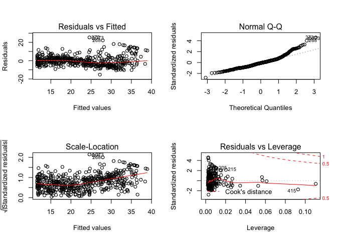

# Kazu_R-club_MachineLearning_Dec6&13&20_2017
Kazu  
12/19/2017  

# R codes for chapter 3

```r
# Chapter 3 Lab: Linear Regression
# Simple Linear Regression
#fix(Boston)
names(Boston)
```

```
##  [1] "crim"    "zn"      "indus"   "chas"    "nox"     "rm"      "age"    
##  [8] "dis"     "rad"     "tax"     "ptratio" "black"   "lstat"   "medv"
```

```r
lm.fit=lm(medv~lstat) # error
```

```
## Error in eval(expr, envir, enclos): object 'medv' not found
```

```r
lm.fit=lm(medv~lstat,data=Boston)
attach(Boston)
lm.fit=lm(medv~lstat)
lm.fit
```

```
## 
## Call:
## lm(formula = medv ~ lstat)
## 
## Coefficients:
## (Intercept)        lstat  
##       34.55        -0.95
```

```r
summary(lm.fit)
```

```
## 
## Call:
## lm(formula = medv ~ lstat)
## 
## Residuals:
##     Min      1Q  Median      3Q     Max 
## -15.168  -3.990  -1.318   2.034  24.500 
## 
## Coefficients:
##             Estimate Std. Error t value Pr(>|t|)    
## (Intercept) 34.55384    0.56263   61.41   <2e-16 ***
## lstat       -0.95005    0.03873  -24.53   <2e-16 ***
## ---
## Signif. codes:  0 '***' 0.001 '**' 0.01 '*' 0.05 '.' 0.1 ' ' 1
## 
## Residual standard error: 6.216 on 504 degrees of freedom
## Multiple R-squared:  0.5441,	Adjusted R-squared:  0.5432 
## F-statistic: 601.6 on 1 and 504 DF,  p-value: < 2.2e-16
```

```r
names(lm.fit)
```

```
##  [1] "coefficients"  "residuals"     "effects"       "rank"         
##  [5] "fitted.values" "assign"        "qr"            "df.residual"  
##  [9] "xlevels"       "call"          "terms"         "model"
```

```r
coef(lm.fit)
```

```
## (Intercept)       lstat 
##  34.5538409  -0.9500494
```

```r
confint(lm.fit)
```

```
##                 2.5 %     97.5 %
## (Intercept) 33.448457 35.6592247
## lstat       -1.026148 -0.8739505
```

```r
predict(lm.fit,data.frame(lstat=(c(5,10,15))), interval="confidence")
```

```
##        fit      lwr      upr
## 1 29.80359 29.00741 30.59978
## 2 25.05335 24.47413 25.63256
## 3 20.30310 19.73159 20.87461
```

```r
predict(lm.fit,data.frame(lstat=(c(5,10,15))), interval="prediction")
```

```
##        fit       lwr      upr
## 1 29.80359 17.565675 42.04151
## 2 25.05335 12.827626 37.27907
## 3 20.30310  8.077742 32.52846
```

```r
plot(lstat,medv)
abline(lm.fit)
abline(lm.fit,lwd=3)
abline(lm.fit,lwd=3,col="red")
```

<!-- -->

```r
plot(lstat,medv,col="red")
```

<!-- -->

```r
plot(lstat,medv,pch=20)
```

<!-- -->

```r
plot(lstat,medv,pch="+")
```

<!-- -->

```r
plot(1:20,1:20,pch=1:20)
```

<!-- -->

```r
par(mfrow=c(2,2))
plot(lm.fit)
```

<!-- -->

```r
plot(predict(lm.fit), residuals(lm.fit))
plot(predict(lm.fit), rstudent(lm.fit)) # rstudent()
plot(hatvalues(lm.fit))
which.max(hatvalues(lm.fit))
```

```
## 375 
## 375
```

<!-- -->
###

```r
# 3.6.3 - 
# Multiple Linear Regression
lm.fit=lm(medv~lstat+age,data=Boston)
summary(lm.fit)
```

```
## 
## Call:
## lm(formula = medv ~ lstat + age, data = Boston)
## 
## Residuals:
##     Min      1Q  Median      3Q     Max 
## -15.981  -3.978  -1.283   1.968  23.158 
## 
## Coefficients:
##             Estimate Std. Error t value Pr(>|t|)    
## (Intercept) 33.22276    0.73085  45.458  < 2e-16 ***
## lstat       -1.03207    0.04819 -21.416  < 2e-16 ***
## age          0.03454    0.01223   2.826  0.00491 ** 
## ---
## Signif. codes:  0 '***' 0.001 '**' 0.01 '*' 0.05 '.' 0.1 ' ' 1
## 
## Residual standard error: 6.173 on 503 degrees of freedom
## Multiple R-squared:  0.5513,	Adjusted R-squared:  0.5495 
## F-statistic:   309 on 2 and 503 DF,  p-value: < 2.2e-16
```

```r
lm.fit=lm(medv~.,data=Boston) # short-hand of "all of variables"
summary(lm.fit)
```

```
## 
## Call:
## lm(formula = medv ~ ., data = Boston)
## 
## Residuals:
##     Min      1Q  Median      3Q     Max 
## -15.595  -2.730  -0.518   1.777  26.199 
## 
## Coefficients:
##               Estimate Std. Error t value Pr(>|t|)    
## (Intercept)  3.646e+01  5.103e+00   7.144 3.28e-12 ***
## crim        -1.080e-01  3.286e-02  -3.287 0.001087 ** 
## zn           4.642e-02  1.373e-02   3.382 0.000778 ***
## indus        2.056e-02  6.150e-02   0.334 0.738288    
## chas         2.687e+00  8.616e-01   3.118 0.001925 ** 
## nox         -1.777e+01  3.820e+00  -4.651 4.25e-06 ***
## rm           3.810e+00  4.179e-01   9.116  < 2e-16 ***
## age          6.922e-04  1.321e-02   0.052 0.958229    
## dis         -1.476e+00  1.995e-01  -7.398 6.01e-13 ***
## rad          3.060e-01  6.635e-02   4.613 5.07e-06 ***
## tax         -1.233e-02  3.760e-03  -3.280 0.001112 ** 
## ptratio     -9.527e-01  1.308e-01  -7.283 1.31e-12 ***
## black        9.312e-03  2.686e-03   3.467 0.000573 ***
## lstat       -5.248e-01  5.072e-02 -10.347  < 2e-16 ***
## ---
## Signif. codes:  0 '***' 0.001 '**' 0.01 '*' 0.05 '.' 0.1 ' ' 1
## 
## Residual standard error: 4.745 on 492 degrees of freedom
## Multiple R-squared:  0.7406,	Adjusted R-squared:  0.7338 
## F-statistic: 108.1 on 13 and 492 DF,  p-value: < 2.2e-16
```

```r
library(car)
```

```
## 
## Attaching package: 'car'
```

```
## The following object is masked from 'package:dplyr':
## 
##     recode
```

```
## The following object is masked from 'package:purrr':
## 
##     some
```

```r
vif(lm.fit) # VIF
```

```
##     crim       zn    indus     chas      nox       rm      age      dis 
## 1.792192 2.298758 3.991596 1.073995 4.393720 1.933744 3.100826 3.955945 
##      rad      tax  ptratio    black    lstat 
## 7.484496 9.008554 1.799084 1.348521 2.941491
```

```r
lm.fit1=lm(medv~.-age,data=Boston)
summary(lm.fit1)
```

```
## 
## Call:
## lm(formula = medv ~ . - age, data = Boston)
## 
## Residuals:
##      Min       1Q   Median       3Q      Max 
## -15.6054  -2.7313  -0.5188   1.7601  26.2243 
## 
## Coefficients:
##               Estimate Std. Error t value Pr(>|t|)    
## (Intercept)  36.436927   5.080119   7.172 2.72e-12 ***
## crim         -0.108006   0.032832  -3.290 0.001075 ** 
## zn            0.046334   0.013613   3.404 0.000719 ***
## indus         0.020562   0.061433   0.335 0.737989    
## chas          2.689026   0.859598   3.128 0.001863 ** 
## nox         -17.713540   3.679308  -4.814 1.97e-06 ***
## rm            3.814394   0.408480   9.338  < 2e-16 ***
## dis          -1.478612   0.190611  -7.757 5.03e-14 ***
## rad           0.305786   0.066089   4.627 4.75e-06 ***
## tax          -0.012329   0.003755  -3.283 0.001099 ** 
## ptratio      -0.952211   0.130294  -7.308 1.10e-12 ***
## black         0.009321   0.002678   3.481 0.000544 ***
## lstat        -0.523852   0.047625 -10.999  < 2e-16 ***
## ---
## Signif. codes:  0 '***' 0.001 '**' 0.01 '*' 0.05 '.' 0.1 ' ' 1
## 
## Residual standard error: 4.74 on 493 degrees of freedom
## Multiple R-squared:  0.7406,	Adjusted R-squared:  0.7343 
## F-statistic: 117.3 on 12 and 493 DF,  p-value: < 2.2e-16
```

```r
lm.fit1=update(lm.fit, ~.-age)

#3.6.4 Interaction Terms Interaction Terms
summary(lm(medv~lstat*age,data=Boston))
```

```
## 
## Call:
## lm(formula = medv ~ lstat * age, data = Boston)
## 
## Residuals:
##     Min      1Q  Median      3Q     Max 
## -15.806  -4.045  -1.333   2.085  27.552 
## 
## Coefficients:
##               Estimate Std. Error t value Pr(>|t|)    
## (Intercept) 36.0885359  1.4698355  24.553  < 2e-16 ***
## lstat       -1.3921168  0.1674555  -8.313 8.78e-16 ***
## age         -0.0007209  0.0198792  -0.036   0.9711    
## lstat:age    0.0041560  0.0018518   2.244   0.0252 *  
## ---
## Signif. codes:  0 '***' 0.001 '**' 0.01 '*' 0.05 '.' 0.1 ' ' 1
## 
## Residual standard error: 6.149 on 502 degrees of freedom
## Multiple R-squared:  0.5557,	Adjusted R-squared:  0.5531 
## F-statistic: 209.3 on 3 and 502 DF,  p-value: < 2.2e-16
```

```r
#3.6.5 Non-linear Transformations of the Predictors

lm.fit2=lm(medv~lstat+I(lstat^2)) # I(); Inhibit Interpretation/Conversion of Objects
summary(lm.fit2)
```

```
## 
## Call:
## lm(formula = medv ~ lstat + I(lstat^2))
## 
## Residuals:
##      Min       1Q   Median       3Q      Max 
## -15.2834  -3.8313  -0.5295   2.3095  25.4148 
## 
## Coefficients:
##              Estimate Std. Error t value Pr(>|t|)    
## (Intercept) 42.862007   0.872084   49.15   <2e-16 ***
## lstat       -2.332821   0.123803  -18.84   <2e-16 ***
## I(lstat^2)   0.043547   0.003745   11.63   <2e-16 ***
## ---
## Signif. codes:  0 '***' 0.001 '**' 0.01 '*' 0.05 '.' 0.1 ' ' 1
## 
## Residual standard error: 5.524 on 503 degrees of freedom
## Multiple R-squared:  0.6407,	Adjusted R-squared:  0.6393 
## F-statistic: 448.5 on 2 and 503 DF,  p-value: < 2.2e-16
```

```r
lm.fit=lm(medv~lstat)
anova(lm.fit,lm.fit2)
```

```
## Analysis of Variance Table
## 
## Model 1: medv ~ lstat
## Model 2: medv ~ lstat + I(lstat^2)
##   Res.Df   RSS Df Sum of Sq     F    Pr(>F)    
## 1    504 19472                                 
## 2    503 15347  1    4125.1 135.2 < 2.2e-16 ***
## ---
## Signif. codes:  0 '***' 0.001 '**' 0.01 '*' 0.05 '.' 0.1 ' ' 1
```

```r
par(mfrow=c(2,2))
plot(lm.fit2)
```

<!-- -->

```r
lm.fit5=lm(medv~poly(lstat,5))
summary(lm.fit5)
```

```
## 
## Call:
## lm(formula = medv ~ poly(lstat, 5))
## 
## Residuals:
##      Min       1Q   Median       3Q      Max 
## -13.5433  -3.1039  -0.7052   2.0844  27.1153 
## 
## Coefficients:
##                  Estimate Std. Error t value Pr(>|t|)    
## (Intercept)       22.5328     0.2318  97.197  < 2e-16 ***
## poly(lstat, 5)1 -152.4595     5.2148 -29.236  < 2e-16 ***
## poly(lstat, 5)2   64.2272     5.2148  12.316  < 2e-16 ***
## poly(lstat, 5)3  -27.0511     5.2148  -5.187 3.10e-07 ***
## poly(lstat, 5)4   25.4517     5.2148   4.881 1.42e-06 ***
## poly(lstat, 5)5  -19.2524     5.2148  -3.692 0.000247 ***
## ---
## Signif. codes:  0 '***' 0.001 '**' 0.01 '*' 0.05 '.' 0.1 ' ' 1
## 
## Residual standard error: 5.215 on 500 degrees of freedom
## Multiple R-squared:  0.6817,	Adjusted R-squared:  0.6785 
## F-statistic: 214.2 on 5 and 500 DF,  p-value: < 2.2e-16
```

```r
summary(lm(medv~log(rm),data=Boston))
```

```
## 
## Call:
## lm(formula = medv ~ log(rm), data = Boston)
## 
## Residuals:
##     Min      1Q  Median      3Q     Max 
## -19.487  -2.875  -0.104   2.837  39.816 
## 
## Coefficients:
##             Estimate Std. Error t value Pr(>|t|)    
## (Intercept)  -76.488      5.028  -15.21   <2e-16 ***
## log(rm)       54.055      2.739   19.73   <2e-16 ***
## ---
## Signif. codes:  0 '***' 0.001 '**' 0.01 '*' 0.05 '.' 0.1 ' ' 1
## 
## Residual standard error: 6.915 on 504 degrees of freedom
## Multiple R-squared:  0.4358,	Adjusted R-squared:  0.4347 
## F-statistic: 389.3 on 1 and 504 DF,  p-value: < 2.2e-16
```

```r
# 3.6.6  Qualitative Predictors
#fix(Carseats)
names(Carseats)
```

```
##  [1] "Sales"       "CompPrice"   "Income"      "Advertising" "Population" 
##  [6] "Price"       "ShelveLoc"   "Age"         "Education"   "Urban"      
## [11] "US"
```

```r
lm.fit=lm(Sales~.+Income:Advertising+Price:Age,data=Carseats)
summary(lm.fit)
```

```
## 
## Call:
## lm(formula = Sales ~ . + Income:Advertising + Price:Age, data = Carseats)
## 
## Residuals:
##     Min      1Q  Median      3Q     Max 
## -2.9208 -0.7503  0.0177  0.6754  3.3413 
## 
## Coefficients:
##                      Estimate Std. Error t value Pr(>|t|)    
## (Intercept)         6.5755654  1.0087470   6.519 2.22e-10 ***
## CompPrice           0.0929371  0.0041183  22.567  < 2e-16 ***
## Income              0.0108940  0.0026044   4.183 3.57e-05 ***
## Advertising         0.0702462  0.0226091   3.107 0.002030 ** 
## Population          0.0001592  0.0003679   0.433 0.665330    
## Price              -0.1008064  0.0074399 -13.549  < 2e-16 ***
## ShelveLocGood       4.8486762  0.1528378  31.724  < 2e-16 ***
## ShelveLocMedium     1.9532620  0.1257682  15.531  < 2e-16 ***
## Age                -0.0579466  0.0159506  -3.633 0.000318 ***
## Education          -0.0208525  0.0196131  -1.063 0.288361    
## UrbanYes            0.1401597  0.1124019   1.247 0.213171    
## USYes              -0.1575571  0.1489234  -1.058 0.290729    
## Income:Advertising  0.0007510  0.0002784   2.698 0.007290 ** 
## Price:Age           0.0001068  0.0001333   0.801 0.423812    
## ---
## Signif. codes:  0 '***' 0.001 '**' 0.01 '*' 0.05 '.' 0.1 ' ' 1
## 
## Residual standard error: 1.011 on 386 degrees of freedom
## Multiple R-squared:  0.8761,	Adjusted R-squared:  0.8719 
## F-statistic:   210 on 13 and 386 DF,  p-value: < 2.2e-16
```

```r
attach(Carseats)
contrasts(ShelveLoc)
```

```
##        Good Medium
## Bad       0      0
## Good      1      0
## Medium    0      1
```

```r
detach()
# 3.6.7  Writing Functions

LoadLibraries
```

```
## Error in eval(expr, envir, enclos): object 'LoadLibraries' not found
```

```r
LoadLibraries()
```

```
## Error in eval(expr, envir, enclos): could not find function "LoadLibraries"
```

```r
LoadLibraries=function(){
 library(ISLR)
 library(MASS)
 print("The libraries have been loaded.")
 }
LoadLibraries
```

```
## function(){
##  library(ISLR)
##  library(MASS)
##  print("The libraries have been loaded.")
##  }
```

```r
LoadLibraries()
```

```
## [1] "The libraries have been loaded."
```
# 3.7. Excersise 3
## Suppose we have a data set with five predictors, X1 = GPA, X2 = IQ, X3 = Gender (1 for Female and 0 for Male), X4 = Interaction between GPA and IQ, and X5 = Interaction between GPA and Gender. The response is starting salary after graduation (in thousands of dollars). Suppose we use least squares to fit the model, and get βˆ0 = 50, βˆ1 = 2 0 , βˆ 2 = 0 . 0 7 , βˆ 3 = 3 5 , βˆ 4 = 0 . 0 1 , βˆ 5 = − 1 0 .
## (a) Which answer is correct, and why?
### i. ForafixedvalueofIQandGPA,malesearnmoreonaverage than females.
### ii. For a fixed value of IQ and GPA, females earn more on average than males.
### iii. ForafixedvalueofIQandGPA,malesearnmoreonaverage than females provided that the GPA is high enough.
### iv. For a fixed value of IQ and GPA, females earn more on average than males provided that the GPA is high enough.
## (b) Predict the salary of a female with IQ of 110 and a GPA of 4.0.
## (c) True or false: Since the coefficient for the GPA/IQ interaction term is very small, there is very little evidence of an interaction effect. Justify your answer.

```r
# (a) 
```
# Dec 13

# Dec 20
# Problems
# 3.9, d, e, f
# This question involves the use of multiple linear regression on the Auto data set.

```r
head(Auto)
```

```
##   mpg cylinders displacement horsepower weight acceleration year origin
## 1  18         8          307        130   3504         12.0   70      1
## 2  15         8          350        165   3693         11.5   70      1
## 3  18         8          318        150   3436         11.0   70      1
## 4  16         8          304        150   3433         12.0   70      1
## 5  17         8          302        140   3449         10.5   70      1
## 6  15         8          429        198   4341         10.0   70      1
##                        name
## 1 chevrolet chevelle malibu
## 2         buick skylark 320
## 3        plymouth satellite
## 4             amc rebel sst
## 5               ford torino
## 6          ford galaxie 500
```

```r
# (a) Produce a scatterplot matrix which includes all of the variables in the data set.
pairs(Auto)
```

<!-- -->

```r
# (b) Compute the matrix of correlations between the variables using the function cor(). You will need to exclude the name variable, which is qualitative.
panel.cor <- function(x, y, digits = 2, prefix = "", cex.cor, ...)
{
    usr <- par("usr"); on.exit(par(usr))
    par(usr = c(0, 1, 0, 1))
    r <- abs(cor(x, y))
    txt <- format(c(r, 0.123456789), digits = digits)[1]
    txt <- paste0(prefix, txt)
    if(missing(cex.cor)) cex.cor <- 0.8/strwidth(txt)
    text(0.5, 0.5, txt, cex = cex.cor * r)
}
pairs(Auto, lower.panel = panel.smooth, upper.panel = panel.cor)
```

<!-- -->

```r
# (c) Use the lm() function to perform a multiple linear regression with mpg as the response and all other variables except name as the predictors. Use the summary() function to print the results. Comment on the output. For instance:
## i. Is there a relationship between the predictors and the re- sponse?
## ii. Which predictors appear to have a statistically significant relationship to the response?
## iii. What does the coefficient for the year variable suggest?
# (d) Use the plot() function to produce diagnostic plots of the linear regression fit. Comment on any problems you see with the fit. Do the residual plots suggest any unusually large outliers? Does the leverage plot identify any observations with unusually high leverage?
lm.fit<-lm(mpg~.,data=Auto)
summary(lm.fit)
```

```
## 
## Call:
## lm(formula = mpg ~ ., data = Auto)
## 
## Residuals:
##    Min     1Q Median     3Q    Max 
## -5.646  0.000  0.000  0.000  5.646 
## 
## Coefficients: (1 not defined because of singularities)
##                                            Estimate Std. Error t value
## (Intercept)                                0.187305  12.773943   0.015
## cylinders                                 -0.918096   0.616653  -1.489
## displacement                               0.003041   0.015621   0.195
## horsepower                                -0.042342   0.029070  -1.457
## weight                                    -0.004193   0.001209  -3.467
## acceleration                              -0.481449   0.171537  -2.807
## year                                       0.636498   0.112195   5.673
## origin                                     1.324264   4.243221   0.312
## nameamc ambassador dpl                     3.371358   3.245610   1.039
## nameamc ambassador sst                     3.364264   3.270924   1.029
## nameamc concord                           -0.122500   3.275058  -0.037
## nameamc concord d/l                       -1.686548   3.422955  -0.493
## nameamc concord dl 6                      -0.529687   3.514452  -0.151
## nameamc gremlin                           -0.426606   2.958293  -0.144
## nameamc hornet                             0.269026   2.902972   0.093
## nameamc hornet sportabout (sw)            -0.403111   3.527112  -0.114
## nameamc matador                            0.462233   2.667735   0.173
## nameamc matador (sw)                       3.118929   2.894160   1.078
## nameamc pacer                              0.012163   3.519402   0.003
## nameamc pacer d/l                         -1.682001   3.517154  -0.478
## nameamc rebel sst                          2.875941   3.284138   0.876
## nameamc spirit dl                          0.713000   4.063462   0.175
## nameaudi 100 ls                            0.936254   3.449074   0.271
## nameaudi 100ls                            -3.133448   2.984726  -1.050
## nameaudi 4000                              4.004843   3.244193   1.234
## nameaudi 5000                             -4.109082   3.450859  -1.191
## nameaudi 5000s (diesel)                   11.652927   3.494256   3.335
## nameaudi fox                               3.199486   3.328970   0.961
## namebmw 2002                               2.082893   3.429803   0.607
## namebmw 320i                              -5.320674   3.378167  -1.575
## namebuick century                          2.213275   3.073805   0.720
## namebuick century 350                      2.163058   3.250910   0.665
## namebuick century limited                  1.154506   3.653147   0.316
## namebuick century luxus (sw)               3.701574   3.397404   1.090
## namebuick century special                  0.471663   3.468124   0.136
## namebuick electra 225 custom               5.565899   3.481596   1.599
## namebuick estate wagon (sw)                2.288361   2.883255   0.794
## namebuick lesabre custom                   3.878880   3.350669   1.158
## namebuick opel isuzu deluxe                2.360903   4.090583   0.577
## namebuick regal sport coupe (turbo)       -0.770758   3.673221  -0.210
## namebuick skyhawk                          1.178015   3.453774   0.341
## namebuick skylark                          0.485925   3.292621   0.148
## namebuick skylark 320                      3.220548   3.239745   0.994
## namebuick skylark limited                  2.526638   3.945353   0.640
## namecadillac eldorado                      7.506805   3.434596   2.186
## namecadillac seville                       4.705913   3.307504   1.423
## namecapri ii                               0.213795   3.974233   0.054
## namechevroelt chevelle malibu              1.190886   3.501889   0.340
## namechevrolet bel air                      3.526745   3.332996   1.058
## namechevrolet camaro                       1.016970   3.965053   0.256
## namechevrolet caprice classic              1.486191   2.705678   0.549
## namechevrolet cavalier                     1.711757   4.062490   0.421
## namechevrolet cavalier 2-door              6.060983   4.085007   1.484
## namechevrolet cavalier wagon               0.377051   4.065117   0.093
## namechevrolet chevelle concours (sw)       1.497987   3.363217   0.445
## namechevrolet chevelle malibu              2.508523   3.012061   0.833
## namechevrolet chevelle malibu classic      2.148872   2.973671   0.723
## namechevrolet chevette                     2.796588   3.583400   0.780
## namechevrolet citation                     0.835024   3.277093   0.255
## namechevrolet concours                    -0.962069   3.436400  -0.280
## namechevrolet impala                       3.901975   2.655000   1.470
## namechevrolet malibu                       0.338930   2.908792   0.117
## namechevrolet malibu classic (sw)          1.566909   3.369001   0.465
## namechevrolet monte carlo                  1.755561   3.510683   0.500
## namechevrolet monte carlo landau           1.360482   2.830125   0.481
## namechevrolet monte carlo s                2.817323   3.294556   0.855
## namechevrolet monza 2+2                    1.960822   3.418832   0.574
## namechevrolet nova                         0.013367   2.932203   0.005
## namechevrolet nova custom                 -0.583803   3.483183  -0.168
## namechevrolet vega                        -0.123809   3.451390  -0.036
## namechevrolet vega (sw)                    0.835785   3.957409   0.211
## namechevrolet vega 2300                    5.309133   3.978383   1.334
## namechevrolet woody                        0.242401   4.035002   0.060
## namechevy c10                             -1.686820   3.292205  -0.512
## namechevy c20                              4.381943   3.755983   1.167
## namechevy s-10                             4.822281   4.016031   1.201
## namechrysler cordoba                       3.158331   3.288955   0.960
## namechrysler lebaron medallion            -2.791925   4.039754  -0.691
## namechrysler lebaron salon                -4.524894   3.582800  -1.263
## namechrysler lebaron town @ country (sw)   2.084281   3.302393   0.631
## namechrysler new yorker brougham           5.282481   3.390324   1.558
## namechrysler newport royal                 4.391942   3.291715   1.334
## namedatsun 1200                            7.452422   6.449055   1.156
## namedatsun 200-sx                         -5.232326   6.424023  -0.814
## namedatsun 200sx                           2.817519   6.441163   0.437
## namedatsun 210                             5.606103   6.195917   0.905
## namedatsun 210 mpg                         5.070308   6.390048   0.793
## namedatsun 280-zx                          5.896050   6.830585   0.863
## namedatsun 310                             4.643895   6.277737   0.740
## namedatsun 310 gx                          4.043465   6.266014   0.645
## namedatsun 510                            -2.468844   6.400190  -0.386
## namedatsun 510 (sw)                        3.062356   6.557580   0.467
## namedatsun 510 hatchback                   6.552699   6.395446   1.025
## namedatsun 610                            -3.382103   6.545652  -0.517
## namedatsun 710                             1.331250   6.306882   0.211
## namedatsun 810                            -3.215340   6.816828  -0.472
## namedatsun 810 maxima                     -2.442319   6.860787  -0.356
## namedatsun b-210                           2.371920   6.357360   0.373
## namedatsun b210                            3.331328   6.462449   0.515
## namedatsun b210 gx                         9.604655   6.404554   1.500
## namedatsun f-10 hatchback                  2.950464   6.329051   0.466
## namedatsun pl510                           0.981674   6.254240   0.157
## namedodge aries se                         0.403815   4.041675   0.100
## namedodge aries wagon (sw)                -2.256829   4.019898  -0.561
## namedodge aspen                           -0.206883   3.088343  -0.067
## namedodge aspen 6                          0.366429   3.465245   0.106
## namedodge aspen se                         3.002155   3.493627   0.859
## namedodge challenger se                    2.064684   3.290611   0.627
## namedodge charger 2.2                      5.309608   4.166685   1.274
## namedodge colt                             1.482396   3.584355   0.414
## namedodge colt (sw)                        3.716950   4.113570   0.904
## namedodge colt hardtop                     1.522048   4.067987   0.374
## namedodge colt hatchback custom            5.628627   4.197231   1.341
## namedodge colt m/m                         6.221646   4.105872   1.515
## namedodge coronet brougham                 2.669663   3.290052   0.811
## namedodge coronet custom                   1.606868   3.247032   0.495
## namedodge coronet custom (sw)              3.302820   3.364562   0.982
## namedodge d100                            -1.672691   3.254823  -0.514
## namedodge d200                             5.074896   3.746461   1.355
## namedodge dart custom                     -0.700127   3.265096  -0.214
## namedodge diplomat                         2.561880   3.282848   0.780
## namedodge magnum xe                        2.349068   3.293521   0.713
## namedodge monaco (sw)                      5.409949   3.475789   1.556
## namedodge monaco brougham                  1.448836   3.286662   0.441
## namedodge omni                             2.600955   4.128988   0.630
## namedodge rampage                          0.321131   4.244538   0.076
## namedodge st. regis                        1.874870   3.310142   0.566
## namefiat 124 sport coupe                   0.843793   3.356728   0.251
## namefiat 124 tc                           -1.284412   3.299112  -0.389
## namefiat 124b                              4.234430   3.350724   1.264
## namefiat 128                              -0.302820   2.911282  -0.104
## namefiat 131                               1.571897   3.313206   0.474
## namefiat strada custom                     6.505740   3.221602   2.019
## namefiat x1.9                              3.420877   3.286517   1.041
## nameford country                           3.810815   3.447980   1.105
## nameford country squire (sw)               2.588023   2.891203   0.895
## nameford escort 2h                         2.903207   4.052921   0.716
## nameford escort 4w                         3.832150   4.172436   0.918
## nameford f108                             -1.507274   3.300893  -0.457
## nameford f250                              5.376492   3.649336   1.473
## nameford fairmont                          1.688480   3.942005   0.428
## nameford fairmont (auto)                  -2.420856   3.577091  -0.677
## nameford fairmont (man)                   -0.267333   3.979340  -0.067
## nameford fairmont 4                       -2.076328   3.945762  -0.526
## nameford fairmont futura                  -2.654573   4.013149  -0.661
## nameford fiesta                            5.590179   4.227911   1.322
## nameford futura                           -1.916806   3.362257  -0.570
## nameford galaxie 500                       4.442480   2.696732   1.647
## nameford gran torino                       2.395149   2.717190   0.881
## nameford gran torino (sw)                  4.305909   3.032697   1.420
## nameford granada                           0.802555   3.476415   0.231
## nameford granada ghia                      1.260545   3.617154   0.348
## nameford granada gl                       -3.179138   3.572976  -0.890
## nameford granada l                        -3.195561   3.585987  -0.891
## nameford ltd                               2.931338   2.921112   1.004
## nameford ltd landau                       -0.237362   3.326697  -0.071
## nameford maverick                          0.203527   3.006394   0.068
## nameford mustang                          -0.086763   3.673287  -0.024
## nameford mustang gl                       -0.608234   4.034452  -0.151
## nameford mustang ii                       -5.296511   3.364527  -1.574
## nameford mustang ii 2+2                    1.150829   3.960070   0.291
## nameford pinto                            -0.775120   3.301082  -0.235
## nameford pinto (sw)                       -0.652033   4.001814  -0.163
## nameford pinto runabout                   -2.119866   3.996017  -0.530
## nameford ranger                            0.908753   4.018900   0.226
## nameford thunderbird                       3.220573   3.297455   0.977
## nameford torino                            2.803510   3.333644   0.841
## nameford torino 500                        2.078087   3.646390   0.570
## namehi 1200d                               6.272325   3.984511   1.574
## namehonda accord                           1.948521   6.116848   0.319
## namehonda accord cvcc                      2.063973   6.429582   0.321
## namehonda accord lx                       -1.109939   6.347929  -0.175
## namehonda civic                            1.053256   6.055926   0.174
## namehonda civic (auto)                    -2.323039   6.246699  -0.372
## namehonda civic 1300                       0.480561   6.224808   0.077
## namehonda civic 1500 gl                   10.153049   6.196347   1.639
## namehonda civic cvcc                       3.182648   6.123490   0.520
## namehonda prelude                          0.704854   6.280545   0.112
## namemaxda glc deluxe                       1.418177   6.244770   0.227
## namemaxda rx3                            -10.867477   6.267079  -1.734
## namemazda 626                              1.984386   6.282271   0.316
## namemazda glc                             15.147599   6.344260   2.388
## namemazda glc 4                            0.684088   6.266174   0.109
## namemazda glc custom                      -2.344981   6.320355  -0.371
## namemazda glc custom l                     4.174484   6.349602   0.657
## namemazda glc deluxe                       2.292567   6.386457   0.359
## namemazda rx-4                            -6.598216   6.446482  -1.024
## namemazda rx-7 gs                         -8.439964   6.251072  -1.350
## namemazda rx2 coupe                       -8.070898   6.367885  -1.267
## namemercedes-benz 240d                     6.431350   3.628762   1.772
## namemercedes-benz 280s                    -0.574813   3.970931  -0.145
## namemercedes benz 300d                     4.052324   3.714017   1.091
## namemercury capri 2000                    -0.712146   4.074233  -0.175
## namemercury capri v6                      -0.303572   3.691241  -0.082
## namemercury cougar brougham                1.589959   3.361893   0.473
## namemercury grand marquis                 -0.237277   3.337834  -0.071
## namemercury lynx l                         5.872369   4.147537   1.416
## namemercury marquis                        3.228385   3.350958   0.963
## namemercury marquis brougham               4.746644   3.423970   1.386
## namemercury monarch                       -1.952366   3.676929  -0.531
## namemercury monarch ghia                   2.483829   3.298276   0.753
## namemercury zephyr                        -0.947324   3.554276  -0.267
## namemercury zephyr 6                      -2.197060   3.553076  -0.618
## namenissan stanza xe                       2.717783   6.321214   0.430
## nameoldsmobile cutlass ciera (diesel)     13.431975   3.705632   3.625
## nameoldsmobile cutlass ls                  9.023570   3.661744   2.464
## nameoldsmobile cutlass salon brougham      4.510530   3.094646   1.458
## nameoldsmobile cutlass supreme             3.859509   3.468811   1.113
## nameoldsmobile delta 88 royale             2.897729   3.327483   0.871
## nameoldsmobile omega                      -2.416124   3.226729  -0.749
## nameoldsmobile omega brougham              2.387769   3.687973   0.647
## nameoldsmobile starfire sx                -0.102617   3.905251  -0.026
## nameoldsmobile vista cruiser               2.806911   3.342458   0.840
## nameopel 1900                              0.364179   2.888955   0.126
## nameopel manta                            -1.463586   2.886584  -0.507
## namepeugeot 304                            6.452724   3.479899   1.854
## namepeugeot 504                            2.256143   3.020582   0.747
## namepeugeot 504 (sw)                       1.205706   3.655813   0.330
## namepeugeot 505s turbo diesel              3.702626   3.568596   1.038
## namepeugeot 604sl                         -3.734443   3.870878  -0.965
## nameplymouth 'cuda 340                     0.001994   3.312175   0.001
## nameplymouth arrow gs                     -0.550125   4.028316  -0.137
## nameplymouth champ                         7.809841   4.225532   1.848
## nameplymouth cricket                       3.723019   4.089471   0.910
## nameplymouth custom suburb                 4.243663   3.356462   1.264
## nameplymouth duster                        3.100163   3.013252   1.029
## nameplymouth fury                          2.614640   3.537123   0.739
## nameplymouth fury gran sedan               3.498384   3.316570   1.055
## nameplymouth fury iii                      4.299562   2.679985   1.604
## nameplymouth grand fury                    5.319669   3.369828   1.579
## nameplymouth horizon                       4.301083   4.214230   1.021
## nameplymouth horizon 4                     4.113045   4.189513   0.982
## nameplymouth horizon miser                 6.302919   4.228303   1.491
## nameplymouth horizon tc3                   5.209914   4.143729   1.257
## nameplymouth reliant                      -0.545007   3.754920  -0.145
## nameplymouth sapporo                      -0.765473   3.911418  -0.196
## nameplymouth satellite                     4.364495   3.282401   1.330
## nameplymouth satellite custom              0.448326   3.526696   0.127
## nameplymouth satellite custom (sw)         3.223333   3.292706   0.979
## nameplymouth satellite sebring             1.749802   3.497976   0.500
## nameplymouth valiant                       1.232906   3.073459   0.401
## nameplymouth valiant custom               -0.014077   3.503255  -0.004
## nameplymouth volare                        1.061859   3.474219   0.306
## nameplymouth volare custom                 1.277611   3.488038   0.366
## nameplymouth volare premier v8            -1.282210   3.255780  -0.394
## namepontiac astro                          0.074570   3.909875   0.019
## namepontiac catalina                       5.445037   2.738420   1.988
## namepontiac catalina brougham              5.087948   3.326698   1.529
## namepontiac firebird                       2.261616   3.549778   0.637
## namepontiac grand prix                     6.401045   3.428059   1.867
## namepontiac grand prix lj                  2.265087   3.274738   0.692
## namepontiac j2000 se hatchback             2.822025   4.099435   0.688
## namepontiac lemans v6                      0.400000   3.461834   0.116
## namepontiac phoenix                        3.126592   3.641875   0.859
## namepontiac phoenix lj                     1.358450   3.465997   0.392
## namepontiac safari (sw)                    7.162903   3.555491   2.015
## namepontiac sunbird coupe                  0.108434   3.930485   0.028
## namepontiac ventura sj                     1.102220   3.450690   0.319
## namerenault 12 (sw)                        1.482167   3.395489   0.437
## namerenault 12tl                          -0.731646   3.266427  -0.224
## namerenault 5 gtl                          6.648358   3.298178   2.016
## namesaab 99e                               3.370839   3.531246   0.955
## namesaab 99gle                            -3.431693   3.516847  -0.976
## namesaab 99le                              0.426670   3.063299   0.139
## namesubaru                                -0.233280   6.193441  -0.038
## namesubaru dl                              0.927894   6.146221   0.151
## nametoyota carina                         -4.818346   6.613451  -0.729
## nametoyota celica gt                       0.811953   6.436095   0.126
## nametoyota celica gt liftback             -7.749581   6.454951  -1.201
## nametoyota corolla                         0.502682   6.023789   0.083
## nametoyota corolla 1200                    4.597137   6.314043   0.728
## nametoyota corolla 1600 (sw)               0.864045   6.491090   0.133
## nametoyota corolla liftback               -2.358642   6.455302  -0.365
## nametoyota corolla tercel                  6.264712   6.367373   0.984
## nametoyota corona                         -1.217090   6.101896  -0.199
## nametoyota corona hardtop                 -1.623374   6.517263  -0.249
## nametoyota corona liftback                 0.624486   6.480690   0.096
## nametoyota corona mark ii                 -0.196994   6.567408  -0.030
## nametoyota cressida                       -2.182111   6.794927  -0.321
## nametoyota mark ii                        -3.168040   6.744488  -0.470
## nametoyota starlet                         4.766154   6.246630   0.763
## nametoyota tercel                          4.934523   6.305873   0.783
## nametoyouta corona mark ii (sw)           -2.085503   6.540427  -0.319
## nametriumph tr7 coupe                      6.023330   3.279325   1.837
## namevokswagen rabbit                      -2.827106   3.226492  -0.876
## namevolkswagen 1131 deluxe sedan           1.497675   3.578202   0.419
## namevolkswagen 411 (sw)                   -0.947433   3.453190  -0.274
## namevolkswagen dasher                     -0.858245   2.683260  -0.320
## namevolkswagen jetta                       1.112715   3.228297   0.345
## namevolkswagen model 111                   1.727602   3.449948   0.501
## namevolkswagen rabbit                     -1.074894   2.814449  -0.382
## namevolkswagen rabbit custom              -1.051324   3.224945  -0.326
## namevolkswagen rabbit custom diesel       14.722011   3.409156   4.318
## namevolkswagen rabbit l                    3.125355   3.244626   0.963
## namevolkswagen scirocco                    0.942324   3.219495   0.293
## namevolkswagen super beetle                0.311060   3.498963   0.089
## namevolkswagen type 3                      0.764483   3.649570   0.209
## namevolvo 144ea                           -2.766457   3.580135  -0.773
## namevolvo 145e (sw)                       -3.338886   3.609192  -0.925
## namevolvo 244dl                           -1.790859   3.478340  -0.515
## namevolvo 245                             -2.848126   3.553844  -0.801
## namevolvo 264gl                           -5.464384   3.628736  -1.506
## namevolvo diesel                           7.278640   3.656834   1.990
## namevw dasher (diesel)                    16.275630   3.503824   4.645
## namevw pickup                             15.324526   3.586036   4.273
## namevw rabbit                              4.756880   2.789326   1.705
## namevw rabbit c (diesel)                  15.164570   3.399743   4.461
## namevw rabbit custom                             NA         NA      NA
##                                          Pr(>|t|)    
## (Intercept)                              0.988335    
## cylinders                                0.140231    
## displacement                             0.846109    
## horsepower                               0.148919    
## weight                                   0.000829 ***
## acceleration                             0.006206 ** 
## year                                     1.89e-07 ***
## origin                                   0.755737    
## nameamc ambassador dpl                   0.301870    
## nameamc ambassador sst                   0.306616    
## nameamc concord                          0.970251    
## nameamc concord d/l                      0.623483    
## nameamc concord dl 6                     0.880556    
## nameamc gremlin                          0.885679    
## nameamc hornet                           0.926382    
## nameamc hornet sportabout (sw)           0.909278    
## nameamc matador                          0.862853    
## nameamc matador (sw)                     0.284233    
## nameamc pacer                            0.997251    
## nameamc pacer d/l                        0.633716    
## nameamc rebel sst                        0.383658    
## nameamc spirit dl                        0.861131    
## nameaudi 100 ls                          0.786702    
## nameaudi 100ls                           0.296773    
## nameaudi 4000                            0.220431    
## nameaudi 5000                            0.237070    
## nameaudi 5000s (diesel)                  0.001266 ** 
## nameaudi fox                             0.339226    
## namebmw 2002                             0.545276    
## namebmw 320i                             0.118967    
## namebuick century                        0.473473    
## namebuick century 350                    0.507615    
## namebuick century limited                0.752754    
## namebuick century luxus (sw)             0.278999    
## namebuick century special                0.892143    
## namebuick electra 225 custom             0.113606    
## namebuick estate wagon (sw)              0.429596    
## namebuick lesabre custom                 0.250252    
## namebuick opel isuzu deluxe              0.565360    
## namebuick regal sport coupe (turbo)      0.834301    
## namebuick skyhawk                        0.733885    
## namebuick skylark                        0.883024    
## namebuick skylark 320                    0.323008    
## namebuick skylark limited                0.523630    
## namecadillac eldorado                    0.031592 *  
## namecadillac seville                     0.158454    
## namecapri ii                             0.957225    
## namechevroelt chevelle malibu            0.734643    
## namechevrolet bel air                    0.292994    
## namechevrolet camaro                     0.798197    
## namechevrolet caprice classic            0.584249    
## namechevrolet cavalier                   0.674558    
## namechevrolet cavalier 2-door            0.141584    
## namechevrolet cavalier wagon             0.926318    
## namechevrolet chevelle concours (sw)     0.657161    
## namechevrolet chevelle malibu            0.407277    
## namechevrolet chevelle malibu classic    0.471889    
## namechevrolet chevette                   0.437307    
## namechevrolet citation                   0.799488    
## namechevrolet concours                   0.780185    
## namechevrolet impala                     0.145343    
## namechevrolet malibu                     0.907516    
## namechevrolet malibu classic (sw)        0.643052    
## namechevrolet monte carlo                0.618323    
## namechevrolet monte carlo landau         0.631955    
## namechevrolet monte carlo s              0.394875    
## namechevrolet monza 2+2                  0.567797    
## namechevrolet nova                       0.996373    
## namechevrolet nova custom                0.867291    
## namechevrolet vega                       0.971468    
## namechevrolet vega (sw)                  0.833241    
## namechevrolet vega 2300                  0.185606    
## namechevrolet woody                      0.952237    
## namechevy c10                            0.609722    
## namechevy c20                            0.246612    
## namechevy s-10                           0.233181    
## namechrysler cordoba                     0.339636    
## namechrysler lebaron medallion           0.491378    
## namechrysler lebaron salon               0.210061    
## namechrysler lebaron town @ country (sw) 0.529641    
## namechrysler new yorker brougham         0.122924    
## namechrysler newport royal               0.185688    
## namedatsun 1200                          0.251090    
## namedatsun 200-sx                        0.417638    
## namedatsun 200sx                         0.662913    
## namedatsun 210                           0.368126    
## namedatsun 210 mpg                       0.429714    
## namedatsun 280-zx                        0.390466    
## namedatsun 310                           0.461496    
## namedatsun 310 gx                        0.520470    
## namedatsun 510                           0.700649    
## namedatsun 510 (sw)                      0.641698    
## namedatsun 510 hatchback                 0.308465    
## namedatsun 610                           0.606711    
## namedatsun 710                           0.833331    
## namedatsun 810                           0.638366    
## namedatsun 810 maxima                    0.722736    
## namedatsun b-210                         0.710004    
## namedatsun b210                          0.607549    
## namedatsun b210 gx                       0.137408    
## namedatsun f-10 hatchback                0.642281    
## namedatsun pl510                         0.875648    
## namedodge aries se                       0.920649    
## namedodge aries wagon (sw)               0.575992    
## namedodge aspen                          0.946748    
## namedodge aspen 6                        0.916035    
## namedodge aspen se                       0.392579    
## namedodge challenger se                  0.532048    
## namedodge charger 2.2                    0.206030    
## namedodge colt                           0.680228    
## namedodge colt (sw)                      0.368771    
## namedodge colt hardtop                   0.709223    
## namedodge colt hatchback custom          0.183482    
## namedodge colt m/m                       0.133405    
## namedodge coronet brougham               0.419382    
## namedodge coronet custom                 0.621967    
## namedodge coronet custom (sw)            0.329059    
## namedodge d100                           0.608647    
## namedodge d200                           0.179140    
## namedodge dart custom                    0.830727    
## namedodge diplomat                       0.437333    
## namedodge magnum xe                      0.477652    
## namedodge monaco (sw)                    0.123313    
## namedodge monaco brougham                0.660460    
## namedodge omni                           0.530433    
## namedodge rampage                        0.939869    
## namedodge st. regis                      0.572613    
## namefiat 124 sport coupe                 0.802132    
## namefiat 124 tc                          0.698013    
## namefiat 124b                            0.209780    
## namefiat 128                             0.917402    
## namefiat 131                             0.636407    
## namefiat strada custom                   0.046595 *  
## namefiat x1.9                            0.300882    
## nameford country                         0.272178    
## nameford country squire (sw)             0.373242    
## nameford escort 2h                       0.475754    
## nameford escort 4w                       0.360985    
## nameford f108                            0.649105    
## nameford f250                            0.144369    
## nameford fairmont                        0.669494    
## nameford fairmont (auto)                 0.500392    
## nameford fairmont (man)                  0.946596    
## nameford fairmont 4                      0.600108    
## nameford fairmont futura                 0.510101    
## nameford fiesta                          0.189646    
## nameford futura                          0.570117    
## nameford galaxie 500                     0.103177    
## nameford gran torino                     0.380544    
## nameford gran torino (sw)                0.159315    
## nameford granada                         0.817981    
## nameford granada ghia                    0.728333    
## nameford granada gl                      0.376099    
## nameford granada l                       0.375378    
## nameford ltd                             0.318467    
## nameford ltd landau                      0.943286    
## nameford maverick                        0.946185    
## nameford mustang                         0.981211    
## nameford mustang gl                      0.880522    
## nameford mustang ii                      0.119151    
## nameford mustang ii 2+2                  0.772059    
## nameford pinto                           0.814923    
## nameford pinto (sw)                      0.870957    
## nameford pinto runabout                  0.597152    
## nameford ranger                          0.821651    
## nameford thunderbird                     0.331497    
## nameford torino                          0.402722    
## nameford torino 500                      0.570247    
## namehi 1200d                             0.119162    
## namehonda accord                         0.750849    
## namehonda accord cvcc                    0.748989    
## namehonda accord lx                      0.861613    
## namehonda civic                          0.862341    
## namehonda civic (auto)                   0.710906    
## namehonda civic 1300                     0.938645    
## namehonda civic 1500 gl                  0.105003    
## namehonda civic cvcc                     0.604593    
## namehonda prelude                        0.910907    
## namemaxda glc deluxe                     0.820893    
## namemaxda rx3                            0.086533 .  
## namemazda 626                            0.752875    
## namemazda glc                            0.019175 *  
## namemazda glc 4                          0.913324    
## namemazda glc custom                     0.711545    
## namemazda glc custom l                   0.512674    
## namemazda glc deluxe                     0.720505    
## namemazda rx-4                           0.308958    
## namemazda rx-7 gs                        0.180548    
## namemazda rx2 coupe                      0.208460    
## namemercedes-benz 240d                   0.079923 .  
## namemercedes-benz 280s                   0.885247    
## namemercedes benz 300d                   0.278317    
## namemercury capri 2000                   0.861658    
## namemercury capri v6                     0.934648    
## namemercury cougar brougham              0.637471    
## namemercury grand marquis                0.943496    
## namemercury lynx l                       0.160468    
## namemercury marquis                      0.338069    
## namemercury marquis brougham             0.169282    
## namemercury monarch                      0.596819    
## namemercury monarch ghia                 0.453489    
## namemercury zephyr                       0.790476    
## namemercury zephyr 6                     0.537995    
## namenissan stanza xe                     0.668323    
## nameoldsmobile cutlass ciera (diesel)    0.000492 ***
## nameoldsmobile cutlass ls                0.015743 *  
## nameoldsmobile cutlass salon brougham    0.148656    
## nameoldsmobile cutlass supreme           0.269004    
## nameoldsmobile delta 88 royale           0.386290    
## nameoldsmobile omega                     0.456054    
## nameoldsmobile omega brougham            0.519087    
## nameoldsmobile starfire sx               0.979098    
## nameoldsmobile vista cruiser             0.403391    
## nameopel 1900                            0.899983    
## nameopel manta                           0.613446    
## namepeugeot 304                          0.067166 .  
## namepeugeot 504                          0.457171    
## namepeugeot 504 (sw)                     0.742359    
## namepeugeot 505s turbo diesel            0.302418    
## namepeugeot 604sl                        0.337405    
## nameplymouth 'cuda 340                   0.999521    
## nameplymouth arrow gs                    0.891698    
## nameplymouth champ                       0.068044 .  
## nameplymouth cricket                     0.365191    
## nameplymouth custom suburb               0.209569    
## nameplymouth duster                      0.306472    
## nameplymouth fury                        0.461822    
## nameplymouth fury gran sedan             0.294497    
## nameplymouth fury iii                    0.112352    
## nameplymouth grand fury                  0.118138    
## nameplymouth horizon                     0.310336    
## nameplymouth horizon 4                   0.329010    
## nameplymouth horizon miser               0.139755    
## nameplymouth horizon tc3                 0.212088    
## nameplymouth reliant                     0.884940    
## nameplymouth sapporo                     0.845310    
## nameplymouth satellite                   0.187186    
## nameplymouth satellite custom            0.899143    
## nameplymouth satellite custom (sw)       0.330392    
## nameplymouth satellite sebring           0.618204    
## nameplymouth valiant                     0.689319    
## nameplymouth valiant custom              0.996803    
## nameplymouth volare                      0.760626    
## nameplymouth volare custom               0.715064    
## nameplymouth volare premier v8           0.694696    
## namepontiac astro                        0.984828    
## namepontiac catalina                     0.049987 *  
## namepontiac catalina brougham            0.129871    
## namepontiac firebird                     0.525762    
## namepontiac grand prix                   0.065314 .  
## namepontiac grand prix lj                0.491020    
## namepontiac j2000 se hatchback           0.493079    
## namepontiac lemans v6                    0.908285    
## namepontiac phoenix                      0.393024    
## namepontiac phoenix lj                   0.696086    
## namepontiac safari (sw)                  0.047108 *  
## namepontiac sunbird coupe                0.978055    
## namepontiac ventura sj                   0.750192    
## namerenault 12 (sw)                      0.663573    
## namerenault 12tl                         0.823303    
## namerenault 5 gtl                        0.046983 *  
## namesaab 99e                             0.342500    
## namesaab 99gle                           0.331939    
## namesaab 99le                            0.889555    
## namesubaru                               0.970043    
## namesubaru dl                            0.880357    
## nametoyota carina                        0.468269    
## nametoyota celica gt                     0.899906    
## nametoyota celica gt liftback            0.233256    
## nametoyota corolla                       0.933690    
## nametoyota corolla 1200                  0.468565    
## nametoyota corolla 1600 (sw)             0.894419    
## nametoyota corolla liftback              0.715735    
## nametoyota corolla tercel                0.327968    
## nametoyota corona                        0.842379    
## nametoyota corona hardtop                0.803893    
## nametoyota corona liftback               0.923461    
## nametoyota corona mark ii                0.976141    
## nametoyota cressida                      0.748894    
## nametoyota mark ii                       0.639756    
## nametoyota starlet                       0.447578    
## nametoyota tercel                        0.436079    
## nametoyouta corona mark ii (sw)          0.750612    
## nametriumph tr7 coupe                    0.069741 .  
## namevokswagen rabbit                     0.383382    
## namevolkswagen 1131 deluxe sedan         0.676597    
## namevolkswagen 411 (sw)                  0.784470    
## namevolkswagen dasher                    0.749866    
## namevolkswagen jetta                     0.731190    
## namevolkswagen model 111                 0.617833    
## namevolkswagen rabbit                    0.703474    
## namevolkswagen rabbit custom             0.745228    
## namevolkswagen rabbit custom diesel      4.24e-05 ***
## namevolkswagen rabbit l                  0.338159    
## namevolkswagen scirocco                  0.770470    
## namevolkswagen super beetle              0.929370    
## namevolkswagen type 3                    0.834581    
## namevolvo 144ea                          0.441829    
## namevolvo 145e (sw)                      0.357530    
## namevolvo 244dl                          0.607987    
## namevolvo 245                            0.425122    
## namevolvo 264gl                          0.135809    
## namevolvo diesel                         0.049758 *  
## namevw dasher (diesel)                   1.23e-05 ***
## namevw pickup                            5.00e-05 ***
## namevw rabbit                            0.091774 .  
## namevw rabbit c (diesel)                 2.49e-05 ***
## namevw rabbit custom                           NA    
## ---
## Signif. codes:  0 '***' 0.001 '**' 0.01 '*' 0.05 '.' 0.1 ' ' 1
## 
## Residual standard error: 2.272 on 85 degrees of freedom
## Multiple R-squared:  0.9816,	Adjusted R-squared:  0.9153 
## F-statistic:  14.8 on 306 and 85 DF,  p-value: < 2.2e-16
```

```r
par(mfrow=c(2,2))
plot(lm.fit) # diagnostic plots
```

```
## Warning: not plotting observations with leverage one:
##   2, 3, 4, 5, 10, 11, 12, 13, 15, 20, 23, 24, 26, 27, 28, 29, 31, 34, 36, 39, 42, 44, 45, 46, 47, 48, 49, 51, 52, 54, 55, 56, 58, 59, 61, 67, 68, 69, 70, 71, 73, 75, 76, 77, 79, 80, 81, 82, 83, 84, 85, 89, 90, 93, 94, 95, 96, 98, 102, 104, 105, 110, 111, 113, 114, 115, 116, 120, 121, 124, 128, 134, 136, 137, 140, 147, 150, 151, 153, 156, 157, 160, 162, 163, 164, 165, 169, 175, 178, 181, 183, 185, 187, 195, 198, 199, 200, 201, 203, 206, 207, 210, 211, 212, 213, 214, 215, 216, 217, 218, 219, 221, 222, 223, 224, 226, 227, 228, 230, 231, 232, 233, 234, 235, 237, 240, 241, 242, 243, 244, 245, 246, 249, 250, 251, 253, 254, 255, 257, 258, 260, 262, 263, 264, 267, 268, 269, 270, 271, 272, 273, 274, 275, 276, 277, 278, 279, 280, 281, 282, 283, 286, 287, 290, 291, 292, 293, 294, 295, 296, 297, 300, 301, 303, 304, 306, 309, 311, 313, 316, 317, 319, 321, 324, 325, 326, 327, 328, 330, 331, 332, 333, 337, 340, 341, 342, 344, 345, 346, 347, 348, 349, 350, 351, 353, 356, 357, 358, 360, 361, 362, 363, 364, 365, 366, 367, 369, 371, 372, 373, 374, 375, 379, 380, 381, 382, 383, 384, 385, 386, 387, 388, 389, 390, 391, 392

## Warning: not plotting observations with leverage one:
##   2, 3, 4, 5, 10, 11, 12, 13, 15, 20, 23, 24, 26, 27, 28, 29, 31, 34, 36, 39, 42, 44, 45, 46, 47, 48, 49, 51, 52, 54, 55, 56, 58, 59, 61, 67, 68, 69, 70, 71, 73, 75, 76, 77, 79, 80, 81, 82, 83, 84, 85, 89, 90, 93, 94, 95, 96, 98, 102, 104, 105, 110, 111, 113, 114, 115, 116, 120, 121, 124, 128, 134, 136, 137, 140, 147, 150, 151, 153, 156, 157, 160, 162, 163, 164, 165, 169, 175, 178, 181, 183, 185, 187, 195, 198, 199, 200, 201, 203, 206, 207, 210, 211, 212, 213, 214, 215, 216, 217, 218, 219, 221, 222, 223, 224, 226, 227, 228, 230, 231, 232, 233, 234, 235, 237, 240, 241, 242, 243, 244, 245, 246, 249, 250, 251, 253, 254, 255, 257, 258, 260, 262, 263, 264, 267, 268, 269, 270, 271, 272, 273, 274, 275, 276, 277, 278, 279, 280, 281, 282, 283, 286, 287, 290, 291, 292, 293, 294, 295, 296, 297, 300, 301, 303, 304, 306, 309, 311, 313, 316, 317, 319, 321, 324, 325, 326, 327, 328, 330, 331, 332, 333, 337, 340, 341, 342, 344, 345, 346, 347, 348, 349, 350, 351, 353, 356, 357, 358, 360, 361, 362, 363, 364, 365, 366, 367, 369, 371, 372, 373, 374, 375, 379, 380, 381, 382, 383, 384, 385, 386, 387, 388, 389, 390, 391, 392
```

```
## Warning in sqrt(crit * p * (1 - hh)/hh): NaNs produced

## Warning in sqrt(crit * p * (1 - hh)/hh): NaNs produced
```

```r
test<-plot(lm.fit) # how to get data for those plot?
```

```
## Warning: not plotting observations with leverage one:
##   2, 3, 4, 5, 10, 11, 12, 13, 15, 20, 23, 24, 26, 27, 28, 29, 31, 34, 36, 39, 42, 44, 45, 46, 47, 48, 49, 51, 52, 54, 55, 56, 58, 59, 61, 67, 68, 69, 70, 71, 73, 75, 76, 77, 79, 80, 81, 82, 83, 84, 85, 89, 90, 93, 94, 95, 96, 98, 102, 104, 105, 110, 111, 113, 114, 115, 116, 120, 121, 124, 128, 134, 136, 137, 140, 147, 150, 151, 153, 156, 157, 160, 162, 163, 164, 165, 169, 175, 178, 181, 183, 185, 187, 195, 198, 199, 200, 201, 203, 206, 207, 210, 211, 212, 213, 214, 215, 216, 217, 218, 219, 221, 222, 223, 224, 226, 227, 228, 230, 231, 232, 233, 234, 235, 237, 240, 241, 242, 243, 244, 245, 246, 249, 250, 251, 253, 254, 255, 257, 258, 260, 262, 263, 264, 267, 268, 269, 270, 271, 272, 273, 274, 275, 276, 277, 278, 279, 280, 281, 282, 283, 286, 287, 290, 291, 292, 293, 294, 295, 296, 297, 300, 301, 303, 304, 306, 309, 311, 313, 316, 317, 319, 321, 324, 325, 326, 327, 328, 330, 331, 332, 333, 337, 340, 341, 342, 344, 345, 346, 347, 348, 349, 350, 351, 353, 356, 357, 358, 360, 361, 362, 363, 364, 365, 366, 367, 369, 371, 372, 373, 374, 375, 379, 380, 381, 382, 383, 384, 385, 386, 387, 388, 389, 390, 391, 392
```

```
## Warning: not plotting observations with leverage one:
##   2, 3, 4, 5, 10, 11, 12, 13, 15, 20, 23, 24, 26, 27, 28, 29, 31, 34, 36, 39, 42, 44, 45, 46, 47, 48, 49, 51, 52, 54, 55, 56, 58, 59, 61, 67, 68, 69, 70, 71, 73, 75, 76, 77, 79, 80, 81, 82, 83, 84, 85, 89, 90, 93, 94, 95, 96, 98, 102, 104, 105, 110, 111, 113, 114, 115, 116, 120, 121, 124, 128, 134, 136, 137, 140, 147, 150, 151, 153, 156, 157, 160, 162, 163, 164, 165, 169, 175, 178, 181, 183, 185, 187, 195, 198, 199, 200, 201, 203, 206, 207, 210, 211, 212, 213, 214, 215, 216, 217, 218, 219, 221, 222, 223, 224, 226, 227, 228, 230, 231, 232, 233, 234, 235, 237, 240, 241, 242, 243, 244, 245, 246, 249, 250, 251, 253, 254, 255, 257, 258, 260, 262, 263, 264, 267, 268, 269, 270, 271, 272, 273, 274, 275, 276, 277, 278, 279, 280, 281, 282, 283, 286, 287, 290, 291, 292, 293, 294, 295, 296, 297, 300, 301, 303, 304, 306, 309, 311, 313, 316, 317, 319, 321, 324, 325, 326, 327, 328, 330, 331, 332, 333, 337, 340, 341, 342, 344, 345, 346, 347, 348, 349, 350, 351, 353, 356, 357, 358, 360, 361, 362, 363, 364, 365, 366, 367, 369, 371, 372, 373, 374, 375, 379, 380, 381, 382, 383, 384, 385, 386, 387, 388, 389, 390, 391, 392
```

```
## Warning in sqrt(crit * p * (1 - hh)/hh): NaNs produced

## Warning in sqrt(crit * p * (1 - hh)/hh): NaNs produced
```

<!-- -->

```r
test<-plot(lm.fit,which=1)
# interpretation of those plots (See http://data.library.virginia.edu/diagnostic-plots/)
# Residuals vs Fitted: Outliers
# Normal Q-Q # not normal
# Scale-Location
# Residuals vs Leverage: 


# (e) Use the * and : symbols to fit linear regression models with interaction effects. Do any interactions appear to be statistically significant?
lm.fit2<-lm(mpg~.,data=Auto) # how to find significant interactions?
# using interaction.plot (not good idea)
with(Auto,interaction.plot(cylinders,displacement,mpg))
factors<-names(Auto)
# for(n in 2:8) {
#   # interaction plot #
#   with(Auto,interaction.plot(factor[n],factor[n+1],mpg)) # does not work
# }
str(Auto)
```

```
## 'data.frame':	392 obs. of  9 variables:
##  $ mpg         : num  18 15 18 16 17 15 14 14 14 15 ...
##  $ cylinders   : num  8 8 8 8 8 8 8 8 8 8 ...
##  $ displacement: num  307 350 318 304 302 429 454 440 455 390 ...
##  $ horsepower  : num  130 165 150 150 140 198 220 215 225 190 ...
##  $ weight      : num  3504 3693 3436 3433 3449 ...
##  $ acceleration: num  12 11.5 11 12 10.5 10 9 8.5 10 8.5 ...
##  $ year        : num  70 70 70 70 70 70 70 70 70 70 ...
##  $ origin      : num  1 1 1 1 1 1 1 1 1 1 ...
##  $ name        : Factor w/ 304 levels "amc ambassador brougham",..: 49 36 231 14 161 141 54 223 241 2 ...
```

```r
par(mfrow=c(6,5))
```

<!-- -->

```r
with(Auto,interaction.plot(displacement,cylinders,mpg))
```

```
## Error in plot.new(): figure margins too large
```

```r
with(Auto,interaction.plot(horsepower,cylinders,mpg))
```

```
## Error in plot.new(): figure margins too large
```

```r
with(Auto,interaction.plot(weight,cylinders,mpg))
```

```
## Error in plot.new(): figure margins too large
```

```r
with(Auto,interaction.plot(cylinders,acceleration,mpg))
```

```
## Error in plot.new(): figure margins too large
```

```r
with(Auto,interaction.plot(cylinders,year,mpg))
```

```
## Error in plot.new(): figure margins too large
```

```r
with(Auto,interaction.plot(cylinders,origin,mpg))
```

```
## Error in plot.new(): figure margins too large
```

```r
with(Auto,interaction.plot(cylinders,name,mpg))
```

```
## Error in plot.new(): figure margins too large
```

```r
#
with(Auto,interaction.plot(displacement,horsepower,mpg))
```

```
## Error in plot.new(): figure margins too large
```

```r
with(Auto,interaction.plot(displacement,weight,mpg))
```

```
## Error in plot.new(): figure margins too large
```

```r
with(Auto,interaction.plot(displacement,acceleration,mpg))
```

```
## Error in plot.new(): figure margins too large
```

```r
with(Auto,interaction.plot(displacement,year,mpg))
```

```
## Error in plot.new(): figure margins too large
```

```r
with(Auto,interaction.plot(displacement,origin,mpg))
```

```
## Error in plot.new(): figure margins too large
```

```r
with(Auto,interaction.plot(displacement,name,mpg))
```

```
## Error in plot.new(): figure margins too large
```

```r
#
with(Auto,interaction.plot(horsepower,weight,mpg))
```

```
## Error in plot.new(): figure margins too large
```

```r
with(Auto,interaction.plot(horsepower,acceleration,mpg))
```

```
## Error in plot.new(): figure margins too large
```

```r
with(Auto,interaction.plot(horsepower,year,mpg))
```

```
## Error in plot.new(): figure margins too large
```

```r
with(Auto,interaction.plot(horsepower,origin,mpg))
```

```
## Error in plot.new(): figure margins too large
```

```r
with(Auto,interaction.plot(horsepower,name,mpg))
```

```
## Error in plot.new(): figure margins too large
```

```r
#
with(Auto,interaction.plot(weight,acceleration,mpg))
```

```
## Error in plot.new(): figure margins too large
```

```r
with(Auto,interaction.plot(weight,year,mpg))
```

```
## Error in plot.new(): figure margins too large
```

```r
with(Auto,interaction.plot(weight,origin,mpg))
```

```
## Error in plot.new(): figure margins too large
```

```r
with(Auto,interaction.plot(weight,name,mpg))
```

```
## Error in plot.new(): figure margins too large
```

```r
#
with(Auto,interaction.plot(acceleration,year,mpg))
```

```
## Error in plot.new(): figure margins too large
```

```r
with(Auto,interaction.plot(acceleration,origin,mpg))
```

```
## Error in plot.new(): figure margins too large
```

```r
with(Auto,interaction.plot(acceleration,name,mpg))
```

```
## Error in plot.new(): figure margins too large
```

```r
#
with(Auto,interaction.plot(year,origin,mpg)) # clear interaction
```

```
## Error in plot.new(): figure margins too large
```

```r
with(Auto,interaction.plot(year,name,mpg))
```

```
## Error in plot.new(): figure margins too large
```

```r
#
with(Auto,interaction.plot(origin,name,mpg))
```

```
## Error in plot.new(): figure margins too large
```

```r
# 
lm.fit<-lm(mpg~.,data=Auto)
summary(lm.fit)
```

```
## 
## Call:
## lm(formula = mpg ~ ., data = Auto)
## 
## Residuals:
##    Min     1Q Median     3Q    Max 
## -5.646  0.000  0.000  0.000  5.646 
## 
## Coefficients: (1 not defined because of singularities)
##                                            Estimate Std. Error t value
## (Intercept)                                0.187305  12.773943   0.015
## cylinders                                 -0.918096   0.616653  -1.489
## displacement                               0.003041   0.015621   0.195
## horsepower                                -0.042342   0.029070  -1.457
## weight                                    -0.004193   0.001209  -3.467
## acceleration                              -0.481449   0.171537  -2.807
## year                                       0.636498   0.112195   5.673
## origin                                     1.324264   4.243221   0.312
## nameamc ambassador dpl                     3.371358   3.245610   1.039
## nameamc ambassador sst                     3.364264   3.270924   1.029
## nameamc concord                           -0.122500   3.275058  -0.037
## nameamc concord d/l                       -1.686548   3.422955  -0.493
## nameamc concord dl 6                      -0.529687   3.514452  -0.151
## nameamc gremlin                           -0.426606   2.958293  -0.144
## nameamc hornet                             0.269026   2.902972   0.093
## nameamc hornet sportabout (sw)            -0.403111   3.527112  -0.114
## nameamc matador                            0.462233   2.667735   0.173
## nameamc matador (sw)                       3.118929   2.894160   1.078
## nameamc pacer                              0.012163   3.519402   0.003
## nameamc pacer d/l                         -1.682001   3.517154  -0.478
## nameamc rebel sst                          2.875941   3.284138   0.876
## nameamc spirit dl                          0.713000   4.063462   0.175
## nameaudi 100 ls                            0.936254   3.449074   0.271
## nameaudi 100ls                            -3.133448   2.984726  -1.050
## nameaudi 4000                              4.004843   3.244193   1.234
## nameaudi 5000                             -4.109082   3.450859  -1.191
## nameaudi 5000s (diesel)                   11.652927   3.494256   3.335
## nameaudi fox                               3.199486   3.328970   0.961
## namebmw 2002                               2.082893   3.429803   0.607
## namebmw 320i                              -5.320674   3.378167  -1.575
## namebuick century                          2.213275   3.073805   0.720
## namebuick century 350                      2.163058   3.250910   0.665
## namebuick century limited                  1.154506   3.653147   0.316
## namebuick century luxus (sw)               3.701574   3.397404   1.090
## namebuick century special                  0.471663   3.468124   0.136
## namebuick electra 225 custom               5.565899   3.481596   1.599
## namebuick estate wagon (sw)                2.288361   2.883255   0.794
## namebuick lesabre custom                   3.878880   3.350669   1.158
## namebuick opel isuzu deluxe                2.360903   4.090583   0.577
## namebuick regal sport coupe (turbo)       -0.770758   3.673221  -0.210
## namebuick skyhawk                          1.178015   3.453774   0.341
## namebuick skylark                          0.485925   3.292621   0.148
## namebuick skylark 320                      3.220548   3.239745   0.994
## namebuick skylark limited                  2.526638   3.945353   0.640
## namecadillac eldorado                      7.506805   3.434596   2.186
## namecadillac seville                       4.705913   3.307504   1.423
## namecapri ii                               0.213795   3.974233   0.054
## namechevroelt chevelle malibu              1.190886   3.501889   0.340
## namechevrolet bel air                      3.526745   3.332996   1.058
## namechevrolet camaro                       1.016970   3.965053   0.256
## namechevrolet caprice classic              1.486191   2.705678   0.549
## namechevrolet cavalier                     1.711757   4.062490   0.421
## namechevrolet cavalier 2-door              6.060983   4.085007   1.484
## namechevrolet cavalier wagon               0.377051   4.065117   0.093
## namechevrolet chevelle concours (sw)       1.497987   3.363217   0.445
## namechevrolet chevelle malibu              2.508523   3.012061   0.833
## namechevrolet chevelle malibu classic      2.148872   2.973671   0.723
## namechevrolet chevette                     2.796588   3.583400   0.780
## namechevrolet citation                     0.835024   3.277093   0.255
## namechevrolet concours                    -0.962069   3.436400  -0.280
## namechevrolet impala                       3.901975   2.655000   1.470
## namechevrolet malibu                       0.338930   2.908792   0.117
## namechevrolet malibu classic (sw)          1.566909   3.369001   0.465
## namechevrolet monte carlo                  1.755561   3.510683   0.500
## namechevrolet monte carlo landau           1.360482   2.830125   0.481
## namechevrolet monte carlo s                2.817323   3.294556   0.855
## namechevrolet monza 2+2                    1.960822   3.418832   0.574
## namechevrolet nova                         0.013367   2.932203   0.005
## namechevrolet nova custom                 -0.583803   3.483183  -0.168
## namechevrolet vega                        -0.123809   3.451390  -0.036
## namechevrolet vega (sw)                    0.835785   3.957409   0.211
## namechevrolet vega 2300                    5.309133   3.978383   1.334
## namechevrolet woody                        0.242401   4.035002   0.060
## namechevy c10                             -1.686820   3.292205  -0.512
## namechevy c20                              4.381943   3.755983   1.167
## namechevy s-10                             4.822281   4.016031   1.201
## namechrysler cordoba                       3.158331   3.288955   0.960
## namechrysler lebaron medallion            -2.791925   4.039754  -0.691
## namechrysler lebaron salon                -4.524894   3.582800  -1.263
## namechrysler lebaron town @ country (sw)   2.084281   3.302393   0.631
## namechrysler new yorker brougham           5.282481   3.390324   1.558
## namechrysler newport royal                 4.391942   3.291715   1.334
## namedatsun 1200                            7.452422   6.449055   1.156
## namedatsun 200-sx                         -5.232326   6.424023  -0.814
## namedatsun 200sx                           2.817519   6.441163   0.437
## namedatsun 210                             5.606103   6.195917   0.905
## namedatsun 210 mpg                         5.070308   6.390048   0.793
## namedatsun 280-zx                          5.896050   6.830585   0.863
## namedatsun 310                             4.643895   6.277737   0.740
## namedatsun 310 gx                          4.043465   6.266014   0.645
## namedatsun 510                            -2.468844   6.400190  -0.386
## namedatsun 510 (sw)                        3.062356   6.557580   0.467
## namedatsun 510 hatchback                   6.552699   6.395446   1.025
## namedatsun 610                            -3.382103   6.545652  -0.517
## namedatsun 710                             1.331250   6.306882   0.211
## namedatsun 810                            -3.215340   6.816828  -0.472
## namedatsun 810 maxima                     -2.442319   6.860787  -0.356
## namedatsun b-210                           2.371920   6.357360   0.373
## namedatsun b210                            3.331328   6.462449   0.515
## namedatsun b210 gx                         9.604655   6.404554   1.500
## namedatsun f-10 hatchback                  2.950464   6.329051   0.466
## namedatsun pl510                           0.981674   6.254240   0.157
## namedodge aries se                         0.403815   4.041675   0.100
## namedodge aries wagon (sw)                -2.256829   4.019898  -0.561
## namedodge aspen                           -0.206883   3.088343  -0.067
## namedodge aspen 6                          0.366429   3.465245   0.106
## namedodge aspen se                         3.002155   3.493627   0.859
## namedodge challenger se                    2.064684   3.290611   0.627
## namedodge charger 2.2                      5.309608   4.166685   1.274
## namedodge colt                             1.482396   3.584355   0.414
## namedodge colt (sw)                        3.716950   4.113570   0.904
## namedodge colt hardtop                     1.522048   4.067987   0.374
## namedodge colt hatchback custom            5.628627   4.197231   1.341
## namedodge colt m/m                         6.221646   4.105872   1.515
## namedodge coronet brougham                 2.669663   3.290052   0.811
## namedodge coronet custom                   1.606868   3.247032   0.495
## namedodge coronet custom (sw)              3.302820   3.364562   0.982
## namedodge d100                            -1.672691   3.254823  -0.514
## namedodge d200                             5.074896   3.746461   1.355
## namedodge dart custom                     -0.700127   3.265096  -0.214
## namedodge diplomat                         2.561880   3.282848   0.780
## namedodge magnum xe                        2.349068   3.293521   0.713
## namedodge monaco (sw)                      5.409949   3.475789   1.556
## namedodge monaco brougham                  1.448836   3.286662   0.441
## namedodge omni                             2.600955   4.128988   0.630
## namedodge rampage                          0.321131   4.244538   0.076
## namedodge st. regis                        1.874870   3.310142   0.566
## namefiat 124 sport coupe                   0.843793   3.356728   0.251
## namefiat 124 tc                           -1.284412   3.299112  -0.389
## namefiat 124b                              4.234430   3.350724   1.264
## namefiat 128                              -0.302820   2.911282  -0.104
## namefiat 131                               1.571897   3.313206   0.474
## namefiat strada custom                     6.505740   3.221602   2.019
## namefiat x1.9                              3.420877   3.286517   1.041
## nameford country                           3.810815   3.447980   1.105
## nameford country squire (sw)               2.588023   2.891203   0.895
## nameford escort 2h                         2.903207   4.052921   0.716
## nameford escort 4w                         3.832150   4.172436   0.918
## nameford f108                             -1.507274   3.300893  -0.457
## nameford f250                              5.376492   3.649336   1.473
## nameford fairmont                          1.688480   3.942005   0.428
## nameford fairmont (auto)                  -2.420856   3.577091  -0.677
## nameford fairmont (man)                   -0.267333   3.979340  -0.067
## nameford fairmont 4                       -2.076328   3.945762  -0.526
## nameford fairmont futura                  -2.654573   4.013149  -0.661
## nameford fiesta                            5.590179   4.227911   1.322
## nameford futura                           -1.916806   3.362257  -0.570
## nameford galaxie 500                       4.442480   2.696732   1.647
## nameford gran torino                       2.395149   2.717190   0.881
## nameford gran torino (sw)                  4.305909   3.032697   1.420
## nameford granada                           0.802555   3.476415   0.231
## nameford granada ghia                      1.260545   3.617154   0.348
## nameford granada gl                       -3.179138   3.572976  -0.890
## nameford granada l                        -3.195561   3.585987  -0.891
## nameford ltd                               2.931338   2.921112   1.004
## nameford ltd landau                       -0.237362   3.326697  -0.071
## nameford maverick                          0.203527   3.006394   0.068
## nameford mustang                          -0.086763   3.673287  -0.024
## nameford mustang gl                       -0.608234   4.034452  -0.151
## nameford mustang ii                       -5.296511   3.364527  -1.574
## nameford mustang ii 2+2                    1.150829   3.960070   0.291
## nameford pinto                            -0.775120   3.301082  -0.235
## nameford pinto (sw)                       -0.652033   4.001814  -0.163
## nameford pinto runabout                   -2.119866   3.996017  -0.530
## nameford ranger                            0.908753   4.018900   0.226
## nameford thunderbird                       3.220573   3.297455   0.977
## nameford torino                            2.803510   3.333644   0.841
## nameford torino 500                        2.078087   3.646390   0.570
## namehi 1200d                               6.272325   3.984511   1.574
## namehonda accord                           1.948521   6.116848   0.319
## namehonda accord cvcc                      2.063973   6.429582   0.321
## namehonda accord lx                       -1.109939   6.347929  -0.175
## namehonda civic                            1.053256   6.055926   0.174
## namehonda civic (auto)                    -2.323039   6.246699  -0.372
## namehonda civic 1300                       0.480561   6.224808   0.077
## namehonda civic 1500 gl                   10.153049   6.196347   1.639
## namehonda civic cvcc                       3.182648   6.123490   0.520
## namehonda prelude                          0.704854   6.280545   0.112
## namemaxda glc deluxe                       1.418177   6.244770   0.227
## namemaxda rx3                            -10.867477   6.267079  -1.734
## namemazda 626                              1.984386   6.282271   0.316
## namemazda glc                             15.147599   6.344260   2.388
## namemazda glc 4                            0.684088   6.266174   0.109
## namemazda glc custom                      -2.344981   6.320355  -0.371
## namemazda glc custom l                     4.174484   6.349602   0.657
## namemazda glc deluxe                       2.292567   6.386457   0.359
## namemazda rx-4                            -6.598216   6.446482  -1.024
## namemazda rx-7 gs                         -8.439964   6.251072  -1.350
## namemazda rx2 coupe                       -8.070898   6.367885  -1.267
## namemercedes-benz 240d                     6.431350   3.628762   1.772
## namemercedes-benz 280s                    -0.574813   3.970931  -0.145
## namemercedes benz 300d                     4.052324   3.714017   1.091
## namemercury capri 2000                    -0.712146   4.074233  -0.175
## namemercury capri v6                      -0.303572   3.691241  -0.082
## namemercury cougar brougham                1.589959   3.361893   0.473
## namemercury grand marquis                 -0.237277   3.337834  -0.071
## namemercury lynx l                         5.872369   4.147537   1.416
## namemercury marquis                        3.228385   3.350958   0.963
## namemercury marquis brougham               4.746644   3.423970   1.386
## namemercury monarch                       -1.952366   3.676929  -0.531
## namemercury monarch ghia                   2.483829   3.298276   0.753
## namemercury zephyr                        -0.947324   3.554276  -0.267
## namemercury zephyr 6                      -2.197060   3.553076  -0.618
## namenissan stanza xe                       2.717783   6.321214   0.430
## nameoldsmobile cutlass ciera (diesel)     13.431975   3.705632   3.625
## nameoldsmobile cutlass ls                  9.023570   3.661744   2.464
## nameoldsmobile cutlass salon brougham      4.510530   3.094646   1.458
## nameoldsmobile cutlass supreme             3.859509   3.468811   1.113
## nameoldsmobile delta 88 royale             2.897729   3.327483   0.871
## nameoldsmobile omega                      -2.416124   3.226729  -0.749
## nameoldsmobile omega brougham              2.387769   3.687973   0.647
## nameoldsmobile starfire sx                -0.102617   3.905251  -0.026
## nameoldsmobile vista cruiser               2.806911   3.342458   0.840
## nameopel 1900                              0.364179   2.888955   0.126
## nameopel manta                            -1.463586   2.886584  -0.507
## namepeugeot 304                            6.452724   3.479899   1.854
## namepeugeot 504                            2.256143   3.020582   0.747
## namepeugeot 504 (sw)                       1.205706   3.655813   0.330
## namepeugeot 505s turbo diesel              3.702626   3.568596   1.038
## namepeugeot 604sl                         -3.734443   3.870878  -0.965
## nameplymouth 'cuda 340                     0.001994   3.312175   0.001
## nameplymouth arrow gs                     -0.550125   4.028316  -0.137
## nameplymouth champ                         7.809841   4.225532   1.848
## nameplymouth cricket                       3.723019   4.089471   0.910
## nameplymouth custom suburb                 4.243663   3.356462   1.264
## nameplymouth duster                        3.100163   3.013252   1.029
## nameplymouth fury                          2.614640   3.537123   0.739
## nameplymouth fury gran sedan               3.498384   3.316570   1.055
## nameplymouth fury iii                      4.299562   2.679985   1.604
## nameplymouth grand fury                    5.319669   3.369828   1.579
## nameplymouth horizon                       4.301083   4.214230   1.021
## nameplymouth horizon 4                     4.113045   4.189513   0.982
## nameplymouth horizon miser                 6.302919   4.228303   1.491
## nameplymouth horizon tc3                   5.209914   4.143729   1.257
## nameplymouth reliant                      -0.545007   3.754920  -0.145
## nameplymouth sapporo                      -0.765473   3.911418  -0.196
## nameplymouth satellite                     4.364495   3.282401   1.330
## nameplymouth satellite custom              0.448326   3.526696   0.127
## nameplymouth satellite custom (sw)         3.223333   3.292706   0.979
## nameplymouth satellite sebring             1.749802   3.497976   0.500
## nameplymouth valiant                       1.232906   3.073459   0.401
## nameplymouth valiant custom               -0.014077   3.503255  -0.004
## nameplymouth volare                        1.061859   3.474219   0.306
## nameplymouth volare custom                 1.277611   3.488038   0.366
## nameplymouth volare premier v8            -1.282210   3.255780  -0.394
## namepontiac astro                          0.074570   3.909875   0.019
## namepontiac catalina                       5.445037   2.738420   1.988
## namepontiac catalina brougham              5.087948   3.326698   1.529
## namepontiac firebird                       2.261616   3.549778   0.637
## namepontiac grand prix                     6.401045   3.428059   1.867
## namepontiac grand prix lj                  2.265087   3.274738   0.692
## namepontiac j2000 se hatchback             2.822025   4.099435   0.688
## namepontiac lemans v6                      0.400000   3.461834   0.116
## namepontiac phoenix                        3.126592   3.641875   0.859
## namepontiac phoenix lj                     1.358450   3.465997   0.392
## namepontiac safari (sw)                    7.162903   3.555491   2.015
## namepontiac sunbird coupe                  0.108434   3.930485   0.028
## namepontiac ventura sj                     1.102220   3.450690   0.319
## namerenault 12 (sw)                        1.482167   3.395489   0.437
## namerenault 12tl                          -0.731646   3.266427  -0.224
## namerenault 5 gtl                          6.648358   3.298178   2.016
## namesaab 99e                               3.370839   3.531246   0.955
## namesaab 99gle                            -3.431693   3.516847  -0.976
## namesaab 99le                              0.426670   3.063299   0.139
## namesubaru                                -0.233280   6.193441  -0.038
## namesubaru dl                              0.927894   6.146221   0.151
## nametoyota carina                         -4.818346   6.613451  -0.729
## nametoyota celica gt                       0.811953   6.436095   0.126
## nametoyota celica gt liftback             -7.749581   6.454951  -1.201
## nametoyota corolla                         0.502682   6.023789   0.083
## nametoyota corolla 1200                    4.597137   6.314043   0.728
## nametoyota corolla 1600 (sw)               0.864045   6.491090   0.133
## nametoyota corolla liftback               -2.358642   6.455302  -0.365
## nametoyota corolla tercel                  6.264712   6.367373   0.984
## nametoyota corona                         -1.217090   6.101896  -0.199
## nametoyota corona hardtop                 -1.623374   6.517263  -0.249
## nametoyota corona liftback                 0.624486   6.480690   0.096
## nametoyota corona mark ii                 -0.196994   6.567408  -0.030
## nametoyota cressida                       -2.182111   6.794927  -0.321
## nametoyota mark ii                        -3.168040   6.744488  -0.470
## nametoyota starlet                         4.766154   6.246630   0.763
## nametoyota tercel                          4.934523   6.305873   0.783
## nametoyouta corona mark ii (sw)           -2.085503   6.540427  -0.319
## nametriumph tr7 coupe                      6.023330   3.279325   1.837
## namevokswagen rabbit                      -2.827106   3.226492  -0.876
## namevolkswagen 1131 deluxe sedan           1.497675   3.578202   0.419
## namevolkswagen 411 (sw)                   -0.947433   3.453190  -0.274
## namevolkswagen dasher                     -0.858245   2.683260  -0.320
## namevolkswagen jetta                       1.112715   3.228297   0.345
## namevolkswagen model 111                   1.727602   3.449948   0.501
## namevolkswagen rabbit                     -1.074894   2.814449  -0.382
## namevolkswagen rabbit custom              -1.051324   3.224945  -0.326
## namevolkswagen rabbit custom diesel       14.722011   3.409156   4.318
## namevolkswagen rabbit l                    3.125355   3.244626   0.963
## namevolkswagen scirocco                    0.942324   3.219495   0.293
## namevolkswagen super beetle                0.311060   3.498963   0.089
## namevolkswagen type 3                      0.764483   3.649570   0.209
## namevolvo 144ea                           -2.766457   3.580135  -0.773
## namevolvo 145e (sw)                       -3.338886   3.609192  -0.925
## namevolvo 244dl                           -1.790859   3.478340  -0.515
## namevolvo 245                             -2.848126   3.553844  -0.801
## namevolvo 264gl                           -5.464384   3.628736  -1.506
## namevolvo diesel                           7.278640   3.656834   1.990
## namevw dasher (diesel)                    16.275630   3.503824   4.645
## namevw pickup                             15.324526   3.586036   4.273
## namevw rabbit                              4.756880   2.789326   1.705
## namevw rabbit c (diesel)                  15.164570   3.399743   4.461
## namevw rabbit custom                             NA         NA      NA
##                                          Pr(>|t|)    
## (Intercept)                              0.988335    
## cylinders                                0.140231    
## displacement                             0.846109    
## horsepower                               0.148919    
## weight                                   0.000829 ***
## acceleration                             0.006206 ** 
## year                                     1.89e-07 ***
## origin                                   0.755737    
## nameamc ambassador dpl                   0.301870    
## nameamc ambassador sst                   0.306616    
## nameamc concord                          0.970251    
## nameamc concord d/l                      0.623483    
## nameamc concord dl 6                     0.880556    
## nameamc gremlin                          0.885679    
## nameamc hornet                           0.926382    
## nameamc hornet sportabout (sw)           0.909278    
## nameamc matador                          0.862853    
## nameamc matador (sw)                     0.284233    
## nameamc pacer                            0.997251    
## nameamc pacer d/l                        0.633716    
## nameamc rebel sst                        0.383658    
## nameamc spirit dl                        0.861131    
## nameaudi 100 ls                          0.786702    
## nameaudi 100ls                           0.296773    
## nameaudi 4000                            0.220431    
## nameaudi 5000                            0.237070    
## nameaudi 5000s (diesel)                  0.001266 ** 
## nameaudi fox                             0.339226    
## namebmw 2002                             0.545276    
## namebmw 320i                             0.118967    
## namebuick century                        0.473473    
## namebuick century 350                    0.507615    
## namebuick century limited                0.752754    
## namebuick century luxus (sw)             0.278999    
## namebuick century special                0.892143    
## namebuick electra 225 custom             0.113606    
## namebuick estate wagon (sw)              0.429596    
## namebuick lesabre custom                 0.250252    
## namebuick opel isuzu deluxe              0.565360    
## namebuick regal sport coupe (turbo)      0.834301    
## namebuick skyhawk                        0.733885    
## namebuick skylark                        0.883024    
## namebuick skylark 320                    0.323008    
## namebuick skylark limited                0.523630    
## namecadillac eldorado                    0.031592 *  
## namecadillac seville                     0.158454    
## namecapri ii                             0.957225    
## namechevroelt chevelle malibu            0.734643    
## namechevrolet bel air                    0.292994    
## namechevrolet camaro                     0.798197    
## namechevrolet caprice classic            0.584249    
## namechevrolet cavalier                   0.674558    
## namechevrolet cavalier 2-door            0.141584    
## namechevrolet cavalier wagon             0.926318    
## namechevrolet chevelle concours (sw)     0.657161    
## namechevrolet chevelle malibu            0.407277    
## namechevrolet chevelle malibu classic    0.471889    
## namechevrolet chevette                   0.437307    
## namechevrolet citation                   0.799488    
## namechevrolet concours                   0.780185    
## namechevrolet impala                     0.145343    
## namechevrolet malibu                     0.907516    
## namechevrolet malibu classic (sw)        0.643052    
## namechevrolet monte carlo                0.618323    
## namechevrolet monte carlo landau         0.631955    
## namechevrolet monte carlo s              0.394875    
## namechevrolet monza 2+2                  0.567797    
## namechevrolet nova                       0.996373    
## namechevrolet nova custom                0.867291    
## namechevrolet vega                       0.971468    
## namechevrolet vega (sw)                  0.833241    
## namechevrolet vega 2300                  0.185606    
## namechevrolet woody                      0.952237    
## namechevy c10                            0.609722    
## namechevy c20                            0.246612    
## namechevy s-10                           0.233181    
## namechrysler cordoba                     0.339636    
## namechrysler lebaron medallion           0.491378    
## namechrysler lebaron salon               0.210061    
## namechrysler lebaron town @ country (sw) 0.529641    
## namechrysler new yorker brougham         0.122924    
## namechrysler newport royal               0.185688    
## namedatsun 1200                          0.251090    
## namedatsun 200-sx                        0.417638    
## namedatsun 200sx                         0.662913    
## namedatsun 210                           0.368126    
## namedatsun 210 mpg                       0.429714    
## namedatsun 280-zx                        0.390466    
## namedatsun 310                           0.461496    
## namedatsun 310 gx                        0.520470    
## namedatsun 510                           0.700649    
## namedatsun 510 (sw)                      0.641698    
## namedatsun 510 hatchback                 0.308465    
## namedatsun 610                           0.606711    
## namedatsun 710                           0.833331    
## namedatsun 810                           0.638366    
## namedatsun 810 maxima                    0.722736    
## namedatsun b-210                         0.710004    
## namedatsun b210                          0.607549    
## namedatsun b210 gx                       0.137408    
## namedatsun f-10 hatchback                0.642281    
## namedatsun pl510                         0.875648    
## namedodge aries se                       0.920649    
## namedodge aries wagon (sw)               0.575992    
## namedodge aspen                          0.946748    
## namedodge aspen 6                        0.916035    
## namedodge aspen se                       0.392579    
## namedodge challenger se                  0.532048    
## namedodge charger 2.2                    0.206030    
## namedodge colt                           0.680228    
## namedodge colt (sw)                      0.368771    
## namedodge colt hardtop                   0.709223    
## namedodge colt hatchback custom          0.183482    
## namedodge colt m/m                       0.133405    
## namedodge coronet brougham               0.419382    
## namedodge coronet custom                 0.621967    
## namedodge coronet custom (sw)            0.329059    
## namedodge d100                           0.608647    
## namedodge d200                           0.179140    
## namedodge dart custom                    0.830727    
## namedodge diplomat                       0.437333    
## namedodge magnum xe                      0.477652    
## namedodge monaco (sw)                    0.123313    
## namedodge monaco brougham                0.660460    
## namedodge omni                           0.530433    
## namedodge rampage                        0.939869    
## namedodge st. regis                      0.572613    
## namefiat 124 sport coupe                 0.802132    
## namefiat 124 tc                          0.698013    
## namefiat 124b                            0.209780    
## namefiat 128                             0.917402    
## namefiat 131                             0.636407    
## namefiat strada custom                   0.046595 *  
## namefiat x1.9                            0.300882    
## nameford country                         0.272178    
## nameford country squire (sw)             0.373242    
## nameford escort 2h                       0.475754    
## nameford escort 4w                       0.360985    
## nameford f108                            0.649105    
## nameford f250                            0.144369    
## nameford fairmont                        0.669494    
## nameford fairmont (auto)                 0.500392    
## nameford fairmont (man)                  0.946596    
## nameford fairmont 4                      0.600108    
## nameford fairmont futura                 0.510101    
## nameford fiesta                          0.189646    
## nameford futura                          0.570117    
## nameford galaxie 500                     0.103177    
## nameford gran torino                     0.380544    
## nameford gran torino (sw)                0.159315    
## nameford granada                         0.817981    
## nameford granada ghia                    0.728333    
## nameford granada gl                      0.376099    
## nameford granada l                       0.375378    
## nameford ltd                             0.318467    
## nameford ltd landau                      0.943286    
## nameford maverick                        0.946185    
## nameford mustang                         0.981211    
## nameford mustang gl                      0.880522    
## nameford mustang ii                      0.119151    
## nameford mustang ii 2+2                  0.772059    
## nameford pinto                           0.814923    
## nameford pinto (sw)                      0.870957    
## nameford pinto runabout                  0.597152    
## nameford ranger                          0.821651    
## nameford thunderbird                     0.331497    
## nameford torino                          0.402722    
## nameford torino 500                      0.570247    
## namehi 1200d                             0.119162    
## namehonda accord                         0.750849    
## namehonda accord cvcc                    0.748989    
## namehonda accord lx                      0.861613    
## namehonda civic                          0.862341    
## namehonda civic (auto)                   0.710906    
## namehonda civic 1300                     0.938645    
## namehonda civic 1500 gl                  0.105003    
## namehonda civic cvcc                     0.604593    
## namehonda prelude                        0.910907    
## namemaxda glc deluxe                     0.820893    
## namemaxda rx3                            0.086533 .  
## namemazda 626                            0.752875    
## namemazda glc                            0.019175 *  
## namemazda glc 4                          0.913324    
## namemazda glc custom                     0.711545    
## namemazda glc custom l                   0.512674    
## namemazda glc deluxe                     0.720505    
## namemazda rx-4                           0.308958    
## namemazda rx-7 gs                        0.180548    
## namemazda rx2 coupe                      0.208460    
## namemercedes-benz 240d                   0.079923 .  
## namemercedes-benz 280s                   0.885247    
## namemercedes benz 300d                   0.278317    
## namemercury capri 2000                   0.861658    
## namemercury capri v6                     0.934648    
## namemercury cougar brougham              0.637471    
## namemercury grand marquis                0.943496    
## namemercury lynx l                       0.160468    
## namemercury marquis                      0.338069    
## namemercury marquis brougham             0.169282    
## namemercury monarch                      0.596819    
## namemercury monarch ghia                 0.453489    
## namemercury zephyr                       0.790476    
## namemercury zephyr 6                     0.537995    
## namenissan stanza xe                     0.668323    
## nameoldsmobile cutlass ciera (diesel)    0.000492 ***
## nameoldsmobile cutlass ls                0.015743 *  
## nameoldsmobile cutlass salon brougham    0.148656    
## nameoldsmobile cutlass supreme           0.269004    
## nameoldsmobile delta 88 royale           0.386290    
## nameoldsmobile omega                     0.456054    
## nameoldsmobile omega brougham            0.519087    
## nameoldsmobile starfire sx               0.979098    
## nameoldsmobile vista cruiser             0.403391    
## nameopel 1900                            0.899983    
## nameopel manta                           0.613446    
## namepeugeot 304                          0.067166 .  
## namepeugeot 504                          0.457171    
## namepeugeot 504 (sw)                     0.742359    
## namepeugeot 505s turbo diesel            0.302418    
## namepeugeot 604sl                        0.337405    
## nameplymouth 'cuda 340                   0.999521    
## nameplymouth arrow gs                    0.891698    
## nameplymouth champ                       0.068044 .  
## nameplymouth cricket                     0.365191    
## nameplymouth custom suburb               0.209569    
## nameplymouth duster                      0.306472    
## nameplymouth fury                        0.461822    
## nameplymouth fury gran sedan             0.294497    
## nameplymouth fury iii                    0.112352    
## nameplymouth grand fury                  0.118138    
## nameplymouth horizon                     0.310336    
## nameplymouth horizon 4                   0.329010    
## nameplymouth horizon miser               0.139755    
## nameplymouth horizon tc3                 0.212088    
## nameplymouth reliant                     0.884940    
## nameplymouth sapporo                     0.845310    
## nameplymouth satellite                   0.187186    
## nameplymouth satellite custom            0.899143    
## nameplymouth satellite custom (sw)       0.330392    
## nameplymouth satellite sebring           0.618204    
## nameplymouth valiant                     0.689319    
## nameplymouth valiant custom              0.996803    
## nameplymouth volare                      0.760626    
## nameplymouth volare custom               0.715064    
## nameplymouth volare premier v8           0.694696    
## namepontiac astro                        0.984828    
## namepontiac catalina                     0.049987 *  
## namepontiac catalina brougham            0.129871    
## namepontiac firebird                     0.525762    
## namepontiac grand prix                   0.065314 .  
## namepontiac grand prix lj                0.491020    
## namepontiac j2000 se hatchback           0.493079    
## namepontiac lemans v6                    0.908285    
## namepontiac phoenix                      0.393024    
## namepontiac phoenix lj                   0.696086    
## namepontiac safari (sw)                  0.047108 *  
## namepontiac sunbird coupe                0.978055    
## namepontiac ventura sj                   0.750192    
## namerenault 12 (sw)                      0.663573    
## namerenault 12tl                         0.823303    
## namerenault 5 gtl                        0.046983 *  
## namesaab 99e                             0.342500    
## namesaab 99gle                           0.331939    
## namesaab 99le                            0.889555    
## namesubaru                               0.970043    
## namesubaru dl                            0.880357    
## nametoyota carina                        0.468269    
## nametoyota celica gt                     0.899906    
## nametoyota celica gt liftback            0.233256    
## nametoyota corolla                       0.933690    
## nametoyota corolla 1200                  0.468565    
## nametoyota corolla 1600 (sw)             0.894419    
## nametoyota corolla liftback              0.715735    
## nametoyota corolla tercel                0.327968    
## nametoyota corona                        0.842379    
## nametoyota corona hardtop                0.803893    
## nametoyota corona liftback               0.923461    
## nametoyota corona mark ii                0.976141    
## nametoyota cressida                      0.748894    
## nametoyota mark ii                       0.639756    
## nametoyota starlet                       0.447578    
## nametoyota tercel                        0.436079    
## nametoyouta corona mark ii (sw)          0.750612    
## nametriumph tr7 coupe                    0.069741 .  
## namevokswagen rabbit                     0.383382    
## namevolkswagen 1131 deluxe sedan         0.676597    
## namevolkswagen 411 (sw)                  0.784470    
## namevolkswagen dasher                    0.749866    
## namevolkswagen jetta                     0.731190    
## namevolkswagen model 111                 0.617833    
## namevolkswagen rabbit                    0.703474    
## namevolkswagen rabbit custom             0.745228    
## namevolkswagen rabbit custom diesel      4.24e-05 ***
## namevolkswagen rabbit l                  0.338159    
## namevolkswagen scirocco                  0.770470    
## namevolkswagen super beetle              0.929370    
## namevolkswagen type 3                    0.834581    
## namevolvo 144ea                          0.441829    
## namevolvo 145e (sw)                      0.357530    
## namevolvo 244dl                          0.607987    
## namevolvo 245                            0.425122    
## namevolvo 264gl                          0.135809    
## namevolvo diesel                         0.049758 *  
## namevw dasher (diesel)                   1.23e-05 ***
## namevw pickup                            5.00e-05 ***
## namevw rabbit                            0.091774 .  
## namevw rabbit c (diesel)                 2.49e-05 ***
## namevw rabbit custom                           NA    
## ---
## Signif. codes:  0 '***' 0.001 '**' 0.01 '*' 0.05 '.' 0.1 ' ' 1
## 
## Residual standard error: 2.272 on 85 degrees of freedom
## Multiple R-squared:  0.9816,	Adjusted R-squared:  0.9153 
## F-statistic:  14.8 on 306 and 85 DF,  p-value: < 2.2e-16
```

```r
# weight, acceleration, year are significantly important factors
# under name,audi 5000s (diesel),buick skylark limited, fiat strada custom, mazda glc are significant
str(Auto)
```

```
## 'data.frame':	392 obs. of  9 variables:
##  $ mpg         : num  18 15 18 16 17 15 14 14 14 15 ...
##  $ cylinders   : num  8 8 8 8 8 8 8 8 8 8 ...
##  $ displacement: num  307 350 318 304 302 429 454 440 455 390 ...
##  $ horsepower  : num  130 165 150 150 140 198 220 215 225 190 ...
##  $ weight      : num  3504 3693 3436 3433 3449 ...
##  $ acceleration: num  12 11.5 11 12 10.5 10 9 8.5 10 8.5 ...
##  $ year        : num  70 70 70 70 70 70 70 70 70 70 ...
##  $ origin      : num  1 1 1 1 1 1 1 1 1 1 ...
##  $ name        : Factor w/ 304 levels "amc ambassador brougham",..: 49 36 231 14 161 141 54 223 241 2 ...
```

```r
lm.fit3<-lm(mpg~weight*acceleration + year*acceleration+weight:year,data=Auto)
summary(lm.fit3)
```

```
## 
## Call:
## lm(formula = mpg ~ weight * acceleration + year * acceleration + 
##     weight:year, data = Auto)
## 
## Residuals:
##     Min      1Q  Median      3Q     Max 
## -7.2862 -1.7588  0.0083  1.5590 11.9829 
## 
## Coefficients:
##                       Estimate Std. Error t value Pr(>|t|)    
## (Intercept)         -6.330e+01  2.812e+01  -2.252   0.0249 *  
## weight               2.530e-02  4.764e-03   5.310 1.85e-07 ***
## acceleration        -1.788e+00  1.329e+00  -1.346   0.1792    
## year                 1.165e+00  3.621e-01   3.218   0.0014 ** 
## weight:acceleration -3.436e-04  7.650e-05  -4.491 9.38e-06 ***
## acceleration:year    3.964e-02  1.658e-02   2.391   0.0173 *  
## weight:year         -3.581e-04  6.500e-05  -5.509 6.60e-08 ***
## ---
## Signif. codes:  0 '***' 0.001 '**' 0.01 '*' 0.05 '.' 0.1 ' ' 1
## 
## Residual standard error: 3.042 on 385 degrees of freedom
## Multiple R-squared:  0.8504,	Adjusted R-squared:  0.8481 
## F-statistic: 364.8 on 6 and 385 DF,  p-value: < 2.2e-16
```

```r
# (f) Try a few different transformations of the variables, such as log(X), √X, X2. Comment on your findings.
lm.fit3<-lm(mpg~weight*acceleration + year*acceleration+weight:year,data=Auto)
plot(lm.fit3)
```

```
## Error in plot.new(): figure margins too large
```

```r
plot(lm.fit)
```

```
## Warning: not plotting observations with leverage one:
##   2, 3, 4, 5, 10, 11, 12, 13, 15, 20, 23, 24, 26, 27, 28, 29, 31, 34, 36, 39, 42, 44, 45, 46, 47, 48, 49, 51, 52, 54, 55, 56, 58, 59, 61, 67, 68, 69, 70, 71, 73, 75, 76, 77, 79, 80, 81, 82, 83, 84, 85, 89, 90, 93, 94, 95, 96, 98, 102, 104, 105, 110, 111, 113, 114, 115, 116, 120, 121, 124, 128, 134, 136, 137, 140, 147, 150, 151, 153, 156, 157, 160, 162, 163, 164, 165, 169, 175, 178, 181, 183, 185, 187, 195, 198, 199, 200, 201, 203, 206, 207, 210, 211, 212, 213, 214, 215, 216, 217, 218, 219, 221, 222, 223, 224, 226, 227, 228, 230, 231, 232, 233, 234, 235, 237, 240, 241, 242, 243, 244, 245, 246, 249, 250, 251, 253, 254, 255, 257, 258, 260, 262, 263, 264, 267, 268, 269, 270, 271, 272, 273, 274, 275, 276, 277, 278, 279, 280, 281, 282, 283, 286, 287, 290, 291, 292, 293, 294, 295, 296, 297, 300, 301, 303, 304, 306, 309, 311, 313, 316, 317, 319, 321, 324, 325, 326, 327, 328, 330, 331, 332, 333, 337, 340, 341, 342, 344, 345, 346, 347, 348, 349, 350, 351, 353, 356, 357, 358, 360, 361, 362, 363, 364, 365, 366, 367, 369, 371, 372, 373, 374, 375, 379, 380, 381, 382, 383, 384, 385, 386, 387, 388, 389, 390, 391, 392
```

```
## Error in plot.new(): figure margins too large
```

```r
anova(lm.fit,lm.fit3)
```

```
## Analysis of Variance Table
## 
## Model 1: mpg ~ cylinders + displacement + horsepower + weight + acceleration + 
##     year + origin + name
## Model 2: mpg ~ weight * acceleration + year * acceleration + weight:year
##   Res.Df    RSS   Df Sum of Sq      F    Pr(>F)    
## 1     85  438.7                                    
## 2    385 3562.7 -300     -3124 2.0175 9.521e-05 ***
## ---
## Signif. codes:  0 '***' 0.001 '**' 0.01 '*' 0.05 '.' 0.1 ' ' 1
```

```r
lm.fit4<-lm(mpg~. + weight:acceleration + year:acceleration+weight:year,data=Auto)
anova(lm.fit4,lm.fit)
```

```
## Analysis of Variance Table
## 
## Model 1: mpg ~ cylinders + displacement + horsepower + weight + acceleration + 
##     year + origin + name + weight:acceleration + year:acceleration + 
##     weight:year
## Model 2: mpg ~ cylinders + displacement + horsepower + weight + acceleration + 
##     year + origin + name
##   Res.Df    RSS Df Sum of Sq      F  Pr(>F)  
## 1     82 386.87                              
## 2     85 438.73 -3   -51.863 3.6642 0.01561 *
## ---
## Signif. codes:  0 '***' 0.001 '**' 0.01 '*' 0.05 '.' 0.1 ' ' 1
```

```r
lm.fit5<-lm(mpg~. -weight,data=Auto)
anova(lm.fit5,lm.fit)
```

```
## Analysis of Variance Table
## 
## Model 1: mpg ~ (cylinders + displacement + horsepower + weight + acceleration + 
##     year + origin + name) - weight
## Model 2: mpg ~ cylinders + displacement + horsepower + weight + acceleration + 
##     year + origin + name
##   Res.Df    RSS Df Sum of Sq      F    Pr(>F)    
## 1     86 500.76                                  
## 2     85 438.73  1    62.025 12.017 0.0008293 ***
## ---
## Signif. codes:  0 '***' 0.001 '**' 0.01 '*' 0.05 '.' 0.1 ' ' 1
```

```r
# transform
lm.fit3.log1<-lm(mpg~log(weight)*acceleration + year*acceleration+log(weight):year,data=Auto)
summary(lm.fit3.log1)
```

```
## 
## Call:
## lm(formula = mpg ~ log(weight) * acceleration + year * acceleration + 
##     log(weight):year, data = Auto)
## 
## Residuals:
##     Min      1Q  Median      3Q     Max 
## -8.0217 -1.7286  0.0431  1.3880 11.8468 
## 
## Coefficients:
##                            Estimate Std. Error t value Pr(>|t|)    
## (Intercept)              -311.70746  115.66419  -2.695 0.007349 ** 
## log(weight)                43.79251   13.45685   3.254 0.001237 ** 
## acceleration               -0.11846    2.27455  -0.052 0.958493    
## year                        5.70075    1.52706   3.733 0.000218 ***
## log(weight):acceleration   -0.55826    0.21329  -2.617 0.009211 ** 
## acceleration:year           0.06249    0.01582   3.950 9.31e-05 ***
## log(weight):year           -0.74415    0.18052  -4.122 4.60e-05 ***
## ---
## Signif. codes:  0 '***' 0.001 '**' 0.01 '*' 0.05 '.' 0.1 ' ' 1
## 
## Residual standard error: 2.888 on 385 degrees of freedom
## Multiple R-squared:  0.8652,	Adjusted R-squared:  0.8631 
## F-statistic: 411.9 on 6 and 385 DF,  p-value: < 2.2e-16
```

```r
anova(lm.fit3.log1,lm.fit3)
```

```
## Analysis of Variance Table
## 
## Model 1: mpg ~ log(weight) * acceleration + year * acceleration + log(weight):year
## Model 2: mpg ~ weight * acceleration + year * acceleration + weight:year
##   Res.Df    RSS Df Sum of Sq F Pr(>F)
## 1    385 3210.1                      
## 2    385 3562.7  0   -352.57
```

```r
lm.fit3.log2<-lm(mpg~weight*acceleration + log(year)*acceleration+weight:log(year),data=Auto)
anova(lm.fit3.log2,lm.fit3)
```

```
## Analysis of Variance Table
## 
## Model 1: mpg ~ weight * acceleration + log(year) * acceleration + weight:log(year)
## Model 2: mpg ~ weight * acceleration + year * acceleration + weight:year
##   Res.Df    RSS Df Sum of Sq F Pr(>F)
## 1    385 3584.4                      
## 2    385 3562.7  0    21.707
```

```r
lm.fit3.root1<-lm(mpg~sqrt(weight)*acceleration + year*acceleration+sqrt(weight):year,data=Auto)
anova(lm.fit3.root1,lm.fit3)
```

```
## Analysis of Variance Table
## 
## Model 1: mpg ~ sqrt(weight) * acceleration + year * acceleration + sqrt(weight):year
## Model 2: mpg ~ weight * acceleration + year * acceleration + weight:year
##   Res.Df    RSS Df Sum of Sq F Pr(>F)
## 1    385 3351.6                      
## 2    385 3562.7  0   -211.12
```

```r
par(mfrow=c(2,2));plot(lm.fit3.root1)
```

<!-- -->

```r
par(mfrow=c(2,2));plot(lm.fit3)
```

<!-- -->
# 3.10 h
# Is there evidence of outliers or high leverage observations in the model from (e)?

```r
head(Carseats)
```

```
##   Sales CompPrice Income Advertising Population Price ShelveLoc Age
## 1  9.50       138     73          11        276   120       Bad  42
## 2 11.22       111     48          16        260    83      Good  65
## 3 10.06       113     35          10        269    80    Medium  59
## 4  7.40       117    100           4        466    97    Medium  55
## 5  4.15       141     64           3        340   128       Bad  38
## 6 10.81       124    113          13        501    72       Bad  78
##   Education Urban  US
## 1        17   Yes Yes
## 2        10   Yes Yes
## 3        12   Yes Yes
## 4        14   Yes Yes
## 5        13   Yes  No
## 6        16    No Yes
```

```r
lm.Carseats1<-lm(Sales~Price+Urban + US,data=Carseats)
lm.Carseats2<-lm(Sales~Price+Urban + US + Price:Urban + Price:US + Urban:US,data=Carseats)
anova(lm.Carseats1,lm.Carseats2) # no difference
```

```
## Analysis of Variance Table
## 
## Model 1: Sales ~ Price + Urban + US
## Model 2: Sales ~ Price + Urban + US + Price:Urban + Price:US + Urban:US
##   Res.Df    RSS Df Sum of Sq     F Pr(>F)
## 1    396 2420.8                          
## 2    393 2397.1  3    23.715 1.296 0.2754
```

```r
str(Carseats)
```

```
## 'data.frame':	400 obs. of  11 variables:
##  $ Sales      : num  9.5 11.22 10.06 7.4 4.15 ...
##  $ CompPrice  : num  138 111 113 117 141 124 115 136 132 132 ...
##  $ Income     : num  73 48 35 100 64 113 105 81 110 113 ...
##  $ Advertising: num  11 16 10 4 3 13 0 15 0 0 ...
##  $ Population : num  276 260 269 466 340 501 45 425 108 131 ...
##  $ Price      : num  120 83 80 97 128 72 108 120 124 124 ...
##  $ ShelveLoc  : Factor w/ 3 levels "Bad","Good","Medium": 1 2 3 3 1 1 3 2 3 3 ...
##  $ Age        : num  42 65 59 55 38 78 71 67 76 76 ...
##  $ Education  : num  17 10 12 14 13 16 15 10 10 17 ...
##  $ Urban      : Factor w/ 2 levels "No","Yes": 2 2 2 2 2 1 2 2 1 1 ...
##  $ US         : Factor w/ 2 levels "No","Yes": 2 2 2 2 1 2 1 2 1 2 ...
```

```r
summary(lm.Carseats1)
```

```
## 
## Call:
## lm(formula = Sales ~ Price + Urban + US, data = Carseats)
## 
## Residuals:
##     Min      1Q  Median      3Q     Max 
## -6.9206 -1.6220 -0.0564  1.5786  7.0581 
## 
## Coefficients:
##              Estimate Std. Error t value Pr(>|t|)    
## (Intercept) 13.043469   0.651012  20.036  < 2e-16 ***
## Price       -0.054459   0.005242 -10.389  < 2e-16 ***
## UrbanYes    -0.021916   0.271650  -0.081    0.936    
## USYes        1.200573   0.259042   4.635 4.86e-06 ***
## ---
## Signif. codes:  0 '***' 0.001 '**' 0.01 '*' 0.05 '.' 0.1 ' ' 1
## 
## Residual standard error: 2.472 on 396 degrees of freedom
## Multiple R-squared:  0.2393,	Adjusted R-squared:  0.2335 
## F-statistic: 41.52 on 3 and 396 DF,  p-value: < 2.2e-16
```

```r
lm.Carseats.all<-lm(Sales~.,data=Carseats)
summary(lm.Carseats.all)
```

```
## 
## Call:
## lm(formula = Sales ~ ., data = Carseats)
## 
## Residuals:
##     Min      1Q  Median      3Q     Max 
## -2.8692 -0.6908  0.0211  0.6636  3.4115 
## 
## Coefficients:
##                   Estimate Std. Error t value Pr(>|t|)    
## (Intercept)      5.6606231  0.6034487   9.380  < 2e-16 ***
## CompPrice        0.0928153  0.0041477  22.378  < 2e-16 ***
## Income           0.0158028  0.0018451   8.565 2.58e-16 ***
## Advertising      0.1230951  0.0111237  11.066  < 2e-16 ***
## Population       0.0002079  0.0003705   0.561    0.575    
## Price           -0.0953579  0.0026711 -35.700  < 2e-16 ***
## ShelveLocGood    4.8501827  0.1531100  31.678  < 2e-16 ***
## ShelveLocMedium  1.9567148  0.1261056  15.516  < 2e-16 ***
## Age             -0.0460452  0.0031817 -14.472  < 2e-16 ***
## Education       -0.0211018  0.0197205  -1.070    0.285    
## UrbanYes         0.1228864  0.1129761   1.088    0.277    
## USYes           -0.1840928  0.1498423  -1.229    0.220    
## ---
## Signif. codes:  0 '***' 0.001 '**' 0.01 '*' 0.05 '.' 0.1 ' ' 1
## 
## Residual standard error: 1.019 on 388 degrees of freedom
## Multiple R-squared:  0.8734,	Adjusted R-squared:  0.8698 
## F-statistic: 243.4 on 11 and 388 DF,  p-value: < 2.2e-16
```

```r
# Coefficients:
#                   Estimate Std. Error t value Pr(>|t|)    
# (Intercept)      5.6606231  0.6034487   9.380  < 2e-16 ***
# CompPrice        0.0928153  0.0041477  22.378  < 2e-16 ***
# Income           0.0158028  0.0018451   8.565 2.58e-16 ***
# Advertising      0.1230951  0.0111237  11.066  < 2e-16 ***
# Population       0.0002079  0.0003705   0.561    0.575    
# Price           -0.0953579  0.0026711 -35.700  < 2e-16 ***
# ShelveLocGood    4.8501827  0.1531100  31.678  < 2e-16 ***
# ShelveLocMedium  1.9567148  0.1261056  15.516  < 2e-16 ***
# Age             -0.0460452  0.0031817 -14.472  < 2e-16 ***
# Education       -0.0211018  0.0197205  -1.070    0.285    
# UrbanYes         0.1228864  0.1129761   1.088    0.277    
# USYes           -0.1840928  0.1498423  -1.229    0.220  
lm.Carseats.e1<-lm(Sales~CompPrice+Income+Advertising+Price+ShelveLoc+Age,data=Carseats)
anova(lm.Carseats.all,lm.Carseats.e1) # not significantly dirrerent
```

```
## Analysis of Variance Table
## 
## Model 1: Sales ~ CompPrice + Income + Advertising + Population + Price + 
##     ShelveLoc + Age + Education + Urban + US
## Model 2: Sales ~ CompPrice + Income + Advertising + Price + ShelveLoc + 
##     Age
##   Res.Df    RSS Df Sum of Sq      F Pr(>F)
## 1    388 402.83                           
## 2    392 407.39 -4   -4.5533 1.0964  0.358
```

```r
plot(hatvalues(lm.Carseats.e1))
```

<!-- -->

```r
n<-length(fitted(lm.Carseats.e1))
#identify(1:n, hatvalues(lm.Carseats.e1), names(hatvalues(lm.Carseats.e1)))
# finding outliners
library(mvoutlier)
```

```
## Loading required package: sgeostat
```

```
## sROC 0.1-2 loaded
```

```r
outliers <- aq.plot(data.frame(x=predict(lm.Carseats.e1),y=Carseats$Sales))
```

<!-- -->

```r
outliers
```

```
## $outliers
##     1     2     3     4     5     6     7     8     9    10    11    12 
## FALSE FALSE FALSE FALSE FALSE FALSE FALSE FALSE FALSE FALSE FALSE FALSE 
##    13    14    15    16    17    18    19    20    21    22    23    24 
## FALSE FALSE FALSE FALSE FALSE FALSE FALSE FALSE FALSE FALSE FALSE FALSE 
##    25    26    27    28    29    30    31    32    33    34    35    36 
## FALSE FALSE FALSE FALSE FALSE FALSE FALSE FALSE FALSE FALSE FALSE FALSE 
##    37    38    39    40    41    42    43    44    45    46    47    48 
## FALSE FALSE FALSE FALSE FALSE FALSE FALSE FALSE FALSE FALSE FALSE FALSE 
##    49    50    51    52    53    54    55    56    57    58    59    60 
## FALSE FALSE FALSE FALSE FALSE FALSE FALSE FALSE FALSE FALSE FALSE FALSE 
##    61    62    63    64    65    66    67    68    69    70    71    72 
## FALSE FALSE FALSE FALSE FALSE FALSE FALSE FALSE FALSE FALSE FALSE FALSE 
##    73    74    75    76    77    78    79    80    81    82    83    84 
## FALSE FALSE FALSE FALSE FALSE FALSE FALSE FALSE FALSE FALSE FALSE FALSE 
##    85    86    87    88    89    90    91    92    93    94    95    96 
## FALSE FALSE FALSE FALSE FALSE FALSE FALSE FALSE FALSE FALSE FALSE FALSE 
##    97    98    99   100   101   102   103   104   105   106   107   108 
## FALSE FALSE FALSE FALSE FALSE FALSE FALSE FALSE FALSE FALSE FALSE FALSE 
##   109   110   111   112   113   114   115   116   117   118   119   120 
## FALSE FALSE FALSE FALSE FALSE FALSE FALSE FALSE FALSE FALSE FALSE FALSE 
##   121   122   123   124   125   126   127   128   129   130   131   132 
## FALSE FALSE FALSE FALSE FALSE FALSE FALSE FALSE FALSE FALSE FALSE FALSE 
##   133   134   135   136   137   138   139   140   141   142   143   144 
## FALSE FALSE FALSE FALSE FALSE FALSE FALSE FALSE FALSE FALSE FALSE FALSE 
##   145   146   147   148   149   150   151   152   153   154   155   156 
## FALSE FALSE FALSE FALSE FALSE FALSE FALSE FALSE FALSE FALSE FALSE FALSE 
##   157   158   159   160   161   162   163   164   165   166   167   168 
## FALSE FALSE FALSE FALSE FALSE FALSE FALSE FALSE FALSE FALSE FALSE FALSE 
##   169   170   171   172   173   174   175   176   177   178   179   180 
## FALSE FALSE FALSE FALSE FALSE FALSE FALSE FALSE FALSE FALSE FALSE FALSE 
##   181   182   183   184   185   186   187   188   189   190   191   192 
## FALSE FALSE FALSE FALSE FALSE FALSE FALSE FALSE FALSE FALSE FALSE FALSE 
##   193   194   195   196   197   198   199   200   201   202   203   204 
## FALSE FALSE FALSE FALSE FALSE FALSE FALSE FALSE FALSE FALSE FALSE FALSE 
##   205   206   207   208   209   210   211   212   213   214   215   216 
## FALSE FALSE FALSE FALSE FALSE FALSE FALSE FALSE FALSE FALSE FALSE FALSE 
##   217   218   219   220   221   222   223   224   225   226   227   228 
## FALSE FALSE FALSE FALSE FALSE FALSE FALSE FALSE FALSE FALSE FALSE FALSE 
##   229   230   231   232   233   234   235   236   237   238   239   240 
## FALSE FALSE FALSE FALSE FALSE FALSE FALSE FALSE FALSE FALSE FALSE FALSE 
##   241   242   243   244   245   246   247   248   249   250   251   252 
## FALSE FALSE FALSE FALSE FALSE FALSE FALSE FALSE FALSE FALSE FALSE FALSE 
##   253   254   255   256   257   258   259   260   261   262   263   264 
## FALSE FALSE FALSE FALSE FALSE FALSE FALSE FALSE FALSE FALSE FALSE FALSE 
##   265   266   267   268   269   270   271   272   273   274   275   276 
## FALSE FALSE FALSE FALSE FALSE FALSE FALSE FALSE FALSE FALSE FALSE FALSE 
##   277   278   279   280   281   282   283   284   285   286   287   288 
## FALSE FALSE FALSE FALSE FALSE FALSE FALSE FALSE FALSE FALSE FALSE FALSE 
##   289   290   291   292   293   294   295   296   297   298   299   300 
## FALSE FALSE FALSE FALSE FALSE FALSE FALSE FALSE FALSE FALSE FALSE FALSE 
##   301   302   303   304   305   306   307   308   309   310   311   312 
## FALSE FALSE FALSE FALSE FALSE FALSE FALSE FALSE FALSE FALSE FALSE FALSE 
##   313   314   315   316   317   318   319   320   321   322   323   324 
## FALSE FALSE FALSE FALSE FALSE FALSE FALSE FALSE FALSE FALSE FALSE FALSE 
##   325   326   327   328   329   330   331   332   333   334   335   336 
## FALSE FALSE FALSE FALSE FALSE FALSE FALSE FALSE FALSE FALSE FALSE FALSE 
##   337   338   339   340   341   342   343   344   345   346   347   348 
## FALSE FALSE FALSE FALSE FALSE FALSE FALSE FALSE FALSE FALSE FALSE FALSE 
##   349   350   351   352   353   354   355   356   357   358   359   360 
## FALSE FALSE FALSE FALSE FALSE FALSE FALSE FALSE FALSE FALSE FALSE FALSE 
##   361   362   363   364   365   366   367   368   369   370   371   372 
## FALSE FALSE FALSE FALSE FALSE FALSE FALSE FALSE FALSE FALSE FALSE FALSE 
##   373   374   375   376   377   378   379   380   381   382   383   384 
## FALSE FALSE FALSE FALSE FALSE FALSE FALSE FALSE FALSE FALSE FALSE FALSE 
##   385   386   387   388   389   390   391   392   393   394   395   396 
## FALSE FALSE FALSE FALSE FALSE FALSE FALSE FALSE FALSE FALSE FALSE FALSE 
##   397   398   399   400 
## FALSE FALSE FALSE FALSE
```

```r
# plot cook
library(car)
influencePlot(lm.Carseats.e1) #  the circles representing the observations proportional to Cook's distances
```

```
##        StudRes        Hat        CookD
## 311 -0.2192045 0.06154635 0.0003948704
## 357 -2.6621881 0.03677450 0.0333053552
## 358  3.3407504 0.01963874 0.0272403062
```

```r
# plot cook
cutoff<-4/(nrow(Carseats)-length(lm.Carseats.e1$coefficients)-2) # see Robert (2011) pg 202, "R in Action"
plot(lm.Carseats.e1, which=4, cook.levels=cutoff)
abline(h=cutoff,lty=2,col="red")
```

<!-- -->
