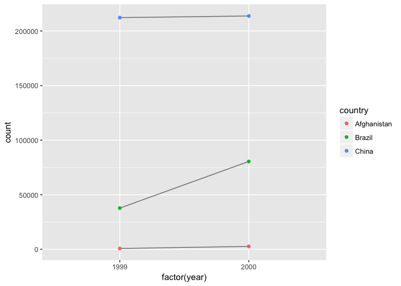

# June14_Kazu
Kazu  
6/8/2017  


# 12.1.1 Prerequisites
# 12.2 Tidy data

```r
table1
```

```
## # A tibble: 6 × 4
##       country  year  cases population
##         <chr> <int>  <int>      <int>
## 1 Afghanistan  1999    745   19987071
## 2 Afghanistan  2000   2666   20595360
## 3      Brazil  1999  37737  172006362
## 4      Brazil  2000  80488  174504898
## 5       China  1999 212258 1272915272
## 6       China  2000 213766 1280428583
```

```r
# Compute rate per 10,000
table1 %>% 
  mutate(rate = cases / population * 10000)
```

```
## # A tibble: 6 × 5
##       country  year  cases population     rate
##         <chr> <int>  <int>      <int>    <dbl>
## 1 Afghanistan  1999    745   19987071 0.372741
## 2 Afghanistan  2000   2666   20595360 1.294466
## 3      Brazil  1999  37737  172006362 2.193930
## 4      Brazil  2000  80488  174504898 4.612363
## 5       China  1999 212258 1272915272 1.667495
## 6       China  2000 213766 1280428583 1.669488
```

```r
# Compute cases per year
table1 %>% 
  count(year, wt = cases)
```

```
## # A tibble: 2 × 2
##    year      n
##   <int>  <int>
## 1  1999 250740
## 2  2000 296920
```

```r
# Visualise changes over time
library(ggplot2)
ggplot(table1, aes(year, cases)) + 
  geom_line(aes(group = country), colour = "grey50") + 
  geom_point(aes(colour = country))
```

<!-- -->
# 12.2.1 Exercises

```r
#1. Using prose, describe how the variables and observations are organised in each of the sample tables.
?prose
```

```
## No documentation for 'prose' in specified packages and libraries:
## you could try '??prose'
```

```r
#2. Compute the rate for table2, and table4a + table4b. You will need to perform four operations:
table2
```

```
## # A tibble: 12 × 4
##        country  year       type      count
##          <chr> <int>      <chr>      <int>
## 1  Afghanistan  1999      cases        745
## 2  Afghanistan  1999 population   19987071
## 3  Afghanistan  2000      cases       2666
## 4  Afghanistan  2000 population   20595360
## 5       Brazil  1999      cases      37737
## 6       Brazil  1999 population  172006362
## 7       Brazil  2000      cases      80488
## 8       Brazil  2000 population  174504898
## 9        China  1999      cases     212258
## 10       China  1999 population 1272915272
## 11       China  2000      cases     213766
## 12       China  2000 population 1280428583
```

```r
##2.1. Extract the number of TB cases per country per year.
table2.cases<-table2  %>% filter(type=="cases") 
##2.2. Extract the matching population per country per year.
table2.pop<-table2  %>% filter(type=="population") 
##2.3. Divide cases by population, and multiply by 10000.
rate1<-table2.cases[,"count"]/table2.pop[,"count"]*10000
##2.4. Store back in the appropriate place.
#table2.pop$rate<-rate1 #
table2.cases[,"rate"]<-rate1 # How to add column in tidy way?
table2.cases
```

```
## # A tibble: 6 × 5
##       country  year  type  count     rate
##         <chr> <int> <chr>  <int>    <dbl>
## 1 Afghanistan  1999 cases    745 0.372741
## 2 Afghanistan  2000 cases   2666 1.294466
## 3      Brazil  1999 cases  37737 2.193930
## 4      Brazil  2000 cases  80488 4.612363
## 5       China  1999 cases 212258 1.667495
## 6       China  2000 cases 213766 1.669488
```

```r
# how to use muatate()?
mutate(table2.cases,rate2=table2.cases[,"count"]/table2.pop[,"count"]*10000) # Error: not compatible with STRSXP
```

```
## Error in eval(expr, envir, enclos): not compatible with STRSXP
```

```r
mutate(table2.cases,rate2=as.vector(table2.cases[,"count"]/table2.pop[,"count"]*10000)) # Error: not compatible with STRSXP ???
```

```
## Error in eval(expr, envir, enclos): not compatible with STRSXP
```

```r
## Which representation is easiest to work with? Which is hardest? Why?
# table2 than table4 because there is only one year column, which enable to extract specific year.


#3. Recreate the plot showing change in cases over time using table2 instead of table1. What do you need to do first?
library(ggplot2)
ggplot(table2.cases, aes(factor(year), count)) + 
  geom_line(aes(group = country), colour = "grey50") + 
  geom_point(aes(colour = country))
```

<!-- -->
# 12.3 Spreading and gathering
# 12.3.1 Gathering

```r
table4a
```

```
## # A tibble: 3 × 3
##       country `1999` `2000`
## *       <chr>  <int>  <int>
## 1 Afghanistan    745   2666
## 2      Brazil  37737  80488
## 3       China 212258 213766
```

```r
table4a %>% 
  gather(`1999`, `2000`, key = "year", value = "cases") # easy to use
```

```
## # A tibble: 6 × 3
##       country  year  cases
##         <chr> <chr>  <int>
## 1 Afghanistan  1999    745
## 2      Brazil  1999  37737
## 3       China  1999 212258
## 4 Afghanistan  2000   2666
## 5      Brazil  2000  80488
## 6       China  2000 213766
```

```r
table4b %>% 
  gather(`1999`, `2000`, key = "year", value = "population")
```

```
## # A tibble: 6 × 3
##       country  year population
##         <chr> <chr>      <int>
## 1 Afghanistan  1999   19987071
## 2      Brazil  1999  172006362
## 3       China  1999 1272915272
## 4 Afghanistan  2000   20595360
## 5      Brazil  2000  174504898
## 6       China  2000 1280428583
```

```r
# To combine the tidied versions of table4a and table4b into a single tibble, we need to use dplyr::left_join(), which you’ll learn about in relational data.
tidy4a <- table4a %>% 
  gather(`1999`, `2000`, key = "year", value = "cases")
tidy4b <- table4b %>% 
  gather(`1999`, `2000`, key = "year", value = "population")
left_join(tidy4a, tidy4b)
```

```
## Joining, by = c("country", "year")
```

```
## # A tibble: 6 × 4
##       country  year  cases population
##         <chr> <chr>  <int>      <int>
## 1 Afghanistan  1999    745   19987071
## 2      Brazil  1999  37737  172006362
## 3       China  1999 212258 1272915272
## 4 Afghanistan  2000   2666   20595360
## 5      Brazil  2000  80488  174504898
## 6       China  2000 213766 1280428583
```
# 12.3.2 Spreading

```r
# Spreading is the opposite of gathering. You use it when an observation is scattered across multiple rows. For example, take table2: an observation is a country in a year, but each observation is spread across two rows.
table2
```

```
## # A tibble: 12 × 4
##        country  year       type      count
##          <chr> <int>      <chr>      <int>
## 1  Afghanistan  1999      cases        745
## 2  Afghanistan  1999 population   19987071
## 3  Afghanistan  2000      cases       2666
## 4  Afghanistan  2000 population   20595360
## 5       Brazil  1999      cases      37737
## 6       Brazil  1999 population  172006362
## 7       Brazil  2000      cases      80488
## 8       Brazil  2000 population  174504898
## 9        China  1999      cases     212258
## 10       China  1999 population 1272915272
## 11       China  2000      cases     213766
## 12       China  2000 population 1280428583
```

```r
spread(table2, key = type, value = count)
```

```
## # A tibble: 6 × 4
##       country  year  cases population
## *       <chr> <int>  <int>      <int>
## 1 Afghanistan  1999    745   19987071
## 2 Afghanistan  2000   2666   20595360
## 3      Brazil  1999  37737  172006362
## 4      Brazil  2000  80488  174504898
## 5       China  1999 212258 1272915272
## 6       China  2000 213766 1280428583
```
# 12.3.3 Exercises
#1. Why are gather() and spread() not perfectly symmetrical?
# Carefully consider the following example:

```r
stocks <- tibble(
  year   = c(2015, 2015, 2016, 2016),
  half  = c(   1,    2,     1,    2),
  return = c(1.88, 0.59, 0.92, 0.17)
)
stocks %>% 
  spread(year, return) %>% 
  gather("year", "return", `2015`:`2016`)
```

```
## # A tibble: 4 × 3
##    half  year return
##   <dbl> <chr>  <dbl>
## 1     1  2015   1.88
## 2     2  2015   0.59
## 3     1  2016   0.92
## 4     2  2016   0.17
```

```r
# (Hint: look at the variable types and think about column names.)
# 
# Both spread() and gather() have a convert argument. What does it do?
stocks %>% 
  spread(year, return)
```

```
## # A tibble: 2 × 3
##    half `2015` `2016`
## * <dbl>  <dbl>  <dbl>
## 1     1   1.88   0.92
## 2     2   0.59   0.17
```

```r
stocks %>% 
  spread(year, return) %>% 
  gather("year", "return", `2015`:`2016`,convert=TRUE) # convet <chr> into <int> in year
```

```
## # A tibble: 4 × 3
##    half  year return
##   <dbl> <int>  <dbl>
## 1     1  2015   1.88
## 2     2  2015   0.59
## 3     1  2016   0.92
## 4     2  2016   0.17
```
#2. Why does this code fail?

```r
table4a %>% 
  gather(1999, 2000, key = "year", value = "cases")
```

```
## Error in eval(expr, envir, enclos): Position must be between 0 and n
```

```r
#> Error in combine_vars(vars, ind_list): Position must be between 0 and n
table4a
```

```
## # A tibble: 3 × 3
##       country `1999` `2000`
## *       <chr>  <int>  <int>
## 1 Afghanistan    745   2666
## 2      Brazil  37737  80488
## 3       China 212258 213766
```

```r
# 1999 and 2000 are treated as value in integer. Treat them as characters.
table4a %>% 
  gather(`1999`, `2000`, key = "year", value = "cases")
```

```
## # A tibble: 6 × 3
##       country  year  cases
##         <chr> <chr>  <int>
## 1 Afghanistan  1999    745
## 2      Brazil  1999  37737
## 3       China  1999 212258
## 4 Afghanistan  2000   2666
## 5      Brazil  2000  80488
## 6       China  2000 213766
```
#3. Why does spreading this tibble fail? How could you add a new column to fix the problem?

```r
people <- tribble(
  ~name,             ~key,    ~value,
  #-----------------|--------|------
  "Phillip Woods",   "age",       45,
  "Phillip Woods",   "height",   186,
  "Phillip Woods",   "age",       50,
  "Jessica Cordero", "age",       37,
  "Jessica Cordero", "height",   156
)
people
```

```
## # A tibble: 5 × 3
##              name    key value
##             <chr>  <chr> <dbl>
## 1   Phillip Woods    age    45
## 2   Phillip Woods height   186
## 3   Phillip Woods    age    50
## 4 Jessica Cordero    age    37
## 5 Jessica Cordero height   156
```

```r
# trying spread
spread(people,key,value) # Error: Duplicate identifiers for rows (1, 3)
```

```
## Error: Duplicate identifiers for rows (1, 3)
```

```r
# adding new column with genertion
people %>% 
  mutate(generation=c("1st","1st","2nd","1st","1st")) %>%
  spread(key,value)
```

```
## # A tibble: 3 × 4
##              name generation   age height
## *           <chr>      <chr> <dbl>  <dbl>
## 1 Jessica Cordero        1st    37    156
## 2   Phillip Woods        1st    45    186
## 3   Phillip Woods        2nd    50     NA
```
#4. Tidy the simple tibble below. Do you need to spread or gather it? What are the variables?

```r
preg <- tribble(
  ~pregnant, ~male, ~female,
  "yes",     NA,    10,
  "no",      20,    12
)
preg %>%
  gather(male,female,key=sex) # Error: Each variable must have a unique name.
```

```
## Error: Each variable must have a unique name.
## Problem variables: 'male'
```

```r
is.na(preg) <-0
```

```
## Error in `[<-.data.frame`(`*tmp*`, value, value = NA): attempt to select less than one element in integerOneIndex
```

```r
preg %>% 
  replace_na(list(male=0)) %>%
  gather(male,female,key="sex") # does not work
```

```
## Error: Each variable must have a unique name.
## Problem variables: 'male'
```
# 12.4 Separating and uniting
# 12.4.1 Separate

```r
table3
```

```
## # A tibble: 6 × 3
##       country  year              rate
## *       <chr> <int>             <chr>
## 1 Afghanistan  1999      745/19987071
## 2 Afghanistan  2000     2666/20595360
## 3      Brazil  1999   37737/172006362
## 4      Brazil  2000   80488/174504898
## 5       China  1999 212258/1272915272
## 6       China  2000 213766/1280428583
```

```r
table3 %>% 
  separate(rate, into = c("cases", "population"))
```

```
## # A tibble: 6 × 4
##       country  year  cases population
## *       <chr> <int>  <chr>      <chr>
## 1 Afghanistan  1999    745   19987071
## 2 Afghanistan  2000   2666   20595360
## 3      Brazil  1999  37737  172006362
## 4      Brazil  2000  80488  174504898
## 5       China  1999 212258 1272915272
## 6       China  2000 213766 1280428583
```

```r
table3 %>% 
  separate(rate, into = c("cases", "population"), sep = "/")
```

```
## # A tibble: 6 × 4
##       country  year  cases population
## *       <chr> <int>  <chr>      <chr>
## 1 Afghanistan  1999    745   19987071
## 2 Afghanistan  2000   2666   20595360
## 3      Brazil  1999  37737  172006362
## 4      Brazil  2000  80488  174504898
## 5       China  1999 212258 1272915272
## 6       China  2000 213766 1280428583
```

```r
table3 %>% 
  separate(rate, into = c("cases", "population"), convert = TRUE)
```

```
## # A tibble: 6 × 4
##       country  year  cases population
## *       <chr> <int>  <int>      <int>
## 1 Afghanistan  1999    745   19987071
## 2 Afghanistan  2000   2666   20595360
## 3      Brazil  1999  37737  172006362
## 4      Brazil  2000  80488  174504898
## 5       China  1999 212258 1272915272
## 6       China  2000 213766 1280428583
```

```r
table3 %>% 
  separate(year, into = c("century", "year"), sep = 2)
```

```
## # A tibble: 6 × 4
##       country century  year              rate
## *       <chr>   <chr> <chr>             <chr>
## 1 Afghanistan      19    99      745/19987071
## 2 Afghanistan      20    00     2666/20595360
## 3      Brazil      19    99   37737/172006362
## 4      Brazil      20    00   80488/174504898
## 5       China      19    99 212258/1272915272
## 6       China      20    00 213766/1280428583
```
# 12.4.2 Unite

```r
table5 %>% 
  unite(new, century, year) # what happened to "paste()"?
```

```
## # A tibble: 6 × 3
##       country   new              rate
## *       <chr> <chr>             <chr>
## 1 Afghanistan 19_99      745/19987071
## 2 Afghanistan 20_00     2666/20595360
## 3      Brazil 19_99   37737/172006362
## 4      Brazil 20_00   80488/174504898
## 5       China 19_99 212258/1272915272
## 6       China 20_00 213766/1280428583
```

```r
table5 %>% 
  unite(new, century, year, sep = "")
```

```
## # A tibble: 6 × 3
##       country   new              rate
## *       <chr> <chr>             <chr>
## 1 Afghanistan  1999      745/19987071
## 2 Afghanistan  2000     2666/20595360
## 3      Brazil  1999   37737/172006362
## 4      Brazil  2000   80488/174504898
## 5       China  1999 212258/1272915272
## 6       China  2000 213766/1280428583
```
# 12.4.3 Exercises

```r
#1. What do the extra and fill arguments do in separate()? Experiment with the various options for the following two toy datasets.
tibble(x = c("a,b,c", "d,e,f,g", "h,i,j")) %>% 
  separate(x, c("one", "two", "three"))
```

```
## Warning: Too many values at 1 locations: 2
```

```
## # A tibble: 3 × 3
##     one   two three
## * <chr> <chr> <chr>
## 1     a     b     c
## 2     d     e     f
## 3     h     i     j
```

```r
# test extra="drop"
tibble(x = c("a,b,c", "d,e,f,g", "h,i,j")) %>% 
  separate(x, c("one", "two", "three"),extra="drop")
```

```
## # A tibble: 3 × 3
##     one   two three
## * <chr> <chr> <chr>
## 1     a     b     c
## 2     d     e     f
## 3     h     i     j
```

```r
# 
tibble(x = c("a,b,c", "d,e", "f,g,i")) %>% 
  separate(x, c("one", "two", "three"))
```

```
## Warning: Too few values at 1 locations: 2
```

```
## # A tibble: 3 × 3
##     one   two three
## * <chr> <chr> <chr>
## 1     a     b     c
## 2     d     e  <NA>
## 3     f     g     i
```

```r
# test fill="right"
tibble(x = c("a,b,c", "d,e", "f,g,i")) %>% 
  separate(x, c("one", "two", "three"),fill="right")
```

```
## # A tibble: 3 × 3
##     one   two three
## * <chr> <chr> <chr>
## 1     a     b     c
## 2     d     e  <NA>
## 3     f     g     i
```

```r
# test fill="left"
tibble(x = c("a,b,c", "d,e", "f,g,i")) %>% 
  separate(x, c("one", "two", "three"),fill="left")
```

```
## # A tibble: 3 × 3
##     one   two three
## * <chr> <chr> <chr>
## 1     a     b     c
## 2  <NA>     d     e
## 3     f     g     i
```

```r
#2. Both unite() and separate() have a remove argument. What does it do? Why would you set it to FALSE?
table5
```

```
## # A tibble: 6 × 4
##       country century  year              rate
## *       <chr>   <chr> <chr>             <chr>
## 1 Afghanistan      19    99      745/19987071
## 2 Afghanistan      20    00     2666/20595360
## 3      Brazil      19    99   37737/172006362
## 4      Brazil      20    00   80488/174504898
## 5       China      19    99 212258/1272915272
## 6       China      20    00 213766/1280428583
```

```r
table5 %>% 
  unite(new, century, year) # what happened to "paste()"?
```

```
## # A tibble: 6 × 3
##       country   new              rate
## *       <chr> <chr>             <chr>
## 1 Afghanistan 19_99      745/19987071
## 2 Afghanistan 20_00     2666/20595360
## 3      Brazil 19_99   37737/172006362
## 4      Brazil 20_00   80488/174504898
## 5       China 19_99 212258/1272915272
## 6       China 20_00 213766/1280428583
```

```r
?unite
table5 %>% 
  unite(new, century, year,remove=FALSE) # keep original columns
```

```
## # A tibble: 6 × 5
##       country   new century  year              rate
## *       <chr> <chr>   <chr> <chr>             <chr>
## 1 Afghanistan 19_99      19    99      745/19987071
## 2 Afghanistan 20_00      20    00     2666/20595360
## 3      Brazil 19_99      19    99   37737/172006362
## 4      Brazil 20_00      20    00   80488/174504898
## 5       China 19_99      19    99 212258/1272915272
## 6       China 20_00      20    00 213766/1280428583
```

```r
# 
tibble(x = c("a,b,c", "d,e", "f,g,i")) %>% 
  separate(x, c("one", "two", "three"),remove=FALSE) # # keep original columns
```

```
## Warning: Too few values at 1 locations: 2
```

```
## # A tibble: 3 × 4
##       x   one   two three
## * <chr> <chr> <chr> <chr>
## 1 a,b,c     a     b     c
## 2   d,e     d     e  <NA>
## 3 f,g,i     f     g     i
```

```r
#3. Compare and contrast separate() and extract(). Why are there three variations of separation (by position, by separator, and with groups), but only one unite?
?separate
# Given either regular expression or a vector of character positions, separate() turns a single character column into multiple columns.
df <- data.frame(x = c(NA, "a.b", "a.d", "b.c"))
df %>% extract(x, c("A", "B"),"([[:alnum:]]+).([[:alnum:]]+)") # does work
```

```
##      A    B
## 1 <NA> <NA>
## 2    a    b
## 3    a    d
## 4    b    c
```

```r
df %>% separate(x, c("A", "B"),"([[:alnum:]]+).([[:alnum:]]+)") # does not work
```

```
##      A    B
## 1 <NA> <NA>
## 2          
## 3          
## 4
```

```r
df %>% separate(x, c("A", "B")) # does work
```

```
##      A    B
## 1 <NA> <NA>
## 2    a    b
## 3    a    d
## 4    b    c
```

```r
df %>% separate(x, c("A", "B"),sep=".") # does not work. why?
```

```
## Warning: Too many values at 3 locations: 2, 3, 4
```

```
##      A    B
## 1 <NA> <NA>
## 2          
## 3          
## 4
```

```r
df %>% separate(x, c("A", "B"),sep=".",extra="merge") # does not work. why?
```

```
##      A    B
## 1 <NA> <NA>
## 2        .b
## 3        .d
## 4        .c
```

```r
df %>% separate(x, c("A", "B"),sep=.) # does not work
```

```
## Error: Invalid column specification
```

```r
df %>% separate(x, c("A", "B"),c(1,2)) # by position? does work? No. How to do?
```

```
##      A    B   NA
## 1 <NA> <NA> <NA>
## 2    a    .    b
## 3    a    .    d
## 4    b    .    c
```

```r
# If every row doesn't split into the same number of pieces, use
# the extra and file arguments to control what happens
df <- data.frame(x = c("a", "a b", "a b c", NA))
df %>% separate(x, c("a", "b"))
```

```
## Warning: Too many values at 1 locations: 3
```

```
## Warning: Too few values at 1 locations: 1
```

```
##      a    b
## 1    a <NA>
## 2    a    b
## 3    a    b
## 4 <NA> <NA>
```

```r
# The same behaviour but no warnings
df %>% separate(x, c("a", "b"), extra = "drop", fill = "right")
```

```
##      a    b
## 1    a <NA>
## 2    a    b
## 3    a    b
## 4 <NA> <NA>
```

```r
# Another option:
df %>% separate(x, c("a", "b"), extra = "merge", fill = "left")
```

```
##      a    b
## 1 <NA>    a
## 2    a    b
## 3    a  b c
## 4 <NA> <NA>
```

```r
# If only want to split specified number of times use extra = "merge"
df <- data.frame(x = c("x: 123", "y: error: 7"))
df %>% separate(x, c("key", "value"), ": ", extra = "merge")
```

```
##   key    value
## 1   x      123
## 2   y error: 7
```

```r
?extract
```

```
## Help on topic 'extract' was found in the following packages:
## 
##   Package               Library
##   tidyr                 /Library/Frameworks/R.framework/Versions/3.3/Resources/library
##   magrittr              /Library/Frameworks/R.framework/Versions/3.3/Resources/library
## 
## 
## Using the first match ...
```

```r
# Given a regular expression with capturing groups, extract() turns each group into a new column. If the groups don't match, or the input is NA, the output will be NA.

df <- data.frame(x = c(NA, "a-b", "a-d", "b-c", "d-e"))
df %>% extract(x, "A")
```

```
##      A
## 1 <NA>
## 2    a
## 3    a
## 4    b
## 5    d
```

```r
df %>% extract(x, c("A", "B"), "([[:alnum:]]+)-([[:alnum:]]+)") # does  work
```

```
##      A    B
## 1 <NA> <NA>
## 2    a    b
## 3    a    d
## 4    b    c
## 5    d    e
```

```r
df %>% separate(x, c("A", "B"), sep="([[:alnum:]]+)-([[:alnum:]]+)") # does not work
```

```
##      A    B
## 1 <NA> <NA>
## 2          
## 3          
## 4          
## 5
```

```r
df %>% separate(x, c("A", "B"), sep="-") # does work
```

```
##      A    B
## 1 <NA> <NA>
## 2    a    b
## 3    a    d
## 4    b    c
## 5    d    e
```

```r
?unite # Convenience function to paste together multiple columns into one.
```
