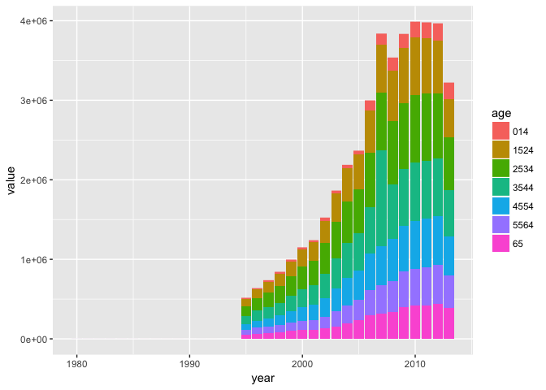

# June21_Kazu
Kazu  
6/20/2017  


# 12.5 Missing values

```r
stocks <- tibble(
  year   = c(2015, 2015, 2015, 2015, 2016, 2016, 2016),
  qtr    = c(   1,    2,    3,    4,    2,    3,    4),
  return = c(1.88, 0.59, 0.35,   NA, 0.92, 0.17, 2.66)
)
stocks %>% 
  spread(year, return)
```

```
## # A tibble: 4 × 3
##     qtr `2015` `2016`
## * <dbl>  <dbl>  <dbl>
## 1     1   1.88     NA
## 2     2   0.59   0.92
## 3     3   0.35   0.17
## 4     4     NA   2.66
```

```r
stocks %>% 
  spread(year, return) %>% 
  gather(year, return, `2015`:`2016`, na.rm = TRUE)
```

```
## # A tibble: 6 × 3
##     qtr  year return
## * <dbl> <chr>  <dbl>
## 1     1  2015   1.88
## 2     2  2015   0.59
## 3     3  2015   0.35
## 4     2  2016   0.92
## 5     3  2016   0.17
## 6     4  2016   2.66
```

```r
stocks %>% 
  complete(year, qtr)
```

```
## # A tibble: 8 × 3
##    year   qtr return
##   <dbl> <dbl>  <dbl>
## 1  2015     1   1.88
## 2  2015     2   0.59
## 3  2015     3   0.35
## 4  2015     4     NA
## 5  2016     1     NA
## 6  2016     2   0.92
## 7  2016     3   0.17
## 8  2016     4   2.66
```

```r
treatment <- tribble(
  ~ person,           ~ treatment, ~response,
  "Derrick Whitmore", 1,           7,
  NA,                 2,           10,
  NA,                 3,           9,
  "Katherine Burke",  1,           4
)
treatment %>% 
  fill(person)
```

```
## # A tibble: 4 × 3
##             person treatment response
##              <chr>     <dbl>    <dbl>
## 1 Derrick Whitmore         1        7
## 2 Derrick Whitmore         2       10
## 3 Derrick Whitmore         3        9
## 4  Katherine Burke         1        4
```
# 12.5.1 Exercises

```r
#1. Compare and contrast the fill arguments to spread() and complete().
## example from spread()
df <- data_frame(
  group = c(1:2, 1),
  item_id = c(1:2, 2),
  item_name = c("a", "b", "b"),
  value1 = 1:3,
  value2 = 4:6
)
df %>% complete(group, nesting(item_id, item_name))
```

```
## # A tibble: 4 × 5
##   group item_id item_name value1 value2
##   <dbl>   <dbl>     <chr>  <int>  <int>
## 1     1       1         a      1      4
## 2     1       2         b      3      6
## 3     2       1         a     NA     NA
## 4     2       2         b      2      5
```

```r
# You can also choose to fill in missing values
df %>% complete(group, nesting(item_id, item_name), fill = list(value1 = 0))
```

```
## # A tibble: 4 × 5
##   group item_id item_name value1 value2
##   <dbl>   <dbl>     <chr>  <dbl>  <int>
## 1     1       1         a      1      4
## 2     1       2         b      3      6
## 3     2       1         a      0     NA
## 4     2       2         b      2      5
```

```r
df %>% complete(group, nesting(item_id, item_name), fill = list(value1 = 0,value2 = "no data")) # you can control what will be filled in each column.
```

```
## # A tibble: 4 × 5
##   group item_id item_name value1  value2
##   <dbl>   <dbl>     <chr>  <dbl>   <chr>
## 1     1       1         a      1       4
## 2     1       2         b      3       6
## 3     2       1         a      0 no data
## 4     2       2         b      2       5
```

```r
# how to use spread?
# 
df %>% spread(group,value1)
```

```
## # A tibble: 3 × 5
##   item_id item_name value2   `1`   `2`
## *   <dbl>     <chr>  <int> <int> <int>
## 1       1         a      4     1    NA
## 2       2         b      5    NA     2
## 3       2         b      6     3    NA
```

```r
df %>% spread(group,value2)
```

```
## # A tibble: 3 × 5
##   item_id item_name value1   `1`   `2`
## *   <dbl>     <chr>  <int> <int> <int>
## 1       1         a      1     4    NA
## 2       2         b      2    NA     5
## 3       2         b      3     6    NA
```

```r
#2. What does the direction argument to fill() do?
?fill
```

```
## Help on topic 'fill' was found in the following packages:
## 
##   Package               Library
##   tidyr                 /Library/Frameworks/R.framework/Versions/3.3/Resources/library
##   ggplot2               /Library/Frameworks/R.framework/Versions/3.3/Resources/library
## 
## 
## Using the first match ...
```

```r
df <- data.frame(Month = 1:12, Year = c(2000, rep(NA, 11)))
df <- data.frame(Month = 1:12, Year = c(rep(NA, 5),2000,rep(NA,6)))
df
```

```
##    Month Year
## 1      1   NA
## 2      2   NA
## 3      3   NA
## 4      4   NA
## 5      5   NA
## 6      6 2000
## 7      7   NA
## 8      8   NA
## 9      9   NA
## 10    10   NA
## 11    11   NA
## 12    12   NA
```

```r
df %>% fill(Year)
```

```
##    Month Year
## 1      1   NA
## 2      2   NA
## 3      3   NA
## 4      4   NA
## 5      5   NA
## 6      6 2000
## 7      7 2000
## 8      8 2000
## 9      9 2000
## 10    10 2000
## 11    11 2000
## 12    12 2000
```

```r
df %>% fill(Year,.direction="up") # Direction in which to fill missing values. Currently either "down" (the default) or "up". ????
```

```
##    Month Year
## 1      1 2000
## 2      2 2000
## 3      3 2000
## 4      4 2000
## 5      5 2000
## 6      6 2000
## 7      7   NA
## 8      8   NA
## 9      9   NA
## 10    10   NA
## 11    11   NA
## 12    12   NA
```

```r
df %>% fill(Year,.direction="down")
```

```
##    Month Year
## 1      1   NA
## 2      2   NA
## 3      3   NA
## 4      4   NA
## 5      5   NA
## 6      6 2000
## 7      7 2000
## 8      8 2000
## 9      9 2000
## 10    10 2000
## 11    11 2000
## 12    12 2000
```

```r
df %>% fill(Year,.direction=c("up","down")) # Error in match.arg(.direction) : 'arg' must be of length 1. 
```

```
## Error in match.arg(.direction): 'arg' must be of length 1
```

```r
# unable to fill all NA by fill()
df %>% complete(Month,Year) 
```

```
## # A tibble: 12 × 2
##    Month  Year
##    <int> <dbl>
## 1      1  2000
## 2      2  2000
## 3      3  2000
## 4      4  2000
## 5      5  2000
## 6      6  2000
## 7      7  2000
## 8      8  2000
## 9      9  2000
## 10    10  2000
## 11    11  2000
## 12    12  2000
```
# 12.6 Case Study

```r
who
```

```
## # A tibble: 7,240 × 60
##        country  iso2  iso3  year new_sp_m014 new_sp_m1524 new_sp_m2534
##          <chr> <chr> <chr> <int>       <int>        <int>        <int>
## 1  Afghanistan    AF   AFG  1980          NA           NA           NA
## 2  Afghanistan    AF   AFG  1981          NA           NA           NA
## 3  Afghanistan    AF   AFG  1982          NA           NA           NA
## 4  Afghanistan    AF   AFG  1983          NA           NA           NA
## 5  Afghanistan    AF   AFG  1984          NA           NA           NA
## 6  Afghanistan    AF   AFG  1985          NA           NA           NA
## 7  Afghanistan    AF   AFG  1986          NA           NA           NA
## 8  Afghanistan    AF   AFG  1987          NA           NA           NA
## 9  Afghanistan    AF   AFG  1988          NA           NA           NA
## 10 Afghanistan    AF   AFG  1989          NA           NA           NA
## # ... with 7,230 more rows, and 53 more variables: new_sp_m3544 <int>,
## #   new_sp_m4554 <int>, new_sp_m5564 <int>, new_sp_m65 <int>,
## #   new_sp_f014 <int>, new_sp_f1524 <int>, new_sp_f2534 <int>,
## #   new_sp_f3544 <int>, new_sp_f4554 <int>, new_sp_f5564 <int>,
## #   new_sp_f65 <int>, new_sn_m014 <int>, new_sn_m1524 <int>,
## #   new_sn_m2534 <int>, new_sn_m3544 <int>, new_sn_m4554 <int>,
## #   new_sn_m5564 <int>, new_sn_m65 <int>, new_sn_f014 <int>,
## #   new_sn_f1524 <int>, new_sn_f2534 <int>, new_sn_f3544 <int>,
## #   new_sn_f4554 <int>, new_sn_f5564 <int>, new_sn_f65 <int>,
## #   new_ep_m014 <int>, new_ep_m1524 <int>, new_ep_m2534 <int>,
## #   new_ep_m3544 <int>, new_ep_m4554 <int>, new_ep_m5564 <int>,
## #   new_ep_m65 <int>, new_ep_f014 <int>, new_ep_f1524 <int>,
## #   new_ep_f2534 <int>, new_ep_f3544 <int>, new_ep_f4554 <int>,
## #   new_ep_f5564 <int>, new_ep_f65 <int>, newrel_m014 <int>,
## #   newrel_m1524 <int>, newrel_m2534 <int>, newrel_m3544 <int>,
## #   newrel_m4554 <int>, newrel_m5564 <int>, newrel_m65 <int>,
## #   newrel_f014 <int>, newrel_f1524 <int>, newrel_f2534 <int>,
## #   newrel_f3544 <int>, newrel_f4554 <int>, newrel_f5564 <int>,
## #   newrel_f65 <int>
```

```r
# The best place to start is almost always to gather together the columns that are not variables. Let’s have a look at what we’ve got:
# It looks like country, iso2, and iso3 are three variables that redundantly specify the country.
# year is clearly also a variable.
# We don’t know what all the other columns are yet, but given the structure in the variable names (e.g. new_sp_m014, new_ep_m014, new_ep_f014) these are likely to be values, not variables.
who1 <- who %>% 
  gather(new_sp_m014:newrel_f65, key = "key", value = "cases", na.rm = TRUE)
who1
```

```
## # A tibble: 76,046 × 6
##        country  iso2  iso3  year         key cases
## *        <chr> <chr> <chr> <int>       <chr> <int>
## 1  Afghanistan    AF   AFG  1997 new_sp_m014     0
## 2  Afghanistan    AF   AFG  1998 new_sp_m014    30
## 3  Afghanistan    AF   AFG  1999 new_sp_m014     8
## 4  Afghanistan    AF   AFG  2000 new_sp_m014    52
## 5  Afghanistan    AF   AFG  2001 new_sp_m014   129
## 6  Afghanistan    AF   AFG  2002 new_sp_m014    90
## 7  Afghanistan    AF   AFG  2003 new_sp_m014   127
## 8  Afghanistan    AF   AFG  2004 new_sp_m014   139
## 9  Afghanistan    AF   AFG  2005 new_sp_m014   151
## 10 Afghanistan    AF   AFG  2006 new_sp_m014   193
## # ... with 76,036 more rows
```

```r
# We can get some hint of the structure of the values in the new key column by counting them:
who1 %>% 
  count(key)
```

```
## # A tibble: 56 × 2
##             key     n
##           <chr> <int>
## 1   new_ep_f014  1032
## 2  new_ep_f1524  1021
## 3  new_ep_f2534  1021
## 4  new_ep_f3544  1021
## 5  new_ep_f4554  1017
## 6  new_ep_f5564  1017
## 7    new_ep_f65  1014
## 8   new_ep_m014  1038
## 9  new_ep_m1524  1026
## 10 new_ep_m2534  1020
## # ... with 46 more rows
```

```r
# You might be able to parse this out by yourself with a little thought and some experimentation, but luckily we have the data dictionary handy. It tells us:
## The first three letters of each column denote whether the column contains new or old cases of TB. In this dataset, each column contains new cases.
##  The next two letters describe the type of TB:
###    rel stands for cases of relapse
###    ep stands for cases of extrapulmonary TB
###    sn stands for cases of pulmonary TB that could not be diagnosed by a pulmonary smear (smear negative)
###    sp stands for cases of pulmonary TB that could be diagnosed be a pulmonary smear (smear positive)
### The sixth letter gives the sex of TB patients. The dataset groups cases by males (m) and females (f).
###  The remaining numbers gives the age group. The dataset groups cases into seven age groups:
### 014 = 0 – 14 years old
### 1524 = 15 – 24 years old
### 2534 = 25 – 34 years old
### 3544 = 35 – 44 years old
### 4554 = 45 – 54 years old
### 5564 = 55 – 64 years old
### 65 = 65 or older

# KN: how ot know those info?
summary(who1) # this is not appropriate
```

```
##    country              iso2               iso3                year     
##  Length:76046       Length:76046       Length:76046       Min.   :1980  
##  Class :character   Class :character   Class :character   1st Qu.:2003  
##  Mode  :character   Mode  :character   Mode  :character   Median :2007  
##                                                           Mean   :2006  
##                                                           3rd Qu.:2010  
##                                                           Max.   :2013  
##      key                cases         
##  Length:76046       Min.   :     0.0  
##  Class :character   1st Qu.:     3.0  
##  Mode  :character   Median :    26.0  
##                     Mean   :   570.7  
##                     3rd Qu.:   184.0  
##                     Max.   :250051.0
```

```r
who1 %>% count(key) %>% separate(key,c("one","two","three"),sep="_") # Warning message:Too few values at 14 locations: 43, 44, 45, 46, 47, 48, 49, 50, 51, 52, 53, 54, 55, 56 
```

```
## Warning: Too few values at 14 locations: 43, 44, 45, 46, 47, 48, 49, 50,
## 51, 52, 53, 54, 55, 56
```

```
## # A tibble: 56 × 4
##      one   two three     n
## *  <chr> <chr> <chr> <int>
## 1    new    ep  f014  1032
## 2    new    ep f1524  1021
## 3    new    ep f2534  1021
## 4    new    ep f3544  1021
## 5    new    ep f4554  1017
## 6    new    ep f5564  1017
## 7    new    ep   f65  1014
## 8    new    ep  m014  1038
## 9    new    ep m1524  1026
## 10   new    ep m2534  1020
## # ... with 46 more rows
```

```r
who1 %>% count(key) %>% separate(key,c("one","two","three"),sep="_",fill="right") -> who1.key
count(who1.key, one)
```

```
## # A tibble: 2 × 2
##      one    nn
##    <chr> <int>
## 1    new    42
## 2 newrel    14
```

```r
count(who1.key, two)
```

```
## # A tibble: 17 × 2
##      two    nn
##    <chr> <int>
## 1     ep    14
## 2   f014     1
## 3  f1524     1
## 4  f2534     1
## 5  f3544     1
## 6  f4554     1
## 7  f5564     1
## 8    f65     1
## 9   m014     1
## 10 m1524     1
## 11 m2534     1
## 12 m3544     1
## 13 m4554     1
## 14 m5564     1
## 15   m65     1
## 16    sn    14
## 17    sp    14
```

```r
count(who1.key, three)
```

```
## # A tibble: 15 × 2
##    three    nn
##    <chr> <int>
## 1   f014     3
## 2  f1524     3
## 3  f2534     3
## 4  f3544     3
## 5  f4554     3
## 6  f5564     3
## 7    f65     3
## 8   m014     3
## 9  m1524     3
## 10 m2534     3
## 11 m3544     3
## 12 m4554     3
## 13 m5564     3
## 14   m65     3
## 15  <NA>    14
```

```r
### the end of my own trial

# We need to make a minor fix to the format of the column names: unfortunately the names are slightly inconsistent because instead of new_rel we have newrel (it’s hard to spot this here but if you don’t fix it we’ll get errors in subsequent steps). You’ll learn about str_replace() in strings, but the basic idea is pretty simple: replace the characters “newrel” with “new_rel”. This makes all variable names consistent.

who2 <- who1 %>% 
  mutate(key = stringr::str_replace(key, "newrel", "new_rel"))
who2
```

```
## # A tibble: 76,046 × 6
##        country  iso2  iso3  year         key cases
##          <chr> <chr> <chr> <int>       <chr> <int>
## 1  Afghanistan    AF   AFG  1997 new_sp_m014     0
## 2  Afghanistan    AF   AFG  1998 new_sp_m014    30
## 3  Afghanistan    AF   AFG  1999 new_sp_m014     8
## 4  Afghanistan    AF   AFG  2000 new_sp_m014    52
## 5  Afghanistan    AF   AFG  2001 new_sp_m014   129
## 6  Afghanistan    AF   AFG  2002 new_sp_m014    90
## 7  Afghanistan    AF   AFG  2003 new_sp_m014   127
## 8  Afghanistan    AF   AFG  2004 new_sp_m014   139
## 9  Afghanistan    AF   AFG  2005 new_sp_m014   151
## 10 Afghanistan    AF   AFG  2006 new_sp_m014   193
## # ... with 76,036 more rows
```

```r
# We can separate the values in each code with two passes of separate(). The first pass will split the codes at each underscore.

who3 <- who2 %>% 
  separate(key, c("new", "type", "sexage"), sep = "_")
who3
```

```
## # A tibble: 76,046 × 8
##        country  iso2  iso3  year   new  type sexage cases
## *        <chr> <chr> <chr> <int> <chr> <chr>  <chr> <int>
## 1  Afghanistan    AF   AFG  1997   new    sp   m014     0
## 2  Afghanistan    AF   AFG  1998   new    sp   m014    30
## 3  Afghanistan    AF   AFG  1999   new    sp   m014     8
## 4  Afghanistan    AF   AFG  2000   new    sp   m014    52
## 5  Afghanistan    AF   AFG  2001   new    sp   m014   129
## 6  Afghanistan    AF   AFG  2002   new    sp   m014    90
## 7  Afghanistan    AF   AFG  2003   new    sp   m014   127
## 8  Afghanistan    AF   AFG  2004   new    sp   m014   139
## 9  Afghanistan    AF   AFG  2005   new    sp   m014   151
## 10 Afghanistan    AF   AFG  2006   new    sp   m014   193
## # ... with 76,036 more rows
```

```r
who4 <- who3 %>% 
  select(-new, -iso2, -iso3)
#Next we’ll separate sexage into sex and age by splitting after the first character:

who5 <- who4 %>% 
  separate(sexage, c("sex", "age"), sep = 1)
who5
```

```
## # A tibble: 76,046 × 6
##        country  year  type   sex   age cases
## *        <chr> <int> <chr> <chr> <chr> <int>
## 1  Afghanistan  1997    sp     m   014     0
## 2  Afghanistan  1998    sp     m   014    30
## 3  Afghanistan  1999    sp     m   014     8
## 4  Afghanistan  2000    sp     m   014    52
## 5  Afghanistan  2001    sp     m   014   129
## 6  Afghanistan  2002    sp     m   014    90
## 7  Afghanistan  2003    sp     m   014   127
## 8  Afghanistan  2004    sp     m   014   139
## 9  Afghanistan  2005    sp     m   014   151
## 10 Afghanistan  2006    sp     m   014   193
## # ... with 76,036 more rows
```

```r
# The who dataset is now tidy!
# I’ve shown you the code a piece at a time, assigning each interim result to a new variable. This typically isn’t how you’d work interactively. Instead, you’d gradually build up a complex pipe:

who %>%
  gather(code, value, new_sp_m014:newrel_f65, na.rm = TRUE) %>% 
  mutate(code = stringr::str_replace(code, "newrel", "new_rel")) %>%
  separate(code, c("new", "var", "sexage")) %>% 
  select(-new, -iso2, -iso3) %>% 
  separate(sexage, c("sex", "age"), sep = 1)
```

```
## # A tibble: 76,046 × 6
##        country  year   var   sex   age value
## *        <chr> <int> <chr> <chr> <chr> <int>
## 1  Afghanistan  1997    sp     m   014     0
## 2  Afghanistan  1998    sp     m   014    30
## 3  Afghanistan  1999    sp     m   014     8
## 4  Afghanistan  2000    sp     m   014    52
## 5  Afghanistan  2001    sp     m   014   129
## 6  Afghanistan  2002    sp     m   014    90
## 7  Afghanistan  2003    sp     m   014   127
## 8  Afghanistan  2004    sp     m   014   139
## 9  Afghanistan  2005    sp     m   014   151
## 10 Afghanistan  2006    sp     m   014   193
## # ... with 76,036 more rows
```
# 12.6.1 Exercises

```r
#1. In this case study I set na.rm = TRUE just to make it easier to check that we had the correct values. Is this reasonable? Think about how missing values are represented in this dataset. Are there implicit missing values? What’s the difference between an NA and zero?

#2. What happens if you neglect the mutate() step? (mutate(key = stringr::str_replace(key, "newrel", "new_rel")))
who %>%
  gather(code, value, new_sp_m014:newrel_f65, na.rm = TRUE) %>% 
  #mutate(code = stringr::str_replace(code, "newrel", "new_rel")) %>%
  #separate(code, c("new", "var", "sexage")) %>% 
  separate(code, c("new", "var", "sexage"),fill="right") %>% # with "newrel" row has only two 
  select(-new, -iso2, -iso3) %>% 
  separate(sexage, c("sex", "age"), sep = 1)
```

```
## # A tibble: 76,046 × 6
##        country  year   var   sex   age value
## *        <chr> <int> <chr> <chr> <chr> <int>
## 1  Afghanistan  1997    sp     m   014     0
## 2  Afghanistan  1998    sp     m   014    30
## 3  Afghanistan  1999    sp     m   014     8
## 4  Afghanistan  2000    sp     m   014    52
## 5  Afghanistan  2001    sp     m   014   129
## 6  Afghanistan  2002    sp     m   014    90
## 7  Afghanistan  2003    sp     m   014   127
## 8  Afghanistan  2004    sp     m   014   139
## 9  Afghanistan  2005    sp     m   014   151
## 10 Afghanistan  2006    sp     m   014   193
## # ... with 76,036 more rows
```

```r
# Warning message:Too few values at 2580 locations: 73467, 73468, 73469, 73470, 73471, 73472, 73473, 73474, 73475, 73476, 73477, 73478, 73479, 73480, 73481, 73482, 73483, 73484, 73485, 73486, ... 


#3. I claimed that iso2 and iso3 were redundant with country. Confirm this claim.
who %>% 
  unite(country,iso2,iso3,col="combined",remove=FALSE) %>% select(combined) %>% count(combined) # this is not what I want
```

```
## # A tibble: 219 × 2
##                      combined     n
##                         <chr> <int>
## 1          Afghanistan_AF_AFG    34
## 2              Albania_AL_ALB    34
## 3              Algeria_DZ_DZA    34
## 4       American Samoa_AS_ASM    34
## 5              Andorra_AD_AND    34
## 6               Angola_AO_AGO    34
## 7             Anguilla_AI_AIA    34
## 8  Antigua and Barbuda_AG_ATG    34
## 9            Argentina_AR_ARG    34
## 10             Armenia_AM_ARM    34
## # ... with 209 more rows
```

```r
#   making table
who %>% 
  select(country, iso2,iso3)  %>%
  spread(country) # tidy version of ftable needed.
```

```
## Error: Please supply column name
```

```r
#4. For each country, year, and sex compute the total number of cases of TB. Make an informative visualisation of the data.
who.summary<-who %>%
  gather(code, value, new_sp_m014:newrel_f65, na.rm = TRUE) %>% 
  mutate(code = stringr::str_replace(code, "newrel", "new_rel")) %>%
  separate(code, c("new", "var", "sexage")) %>% 
  select(-new, -iso2, -iso3) %>% 
  separate(sexage, c("sex", "age"), sep = 1)

who.summary %>% ggplot(aes(x=year,y=value)) + geom_bar(mapping=aes(fill=age),stat="identity")
```

<!-- -->

```r
<<<<<<< HEAD
p<-who.summary %>% ggplot(aes(x=year,y=value)) + geom_bar(mapping=aes(fill=sex),stat="identity") + facet_grid(country~var,scales="free_y") + theme(strip.text.y = element_text(angle=0,size=3))
=======
p<-who.summary %>% ggplot(aes(x=year,y=value)) + geom_bar(mapping=aes(fill=age),stat="identity") + facet_grid(country~var,scales="free_y")
>>>>>>> fdf1625b2be59f5ebcb9fd4c305ab39f1f78d7b4
ggsave(file="who.summary.png",width=8,height=100,limitsize=FALSE)
```
