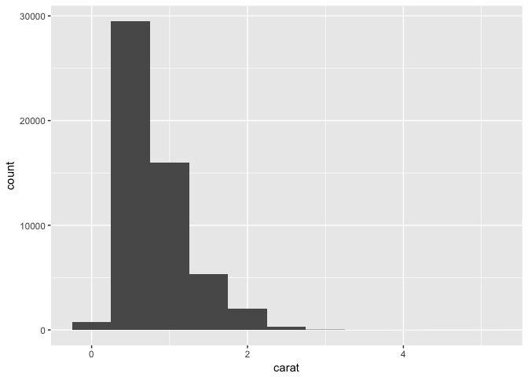
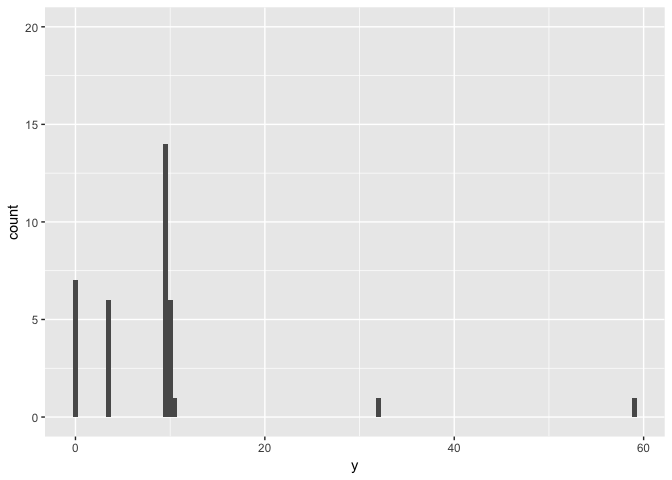
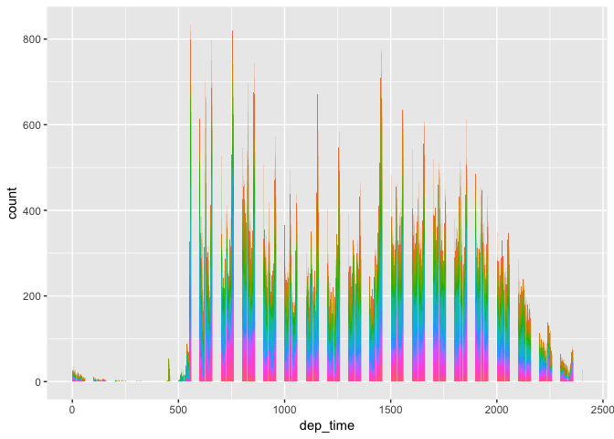
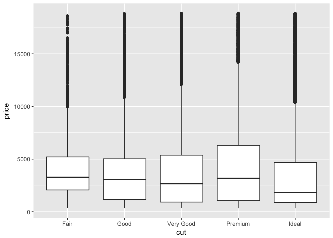
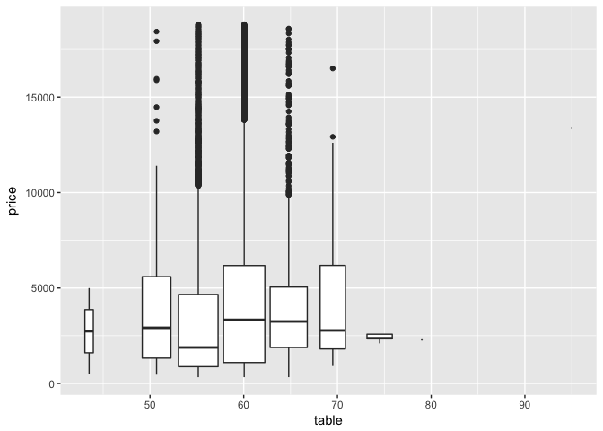

# Kazu_May24
Kazu  
5/3/2017  

# Prerequisites

# 7.3 Variation
# 7.3.1 Visualising distributions

```r
## categorical
ggplot(data = diamonds) +geom_bar(mapping = aes(x = cut))
```

<!-- -->

```r
diamonds %>% 
  count(cut)
```

```
## # A tibble: 5 × 2
##         cut     n
##       <ord> <int>
## 1      Fair  1610
## 2      Good  4906
## 3 Very Good 12082
## 4   Premium 13791
## 5     Ideal 21551
```

```r
## continuous
ggplot(data = diamonds) +
  geom_histogram(mapping = aes(x = carat), binwidth = 0.5)
```

<!-- -->

```r
diamonds %>% 
  count(cut_width(carat, 0.5))
```

```
## # A tibble: 11 × 2
##    `cut_width(carat, 0.5)`     n
##                     <fctr> <int>
## 1             [-0.25,0.25]   785
## 2              (0.25,0.75] 29498
## 3              (0.75,1.25] 15977
## 4              (1.25,1.75]  5313
## 5              (1.75,2.25]  2002
## 6              (2.25,2.75]   322
## 7              (2.75,3.25]    32
## 8              (3.25,3.75]     5
## 9              (3.75,4.25]     4
## 10             (4.25,4.75]     1
## 11             (4.75,5.25]     1
```

```r
## smaller
smaller <- diamonds %>% 
  filter(carat < 3)
  
ggplot(data = smaller, mapping = aes(x = carat)) +
  geom_histogram(binwidth = 0.1)
```

<!-- -->

```r
## overlay multiple histograms in the same plot. Use geom_freqpoly()
ggplot(data = smaller, mapping = aes(x = carat, colour = cut)) +
  geom_freqpoly(binwidth = 0.1)
```

<!-- -->
# 7.3.2 Typical values

```r
ggplot(data = smaller, mapping = aes(x = carat)) +
  geom_histogram(binwidth = 0.01)
```

<!-- -->

```r
ggplot(data = faithful, mapping = aes(x = eruptions)) + 
  geom_histogram(binwidth = 0.25)
```

<!-- -->
# 7.3.3 Unusual values

```r
ggplot(diamonds) + 
  geom_histogram(mapping = aes(x = y), binwidth = 0.5)
```

<!-- -->

```r
ggplot(diamonds) + 
  geom_histogram(mapping = aes(x = y), binwidth = 0.5) +
  coord_cartesian(ylim = c(0, 50))
```

<!-- -->

```r
?coord_cartesian() # useful
## find strange data
unusual <- diamonds %>% 
  filter(y < 3 | y > 20) %>% 
  select(price, x, y, z) %>%
  arrange(y)
unusual
```

```
## # A tibble: 9 × 4
##   price     x     y     z
##   <int> <dbl> <dbl> <dbl>
## 1  5139  0.00   0.0  0.00
## 2  6381  0.00   0.0  0.00
## 3 12800  0.00   0.0  0.00
## 4 15686  0.00   0.0  0.00
## 5 18034  0.00   0.0  0.00
## 6  2130  0.00   0.0  0.00
## 7  2130  0.00   0.0  0.00
## 8  2075  5.15  31.8  5.12
## 9 12210  8.09  58.9  8.06
```
# 7.3.4 Exercises

```r
#1. Explore the distribution of each of the x, y, and z variables in diamonds. What do you learn? Think about a diamond and how you might decide which dimension is the length, width, and depth.
summary(diamonds)
```

```
##      carat               cut        color        clarity     
##  Min.   :0.2000   Fair     : 1610   D: 6775   SI1    :13065  
##  1st Qu.:0.4000   Good     : 4906   E: 9797   VS2    :12258  
##  Median :0.7000   Very Good:12082   F: 9542   SI2    : 9194  
##  Mean   :0.7979   Premium  :13791   G:11292   VS1    : 8171  
##  3rd Qu.:1.0400   Ideal    :21551   H: 8304   VVS2   : 5066  
##  Max.   :5.0100                     I: 5422   VVS1   : 3655  
##                                     J: 2808   (Other): 2531  
##      depth           table           price             x         
##  Min.   :43.00   Min.   :43.00   Min.   :  326   Min.   : 0.000  
##  1st Qu.:61.00   1st Qu.:56.00   1st Qu.:  950   1st Qu.: 4.710  
##  Median :61.80   Median :57.00   Median : 2401   Median : 5.700  
##  Mean   :61.75   Mean   :57.46   Mean   : 3933   Mean   : 5.731  
##  3rd Qu.:62.50   3rd Qu.:59.00   3rd Qu.: 5324   3rd Qu.: 6.540  
##  Max.   :79.00   Max.   :95.00   Max.   :18823   Max.   :10.740  
##                                                                  
##        y                z         
##  Min.   : 0.000   Min.   : 0.000  
##  1st Qu.: 4.720   1st Qu.: 2.910  
##  Median : 5.710   Median : 3.530  
##  Mean   : 5.735   Mean   : 3.539  
##  3rd Qu.: 6.540   3rd Qu.: 4.040  
##  Max.   :58.900   Max.   :31.800  
## 
```

```r
ggplot(diamonds) + 
  geom_histogram(mapping = aes(x = x), binwidth = 0.5)
```

<!-- -->

```r
ggplot(diamonds) + 
  geom_histogram(mapping = aes(x = y), binwidth = 0.5)
```

<!-- -->

```r
ggplot(diamonds) + 
  geom_histogram(mapping = aes(x = z), binwidth = 0.5)
```

<!-- -->

```r
# x: height, y or z (length, width)


#2. Explore the distribution of price. Do you discover anything unusual or surprising? (Hint: Carefully think about the binwidth and make sure you try a wide range of values.)
summary(diamonds)
```

```
##      carat               cut        color        clarity     
##  Min.   :0.2000   Fair     : 1610   D: 6775   SI1    :13065  
##  1st Qu.:0.4000   Good     : 4906   E: 9797   VS2    :12258  
##  Median :0.7000   Very Good:12082   F: 9542   SI2    : 9194  
##  Mean   :0.7979   Premium  :13791   G:11292   VS1    : 8171  
##  3rd Qu.:1.0400   Ideal    :21551   H: 8304   VVS2   : 5066  
##  Max.   :5.0100                     I: 5422   VVS1   : 3655  
##                                     J: 2808   (Other): 2531  
##      depth           table           price             x         
##  Min.   :43.00   Min.   :43.00   Min.   :  326   Min.   : 0.000  
##  1st Qu.:61.00   1st Qu.:56.00   1st Qu.:  950   1st Qu.: 4.710  
##  Median :61.80   Median :57.00   Median : 2401   Median : 5.700  
##  Mean   :61.75   Mean   :57.46   Mean   : 3933   Mean   : 5.731  
##  3rd Qu.:62.50   3rd Qu.:59.00   3rd Qu.: 5324   3rd Qu.: 6.540  
##  Max.   :79.00   Max.   :95.00   Max.   :18823   Max.   :10.740  
##                                                                  
##        y                z         
##  Min.   : 0.000   Min.   : 0.000  
##  1st Qu.: 4.720   1st Qu.: 2.910  
##  Median : 5.710   Median : 3.530  
##  Mean   : 5.735   Mean   : 3.539  
##  3rd Qu.: 6.540   3rd Qu.: 4.040  
##  Max.   :58.900   Max.   :31.800  
## 
```

```r
ggplot(diamonds) + 
  geom_histogram(mapping = aes(x = price), binwidth = 100)
```

<!-- -->

```r
diamonds %>% filter(between(price,1400,1600)) %>%
    ggplot() + 
  geom_histogram(mapping = aes(x = price), binwidth = 10) 
```

<!-- -->

```r
# missing price between $1450 and $1550

#3. How many diamonds are 0.99 carat? How many are 1 carat? What do you think is the cause of the difference?
diamonds %>% filter(carat==0.99) %>% count() # 23
```

```
## # A tibble: 1 × 1
##       n
##   <int>
## 1    23
```

```r
diamonds %>% filter(carat==1) %>% count() # 1558
```

```
## # A tibble: 1 × 1
##       n
##   <int>
## 1  1558
```

```r
diamonds %>% filter(between(carat, 0.97,1.03)) %>% ggplot(mapping=aes(x=price,colour=factor(carat))) + geom_freqpoly() # ?
```

```
## `stat_bin()` using `bins = 30`. Pick better value with `binwidth`.
```

<!-- -->

```r
# because you can have higher prices above 0.99 carrat.
diamonds %>% filter(between(carat, 0.97,1.03)) %>% ggplot(mapping=aes(x=factor(carat), y=price)) + geom_violin()
```

<!-- -->

```r
#4. Compare and contrast coord_cartesian() vs xlim() or ylim() when zooming in on a histogram. What happens if you leave binwidth unset? What happens if you try and zoom so only half a bar shows?
# coord_cartesian(ylim = c(0, 20)). showing graph within ylim()
ggplot(diamonds) + 
  geom_histogram(mapping = aes(x = y), binwidth = 0.5) +
  coord_cartesian(ylim = c(0, 20))
```

<!-- -->

```r
# ylim(). Limit data within ylim range.
ggplot(diamonds) + 
  geom_histogram(mapping = aes(x = y), binwidth = 0.5) + 
  ylim(0, 20)
```

```
## Warning: Removed 11 rows containing missing values (geom_bar).
```

<!-- -->

```r
# coord_cartesian(ylim = c(0, 20)). showing graph within xlim()
ggplot(diamonds) + 
  geom_histogram(mapping = aes(x = y), binwidth = 0.5) +
  coord_cartesian(xlim = c(0, 10))
```

<!-- -->

```r
# xlim
ggplot(diamonds) + 
  geom_histogram(mapping = aes(x = y), binwidth = 0.5) + 
  xlim(0, 10) 
```

```
## Warning: Removed 5 rows containing non-finite values (stat_bin).
```

<!-- -->

```r
# If I leavce binwidth unse, ...
ggplot(diamonds) + 
  geom_histogram(mapping = aes(x = y)) +
  coord_cartesian(ylim = c(0, 20)) # `stat_bin()` using `bins = 30`. Pick better value with `binwidth`.
```

```
## `stat_bin()` using `bins = 30`. Pick better value with `binwidth`.
```

<!-- -->
# 7.4 Missing values

```r
# If you’ve encountered unusual values in your dataset, and simply want to move on to the rest of your analysis, you have two options.
#1.  Drop the entire row with the strange values:
diamonds2 <- diamonds %>% 
  filter(between(y, 3, 20))
#2. Instead, I recommend replacing the unusual values with missing values. The easiest way to do this is to use mutate() to replace the variable with a modified copy. You can use the ifelse() function to replace unusual values with NA:
diamonds2 <- diamonds %>% 
  mutate(y = ifelse(y < 3 | y > 20, NA, y)) 
?ifelse
ggplot(data = diamonds2, mapping = aes(x = x, y = y)) + 
  geom_point()
```

```
## Warning: Removed 9 rows containing missing values (geom_point).
```

<!-- -->

```r
ggplot(data = diamonds2, mapping = aes(x = x, y = y)) + 
  geom_point(na.rm = TRUE)
```

<!-- -->

```r
# 
nycflights13::flights %>% 
  mutate(
    cancelled = is.na(dep_time),
    sched_hour = sched_dep_time %/% 100,
    sched_min = sched_dep_time %% 100,
    sched_dep_time = sched_hour + sched_min / 60
  ) %>% 
  ggplot(mapping = aes(sched_dep_time)) + 
    geom_freqpoly(mapping = aes(colour = cancelled), binwidth = 1/4)
```

<!-- -->
# 7.4.1 Exercises

```r
#1. What happens to missing values in a histogram? What happens to missing values in a bar chart? Why is there a difference?
flights.s<-nycflights13::flights %>% 
mutate(
    cancelled = is.na(dep_time),
    sched_hour = sched_dep_time %/% 100,
    sched_min = sched_dep_time %% 100,
    sched_dep_time = sched_hour + sched_min / 60
  )
ggplot(data=flights.s,aes(x=dep_time,fill=dest)) + geom_histogram(binwidth=100) + theme(legend.position = "none") # Warning message: Removed 8255 rows containing non-finite values (stat_bin). 
```

```
## Warning: Removed 8255 rows containing non-finite values (stat_bin).
```

<!-- -->

```r
ggplot(data=flights.s,aes(x=dep_time,fill=dest)) + geom_bar() + theme(legend.position = "none")  # Warning message: Removed 8255 rows containing non-finite values (stat_count). 
```

```
## Warning: Removed 8255 rows containing non-finite values (stat_count).
```

<!-- -->

```r
#2. What does na.rm = TRUE do in mean() and sum()?
flights.s %>% group_by(dest) %>% summarise(delay.na.rm = mean(dep_delay, na.rm = TRUE),delay = mean(dep_delay, na.rm = FALSE),count.na=sum(is.na(dep_time))) # na.rm = TRUE is necesary to calculate mean 
```

```
## # A tibble: 105 × 4
##     dest delay.na.rm     delay count.na
##    <chr>       <dbl>     <dbl>    <int>
## 1    ABQ   13.740157 13.740157        0
## 2    ACK    6.456604  6.456604        0
## 3    ALB   23.620525        NA       20
## 4    ANC   12.875000 12.875000        0
## 5    ATL   12.509824        NA      317
## 6    AUS   13.025641        NA       21
## 7    AVL    8.190114        NA       12
## 8    BDL   17.720874        NA       31
## 9    BGR   19.475000        NA       15
## 10   BHM   29.694853        NA       25
## # ... with 95 more rows
```

```r
flights.s %>% group_by(dest) %>% summarise(delay.na.rm = sum(dep_delay, na.rm = TRUE),delay = sum(dep_delay, na.rm = FALSE),count.na=sum(is.na(dep_time))) # na.rm = TRUE is not necesary to calculate mean 
```

```
## # A tibble: 105 × 4
##     dest delay.na.rm delay count.na
##    <chr>       <dbl> <dbl>    <int>
## 1    ABQ        3490  3490        0
## 2    ACK        1711  1711        0
## 3    ALB        9897    NA       20
## 4    ANC         103   103        0
## 5    ATL      211391    NA      317
## 6    AUS       31496    NA       21
## 7    AVL        2154    NA       12
## 8    BDL        7301    NA       31
## 9    BGR        7011    NA       15
## 10   BHM        8077    NA       25
## # ... with 95 more rows
```
# 7.5 Covariation
# 7.5.1 A categorical and continuous variable

```r
ggplot(data = diamonds, mapping = aes(x = price)) + 
  geom_freqpoly(mapping = aes(colour = cut), binwidth = 500)
```

<!-- -->

```r
ggplot(diamonds) + 
  geom_bar(mapping = aes(x = cut))
```

<!-- -->

```r
ggplot(data = diamonds, mapping = aes(x = price, y = ..density..)) + 
  geom_freqpoly(mapping = aes(colour = cut), binwidth = 500)
```

<!-- -->

```r
ggplot(data = diamonds, mapping = aes(x = cut, y = price)) +
  geom_boxplot()
```

<!-- -->

```r
ggplot(data = mpg, mapping = aes(x = class, y = hwy)) +
  geom_boxplot()
```

<!-- -->

```r
#To make the trend easier to see, we can reorder class based on the median value of hwy:
ggplot(data = mpg) +
  geom_boxplot(mapping = aes(x = reorder(class, hwy, FUN = median), y = hwy))
```

<!-- -->

```r
# flip
ggplot(data = mpg) +
  geom_boxplot(mapping = aes(x = reorder(class, hwy, FUN = median), y = hwy)) +
  coord_flip()
```

<!-- -->
# 7.5.1.1 Exercises

```r
#1. Use what you’ve learned to improve the visualisation of the departure times of cancelled vs. non-cancelled flights.
## I assumed that this is talking about scheduled departure times
flights %>% mutate(cancelled=is.na(dep_time)) %>% group_by(sched_dep_time) %>% summarise(count.na=sum(is.na(dep_time)),prop.cancel=count.na/n()*100) %>%  ggplot(aes(x=sched_dep_time,y=prop.cancel)) + geom_boxplot(aes(group = cut_width(sched_dep_time, 30))) + coord_cartesian(ylim = c(0, 60))
```

<!-- -->

```r
#2. What variable in the diamonds dataset is most important for predicting the price of a diamond? How is that variable correlated with cut? Why does the combination of those two relationships lead to lower quality diamonds being more expensive?
ggplot(diamonds,aes(x=carat,y=price)) + geom_point()
```

<!-- -->

```r
ggplot(diamonds,aes(x=cut,y=price)) + geom_boxplot()
```

<!-- -->

```r
ggplot(diamonds) + geom_boxplot(aes(x=reorder(color,price, FUN = median),y=price))
```

<!-- -->

```r
ggplot(diamonds,aes(x=depth,y=price)) + geom_boxplot(aes(group=cut_width(depth,5))) # why width are not equal?
```

<!-- -->

```r
ggplot(diamonds,aes(x=table,y=price)) + geom_boxplot(aes(group=cut_width(table,5)))
```

<!-- -->

```r
#3. Install the ggstance package, and create a horizontal boxplot. How does this compare to using coord_flip()?
#install.packages("ggstance")
library(ggstance)
```

```
## 
## Attaching package: 'ggstance'
```

```
## The following objects are masked from 'package:ggplot2':
## 
##     geom_errorbarh, GeomErrorbarh
```

```r
ggplot(diamonds,aes(x=table,y=price)) + geom_boxploth(aes(group=cut_width(table,5))) #?
```

```
## Warning: position_dodgev requires non-overlapping y intervals
```

<!-- -->

```r
#4. One problem with boxplots is that they were developed in an era of much smaller datasets and tend to display a prohibitively large number of “outlying values”. One approach to remedy this problem is the letter value plot. Install the lvplot package, and try using geom_lv() to display the distribution of price vs cut. What do you learn? How do you interpret the plots?
#install.packages("lvplot")
#library(lvplot)
# ?geom_lv
#p <- ggplot(mpg, aes(class, hwy))
#p + geom_lv(aes(fill=..LV..)) + scale_fill_brewer()
# Error: GeomLv was built with an incompatible version of ggproto.
# Please reinstall the package that provides this extension.
# solution?


#5. Compare and contrast geom_violin() with a facetted geom_histogram(), or a coloured geom_freqpoly(). What are the pros and cons of each method?
ggplot(diamonds) + geom_violin(aes(x=reorder(color,price, FUN = median),y=price))
```

<!-- -->

```r
ggplot(diamonds, aes(x=price)) + geom_histogram(binwidth=100) + facet_grid(.~reorder(color,price,FUN=median),scale="free") + coord_flip()
```

<!-- -->

```r
ggplot(diamonds, aes(x=price,color=color)) + geom_freqpoly(binwidth=100) + coord_flip()
```

<!-- -->

```r
#6. If you have a small dataset, it’s sometimes useful to use geom_jitter() to see the relationship between a continuous and categorical variable. The ggbeeswarm package provides a number of methods similar to geom_jitter(). List them and briefly describe what each one does.
#install.packages("ggbeeswarm")
library(ggbeeswarm)
```
# 7.5.2 Two categorical variables

```r
ggplot(data = diamonds) +
  geom_count(mapping = aes(x = cut, y = color))
```

<!-- -->

```r
diamonds %>% 
  count(color, cut)
```

```
## Source: local data frame [35 x 3]
## Groups: color [?]
## 
##    color       cut     n
##    <ord>     <ord> <int>
## 1      D      Fair   163
## 2      D      Good   662
## 3      D Very Good  1513
## 4      D   Premium  1603
## 5      D     Ideal  2834
## 6      E      Fair   224
## 7      E      Good   933
## 8      E Very Good  2400
## 9      E   Premium  2337
## 10     E     Ideal  3903
## # ... with 25 more rows
```

```r
# geom_tile
diamonds %>% 
  count(color, cut) %>%  
  ggplot(mapping = aes(x = color, y = cut)) +
    geom_tile(mapping = aes(fill = n))
```

<!-- -->
# 7.5.2.1 Exercises

```r
#1. How could you rescale the count dataset above to more clearly show the distribution of cut within colour, or colour within cut?
diamonds %>%
  ggplot(mapping=aes(x=cut)) + geom_bar() + facet_grid(color~., scale="free")
```

<!-- -->

```r
diamonds %>%
  ggplot(mapping=aes(x=color)) + geom_bar() + facet_grid(cut~., scale="free")
```

<!-- -->

```r
#2. Use geom_tile() together with dplyr to explore how average flight delays vary by destination and month of year. What makes the plot difficult to read? How could you improve it?
average.delay.month.summary<-flights %>% group_by(dest,month) %>% summarise(av.flight.delay=mean(dep_delay,na.rm=T)) %>% filter(!is.na(av.flight.delay))
average.delay.month.summary
```

```
## Source: local data frame [1,112 x 3]
## Groups: dest [104]
## 
##     dest month av.flight.delay
##    <chr> <int>           <dbl>
## 1    ABQ     4        2.666667
## 2    ABQ     5       11.645161
## 3    ABQ     6       15.466667
## 4    ABQ     7       24.258065
## 5    ABQ     8       15.903226
## 6    ABQ     9       19.166667
## 7    ABQ    10        4.322581
## 8    ABQ    11       -2.200000
## 9    ABQ    12       24.290323
## 10   ACK     5        9.047619
## # ... with 1,102 more rows
```

```r
ggplot(average.delay.month.summary, aes(x=factor(month),y=dest)) + geom_tile(mapping=aes(fill=av.flight.delay)) # T_SHOW_BACKTRACE environmental variable.
```

<!-- -->

```r
#3. Why is it slightly better to use aes(x = color, y = cut) rather than aes(x = cut, y = color) in the example above?
```
# 7.5.3.1 Exercises

```r
#1. Instead of summarising the conditional distribution with a boxplot, you could use a frequency polygon. What do you need to consider when using cut_width() vs cut_number()? How does that impact a visualisation of the 2d distribution of carat and price?

#2. Visualise the distribution of carat, partitioned by price.

#3. How does the price distribution of very large diamonds compare to small diamonds. Is it as you expect, or does it surprise you?

#4. Combine two of the techniques you’ve learned to visualise the combined distribution of cut, carat, and price.

#5. Two dimensional plots reveal outliers that are not visible in one dimensional plots. For example, some points in the plot below have an unusual combination of x and y values, which makes the points outliers even though their x and y values appear normal when examined separately.

ggplot(data = diamonds) +
  geom_point(mapping = aes(x = x, y = y)) +
  coord_cartesian(xlim = c(4, 11), ylim = c(4, 11))
```

<!-- -->

```r
# Why is a scatterplot a better display than a binned plot for this case?
```
