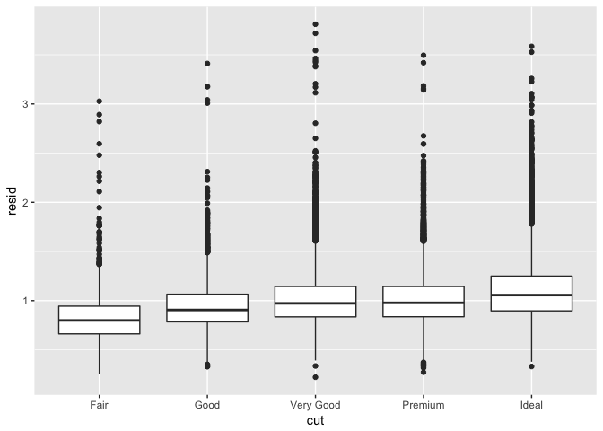
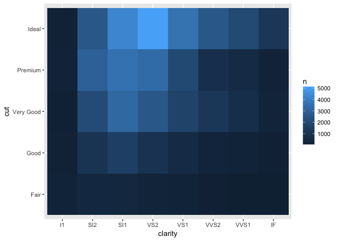
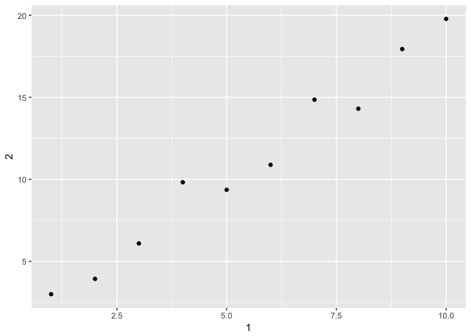

# Kazu_May31
Kazu  
5/31/2017  

# Prerequisites

# 7.6. Patterns and models

```r
ggplot(data = faithful) + 
  geom_point(mapping = aes(x = eruptions, y = waiting))
```

<!-- -->

```r
#
library(modelr)

mod <- lm(log(price) ~ log(carat), data = diamonds)

diamonds2 <- diamonds %>% 
  add_residuals(mod) %>% 
  mutate(resid = exp(resid))
# 
?add_residuals

ggplot(data = diamonds2) + 
  geom_point(mapping = aes(x = carat, y = resid))
```

<!-- -->

```r
# Once you’ve removed the strong relationship between carat and price, you can see what you expect in the relationship between cut and price: relative to their size, better quality diamonds are more expensive.
ggplot(data = diamonds2) + 
  geom_boxplot(mapping = aes(x = cut, y = resid))
```

<!-- -->
# 7.7 ggplot2 calls

```r
ggplot(data = faithful, mapping = aes(x = eruptions)) + 
  geom_freqpoly(binwidth = 0.25)
```

<!-- -->

```r
# concise version
diamonds %>% 
  count(cut, clarity) %>% 
  ggplot(aes(clarity, cut, fill = n)) + 
    geom_tile()
```

<!-- -->
# 8 Workflow: projects
# 8.1 What is real?
# 8.2 Where does your analysis live?


```r
## I do not recommend it, but you can also set the working directory from within R:
# setwd("/path/to/my/CoolProject")
# 8.3 Paths and directories
# 8.4 RStudio projects
```
# 10 Tibbles
# 10.1 Introduction
# 10.1.1 Prerequisites
# 10.2 Creating tibbles

```r
as_tibble(iris)
```

```
## # A tibble: 150 × 5
##    Sepal.Length Sepal.Width Petal.Length Petal.Width Species
##           <dbl>       <dbl>        <dbl>       <dbl>  <fctr>
## 1           5.1         3.5          1.4         0.2  setosa
## 2           4.9         3.0          1.4         0.2  setosa
## 3           4.7         3.2          1.3         0.2  setosa
## 4           4.6         3.1          1.5         0.2  setosa
## 5           5.0         3.6          1.4         0.2  setosa
## 6           5.4         3.9          1.7         0.4  setosa
## 7           4.6         3.4          1.4         0.3  setosa
## 8           5.0         3.4          1.5         0.2  setosa
## 9           4.4         2.9          1.4         0.2  setosa
## 10          4.9         3.1          1.5         0.1  setosa
## # ... with 140 more rows
```

```r
tb <- tibble(
  `:)` = "smile", 
  ` ` = "space",
  `2000` = "number"
)
tb
```

```
## # A tibble: 1 × 3
##    `:)`   ` ` `2000`
##   <chr> <chr>  <chr>
## 1 smile space number
```

```r
# tribble
tribble(
  ~x, ~y, ~z,
  #--|--|----
  "a", 2, 3.6,
  "b", 1, 8.5
)
```

```
## # A tibble: 2 × 3
##       x     y     z
##   <chr> <dbl> <dbl>
## 1     a     2   3.6
## 2     b     1   8.5
```

```r
#> # A tibble: 2 × 3
#>       x     y     z
#>   <chr> <dbl> <dbl>
#> 1     a     2   3.6
#> 2     b     1   8.5
```
# 10.3 Tibbles vs. data.frame
## 10.3.1 Printing

```r
tibble(
  a = lubridate::now() + runif(1e3) * 86400,
  b = lubridate::today() + runif(1e3) * 30,
  c = 1:1e3,
  d = runif(1e3),
  e = sample(letters, 1e3, replace = TRUE)
)
```

```
## # A tibble: 1,000 × 5
##                      a          b     c          d     e
##                 <dttm>     <date> <int>      <dbl> <chr>
## 1  2017-06-01 00:43:32 2017-06-14     1 0.03371285     u
## 2  2017-05-31 23:44:53 2017-06-02     2 0.12559413     a
## 3  2017-06-01 04:15:35 2017-06-09     3 0.29327546     i
## 4  2017-05-31 20:29:04 2017-06-19     4 0.23946122     d
## 5  2017-06-01 04:19:40 2017-06-26     5 0.82501419     j
## 6  2017-06-01 03:17:05 2017-06-09     6 0.40072332     a
## 7  2017-06-01 14:13:57 2017-06-25     7 0.23340123     q
## 8  2017-06-01 01:45:16 2017-06-05     8 0.23007574     r
## 9  2017-06-01 07:03:59 2017-06-14     9 0.75816889     d
## 10 2017-06-01 09:22:09 2017-06-24    10 0.82717117     a
## # ... with 990 more rows
```

```r
# Tibbles are designed so that you don’t accidentally overwhelm your console when you print large data frames. But sometimes you need more output than the default display. There are a few options that can help.
nycflights13::flights %>% 
  print(n = 10, width = Inf)
```

```
## # A tibble: 336,776 × 19
##     year month   day dep_time sched_dep_time dep_delay arr_time
##    <int> <int> <int>    <int>          <int>     <dbl>    <int>
## 1   2013     1     1      517            515         2      830
## 2   2013     1     1      533            529         4      850
## 3   2013     1     1      542            540         2      923
## 4   2013     1     1      544            545        -1     1004
## 5   2013     1     1      554            600        -6      812
## 6   2013     1     1      554            558        -4      740
## 7   2013     1     1      555            600        -5      913
## 8   2013     1     1      557            600        -3      709
## 9   2013     1     1      557            600        -3      838
## 10  2013     1     1      558            600        -2      753
##    sched_arr_time arr_delay carrier flight tailnum origin  dest air_time
##             <int>     <dbl>   <chr>  <int>   <chr>  <chr> <chr>    <dbl>
## 1             819        11      UA   1545  N14228    EWR   IAH      227
## 2             830        20      UA   1714  N24211    LGA   IAH      227
## 3             850        33      AA   1141  N619AA    JFK   MIA      160
## 4            1022       -18      B6    725  N804JB    JFK   BQN      183
## 5             837       -25      DL    461  N668DN    LGA   ATL      116
## 6             728        12      UA   1696  N39463    EWR   ORD      150
## 7             854        19      B6    507  N516JB    EWR   FLL      158
## 8             723       -14      EV   5708  N829AS    LGA   IAD       53
## 9             846        -8      B6     79  N593JB    JFK   MCO      140
## 10            745         8      AA    301  N3ALAA    LGA   ORD      138
##    distance  hour minute           time_hour
##       <dbl> <dbl>  <dbl>              <dttm>
## 1      1400     5     15 2013-01-01 05:00:00
## 2      1416     5     29 2013-01-01 05:00:00
## 3      1089     5     40 2013-01-01 05:00:00
## 4      1576     5     45 2013-01-01 05:00:00
## 5       762     6      0 2013-01-01 06:00:00
## 6       719     5     58 2013-01-01 05:00:00
## 7      1065     6      0 2013-01-01 06:00:00
## 8       229     6      0 2013-01-01 06:00:00
## 9       944     6      0 2013-01-01 06:00:00
## 10      733     6      0 2013-01-01 06:00:00
## # ... with 3.368e+05 more rows
```

```r
#nycflights13::flights %>% 
#  View()
```
## 10.3.2 Subsetting

```r
df <- tibble(
  x = runif(5),
  y = rnorm(5)
)
# Extract by name
df$x
```

```
## [1] 0.9783214 0.5506387 0.7550126 0.4479593 0.7200846
```

```r
#> [1] 0.434 0.395 0.548 0.762 0.254
df[["x"]]
```

```
## [1] 0.9783214 0.5506387 0.7550126 0.4479593 0.7200846
```

```r
#> [1] 0.434 0.395 0.548 0.762 0.254
# Extract by position
df[[1]]
```

```
## [1] 0.9783214 0.5506387 0.7550126 0.4479593 0.7200846
```

```r
## To use these in a pipe, you’ll need to use the special placeholder .:
df %>% .$x
```

```
## [1] 0.9783214 0.5506387 0.7550126 0.4479593 0.7200846
```

```r
#> [1] 0.434 0.395 0.548 0.762 0.254
df %>% .[["x"]]
```

```
## [1] 0.9783214 0.5506387 0.7550126 0.4479593 0.7200846
```
# 10.4 Interacting with older code

```r
#Some older functions don’t work with tibbles. If you encounter one of these functions, use as.data.frame() to turn a tibble back to a data.frame:
class(as.data.frame(tb))
```

```
## [1] "data.frame"
```

```r
#> [1] "data.frame"
```
# 10.5 Exercises

```r
#1. How can you tell if an object is a tibble? (Hint: try printing mtcars, which is a regular data frame).
class(mtcars)
```

```
## [1] "data.frame"
```

```r
tib.mtcars<-as.tibble(mtcars)
tib.mtcars2<-as_tibble(mtcars)
class(tib.mtcars)
```

```
## [1] "tbl_df"     "tbl"        "data.frame"
```

```r
class(tib.mtcars2) # same
```

```
## [1] "tbl_df"     "tbl"        "data.frame"
```

```r
tib.mtcars
```

```
## # A tibble: 32 × 11
##      mpg   cyl  disp    hp  drat    wt  qsec    vs    am  gear  carb
## *  <dbl> <dbl> <dbl> <dbl> <dbl> <dbl> <dbl> <dbl> <dbl> <dbl> <dbl>
## 1   21.0     6 160.0   110  3.90 2.620 16.46     0     1     4     4
## 2   21.0     6 160.0   110  3.90 2.875 17.02     0     1     4     4
## 3   22.8     4 108.0    93  3.85 2.320 18.61     1     1     4     1
## 4   21.4     6 258.0   110  3.08 3.215 19.44     1     0     3     1
## 5   18.7     8 360.0   175  3.15 3.440 17.02     0     0     3     2
## 6   18.1     6 225.0   105  2.76 3.460 20.22     1     0     3     1
## 7   14.3     8 360.0   245  3.21 3.570 15.84     0     0     3     4
## 8   24.4     4 146.7    62  3.69 3.190 20.00     1     0     4     2
## 9   22.8     4 140.8    95  3.92 3.150 22.90     1     0     4     2
## 10  19.2     6 167.6   123  3.92 3.440 18.30     1     0     4     4
## # ... with 22 more rows
```

```r
#2. Compare and contrast the following operations on a data.frame and equivalent tibble. What is different? Why might the default data frame behaviours cause you frustration?

df <- data.frame(abc = 1, xyz = "a")
df$x #  
```

```
## [1] a
## Levels: a
```

```r
df[, "xyz"]
```

```
## [1] a
## Levels: a
```

```r
#df[, c("abc", "xyz")]
## tibble version
tb.10.5<-tibble(abc = 1, xyz = "a")
#tb.10.5$x
# NULL
# Warning message:
# Unknown or uninitialised column: 'x'. 
tb.10.5[,"xyz"]
```

```
## # A tibble: 1 × 1
##     xyz
##   <chr>
## 1     a
```

```r
select(tb.10.5, xyz)
```

```
## # A tibble: 1 × 1
##     xyz
##   <chr>
## 1     a
```

```r
tb.10.5[,c("abc","xyz")] # same as data.frame
```

```
## # A tibble: 1 × 2
##     abc   xyz
##   <dbl> <chr>
## 1     1     a
```

```r
#tb.10.5[["abc","xyz"]];tb.10.5[[c("abc","xyz")]] # does not work. "Error in .subset2(x, i, exact = exact) : subscript out of bounds"
select(tb.10.5, abc,xyz)
```

```
## # A tibble: 1 × 2
##     abc   xyz
##   <dbl> <chr>
## 1     1     a
```

```r
#3. If you have the name of a variable stored in an object, e.g. var <- "mpg", how can you extract the reference variable from a tibble?
var<-"mpg"
var.tb<-tibble(var2=var)
var.tb
```

```
## # A tibble: 1 × 1
##    var2
##   <chr>
## 1   mpg
```

```r
var.tb[["var2"]]
```

```
## [1] "mpg"
```

```r
select(var.tb, var2) # is this what is wanted?
```

```
## # A tibble: 1 × 1
##    var2
##   <chr>
## 1   mpg
```

```r
#4. Practice referring to non-syntactic names in the following data frame by:
annoying <- tibble(
  `1` = 1:10,
  `2` = `1` * 2 + rnorm(length(`1`))
)
## Extracting the variable called 1.
annoying %>% select(1)
```

```
## # A tibble: 10 × 1
##      `1`
##    <int>
## 1      1
## 2      2
## 3      3
## 4      4
## 5      5
## 6      6
## 7      7
## 8      8
## 9      9
## 10    10
```

```r
# or
annoying[["1"]]
```

```
##  [1]  1  2  3  4  5  6  7  8  9 10
```

```r
## Plotting a scatterplot of 1 vs 2.
annoying %>% ggplot(aes(x=`1`,y=`2`)) + geom_point()
```

<!-- -->

```r
## Creating a new column called 3 which is 2 divided by 1.
annoying2<-mutate(annoying,`3`=`2`/`1`)
## Renaming the columns to one, two and three.
colnames(annoying2)<-c("one","two","three")
annoying2
```

```
## # A tibble: 10 × 3
##      one       two    three
##    <int>     <dbl>    <dbl>
## 1      1  2.102631 2.102631
## 2      2  3.439841 1.719921
## 3      3  6.606728 2.202243
## 4      4  8.497952 2.124488
## 5      5  8.152574 1.630515
## 6      6 12.624177 2.104030
## 7      7 14.257869 2.036838
## 8      8 15.566958 1.945870
## 9      9 18.843013 2.093668
## 10    10 20.102333 2.010233
```

```r
## or
rename
```

```
## function (.data, ...) 
## {
##     rename_(.data, .dots = lazyeval::lazy_dots(...))
## }
## <environment: namespace:dplyr>
```

```r
#5. What does tibble::enframe() do? When might you use it?
?enframe
enframe(1:3)
```

```
## # A tibble: 3 × 2
##    name value
##   <int> <int>
## 1     1     1
## 2     2     2
## 3     3     3
```

```r
enframe(c(a = 5, b = 7))
```

```
## # A tibble: 2 × 2
##    name value
##   <chr> <dbl>
## 1     a     5
## 2     b     7
```

```r
# Usefule to convert vetor into tibble with its names
gene<-c(0.1,0.5)
names(gene)<-c("AT1g0001","AT1g0002")
gene
```

```
## AT1g0001 AT1g0002 
##      0.1      0.5
```

```r
enframe(gene) 
```

```
## # A tibble: 2 × 2
##       name value
##      <chr> <dbl>
## 1 AT1g0001   0.1
## 2 AT1g0002   0.5
```

```r
#6. What option controls how many additional column names are printed at the footer of a tibble?
?tibble::tibble
?print
flights
```

```
## # A tibble: 336,776 × 19
##     year month   day dep_time sched_dep_time dep_delay arr_time
##    <int> <int> <int>    <int>          <int>     <dbl>    <int>
## 1   2013     1     1      517            515         2      830
## 2   2013     1     1      533            529         4      850
## 3   2013     1     1      542            540         2      923
## 4   2013     1     1      544            545        -1     1004
## 5   2013     1     1      554            600        -6      812
## 6   2013     1     1      554            558        -4      740
## 7   2013     1     1      555            600        -5      913
## 8   2013     1     1      557            600        -3      709
## 9   2013     1     1      557            600        -3      838
## 10  2013     1     1      558            600        -2      753
## # ... with 336,766 more rows, and 12 more variables: sched_arr_time <int>,
## #   arr_delay <dbl>, carrier <chr>, flight <int>, tailnum <chr>,
## #   origin <chr>, dest <chr>, air_time <dbl>, distance <dbl>, hour <dbl>,
## #   minute <dbl>, time_hour <dttm>
```

```r
print(flights,n = 10, width = Inf)
```

```
## # A tibble: 336,776 × 19
##     year month   day dep_time sched_dep_time dep_delay arr_time
##    <int> <int> <int>    <int>          <int>     <dbl>    <int>
## 1   2013     1     1      517            515         2      830
## 2   2013     1     1      533            529         4      850
## 3   2013     1     1      542            540         2      923
## 4   2013     1     1      544            545        -1     1004
## 5   2013     1     1      554            600        -6      812
## 6   2013     1     1      554            558        -4      740
## 7   2013     1     1      555            600        -5      913
## 8   2013     1     1      557            600        -3      709
## 9   2013     1     1      557            600        -3      838
## 10  2013     1     1      558            600        -2      753
##    sched_arr_time arr_delay carrier flight tailnum origin  dest air_time
##             <int>     <dbl>   <chr>  <int>   <chr>  <chr> <chr>    <dbl>
## 1             819        11      UA   1545  N14228    EWR   IAH      227
## 2             830        20      UA   1714  N24211    LGA   IAH      227
## 3             850        33      AA   1141  N619AA    JFK   MIA      160
## 4            1022       -18      B6    725  N804JB    JFK   BQN      183
## 5             837       -25      DL    461  N668DN    LGA   ATL      116
## 6             728        12      UA   1696  N39463    EWR   ORD      150
## 7             854        19      B6    507  N516JB    EWR   FLL      158
## 8             723       -14      EV   5708  N829AS    LGA   IAD       53
## 9             846        -8      B6     79  N593JB    JFK   MCO      140
## 10            745         8      AA    301  N3ALAA    LGA   ORD      138
##    distance  hour minute           time_hour
##       <dbl> <dbl>  <dbl>              <dttm>
## 1      1400     5     15 2013-01-01 05:00:00
## 2      1416     5     29 2013-01-01 05:00:00
## 3      1089     5     40 2013-01-01 05:00:00
## 4      1576     5     45 2013-01-01 05:00:00
## 5       762     6      0 2013-01-01 06:00:00
## 6       719     5     58 2013-01-01 05:00:00
## 7      1065     6      0 2013-01-01 06:00:00
## 8       229     6      0 2013-01-01 06:00:00
## 9       944     6      0 2013-01-01 06:00:00
## 10      733     6      0 2013-01-01 06:00:00
## # ... with 3.368e+05 more rows
```

```r
?print.tbl_df 
print(flights)
```

```
## # A tibble: 336,776 × 19
##     year month   day dep_time sched_dep_time dep_delay arr_time
##    <int> <int> <int>    <int>          <int>     <dbl>    <int>
## 1   2013     1     1      517            515         2      830
## 2   2013     1     1      533            529         4      850
## 3   2013     1     1      542            540         2      923
## 4   2013     1     1      544            545        -1     1004
## 5   2013     1     1      554            600        -6      812
## 6   2013     1     1      554            558        -4      740
## 7   2013     1     1      555            600        -5      913
## 8   2013     1     1      557            600        -3      709
## 9   2013     1     1      557            600        -3      838
## 10  2013     1     1      558            600        -2      753
## # ... with 336,766 more rows, and 12 more variables: sched_arr_time <int>,
## #   arr_delay <dbl>, carrier <chr>, flight <int>, tailnum <chr>,
## #   origin <chr>, dest <chr>, air_time <dbl>, distance <dbl>, hour <dbl>,
## #   minute <dbl>, time_hour <dttm>
```

```r
print(flights, n_extra = 2) # does not work why?
```

```
## # A tibble: 336,776 × 19
##     year month   day dep_time sched_dep_time dep_delay arr_time
##    <int> <int> <int>    <int>          <int>     <dbl>    <int>
## 1   2013     1     1      517            515         2      830
## 2   2013     1     1      533            529         4      850
## 3   2013     1     1      542            540         2      923
## 4   2013     1     1      544            545        -1     1004
## 5   2013     1     1      554            600        -6      812
## 6   2013     1     1      554            558        -4      740
## 7   2013     1     1      555            600        -5      913
## 8   2013     1     1      557            600        -3      709
## 9   2013     1     1      557            600        -3      838
## 10  2013     1     1      558            600        -2      753
## # ... with 336,766 more rows, and 12 more variables: sched_arr_time <int>,
## #   arr_delay <dbl>, ...
```
