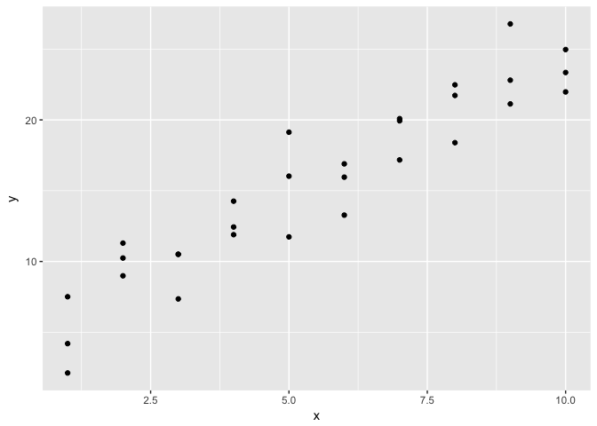
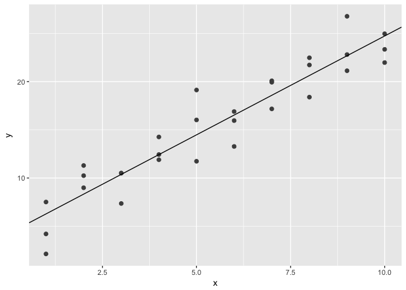

# Kazu_R-club_Aug30
Kazu  
9/20/2017  


# 22 Introduction

# 23 Model basics
## 23.1 Introduction
# 23.1.2 A simple model

```r
ggplot(sim1, aes(x, y)) + 
  geom_point()
```

<!-- -->

```r
#
models <- tibble(
  a1 = runif(250, -20, 40),
  a2 = runif(250, -5, 5)
)

ggplot(sim1, aes(x, y)) + 
  geom_abline(aes(intercept = a1, slope = a2), data = models, alpha = 1/4) +
  geom_point() 
```

<!-- -->

```r
#
model1 <- function(a, data) {
  a[1] + data$x * a[2]
}
model1(c(7, 1.5), sim1)
```

```
##  [1]  8.5  8.5  8.5 10.0 10.0 10.0 11.5 11.5 11.5 13.0 13.0 13.0 14.5 14.5
## [15] 14.5 16.0 16.0 16.0 17.5 17.5 17.5 19.0 19.0 19.0 20.5 20.5 20.5 22.0
## [29] 22.0 22.0
```

```r
#
measure_distance <- function(mod, data) {
  diff <- data$y - model1(mod, data)
  sqrt(mean(diff ^ 2))
}
#
ggplot(models, aes(a1, a2)) +
  geom_point(data = filter(models, rank(dist) <= 10), size = 4, colour = "red") +
  geom_point(aes(colour = -dist))
```

```
## Warning in is.na(x): is.na() applied to non-(list or vector) of type
## 'closure'
```

```
## Error in eval(expr, envir, enclos): object of type 'closure' is not subsettable
```

```r
# Instead of trying lots of random models, we could be more systematic and generate an evenly spaced grid of points (this is called a grid search). I picked the parameters of the grid roughly by looking at where the best models were in the plot above.
grid <- expand.grid(
  a1 = seq(-5, 20, length = 25),
  a2 = seq(1, 3, length = 25)
  ) %>% 
  mutate(dist = purrr::map2_dbl(a1, a2, sim1_dist))
```

```
## Error in eval(expr, envir, enclos): object 'sim1_dist' not found
```

```r
grid %>% 
  ggplot(aes(a1, a2)) +
  geom_point(data = filter(grid, rank(dist) <= 10), size = 4, colour = "red") +
  geom_point(aes(colour = -dist)) 
```

```
## Error in UseMethod("filter_"): no applicable method for 'filter_' applied to an object of class "function"
```

```r
sim1_dist <- function(a1, a2) {
  measure_distance(c(a1, a2), sim1)
}

models <- models %>% 
  mutate(dist = purrr::map2_dbl(a1, a2, sim1_dist))
models
```

```
## # A tibble: 250 × 3
##            a1         a2      dist
##         <dbl>      <dbl>     <dbl>
## 1   10.013353  4.0611381 17.933572
## 2    9.738681  3.0520814 11.586539
## 3   21.085996 -1.3067653 10.007575
## 4   25.657001  2.6381874 24.811713
## 5   13.665190 -0.6670105  9.789509
## 6  -19.306859 -2.2811124 49.011264
## 7   17.574218 -0.9382959  9.371699
## 8  -14.228985 -4.2087107 55.895150
## 9   33.291173 -2.0506545 13.627836
## 10  -2.431964  4.4161501  9.540123
## # ... with 240 more rows
```

```r
#
ggplot(sim1, aes(x, y)) + 
  geom_point(size = 2, colour = "grey30") + 
  geom_abline(
    aes(intercept = a1, slope = a2, colour = -dist), 
    data = filter(models, rank(dist) <= 10)
  )
```

<!-- -->

```r
measure_distance(c(7, 1.5), sim1)
```

```
## [1] 2.665212
```

```r
#
ggplot(sim1, aes(x, y)) + 
  geom_point(size = 2, colour = "grey30") + 
  geom_abline(
    aes(intercept = a1, slope = a2, colour = -dist), 
    data = filter(grid, rank(dist) <= 10)
  )
```

```
## Error in UseMethod("filter_"): no applicable method for 'filter_' applied to an object of class "function"
```

```r
#
best <- optim(c(0, 0), measure_distance, data = sim1)
best$par
```

```
## [1] 4.222248 2.051204
```

```r
#> [1] 4.22 2.05

ggplot(sim1, aes(x, y)) + 
  geom_point(size = 2, colour = "grey30") + 
  geom_abline(intercept = best$par[1], slope = best$par[2])
```

<!-- -->

```r
# 
sim1_mod <- lm(y ~ x, data = sim1)
coef(sim1_mod)
```

```
## (Intercept)           x 
##    4.220822    2.051533
```
# 23.2.1 Exercises

```r
#1. One downside of the linear model is that it is sensitive to unusual values because the distance incorporates a squared term. Fit a linear model to the simulated data below, and visualise the results. Rerun a few times to generate different simulated datasets. What do you notice about the model?
sim1a <- tibble(
  x = rep(1:10, each = 3),
  y = x * 1.5 + 6 + rt(length(x), df = 2)
)
ggplot(sim1a, aes(x, y)) + 
  geom_point(size = 2, colour = "grey30") + 
  geom_abline(intercept=coef(lm(y~x,data=sim1a))[1],slope=coef(lm(y~x,data=sim1a))[2])
```

<!-- -->

```r
# 
sim1a <- tibble(
  x = rep(1:10, each = 3),
  y = x * 1.5 + 6 + rt(length(x), df = 2)
)
ggplot(sim1a, aes(x, y)) + 
  geom_point(size = 2, colour = "grey30") + 
  geom_abline(intercept=coef(lm(y~x,data=sim1a))[1],slope=coef(lm(y~x,data=sim1a))[2])
```

<!-- -->

```r
# 
sim1a <- tibble(
  x = rep(1:10, each = 3),
  y = x * 1.5 + 6 + rt(length(x), df = 2)
)
ggplot(sim1a, aes(x, y)) + 
  geom_point(size = 2, colour = "grey30") + 
  geom_abline(intercept=coef(lm(y~x,data=sim1a))[1],slope=coef(lm(y~x,data=sim1a))[2])
```

<!-- -->

```r
#2. One way to make linear models more robust is to use a different distance measure. For example, instead of root-mean-squared distance, you could use mean-absolute distance:
measure_distance <- function(mod, data) {
  diff <- data$y - make_prediction(mod, data)
  mean(abs(diff))
}
# Use optim() to fit this model to the simulated data above and compare it to the linear model.


#3. One challenge with performing numerical optimisation is that it’s only guaranteed to find one local optima. What’s the problem with optimising a three parameter model like this?
model1 <- function(a, data) {
  a[1] + data$x * a[2] + a[3]
}
```
