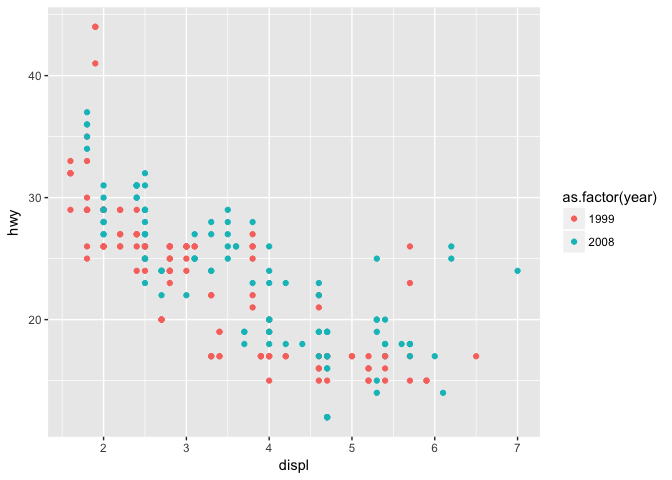
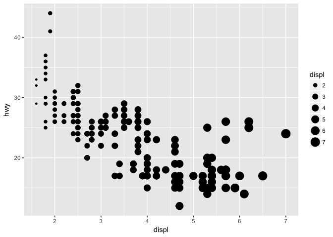
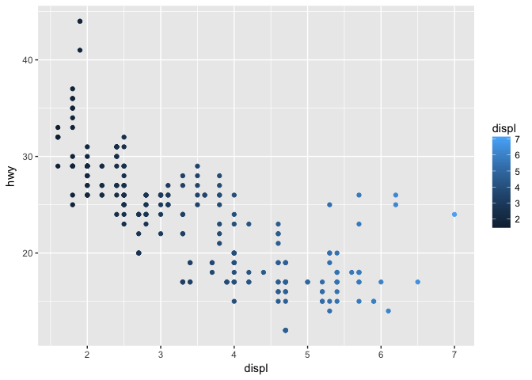
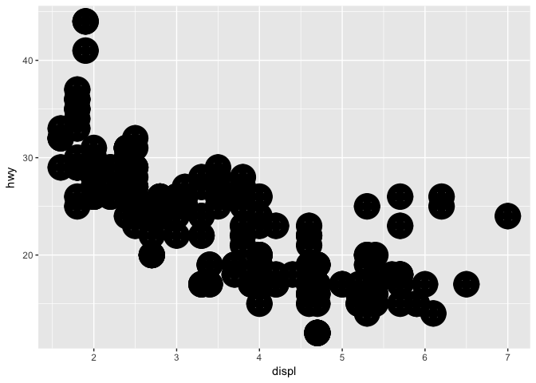
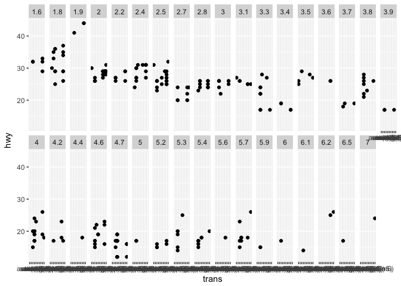
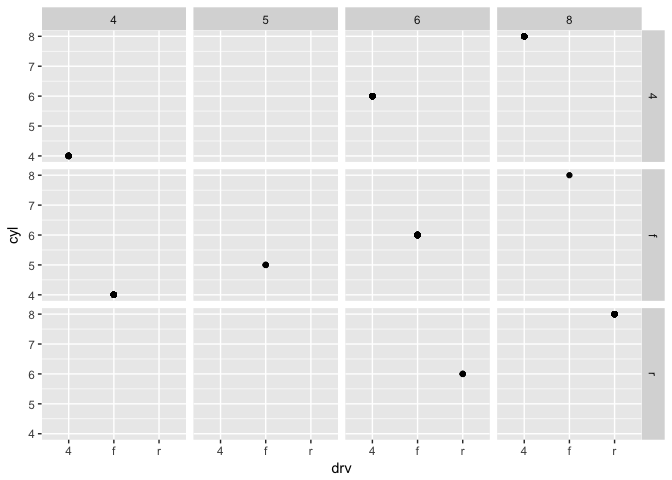
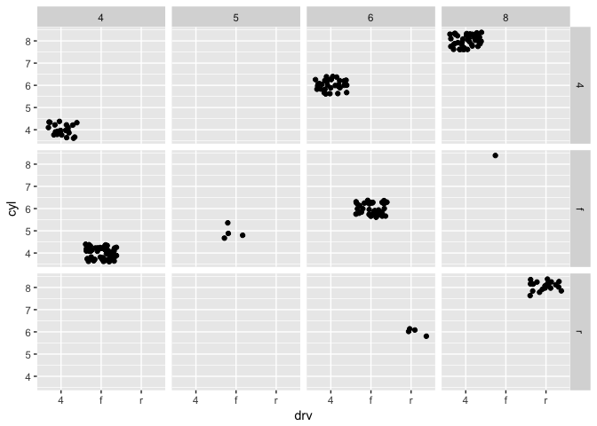
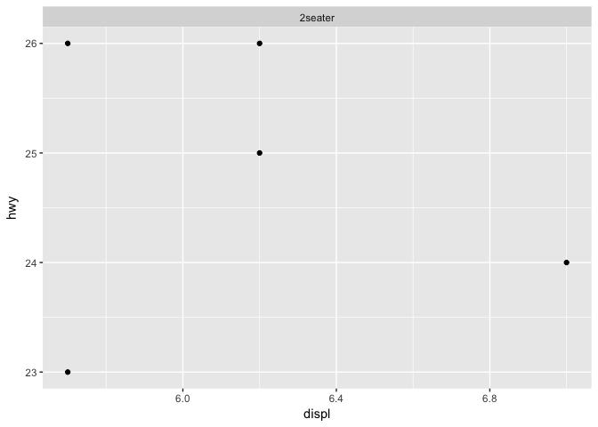

# Rclub2017_spring_Kazu
Kazu  
4/25/2017  
# Prerequisites

# 3.2.4 Exercises

```r
# 1. Run ggplot(data = mpg) what do you see?
ggplot(data = mpg) # nothing
```

<!-- -->

```r
# 2. How many rows are in mtcars? How many columns?
dim(mtcars) #32, 11
```

```
## [1] 32 11
```

```r
# 3. What does the drv variable describe? Read the help for ?mpg to find out.
# f = front-wheel drive, r = rear wheel drive, 4 = 4wd
# 4. Make a scatterplot of hwy vs cyl.
ggplot(data=mpg, aes(x=hwy,y=cyl))+geom_point()
```

<!-- -->

```r
# 5. What happens if you make a scatterplot of class vs drv. Why is the plot not useful?
ggplot(data=mpg, aes(x=class,y=drv))+geom_point()
```

<!-- -->
# 3.3.1 Exercises

```r
#1. What’s gone wrong with this code? Why are the points not blue?
ggplot(data = mpg) +   geom_point(mapping = aes(x = displ, y = hwy, color = "blue")) 
```

<!-- -->

```r
## Within aesthetic, different colors were assined automatically to each level of variables in data (eg. year)
ggplot(data = mpg) +   geom_point(mapping = aes(x = displ, y = hwy),colour="blue") # outside aesthetic
```

<!-- -->

```r
ggplot(data = mpg) +   geom_point(mapping = aes(x = displ, y = hwy,colour=as.factor(year))) # example of colours within aesthetic
```

<!-- -->

```r
#2. Which variables in mpg are categorical? Which variables are continuous? (Hint: type ?mpg to read the documentation for the dataset). arow can you see this information when you run mpg?
str(mpg) # displ
```

```
## Classes 'tbl_df', 'tbl' and 'data.frame':	234 obs. of  11 variables:
##  $ manufacturer: chr  "audi" "audi" "audi" "audi" ...
##  $ model       : chr  "a4" "a4" "a4" "a4" ...
##  $ displ       : num  1.8 1.8 2 2 2.8 2.8 3.1 1.8 1.8 2 ...
##  $ year        : int  1999 1999 2008 2008 1999 1999 2008 1999 1999 2008 ...
##  $ cyl         : int  4 4 4 4 6 6 6 4 4 4 ...
##  $ trans       : chr  "auto(l5)" "manual(m5)" "manual(m6)" "auto(av)" ...
##  $ drv         : chr  "f" "f" "f" "f" ...
##  $ cty         : int  18 21 20 21 16 18 18 18 16 20 ...
##  $ hwy         : int  29 29 31 30 26 26 27 26 25 28 ...
##  $ fl          : chr  "p" "p" "p" "p" ...
##  $ class       : chr  "compact" "compact" "compact" "compact" ...
```

```r
#3. Map a continuous variable to color, size, and shape. How do these aesthetics behave differently for categorical vs. continuous variables?
ggplot(data = mpg) +   geom_point(mapping = aes(x = displ, y = hwy,colour=displ)) # color. continuous color gradient
```

<!-- -->

```r
ggplot(data = mpg) +   geom_point(mapping = aes(x = displ, y = hwy,size=displ)) # size. discreate size
```

<!-- -->

```r
#ggplot(data = mpg) +   geom_point(mapping = aes(x = displ, y = hwy,shape=displ)) # Error: A continuous variable can not be mapped to shape

#4. What happens if you map the same variable to multiple aesthetics?
ggplot(data = mpg) +   geom_point(mapping = aes(x = displ, y = hwy,colour=displ)) # colour and x-axis are redundant.
```

<!-- -->

```r
#5. What does the stroke aesthetic do? What shapes does it work with? (Hint: use ?geom_point)
ggplot(data = mpg) +   geom_point(mapping = aes(x = displ, y = hwy),shape = 10,fill="white",size=5,stroke=5) # stroke is effective in certain shape?
```

<!-- -->

```r
ggplot(data = mpg) +   geom_point(mapping = aes(x = displ, y = hwy),shape = 21,fill="white",size=5,stroke=5) # stroke is effective in certain shape
```

<!-- -->

```r
#6. What happens if you map an aesthetic to something other than a variable name, like aes(colour = displ < 5)?
ggplot(data = mpg) +   geom_point(mapping = aes(x = displ, y = hwy, colour=displ<5))  # two colours (boundary is 5) becasue displ<5 gave us True/False vectors. Interesting!
```

<!-- -->
# 3.5.1

```r
#1. What happens if you facet on a continuous variable?
ggplot(data = mpg) + 
  geom_point(mapping = aes(x = trans, y = hwy)) + 
  facet_wrap(~ displ, nrow = 2) # A continuous variable (in this case "displ") was treated as discrite numbers. 
```

<!-- -->

```r
#2. What do the empty cells in plot with facet_grid(drv ~ cyl) mean? How do they relate to this plot?
ggplot(data = mpg) + 
  geom_point(mapping = aes(x = drv, y = cyl)) +
  facet_grid(drv~cyl)
```

<!-- -->

```r
# empty = no data in that categry
ggplot(data = mpg) + 
  geom_point(mapping = aes(x = drv, y = cyl))
```

<!-- -->

```r
# one point in geom_point is not one data
ggplot(data = mpg) + 
  geom_jitter(mapping = aes(x = drv, y = cyl)) +
  facet_grid(drv~cyl)  
```

<!-- -->

```r
#3. What plots does the following code make? What does . do?
ggplot(data = mpg) + 
  geom_point(mapping = aes(x = displ, y = hwy)) +
  facet_grid(drv ~ .) # drv category on rows
```

<!-- -->

```r
ggplot(data = mpg) + 
  geom_point(mapping = aes(x = displ, y = hwy)) +
  facet_grid(. ~ cyl) # cyl category on columns
```

<!-- -->

```r
#4. Take the first faceted plot in this section:
ggplot(data = mpg) + 
  geom_point(mapping = aes(x = displ, y = hwy)) + 
  facet_wrap(~ class, nrow = 2)
```

<!-- -->

```r
# 
ggplot(data = mpg[mpg$class=="2seater",]) + 
  geom_point(mapping = aes(x = displ, y = hwy)) + 
  facet_wrap(~ class, nrow = 2)
```

<!-- -->

```r
# What are the advantages to using faceting instead of the colour aesthetic? What are the disadvantages? How might the balance change if you had a larger dataset?
# (KN) less complicated in one plot. Difficult to compare differnt plots in details (Eg. how much overlapped)

#5. Read ?facet_wrap. What does nrow do? What does ncol do? What other options control the layout of the individual panels? Why doesn’t facet_grid() have nrow and ncol variables?
?facet_wrap
# nrow specify number of rows
# facet_grid() use row and column numbers based on facetting variables automatically.

#6. When using facet_grid() you should usually put the variable with more unique levels in the columns. Why?
ggplot(data = mpg) + 
  geom_point(mapping = aes(x = displ, y = hwy)) +
  facet_grid(. ~ cyl) # do you mean length(displ) > levels(cyl)?
```

<!-- -->
